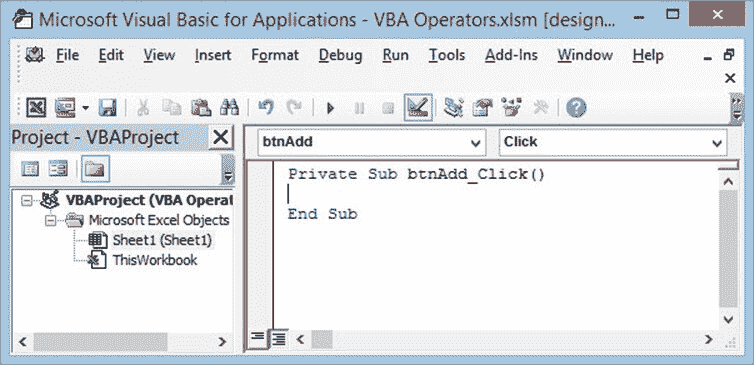
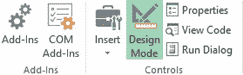
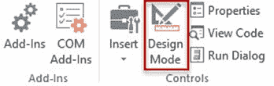
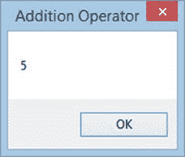

# VBA 算术运算符：乘法，除法，加法，模量

> 原文： [https://www.guru99.com/vba-arithmetic-operators.html](https://www.guru99.com/vba-arithmetic-operators.html)

VBA 算术运算符用于执行算术运算，例如加，减，除或乘数。

下表显示了 VBA 中的算术运算符

| **S / N** | **运算符** | **说明** | **范例** | **输出** |
| 1 | + | 加法：此运算符用于加号 | 2 + 2 | 4 |
| 2 | - | 减法：该运算符用于减去数字 | 5 - 3 | 2 |
| 3 | * | 乘法：此运算符用于将数字相乘 | 3 * 2 | 6 |
| 4 | / | 除：此运算符用于除数 | 9 / 3 | 3 |
| 5 | ^ | 求幂：此运算符用于将一个数字乘以另一个数字的幂 | 2^3 | 8 |
| 6 | 反对 | 模运算符：除数并返回余数 | 10 对 3 | 1 |

VBA Arithmetic Operators: Modulus, Multiplication, Division, Addition

### VBA 算术运算符示例

如我们先前所示，将一个按钮添加到 Excel 工作表，然后按照以下几点进行操作

*   将名称属性更改为 btnAdd
*   将标题属性更改为添加运算符
*   右键点击按钮
*   选择查看代码
*   您将获得以下代码窗口

在 Private Sub btnAdd_Click（）和 End Sub 之间输入以下代码

*   Dim x 作为整数，z 作为整数
    *   x = 2
    *   z = 3
*   MsgBox x + z，vbOKOnly，“加法运算符”
*   点击保存按钮
*   关闭代码编辑器窗口

现在执行我们的代码

在功能区栏上，查找“设计模式”按钮

如果按钮处于活动状态（绿色背景色），则处于设计模式。 您无法在此状态下执行代码**。** 如果它不是处于活动状态（白色背景色），则允许您运行代码。

单击设计模式按钮

该按钮现在应显示如下

单击添加运算符

您将获得以下结果

[下载上面的 Excel 代码](https://drive.google.com/uc?export=download&id=0BwL5un1OyjsdQkVXMVFkNG1UZk0)

### 算术运算符教程练习

最好的学习方法是练习。 请按照上述步骤创建用于减法，除法，乘法和乘幂的按钮。

编写按钮的代码并测试它们以查看代码是否执行。