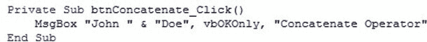
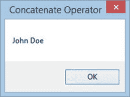

# VBA 字符串运算符

> 原文： [https://www.guru99.com/vba-string-operators.html](https://www.guru99.com/vba-string-operators.html)

## VBA 字符串运算符

字符串数据用于保存由数字，字符和符号组成的数据。 “ 2015 年 7 月”是字符串数据的示例。 它是由

*   角色（7 月）
*   符号（-）
*   数字（2015）

字符串运算符用于处理字符串数据。 例如，您可以将月份和年份的前 3 个字母（例如“ Jul-2015”）连接起来，以组合 2015 年 7 月的值。

下表显示了串联字符串运算符。

| **S / N** | **运算符** | **说明** | **范例** | **输出** |
| 1 | & | 连接：此运算符用于将字符串连接在一起 | “约翰” &“母鹿” | 约翰·杜 |

### 示例源代码

MsgBox“ John” &“ Doe”，vbOKOnly，“连接运算符”

执行上面的代码会产生以下结果

[下载上面的 Excel 代码](https://drive.google.com/uc?export=download&id=0BwL5un1OyjsdME04bHB1UElPWkE)