# 15 本最佳 Excel 书籍（2020 年更新）

> 原文： [https://www.guru99.com/best-excel-books.html](https://www.guru99.com/best-excel-books.html)

Microsoft Excel 是一个电子表格程序，用于记录和分析数值数据。 Excel 是管理和分析各种类型数据的最强大工具。

这是最佳 Excel 书籍的精选清单，这些书籍应该是高级 Excel 学习者库的任何初学者的一部分。

### 1） [Excel 2019 圣经](https://geni.us/sEgNAi)

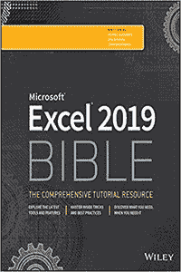

Excel 2019 Bible 是 Michael Alexander Richard Kusleika John Walkenbach 撰写的书。 本书是满足您所有 Excel 2019 需求的最全面的入门指南。 您还将学习如何合并模板，实现公式，创建数据透视表，分析数据等等。

该教科书还涵盖诸如创建函数，电子表格，主公式，格式，数据透视表等主题。

[Check Latest Price and User Reviews on Amazon](https://geni.us/sEgNAi)

* * *

### 2）[杀死 Excel Dragons：克服 Excel 挫败和使 Excel 有趣的入门指南](https://geni.us/LNXw)

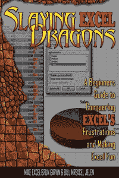

《杀死 Excel 龙》是 Mike Girvin 和 Bill Jelen 所写的书。 本书着重于立即使用该程序以实现最大效率。 它拥有超过 1,104 个屏幕截图，以及从行，列和单元格到小计，排序和数据透视表的所有信息。

这本卓越的书提供了避免问题和简化效率的策略，并从头到尾地帮助读者，将新手变成专家。

[Check Latest Price and User Reviews on Amazon](https://geni.us/LNXw)

* * *

### 3）30 分钟内的 [Excel 基础：Microsoft Excel 和 Google 表格的快速指南](https://geni.us/D88c3S)

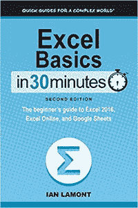

Excel 基础知识在 30 分钟内是 Ian Lamont 写的一本书。 这本书教您一些 MS Excel 基础知识，从导航主屏幕到使用公式和图表。

Excel 基础知识在 30 分钟内，这本书是用纯英语编写的，并提供了分步说明和截屏，以演示确切的操作方法。 本书涵盖了重要的主题，例如 Excel 屏幕布局，单元格和术语，Excel 2016 与 Excel Online 与 Google 表格，适用于 iOS 和 Android 的 excel，基本 excel 格式等​​。

[Check Latest Price and User Reviews on Amazon](https://geni.us/D88c3S)

* * *

### 4）[通过智能方法学习 Excel 2016 基本技能：初学者和中级水平的自学课件教程](https://geni.us/BClUvB)

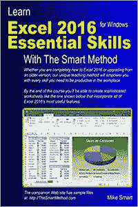

Learn Excel 2016 Essential Skills 是 Mike Smart 撰写的书。 在本书中，您将发现轻松学习这些课程。 每个主题的描述方式绝对使任何年龄的学生都可以轻松理解。

这本书适合任何自学或教学时期。 每天只有几分钟的时间，许多学习者都在旁边使用本书来学习 excel，以完成一堂课。

[Check Latest Price and User Reviews on Amazon](https://geni.us/BClUvB)

* * *

### 5） [Microsoft Excel 2019 数据分析和业务建模（第六版）（业务技能）](https://geni.us/0JJQtpA)

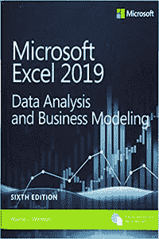

Microsoft Excel 2019 数据分析和业务建模是 Wayne Winston 写的一本书。 这本新书可帮助您学习 excel，以获取 excel 复杂主题（如数据透视表，高级筛选等）的准确答案和解决方案。该参考书涵盖了诸如查询/获取并转换为 Office 365 地理和股票数据类型之类的主题。

该书可帮助您学习将 PowerQuery，地理和时间数据与 3D 地图结合使用：数据透视表，描述性统计数据，直方图，帕累托图等。

[Check Latest Price and User Reviews on Amazon](https://geni.us/0JJQtpA)

* * *

### 6）[面向初学者的 Excel（Excel Essentials 书 1）](https://geni.us/fggz)

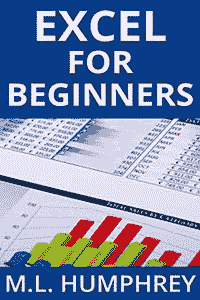

Excel for Beginners 是由 M.L. 汉弗莱。 当面对一千篇关于阳光下的万物的指南时，学会使用 Excel 可能会令人头疼。

在本书中，作者将重点介绍您日常使用所需的知识，向您介绍使用 Excel 的基础知识。 本书涵盖的这本书包括导航 Excel，输入数据，对其进行格式化，对其进行操作以及打印结果。

[Check Latest Price and User Reviews on Amazon](https://geni.us/fggz)

* * *

### 7） [Ctrl + Shift + Enter 掌握 Excel 数组公式：借助数组公式魔术](https://geni.us/z4sRjAP)

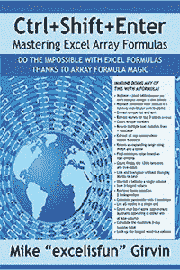

Ctrl + Shift + Enter 掌握 Excel 数组公式是 Mike Girvin 撰写的书。 该参考书教您如何创建可用于解决一系列数据值的日常问题的公式。

本书首先介绍了数组公式。 本书包括诸如函数的使用以及数组常量和函数之类的主题。 该书包含 529 个屏幕截图，可帮助您学习 Microsoft Excel 的各个方面。

[Check Latest Price and User Reviews on Amazon](https://geni.us/z4sRjAP)

* * *

### 8）[专业 Excel 开发：使用 Microsoft Excel，VBA 和.NET 开发应用程序的权威指南](https://geni.us/8lVsPA)

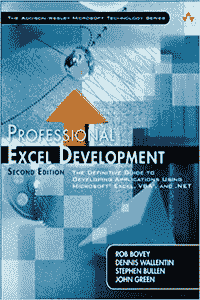

专业 Excel 开发是由 Rob Bovey，Dennis Wallentin，Stephen Bullen，John Green 撰写的书。 对于希望使用最新技术构建功能强大的最新 Excel 应用程序的开发人员来说，这是一本 excel 参考书。

本书的课程涵盖了作者在现实世界中的经验，不仅涵盖了功能的工作原理，还涵盖了其在现实生活中的实际含义。

[Check Latest Price and User Reviews on Amazon](https://geni.us/8lVsPA)

* * *

### 9） [Microsoft Excel 2019 数据透视表数据处理（业务技能）](https://geni.us/DfuejCf)

Microsoft Excel 2019 数据透视表数据处理是由 Bill Jelen 和 Michael Alexander 编写的书。 在本书中，您将学习使用数据透视表和数据透视图在数分钟而不是数小时内生成功能强大的动态报表。 它可以帮助您控制数据和业务。

这本书提供了解决实际业务问题，避免常见错误以及提供提示和技巧的方法，您在其他任何地方都找不到。

[Check Latest Price and User Reviews on Amazon](https://geni.us/DfuejCf)

* * *

### 10） [Excel 2016 VBA 和宏（包括内容更新程序）：Excel 2016 VBA 和宏 _p1（MrExcel 库）](https://geni.us/xyqbGGE)

Excel 2016 VBA 和宏是 Tracy Syrstad 编写的书。 该书可帮助您发现在其他地方找不到的宏技术，并创建功能强大的自动化报告。

在这本 excel 参考书中，您将找到分步说明，实际案例研究以及包含其他示例，宏和解决方案的 50 个工作簿。 这本书还可以帮助您避免重大错误。

[Check Latest Price and User Reviews on Amazon](https://geni.us/xyqbGGE)

* * *

### 11） [Power Pivot 和 Power BI：Excel 2010-2016 中的 DAX，Power Query，Power BI Excel 用户指南& Power Pivot](https://geni.us/mTbsBT)

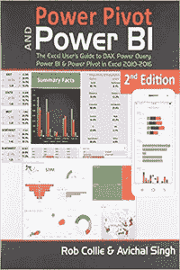

Power Pivot 和 Power BI 是 Rob Collie 所写的书。 本书以全彩色印刷，概述了数据透视表，Power BI，DAX 公式以及 Power Pivot 的功能。

这本参考书包括许多公式，这些公式可在形状完全不同的报表之间重用，如何在数据透视表中创建特定的列，如何将不连续的数据集合并为统一的报表等。

[Check Latest Price and User Reviews on Amazon](https://geni.us/mTbsBT)

* * *

### 12） [Microsoft Excel 2019 公式和函数（业务技能）](https://geni.us/DsIHKi)

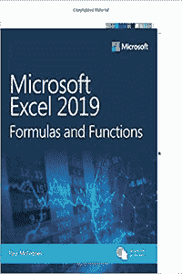

Microsoft Excel 2019 公式和函数是 Paul McFedries 编写的一本书，可帮助您充分利用公式和函数，包括对数组，公式错误处理和统计信息的最新改进。

本书包括示例和清晰的说明，可帮助您开发高级公式构造。 它可以帮助您在日常工作中利用 Excel 最有用的功能。

[Check Latest Price and User Reviews on Amazon](https://geni.us/DsIHKi)

* * *

### 13）[用于假人的 Excel VBA 编程（对于假人（计算机/技术））](https://geni.us/BqwIjly)

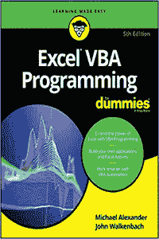

Excel VBA 傻瓜编程是由 Michael Alexander 和 John Walkenbach 撰写的书。 本书可帮助您学习 Visual Basic for Applications（VBA）。

本书从 Visual Basic 编辑器最重要的工具和操作开始，向您介绍了一系列新的 Excel 选项。 在本书中，您将找到编程的基本要素和概念的概述。

[Check Latest Price and User Reviews on Amazon](https://geni.us/BqwIjly)

* * *

### 14）[使用 Excel 进行假人统计分析](https://geni.us/jnYy9A)

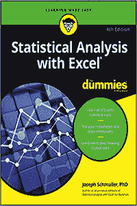

用 Excel For Dummies 进行统计分析是一本书，由 Joseph Schmuller 撰写。 在本 excel 学习指南中，您将学习如何使用 excel 来创建和转换统计信息，了解常见的统计术语以及提高您的专业技能。

本书向您展示如何使用公式和函数，图表和数据透视表，样本和正态分布，概率以及相关分布等。

[Check Latest Price and User Reviews on Amazon](https://geni.us/jnYy9A)

* * *

### 15） [Advanced Excel Essentials](https://geni.us/MPzuS)

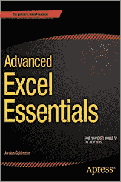

Advanced Excel Essentials 由 Jordan Goldmeier 编写。 这是经验丰富的 Excel 开发人员的唯一书籍。 本参考书假定您精通 Excel，并以自己的技能为基础，将其提高到了更高的水平。

本书涵盖了高级公式主题，例如数组公式和布尔逻辑。 它提供了对更好的代码和公式开发的见解。

[Check Latest Price and User Reviews on Amazon](https://geni.us/MPzuS)