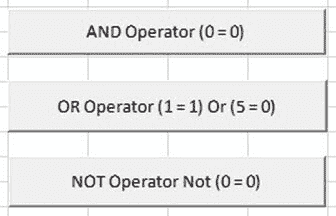

# VBA 逻辑运算符：AND，OR，NOT

> 原文： [https://www.guru99.com/vba-logical-operators.html](https://www.guru99.com/vba-logical-operators.html)

VBA Logical Operators: AND, OR, NOT

## 逻辑运算符

假设您要处理客户订单。 为此，您想首先检查订购的产品是否存在。 如果是这样，您还想检查现有数量是否足够。 在这种情况下，逻辑运算符会派上用场。 逻辑运算符用于评估多个条件。

| **S / N** | **运算符** | **说明** | **范例** | **输出** |
| 1 | 和 | AND：用于组合多个条件。 如果所有条件都为真，则 AND 评估为真。 如果任何条件为假，则 AND 的计算结果为假 | 如果 true = true AND false = true 然后 | 假 |
| 2 | 要么 | 或：这用于组合多个条件。 如果任何条件评估为 true，则 OR 返回 true。 如果它们全都为假，或返回假 | 如果 true = true 或 true = false 则 | 真正 |
| 3 | 不 | 不是：这就像一个逆函数。 如果条件为 true，则返回 false，如果条件为 false，则返回 true。 | 如果不是（真），则 | false |

### 示例源代码

为了简单起见，我们将比较硬编码的数字。

从“插入选项”将 ActiveX 按钮添加到工作表中。

设置属性，如下图所示



下表显示了您需要更改的属性以及也需要更新的值。

| **S/N** | **控件** | **属性** | **值** |
| 1 | CommandButton1 | Name | btnAND |
|  |  | 标题 | AND 运算子（0 = 0） |
| 2 | CommandButton2 | Name | btnOR |
|  |  | Caption | 或运算符（1 = 1）或（5 = 0） |
| 3 | CommandButton3 | Name | btnNOT |
|  |  | Caption | NOT 运算符 Not（0 =） |

将以下代码添加到 btnAND_Click

```
Private Sub btnAND_Click()
    If (1 = 1) And (0 = 0) Then
            MsgBox "AND evaluated to TRUE", vbOKOnly, "AND operator"
        Else
            MsgBox "AND evaluated to FALSE", vbOKOnly, "AND operator"
    End If
End Sub

```

**此处，**

*   **“ If（1 = 1）和（0 = 0）然后”** if 语句使用 AND 逻辑运算符组合两个条件（1 = 1）和（0 = 0）。 如果两个条件都成立，则执行“ Else”关键字上方的代码。 如果两个条件都不成立，则执行“ Else”关键字下面的代码。

将以下代码添加到 btnOR_Click

```
Private Sub btnOR_Click()
    If (1 = 1) Or (5 = 0) Then
            MsgBox "OR evaluated to TRUE", vbOKOnly, "OR operator"
        Else
            MsgBox "OR evaluated to FALSE", vbOKOnly, "OR operator"
    End If
End Sub

```

**此处，**

*   **“ If（1 = 1）或（5 = 0）然后”** if 语句使用 OR 逻辑运算符组合两个条件（1 = 1）和（5 = 0）。 如果满足任何条件，则执行 Else 关键字上方的代码。 如果两个条件都为假，则执行 Else 关键字下面的代码。

将以下代码添加到 btnNOT_Click

```
Private Sub btnNOT_Click()
    If Not (0 = 0) Then
            MsgBox "NOT evaluated to TRUE", vbOKOnly, "NOT operator"
        Else
            MsgBox "NOT evaluated to FALSE", vbOKOnly, "NOT operator"
    End If
End Sub

```

**HERE,**

*   **“如果不是（0 = 0）那么”** if 语句使用 NOT 逻辑运算符来取反条件的结果。 如果条件为真，则执行“ Else”关键字下面的代码。 如果条件为真，则执行 Else 关键字上方的代码。

[下载包含上述代码](https://drive.google.com/uc?export=download&id=0BwL5un1OyjsdTUlHcXZmVXBjZms)的 Excel