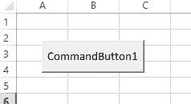
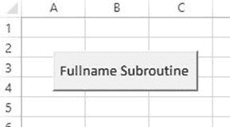
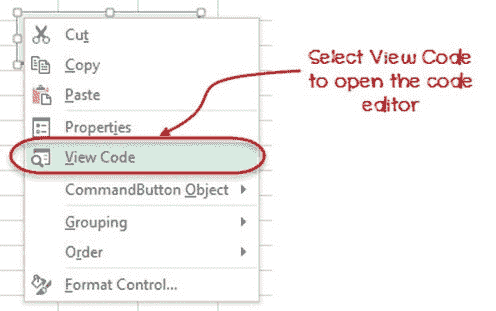
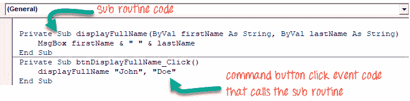
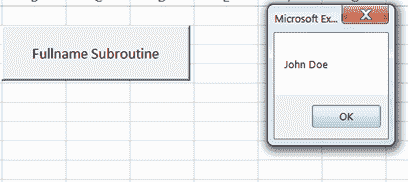

# Excel VBA 子例程：如何使用示例调用 Sub

> 原文： [https://www.guru99.com/vba-functions-subroutine.html](https://www.guru99.com/vba-functions-subroutine.html)

## 什么是子程序？

子例程是一段代码，它执行特定的任务并且不返回结果。 子例程用于将大段代码分解为可管理的小部分。

假设您已经创建了一个带有文本框的用户界面，用于接受用户输入数据。 您可以创建一个子例程，以清除文本框的内容。 子例程在这种情况下是合适的，因为您不想返回任何结果。

在本教程中，您将学习-

*   [为什么使用子例程](#2)
*   [命名子例程和函数的规则](#3)
*   [VBA 子例程语法](#4)
*   [如何在 VBA 中调用子例程](#5)

## 为什么使用子例程

*   **将代码分解为易于管理的小代码**：一个普通的计算机程序具有成千上万的源代码行。 这引入了复杂性。 子例程通过将程序分解为可管理的小代码段来帮助解决此问题。
*   **代码可重用性**。 假设您有一个需要访问数据库的程序，该程序中几乎所有窗口都需要与数据库进行交互。 您可以创建一个处理所有数据库交互的函数，而不是为这些窗口编写单独的代码。 然后，您可以从所需的任何窗口调用它。
*   **子例程和函数是自记录**。 假设您有一个函数 calculateLoanInterest，另一个函数是 connectToDatabase。 只需查看子例程/函数的名称，程序员就可以知道程序的作用。

## 子例程和函数的命名规则

要使用子例程和函数，必须遵循一组规则。

*   子例程或函数名称不能包含空格
*   子例程或函数名称应以字母或下划线开头。 它不能以数字或特殊字符开头
*   子例程或函数名称不能是关键字。 关键字是在 VBA 中具有特殊含义的单词。 诸如 Private，Sub，Function 和 End 等之类的词都是关键字的示例。 编译器将它们用于特定任务。

## VBA 子例程语法

您将需要在 Excel 中启用“开发人员”选项卡，以遵循此示例。 如果您不知道如何启用“开发人员”选项卡，请阅读有关 VBA 操作员的教程

**此处为语法**

```
Private Sub mySubRoutine(ByVal arg1 As String, ByVal arg2 As String)
    'do something
End Sub
```

语法说明

| **代码** | **动作** |
| 

*   “私人 Sub mySubRoutine（…）”

 | 

*   此处，关键字“ Sub”用于声明名为“ mySubRoutine”的子例程并启动该子例程的主体。
*   关键字 Private 用于指定子例程

的范围 |
| 

*   “ ByVal arg1 作为字符串，ByVal arg2 作为字符串”：

 | 

*   声明字符串数据类型名称 arg1 和 arg2 的两个参数

 |
| 

*   “结束子”

 | 

*   “ End Sub”用于结束子程序

的主体 |

以下子例程接受名字和姓氏并将其显示在消息框中。

现在，我们要编程并执行此子过程。 让我们看看这个。

## 如何在 VBA 中调用子例程

1.  设计用户界面并设置用户控件的属性。
2.  添加子程序
3.  为调用该子例程的命令按钮编写 click 事件代码
4.  测试应用

**步骤 1）**用户界面

设计用户界面，如下图所示



设置以下属性。 我们正在设置的属性

| **S / N** | **控件** | **属性** | **值** |
| 1 | CommandButton1 | Name | btnDisplayFullName |
| 2 |  | 标题 | 全名子例程 |

您的界面现在应如下所示



**步骤 2）**添加子例程

1.  按 Alt + F11 打开代码窗口
2.  添加以下子例程

```
Private Sub displayFullName(ByVal firstName As String, ByVal lastName As String)
    MsgBox firstName & " " & lastName
End Sub

```

代码中的

| **代码** | **动作** |
| 

*   “私人子 displayFullName（…）”

 | 

*   它声明一个接受两个字符串参数的私有子程序 displayFullName。

 |
| 

*   “ ByVal firstName 作为字符串，ByVal lastName 作为字符串”

 | 

*   声明两个参数变量 firstName 和 lastName

 |
| 

*   MsgBox firstName &“” & lastName”

 | 

*   它调用 MsgBox 内置函数来显示消息框。 然后，它将“ firstName”和“ lastName”变量作为参数传递。
*   和号“ & ”用于连接两个变量，并在它们之间添加一个空格。

 |

**步骤 3）**从命令按钮单击事件调用子例程。

*   右键单击命令按钮，如下图所示。 选择查看代码。
*   代码编辑器将打开



在 btnDisplayFullName 命令按钮的 click 事件的代码编辑器中添加以下代码。

```
Private Sub btnDisplayFullName_Click()
    displayFullName "John", "Doe"
End Sub

```

您的代码窗口现在应如下所示



保存更改并关闭代码窗口。

**步骤 4）测试代码**

在开发人员工具栏上，将设计模式设置为“关闭”。 如下所示。


**步骤 5）**单击命令按钮“全名子例程”。

您将获得以下结果



[下载上面的 Excel 代码](https://drive.google.com/uc?export=download&id=0BwL5un1OyjsdTDg1QllTM2p0ZHM)

**摘要**：

*   子例程是执行特定任务的一段代码。 子例程执行后不返回值
*   子例程提供代码可重用性
*   子例程有助于将大块代码分解为可管理的小代码。