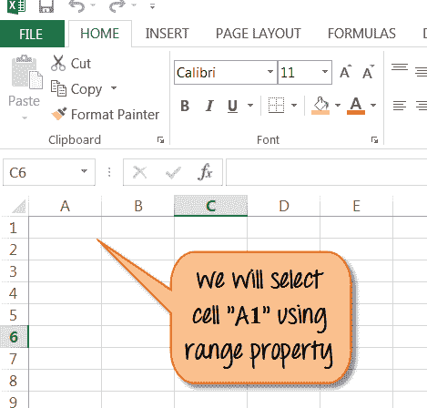
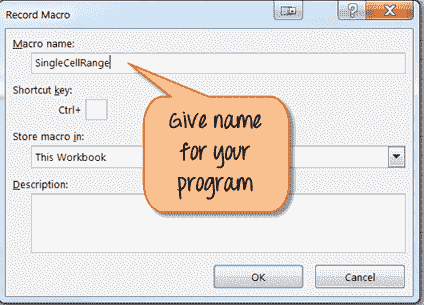
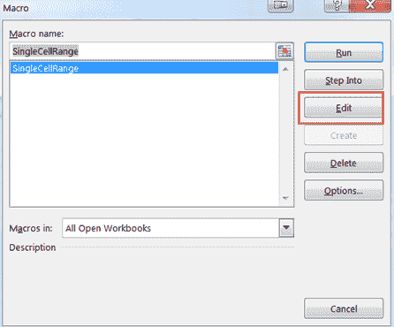
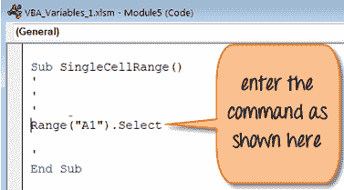
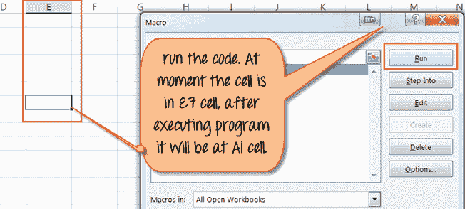

# Excel VBA 范围对象

> 原文： [https://www.guru99.com/vba-range-objects.html](https://www.guru99.com/vba-range-objects.html)

## 什么是 VBA 范围？

VBA 范围对象代表 Excel 工作表中的一个或多个单元格。 它是 Excel VBA 的最重要对象。 通过使用 Excel VBA 范围对象，您可以引用，

*   一个单元格
*   一排或一列单元格
*   单元格的选择
*   3-D 范围

正如我们在上一教程中讨论的那样，该 VBA 用于记录和运行 Macro。 但是 VBA 如何识别工作表中的哪些数据需要执行。 这是 VBA 范围对象有用的地方。

在本教程中，您将学习-

*   [在 VBA 中引用对象的介绍](#1)
*   [使用 Worksheet.Range 属性](#2)引用单个单元格
*   [细胞特性](#3)
*   [范围偏移属性](#4)

## 在 VBA 中引用对象的简介

引用 Excel 的 VBA 范围对象和对象限定符。

*   **对象限定符**：用于引用对象。 它指定您要引用的工作簿或工作表。

要操作这些单元格值，请使用**属性**和**方法**。

*   **属性：**属性存储有关对象的信息。
*   **方法：**方法是它将执行的对象的操作。 范围对象可以执行诸如选择，复制，清除，排序等操作。

VBA 遵循对象层次结构模式来引用 Excel 中的对象。 您必须遵循以下结构。 请记住，.dot 上端在每个不同级别连接对象。

**Application.Workbooks.Worksheets.Range**

默认对象有两种主要类型。

## 如何使用 Range 属性引用 Excel VBA Range 对象

范围属性可以应用于两种不同类型的对象。

*   工作表对象
*   范围对象

范围属性的语法

1.  关键字“范围”。
2.  关键字后的括号
3.  相关单元格范围
4.  报价单（“”）

```
Application.Workbooks("Book1.xlsm").Worksheets("Sheet1").Range("A1")
```

如上所示，当引用范围对象时，它称为**完全引用**。 您已经准确地告诉了 Excel 您想要的范围，什么工作表和什么工作表。

**示例**：MsgBox Worksheet（“ sheet1”）。Range（“ A1”）。Value

使用 Range 属性，您可以执行许多任务，例如，

*   使用范围属性引用单个单元格
*   使用 Worksheet.Range 属性引用单个单元格
*   引用整行或整列
*   使用 Worksheet.Range 属性等引用合并的单元格

因此，它太长了，无法涵盖 range 属性的所有情况。 对于上述场景，我们将仅演示一个示例。 使用范围属性引用单个单元格。

## 使用 Worksheet.Range 属性引用单个单元格

要引用单个单元格，您必须引用单个单元格。

语法很简单**“ Range（” Cell“）”。**

在这里，我们将使用“ .Select”命令从表单中选择单个单元格。

**步骤 1）**在此步骤中，打开您的 Excel。



**步骤 2）**在此步骤中，

*   单击  按钮。
*   它将打开一个窗口。
*   在此处输入程序名称，然后单击“确定”按钮。
*   它将带您到主 Excel 文件，从顶部菜单单击“停止”记录按钮以停止记录宏。



**步骤 3）**在下一步中，

*   从顶部菜单中单击“宏”按钮  。 它将打开下面的窗口。
*   在此窗口中，单击“编辑”按钮。



**步骤 4）**上面的步骤将打开文件名“ Single Cell Range”的 VBA 代码编辑器。 输入如下所示的代码，以从 Excel 中选择范围“ A1”。



**步骤 5）**现在保存文件  并运行程序，如下所示。



**步骤 6）**在执行程序后，您将看到选择了单元格“ A1”。


同样，您可以选择具有特定名称的单元格。 例如，如果要搜索名称为“ Guru99- VBA Tutorial”的单元格。 您必须运行如下所示的命令。 它将选择具有该名称的单元格。

**范围（“ Guru99- VBA 教程”）。选择**

要应用其他范围对象，这里是代码示例。

| **在 Excel** 中选择单元格的范围 | **声明为**的范围 |
| 对于单行 | 范围（“ 1：1”） |
| 对于单列 | 范围（“ A：A”） |
| 对于连续单元 | 范围（“ A1：C5”） |
| 对于非连续单元 | 范围（“ A1：C5，F1：F5”） |
| 对于两个范围的交集 | 范围（“ A1：C5 F1：F5”）

（对于相交单元，请记住没有逗号运算符） |
| 合并单元格 | Range（“ A1：C5”）

（要合并单元格，请使用“ merge”命令） |

## 细胞特性

与范围类似，在 VBA 中，您也可以“单元属性”。 唯一的区别是，它具有“项目”属性，可用于引用电子表格中的单元格。 单元属性在编程循环中很有用。

例如，

Cells.item（行，列）。 下面的两行均引用单元格 A1。

*   Cells.item（1,1）或
*   Cells.item（1，“ A”）

## 范围偏移属性

范围偏移量属性将选择远离其原始位置的行/列。 根据声明的范围，选择单元格。 请参见下面的示例。

For example,

```
Range("A1").offset(Rowoffset:=1, Columnoffset:=1).Select
```

结果将存储在单元格 B2 中。 offset 属性会将 A1 单元格移到 1 列和 1 行。 您可以根据需要更改 rowoffset / columnoffset 的值。 您可以使用负值（-1）向后移动单元格。

下载包含以上代码的 Excel

[下载上面的 Excel 代码](https://drive.google.com/uc?export=download&id=0ByI5-ZLwpo25WW54blAzRGF2cU0)

**摘要**：

*   VBA 范围对象代表 Excel 工作表中的一个或多个单元格
    *   一个单元格
    *   一排或一列单元格
    *   单元格的选择
    *   3-D 范围
*   要操作单元格值，请使用**属性**和**方法**
    *   属性存储有关对象的信息
    *   方法是对象将执行的操作，例如选择，合并，排序等。
*   VBA 遵循对象层次结构模式以使用.dot 运算符引用 Excel 中的对象
*   范围属性可以应用于两种不同类型的对象
    *   工作表对象
    *   范围对象