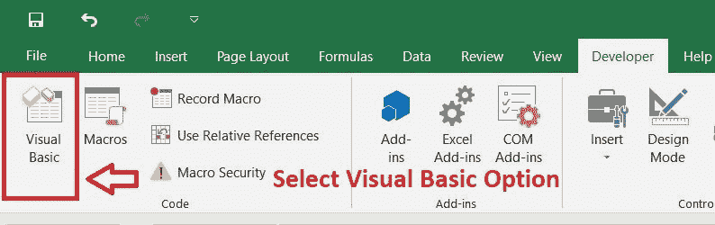
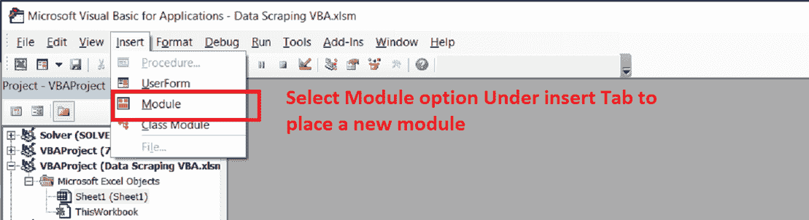
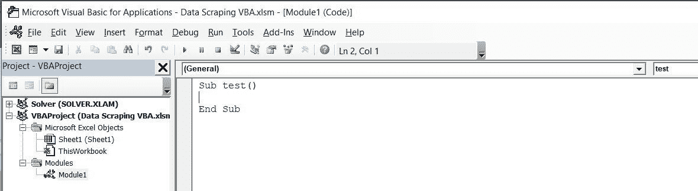
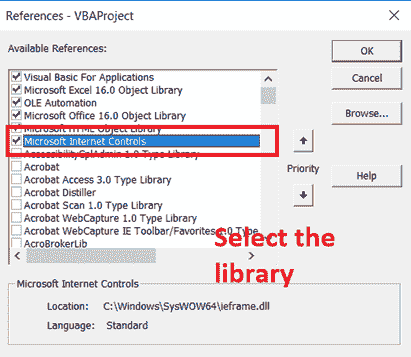
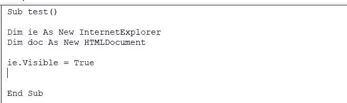
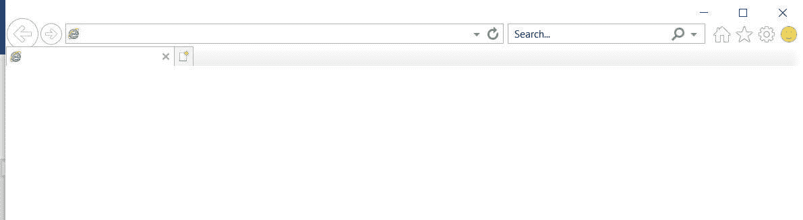
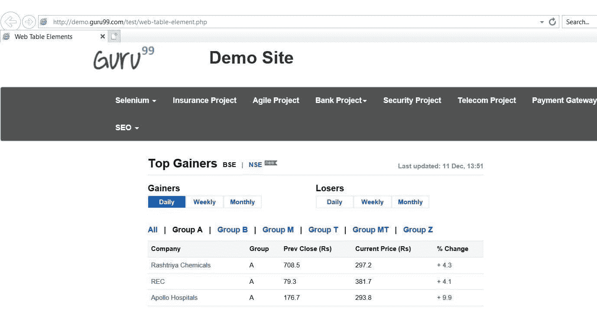
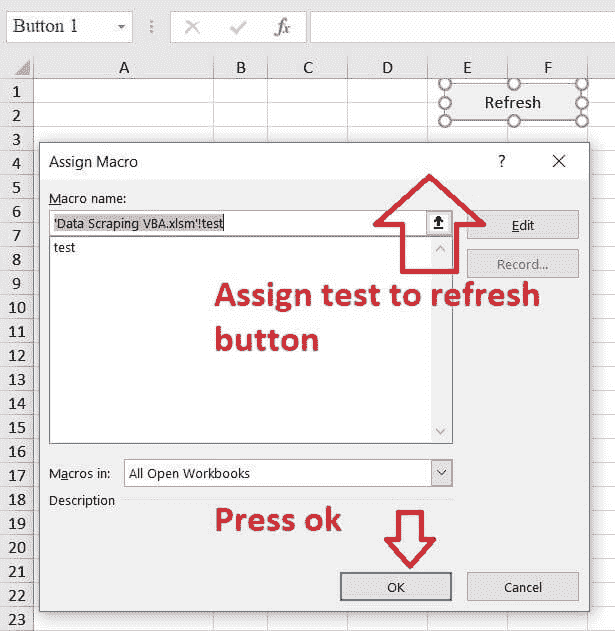
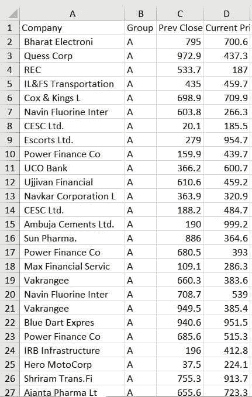
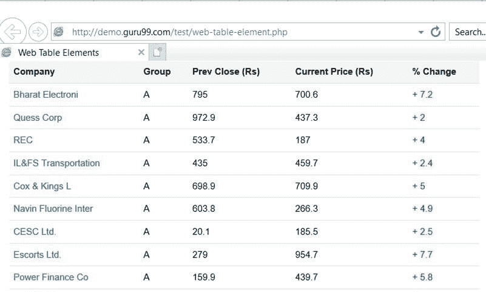

# 使用 VBA 进行网页搜刮

> 原文： [https://www.guru99.com/data-scraping-vba.html](https://www.guru99.com/data-scraping-vba.html)

## 什么是数据收集？

数据抓取是一种有助于将所需信息从 HTML 网页提取到本地计算机中存在的本地文件的技术。 通常，本地文件可以对应于 excel 文件，word 文件或任何 Microsoft Office 应用程序。 它有助于引导网页中的关键信息。

每天在基于研究的项目上工作时，数据抓取变得很简单，而这样的项目完全依赖于 Internet 和网站。 为了进一步说明该主题，让我们以一个日间交易员为例，该日交易员运行 excel 宏，使用 VBA 将金融网站的市场信息提取到 excel 表中。

在本教程中，您将学习：

*   [什么是数据抓取？](#1)
*   [在使用 Internet Explorer 执行数据搜刮之前，如何准备 Excel 宏？](#2)
*   [如何使用 Excel VBA 打开 Internet Explorer？](#3)
*   [如何使用 VBA 在 Internet Explorer 中打开网站？](#4)
*   [如何使用 VBA 从网站上抓取信息？](#5)

## 在使用 Internet Explorer 执行数据搜刮之前，如何准备 Excel 宏？

在进入 excel 中的数据抓取过程之前，必须对 excel 宏文件执行某些先决条件。

这些先决条件如下：-

**步骤 1）**打开一个基于 Excel 的宏，并访问 excel 的开发人员选项。


**步骤 2）**在“开发人员”功能区下选择“ Visual Basic”选项。



**步骤 3）**插入一个新模块。



**步骤 4）**初始化新的子例程

```
Sub test()
End sub

```

该模块的结果如下：-



**步骤 5）**访问“工具”选项卡下的引用选项，并引用 Microsoft HTML 对象库和 Microsoft Internet 控件。

以下文件将作为该模块的参考文件，因为它有助于打开 Internet Explorer，并有助于宏脚本的开发。



现在，Excel 文件已准备就绪，可以与 Internet Explorer 进行交互。 下一步将是结合宏脚本，这些宏脚本将有助于 HTML 中的数据抓取。

## 如何使用 Excel VBA 打开 Internet Explorer？

**步骤 1）**如下所示在子例程中初始化变量

```
Sub test()
Dim ie As New InternetExplorer 
Dim doc As New HTMLDocument

```

**步骤 2）**要使用 VBA 打开 Internet Explorer，请写**，即 visible = true** ，然后按 **F5。**

```
Sub test()
Dim ie As New InternetExplorer 
Dim doc As New HTMLDocument
Ie.visible=true

```

该模块如下所示：-





## 如何使用 VBA 在 Internet Explorer 中打开网站？

这是使用 VBA 在 Internet Explorer 中打开网站的步骤

**步骤 1）**一旦您能够使用 Excel VBA 访问 Internet Explorer，则下一步将包括使用 VBA 访问网站。 导航属性有助于实现这一点，其中 URL 必须在属性中作为双引号传递。 按照显示的以下步骤操作。

```
Sub test()
Dim, ie As New InternetExplorer
Dim doc As New HTMLDocument
Dim ecoll As Object
ie.Visible = True
ie.navigate"http://demo.guru99.com/test/web-table-element.php"
Do
DoEvents
Loop Until ie.readyState = READYSTATE_COMPLETE

```

**步骤 2）-**按 F5 执行宏。 将打开以下网页，如显示



现在，excel 宏已准备好执行抓取功能。 下一步将显示如何使用 VBA 从 Internet Explorer 提取信息。

## 如何使用 VBA 从网站中抓取信息？

假设日间交易员希望每天访问网站上的数据。 当日交易者每次点击按钮时，它将自动将市场数据提取到 excel 中。

在上述网站上，有必要检查元素并观察数据的结构。

**步骤 1）**通过按 Control + Shift + I 访问下面的 HTML 源代码

```
<table class="datatable">
<thead>
<tr>
<th>Company</th>
<th>Group</th>
<th>Pre Close (Rs)</th>
<th>Current Price (Rs)</th>
<th>% Change</th>
</tr>

```

源代码如下：-

```
Sub test()
Dim ie As New InternetExplorer
Dim doc As New HTMLDocument
Dim ecoll As Object
ie.Visible = True
ie.navigate "http://demo.guru99.com/test/web-table-element.php"
Do
DoEvents
Loop Until ie.readyState = READYSTATE_COMPLETE
Set doc = ie.document

```

可以看出，数据被构造为单个 HTML 表。 因此，为了从 html 表中提取整个数据，将需要设计宏，该宏以集合的形式收集数据。

然后将集合粘贴到 excel 中。 为此，所需的结果执行以下步骤：-

**步骤 2）**在子例程中初始化 Html 文档

VBA 模块如下所示：-

**步骤 3）**初始化 HTML 文档中存在的 collection 元素

The VBA module would look as follows: -

```
Sub test()
Dim ie As New InternetExplorer
Dim doc As New HTMLDocument
Dim ecoll As Object
ie.Visible = True
ie.navigate "http://demo.guru99.com/test/web-table-element.php"
Do
DoEvents
Loop Until ie.readyState = READYSTATE_COMPLETE
Set doc = ie.document
Set ecoll = doc.getElementsByTagName("table")
```

**步骤 4）**借助嵌套循环初始化 excel 表格单元格，如图所示

The VBA module would look as follows: -

```
Sub test()
Dim ie As New InternetExplorer
Dim doc As New HTMLDocument
Dim ecoll As Object

ie.Visible = True
ie.navigate "http://demo.guru99.com/test/web-table-element.php"
Do
DoEvents
Loop Until ie.readyState = READYSTATE_COMPLETE
Set doc = ie.document
Set ecoll = doc.getElementsByTagName("table")

```

可以使用 excel 工作表的 range 属性或通过 excel 工作表的 cell 属性来初始化 excel。 为了降低 VBA 脚本的复杂性，将收集数据初始化为工作簿中存在的工作表 1 的 excel 单元属性。

宏脚本准备好后，将子例程传递并分配给 excel 按钮，然后退出 VBA 模块。 将按钮标记为刷新或可以对其进行初始化的任何合适的名称。 对于此示例，按钮被初始化为刷新。



**步骤 5）**按下刷新按钮以获取下述输出



**步骤 6）**将 excel 中的结果与 Internet Explorer 的结果进行比较



### 摘要：

*   数据抓取允许用户仅抓取用户想要的信息。
*   可以使用 Internet Explorer 进行刮取。
*   对于 Internet Explorer，抓取过程较慢； 但是，它可以为用户提供所需的结果。
*   刮刮操作时应格外小心和谨慎，因为它可能会损坏和损坏用于刮刮的系统。