# CCNA 认证教程：简介&基础

> 原文： [https://www.guru99.com/introduction-ccna.html](https://www.guru99.com/introduction-ccna.html)

## 什么是 CCNA？

CCNA 是计算机网络工程师中流行的认证。 CCNA 的完整格式是 Cisco 认证的网络助理。 这是一个适用于所有类型工程师的认证计划。 它包括入门级网络工程师，网络管理员，网络支持工程师和网络专家。

据估计，自 1998 年首次发布以来，已经颁发了超过 100 万个 CCNA 证书。

CCNA 证书涵盖了广泛的网络概念。 它可以帮助候选人为他们可能使用的最新网络技术做准备。

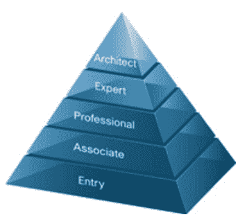

CCNA 认证涵盖的一些常见主题包括：

*   OSI 模型
*   IP 编址
*   WLAN 和 VLAN
*   网络安全和管理（包括 ACL）
*   路由器/路由协议（EIGRP，OSPF 和 RIP）
*   IP 路由
*   网络设备安全
*   故障排除

**注意**： Cisco 认证仅有效 3 年。 认证过期后，证书持有人必须再次参加 CCNA 认证考试。

**What You Will Learn:** []

*   [什么是 CCNA？](#1)
*   [为什么要获得 CCNA 认证？](#2)
*   [CCNA 认证的类型](#3)
*   [CCNA 课程由](#4)组成
*   [了解联网的需求](#5)
*   [网络上使用的互联网络设备](#6)
*   [了解 TCP / IP 层](#7)
*   [网络分段](#8)
*   [数据包传递过程](#9)
*   [什么是 WLAN 或无线局域网](#10)
*   [WLAN 和 LAN 之间的主要区别](#11)
*   [WLAN 重要组件](#12)
*   [WLAN 安全性](#13)
*   [实施 WLAN](#14)
*   [故障排除](#15)
*   [路由器](#16)简介
*   [二进制数字基础](#17)
*   [网络寻址方案](#18)的重要元素
*   [路由器安全性](#19)

## 为什么要获得 CCNA 认证？

*   该证书验证了专业人员理解，操作，配置中级交换和路由网络并进行故障排除的能力。 它还包括使用 WAN 验证和实现通过远程站点的连接。
*   它教考生如何创建点对点网络
*   通过确定网络拓扑来教授如何满足用户要求
*   它介绍了如何路由协议以连接网络
*   它解释了如何构造网络地址
*   它说明了如何与远程网络建立连接。
*   证书持有者可以为小型网络安装，配置和运行 LAN 和 WAN 服务
*   CCNA 证书是许多其他 Cisco 认证（例如 CCNA Security，CCNA Wireless，CCNA Voice 等）的前提条件。
*   易于遵循的学习资料。

## CCNA 认证的类型

保护 CCNA。 基本上有两种方法，如下所示。

1.  ICND1 考试和 ICND2
2.  CCNA 联合考试

如前所述，任何 CCNA 证书的有效期为三年。

| **考试代码** | **专为**设计 | **考试时间和问题数量** | **考试费用** |
| 100-101 ICND1 | 入门级网络技术员 | 

*   90 分钟考试时间
*   50-60 题

 | $ 150（因国家/地区不同而异） |
| 200-101 ICND2 | 经验丰富的网络技术员 | 

*   75 分钟的考试时间
*   50-60 题

 | $150 ( for different country price may vary) |
| 200-120 CCNA | Experienced Network Technician | 

*   90 分钟的考试时间
*   50-60 个问题

 | 295 美元（不同国家的价格可能有所不同） |

除此认证外，CCNA 开设的新认证课程还包括：

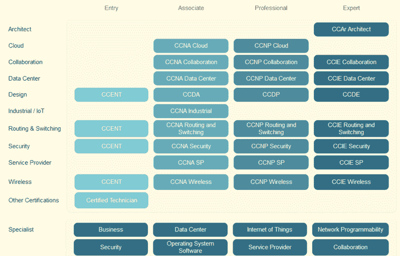

*   CCNA 云
*   CCNA 合作
*   CCNA 交换和路由
*   CCNA 安全
*   CCNA 服务提供商
*   CCNA 数据中心
*   CCNA 工业
*   CCNA 语音
*   CCNA 无线

有关这些考试的更多详细信息，请访问此处的链接[。](https://www.cisco.com/c/en/us/training-events/training-certifications/exams/current-list.html)

获得 CCNA 认证的候选人还可以借助 CCNA 新手训练营为考试做准备。

成功完成 CCNA 考试。 这些是 TCP / IP 和 OSI 模型，子网划分，IPv6，NAT（网络地址转换）和无线访问所必须全面的主题。

## CCNA 课程包括什么

*   **ICND1** 包含诸如 IP 路由技术，IP 服务（NAT，ACLS，DHCP），网络设备安全性，IPv6，LAN 交换技术等主题。
*   **ICND2** 包含诸如 IP 路由技术，IP 服务（FHRP，syslog，SNMP v2 和 v3），LAN 交换技术和 WAN 技术之类的主题。
*   CCNA 联合考试涵盖 ICND1 和 ICND2 中的所有主题。 它涵盖了有关安装，操作和故障排除的主题。

当前 CCNA 考试的新变化包括：

*   对 IPv6 的深刻理解
*   CCNP 级别的主题为 HSRP，DTP，EtherChannel
*   先进的故障排除技术
*   带有超网和子网的网络设计

**资格认证标准**

*   对于认证，不需要学位。 但是，受到一些雇主的青睐。

**Internet 局域网**

互联网局域网由计算机网络组成，该计算机网络将办公室，住宅，实验室等有限区域内的计算机互连。该区域网络包括 WAN，WLAN，LAN，SAN 等。

在这些 WAN 中，LAN 和 WLAN 是最流行的。 在本学习指南中，您将学习如何使用这些网络系统建立局域网。

## 了解网络需求

**什么是网络？**

网络被定义为链接到共享资源（例如打印机和 CD），交换文件或允许电子通信的两个或多个独立的设备或计算机。

例如，网络上的计算机可以通过电话线，电缆，卫星​​，无线电波或红外光束链接。

两种非常常见的网络类型包括：

*   局域网（LAN）
*   广域网（WAN）

根据 OSI 参考模型，第 3 层（即网络层）参与联网。 该层负责数据包转发，通过中间路由器的路由，识别并将本地主机域消息转发到传输层（第 4 层）等。

该网络通过使用路由和交换机这两种设备连接计算机和外围设备来运行。 如果两个设备或计算机连接在同一链路上，则不需要网络层。

## 网络上使用的互联网络设备

为了连接互联网，我们需要各种互联设备。 一些用于建立 Internet 的常用设备是。

*   **NIC**：网络接口卡或 NIC 是工作站中安装的印刷电路板。 它代表工作站和网络电缆之间的物理连接。 尽管 NIC 在 OSI 模型的物理层上运行，但它也被认为是数据链路层设备。 NIC 的一部分是为了促进工作站和网络之间的信息。 它还控制数据到电线上的传输
*   **集线器**：通过放大信号然后重新传输，集线器有助于延长网络布线系统的长度。 它们基本上是多端口中继器，根本不关心数据。 集线器连接工作站，并将传输发送到所有连接的工作站。

*   **桥接器**：随着网络的扩大，它们通常变得难以处理。 为了管理这些不断增长的网络，通常将它们划分为较小的 LAN。 这些较小的 LAN 通过网桥相互连接。 这不仅有助于减少网络上的流量消耗，而且还可以监视数据包在网段之间移动时的情况。 它跟踪与各个端口关联的 MAC 地址。

*   **开关**：桥接选项中使用了开关。 由于它们比网桥更快速，更智能，因此它已成为连接网络的更常用方法。 它能够将信息传输到特定的工作站。 交换机使每个工作站可以独立于其他工作站通过网络传输信息。 就像一条现代电话线，一次可以进行多个私人对话。

*   **路由器**：使用路由器的目的是沿着最有效，最经济的路线将数据定向到目标设备。 它们在网络层 3 上运行，这意味着它们通过 IP 地址而不是物理（MAC）地址进行通信。 路由器将两个或多个不同的网络连接在一起，例如 Internet 协议网络。 路由器可以链接不同的网络类型，例如以太网，FDDI 和令牌环。

*   **代理**：它是路由器和网桥的组合。 Brouter 充当过滤器，使一些数据可以进入本地网络，并将未知数据重定向到另一个网络。
*   **调制解调器**：这是一种将计算机生成的计算机数字信号转换为模拟信号（通过电话线传输）的设备。

## 了解 TCP / IP 层

TCP / IP 代表传输控制协议/ Internet 协议。 它确定如何将计算机连接到 Internet 以及如何在计算机之间传输数据。

*   **TCP**：它负责将数据分解为小数据包，然后才能在网络上发送它们。 同样，用于在到达包装盒时再次组装它们。
*   **IP（Internet 协议）**：它负责通过 Internet 寻址，发送和接收数据包。

下图显示了连接到 OSI 层的 TCP / IP 模型。

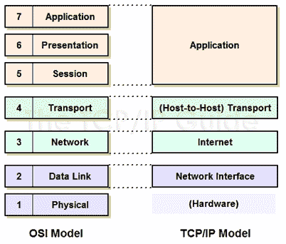

**了解 TCP / IP Internet 层**

为了理解 TCP / IP Internet 层，我们举一个简单的例子。 当我们在地址栏中键入内容时，我们的请求将被处理到服务器。 服务器将通过请求回复我们。 由于 TCP / IP 协议，因此可以在 Internet 上进行此通信。 邮件以小包装形式发送和接收。

TCP / IP 参考模型中的 Internet 层负责在源计算机和目标计算机之间传输数据。 该层包括两个活动

*   将数据传输到网络接口层
*   将数据路由到正确的目的地

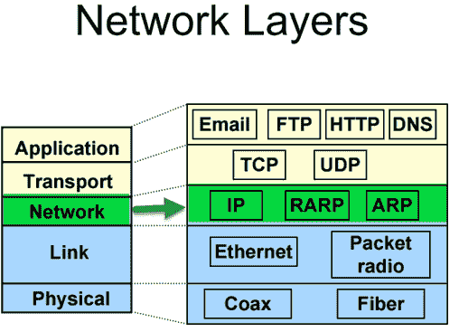

那怎么发生的呢？

Internet 层将数据打包到称为 IP 数据报的数据包中。 它由源 IP 地址和目标 IP 地址组成。 除此之外，IP 数据报报头字段还包括版本，报头长度，服务类型，数据报长度，生存时间等信息。

在网络层中，您可以观察到网络协议，例如 ARP，IP，ICMP，IGMP 等。数据报是使用这些协议通过网络传输的。 它们每个都类似于某些功能。

*   互联网协议（IP）负责 IP 寻址，路由，数据包的分段和重组。 它确定如何在网络上路由消息。
*   同样，您将具有 ICMP 协议。 它负责诊断功能并报告由于 IP 数据包传递失败而导致的错误。
*   对于 IP 组播组的管理，IGMP 协议负责。
*   ARP 或地址解析协议负责将 Internet 层地址解析为网络接口层地址（例如硬件地址）。
*   RARP 用于无盘计算机，以使用网络确定其 IP 地址。

下图显示了 IP 地址的格式。

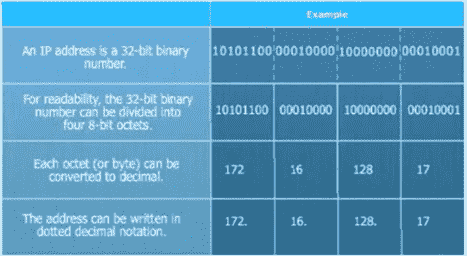

**了解 TCP / IP 传输层**

传输层也称为主机到主机传输层。 它负责为应用程序层提供会话和数据报通信服务。

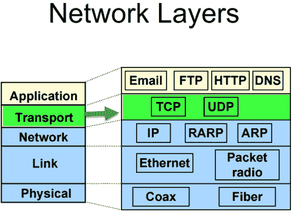

传输层的主要协议是用户数据报协议（UDP）和传输控制协议（TCP）。

*   TCP 负责排序和确认已发送的数据包。 它还可以恢复传输过程中丢失的数据包。 通过 TCP 进行数据包传送更加安全和有保证。 属于同一类别的其他协议是 FTP，HTTP，SMTP，POP，IMAP 等。
*   当要传输的数据量较小时，使用 UDP。 它不保证包的传送。 UDP 用于 VoIP，视频会议，Ping 等。

## 网络分段

网络分段意味着将网络分成更小的网络。 它有助于分散流量负荷并提高 Internet 的速度。

可以通过以下方式实现网络分段：

*   通过在具有不同安全性要求的网络或系统之间实施 DMZ（非军事区）和网关。
*   通过使用 Internet 协议安全性（IPsec）实现服务器和域隔离。
*   通过使用 LUN（逻辑单元号）屏蔽和加密等技术实现基于存储的分段和过滤。
*   通过在必要时实施 DSD 评估的跨域解决方案

**为什么网络分段很重要**

出于以下原因，网络细分很重要，

*   **改善安全性**-防止可能危害网络可用性的恶意网络攻击。 检测并响应网络中的未知入侵
*   **隔离网络问题**-提供一种快速方法，以在入侵时将受感染的设备与网络的其余部分隔离。
*   **减少拥塞**-通过分段局域网，可以减少每个网络的主机数量
*   **扩展网络**-可以添加路由器以扩展网络，从而允许其他主机进入 LAN。

**VLAN 分段**：

VLAN 使管理员可以分割网络。 基于诸如项目团队，功能或应用程序之类的因素进行细分，而与用户或设备的物理位置无关。 VLAN 中连接的一组设备的行为就像它们位于自己的独立网络中一样，即使它们与其他 VLAN 共享公共基础结构也是如此。 VLAN 用于数据链路层或 Internet 层，而子网用于网络/ IP 层。 VLAN 内的设备可以相互通信，而无需三层交换机或路由器。

用于分段的流行设备是交换机，路由器，网桥等。

**划分子网**

子网更关心 IP 地址。 子网划分主要基于硬件，与基于软件的 VLAN 不同。 子网是一组 IP 地址。 如果它们属于同一子网，则无需使用任何路由设备即可到达任何地址。

做网络分段时要考虑的几件事

*   正确的用户身份验证以访问安全网段
*   ACL 或访问列表应正确配置
*   访问审核日志
*   应当检查任何影响安全网段的内容-数据包，设备，用户，应用程序和协议
*   随时注意传入和传出的流量
*   基于用户身份或应用程序的安全策略，以确定谁有权访问哪些数据，而不基于端口，IP 地址和协议
*   不允许将持卡人数据退出到 PCI DSS 范围之外的另一个网段。

## 数据包传递过程

到目前为止，我们已经看到了不同的协议，分段，各种通信层等。现在，我们将了解数据包如何通过网络传递。 将数据从一台主机传递到另一台主机的过程取决于发送和接收主机是否在同一域中。

数据包可以通过两种方式传递：

*   发送到不同网络上的远程系统的数据包
*   发往同一局域网上系统的数据包

如果接收和发送设备连接到同一广播域，则可以使用交换机和 MAC 地址交换数据。 但是，如果发送和接收设备连接到不同的广播域，则需要使用 IP 地址和路由器。

**第 2 层数据包传递**

在单个 LAN 网段内传送 IP 数据包很简单。 假设主机 A 要向主机 B 发送一个数据包。它首先需要具有主机 B 的 IP 地址到 MAC 地址的映射。由于在第 2 层，以 MAC 地址作为源地址和目标地址发送了数据包。 如果不存在映射，则主机 A 将针对 IP 地址的 MAC 地址发送 ARP 请求（在 LAN 网段上广播）。 主机 B 将接收到该请求，并以 ARP 响应作为响应，指示 MAC 地址。

**段内分组路由**

如果数据包发往同一本地网络上的系统，则意味着目标节点是否在发送节点的同一网段上。 发送节点以以下方式寻址数据包。

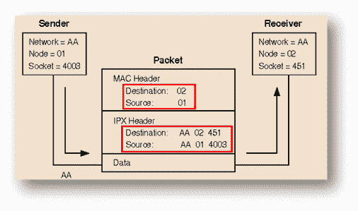

*   目标节点的节点号位于 MAC 头目标地址字段中。
*   发送节点的节点号放置在 MAC 标头源地址字段中
*   目标节点的完整 IPX 地址位于 IPX 标头目标地址字段中。
*   发送节点的完整 IPX 地址位于 IPX 标头目标地址字段中。

**第 3 层数据包传递**

要通过路由网络传送 IP 数据包，需要执行几个步骤。

例如，如果主机 A 要向主机 B 发送数据包，它将以这种方式发送数据包

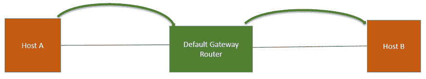

*   主机 A 将数据包发送到其“默认网关”（默认网关路由器）。
*   要将数据包发送到路由器，主机 A 需要知道路由器的 Mac 地址
*   为此，主机 A 发送 ARP 请求，询问路由器的 Mac 地址。

*   然后，此数据包在本地网络上广播。 默认网关路由器接收针对 MAC 地址的 ARP 请求。 它以默认路由器的 Mac 地址作为主机 A 的响应。
*   现在，主机 A 知道了路由器的 MAC 地址。 它可以发送 IP 数据包，其目的地址为主机 B。
*   由主机 A 发送到默认路由器的发往主机 B 的数据包将具有以下信息，
    *   源 IP 信息
    *   目的 IP 的信息
    *   来源 Mac 地址的信息
    *   目的地 Mac 地址的信息
*   路由器收到数据包后，将结束主机 A 发出的 ARP 请求
*   现在，主机 B 将收到来自默认网关路由器的针对主机 B mac 地址的 ARP 请求。 主机 B 回应 ARP 响应，指示与之关联的 MAC 地址。
*   现在，默认路由器将向主机 B 发送一个数据包

**段间分组路由**

在两个节点位于不同网段的情况下，将按以下方式进行数据包路由。

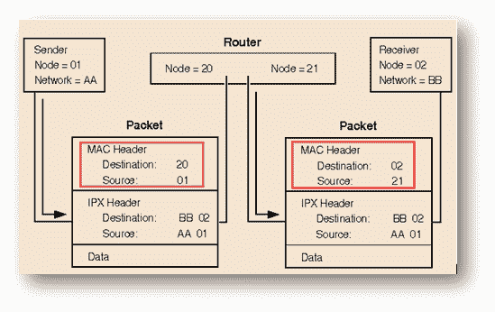

*   在第一个数据包中，在 MAC 头中放置来自路由器的目标号码“ 20”及其自身的源字段“ 01”。 对于 IPX 标头，将目标编号“ 02”，源字段放置为“ AA”和 01。
*   在第二个数据包中时，在 MAC 标头中，来自路由器的目标编号为“ 02”，源编号为“ 21”。 对于 IPX 标头，将目标号码“ 02”和源字段分别放置为“ AA”和 01。

**无线局域网**

无线技术最早是在 90 年代引入的。 它用于将设备连接到 LAN。 从技术上讲，它称为 802.11 协议。

## 什么是 WLAN 或无线局域网

WLAN 是使用无线电或红外信号在短距离内进行的无线网络通信。 WLAN 以 Wi-Fi 品牌名称销售。

连接到 WLAN 的任何组件都被视为站点，并且属于以下两种类别之一。

*   **接入点（AP）**：AP 通过能够接收发送信号的设备发送和接收射频信号。 通常，这些设备是路由器。
*   **客户端**：它可以包括各种设备，例如工作站，便携式计算机，IP 电话，台式计算机等。所有能够相互连接的工作站都称为 BSS（基本服务集）。

WLAN 的示例包括

*   WLAN 适配器
*   接入点（AP）
*   站适配器
*   WLAN 交换机
*   WLAN 路由器
*   安全服务器
*   电缆，连接器等。

**WLAN 的类型**

*   基础设施
*   点对点
*   桥
*   无线分布式系统

## WLAN 和 LAN 之间的主要区别

*   与以太网 LAN 中使用的 CSMA / CD（带有冲突检测的载波侦听多路访问）不同。 WLAN 使用 CSMA / CA（具有冲突避免功能的载波侦听多路访问）技术。
*   WLAN 使用准备发送（RTS）协议和清除发送（CTS）协议来避免冲突。
*   WLAN 使用的帧格式与有线以太网 LAN 使用的帧格式不同。 WLAN 在帧的第 2 层标头中需要其他信息。

## WLAN 重要组件

WLAN 非常依赖这些组件来实现有效的无线通信，

*   **射频传输**
*   **WLAN 标准**
*   **ITU-R 本地 FCC 无线**
*   **802.11 标准和 Wi-Fi 协议**
*   **Wi-Fi 联盟**

让我们一一看一下

**射频传输**

无线电频率的范围从手机使用的频率到 AM 无线电频段。 无线电频率通过产生无线电波的天线辐射到空中。

以下因素会影响射频传输，

*   **吸收**-当无线电波从物体上反弹时
*   **反射**-当无线电波撞击不平坦的表面时
*   **散射**-当无线电波被物体吸收时

**WLAN 标准**

为了建立 WLAN 标准和认证，一些组织已经向前迈进了一步。 组织已设立监管机构来控制 RF 频段的使用。 在使用或实现任何新的传输，调制和频率之前，必须先获得 WLAN 服务所有监管机构的批准。

这些监管机构包括：

*   美国联邦通讯委员会（FCC）
*   欧洲欧洲电信标准协会（ETSI）

在为这些无线技术定义标准时，您具有另一权限。 这些包括，

*   IEEE（电气与电子工程师学会）
*   ITU（国际电信联盟）

**ITU-R 本地 FCC 无线**

ITU（国际电信联盟）在每个国家的所有监管机构之间协调频谱分配和规定。

在未许可的频段上操作无线设备不需要许可证。 例如，2.4 GHz 频段既用于无线 LAN，也用于蓝牙设备，微波炉和便携式电话。

**WiFi 协议和 802.11 标准**

IEEE 802.11 WLAN 使用称为 CSMA / CA（具有冲突避免功能的载波侦听多路访问）的媒体访问控制协议

无线分配系统允许 IEEE 802.11 网络中的接入点无线互连。

IEEE（电气和电子工程师协会）802 标准包括一系列网络标准，这些标准涵盖了从以太网到无线技术的物理层规范。 IEEE 802.11 使用以太网协议和 CSMA / CA 进行路径共享。

IEEE 为 WLAN 服务定义了各种规范（如表所示）。 例如，802.11g 适用于无线 LAN。 它用于在 2.4 GHz 频段内以高达 54 Mbps 的短距离传输。 同样，可以对适用于无线 LAN 的 802.11b 进行扩展，并在 2.4 GHz 频带中提供 11 Mbps 的传输（回退到 5.5、2 和 1 Mbps）。 它仅使用 DSSS（直接序列扩频）。

下表显示了不同的 Wi-Fi 协议和数据速率。

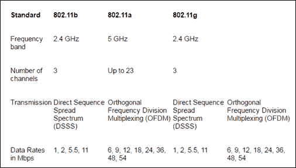

**Wi-Fi 联盟**

Wi-Fi 联盟通过提供认证来确保各个供应商提供的 802.11 产品之间的互操作性。 该认证包括所有三种 IEEE 802.11 RF 技术，以及早期采用的未完成 IEEE 草案，例如解决安全问题的草案。

## WLAN 安全

网络安全仍然是 WLAN 中的重要问题。 作为预防措施，通常必须禁止随机的无线客户端加入 WLAN。

WLAN 容易受到各种安全威胁的侵害，例如，

*   越权存取
*   MAC 和 IP 欺骗
*   窃听
*   会话劫持
*   DOS（拒绝服务）攻击

用于保护 WLAN 免受漏洞攻击的技术包括：

*   **WEP（有线等效保密）**：为了应对安全威胁，使用了 WEP。 它通过加密通过空中传输的消息，为 WLAN 提供安全性。 这样，只有具有正确加密密钥的接收者才能解密信息。 但是，它被认为是较弱的安全标准，与之相比，WPA 是更好的选择。
*   **WPA / WPA2（受 WI-FI 保护的访问）**：通过在 wi-fi 上引入 TKIP（临时密钥完整性协议），进一步提高了安全标准。 TKIP 会定期更新，因此无法进行窃取。 而且，通过使用更强大的哈希机制可以增强数据完整性。

*   **Wireless Intrusion Prevention Systems / Intrusion Detection Systems**: It is a device that monitors the radio spectrum for the presence of unauthorized access points.

    WIPS 有三种部署模型，

    *   AP（接入点）通过与常规的网络连接功能交替使用来部分执行 WIPS 功能
    *   AP（接入点）具有内置的专用 WIPS 功能。 因此它可以一直执行 WIPS 功能和网络连接功能
    *   通过专用传感器而不是 AP 部署 WIPS

## 实施 WLAN

在实施 WLAN 时，接入点放置对吞吐量的影响比标准更大。 WLAN 的效率可能受到三个因素的影响，

*   拓扑结构
*   距离
*   接入点位置。

WLAN 可以通过两种方式实现：

1.  **Ad-hoc 模式**：在此模式下，不需要接入点，可以直接连接。 对于小型办公室（或家庭办公室），此设置更可取。 唯一的缺点是在这种模式下安全性很弱。
2.  **基础结构模式**：在此模式下，可以通过访问点连接客户端。 基础结构模式分为两种模式：

*   **基本服务集（BSS）**： BSS 提供 802.11 无线 LAN 的基本构件。 一个 BSS 包括一组计算机和一个 AP（访问点），它们链接到有线 LAN。 BSS 有两种类型，独立 BSS 和基础结构 BSS。 每个 BSS 都有一个称为 BSSID 的 ID（它是为 BSS 服务的接入点的 Mac 地址）。
*   **扩展服务集（ESS）**：它是一组连接的 BSS。 ESS 允许用户（尤其是移动用户）在多个 AP（接入点）覆盖的区域内的任何地方漫游。 每个 ESS 都有一个称为 SSID 的 ID。

**WLAN 拓扑**

*   **BSA** ：被称为 BSS 中的接入点提供的 RF（射频）覆盖范围的物理区域。 它取决于因接入点功率输出，天线类型以及影响 RF 的物理环境而产生的变化而产生的 RF。 远程设备无法直接通信，它们只能通过访问点进行通信。 AP 开始发送通告 BSS 特性的信标，例如所支持的调制方案，信道和协议。
*   **ESA** ：如果单个小区无法提供足够的覆盖范围，则可以添加任意数量的小区以扩展覆盖范围。 这被称为 ESA。
    *   为了使远程用户漫游而不会丢失 RF 连接，建议重叠 10％到 15％
    *   对于无线语音网络，建议重叠 15％到 20％。
*   **数据速率**：数据速率是指信息可以在电子设备之间传输的速度。 以 Mbps 为单位。 数据速率的转换可能会在逐个传输的基础上发生。
*   **接入点配置**：可以通过命令行界面或浏览器 GUI 来配置无线接入点。 接入点的功能通常允许调整参数，例如启用哪个无线电，提供的频率以及在该 RF 上使用哪个 IEEE 标准。

**实施无线网络的步骤，**

为了实现无线网络，基本步骤包括

**步骤 1）**在实现任何无线网络之前，请验证有线主机的现有网络和 Internet 访问。

**步骤 2）**使用单个接入点和单个客户端实现无线，而没有无线安全性

**步骤 3）**验证无线客户端已收到 DHCP IP 地址。 它可以连接到本地有线默认路由器并浏览到外部 Internet。

**步骤 4）**使用 WPA / WPA2 保护无线网络。

## 故障排除

WLAN 可能会遇到一些配置问题，例如

*   配置不兼容的安全性方法
*   在客户端上配置与访问点不匹配的已定义 SSID

以下是一些故障排除步骤，可帮助您解决上述问题，

*   将环境分为有线网络与无线网络
*   此外，将无线网络分为配置问题和射频问题
*   验证现有有线基础设施和相关服务的正常运行
*   验证其他先前已连接以太网的主机可以续订其 DHCP 地址并访问 Internet
*   验证配置并消除 RF 问题的可能性。 将接入点和无线客户端放在一起。
*   始终以开放式身份验证启动无线客户端并建立连接
*   验证是否存在任何金属障碍物，如果存在，则更改接入点的位置

**局域网连接**

局域网被限制在较小的区域。 使用 LAN，您可以相互连接支持网络的打印机，网络连接的存储设备和 Wi-Fi 设备。

要连接不同地理区域的网络，可以使用 WAN（广域网）。

在这里，我们将看到不同网络上的计算机如何相互通信。

## 路由器简介

路由器是用于连接 LAN 上的网络的电子设备。 它连接至少两个网络并在其中转发数据包。 根据数据包头和路由表中的信息，路由器连接网络。

它是 Internet 和其他复杂网络运行所需的主要设备。

路由器分为两类，

*   **静态**：管理员手动设置并配置路由表以指定每个路由。
*   **动态**：它能够自动发现路由。 他们检查来自其他路由器的信息。 在此基础上，它对如何在网络上发送数据进行逐包决策。

## 二进制数字基础

Internet 上的计算机通过 IP 地址进行通信。 网络中的每个设备均由唯一的 IP 地址标识。 这些 IP 地址使用二进制数字，该数字将转换为十进制数字。 我们将在后面的部分中看到这一点，首先看到一些基本的二进制数字课程。

二进制数字包括数字 1,1,0,0,1,1。 但是如何在网络之间路由和通信时使用此数字。 让我们从一些基本的二进制课程开始。

在二进制算术中，每个二进制值均由 8 位（1 或 0）组成。如果某位为 1，则视为“有效”；如果为 0，则为“无效”。

二进制如何计算？

您将熟悉小数位置，例如 10、100、1000、10,000 等。 除了加 10 之外，其他什么都没有。二进制值以类似的方式工作，但是它将以 2 为底，而不是以 10 为底。例如 2 0 ，2 1 ， 2 2 ，2 3 ，.... 2 6 。 这些位的值从左到右递增。 为此，您将获得像 1,2,4，.... 64 这样的值。

请参阅下表。

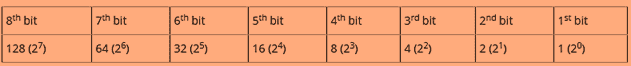

现在，由于您熟悉字节中每个位的值。 下一步是了解如何将这些数字转换为 01101110 等二进制格式。 二进制数中的每个数字“ 1”表示 2 的幂，每个“ 0”表示 0。

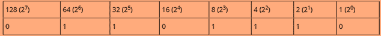

在上表中，您可以看到值 64、32、8、4 和 2 的位已打开并表示为二进制 1。因此，对于表 01101110 中的二进制值，我们将数字相加

64 + 32 + 8 + 4 + 2 获得数字 110。

## 网络寻址方案的重要元素

**IP 地址**

对于构建网络，首先，我们需要了解 IP 地址的工作方式。 IP 地址是 Internet 协议。 它主要负责在数据包交换网络中路由数据包。 IP 地址由 32 个二进制位组成，这些位对于网络部分和主机部分是可分割的。 32 个二进制位分为四个八位位组（1 个八位位组= 8 位）。 每个八位位组都将转换为十进制，并用句点（点）分隔。

IP 地址由两部分组成。

*   **网络 ID** -网络 ID 标识计算机所在的网络
*   **主机 ID** -标识该网络上计算机的部分

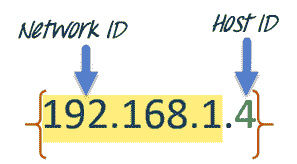

这 32 位分为四个八位位组（1 个八位位组= 8 位）。 每个八位位组中的值的范围是 0 到 255 十进制。 八位位组的最右边位的值为 2 0 ，然后逐渐增加，直到 2 7 ，如下所示。

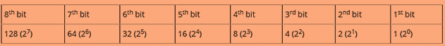

再举一个例子

例如，我们有一个 IP 地址 10.10.16.1，然后首先将该地址分解为以下八位字节。

*   .10
*   .10
*   .16
*   .1

每个八位位组中的值的范围是 0 到 255 十进制。 现在，如果将它们转换为二进制形式。 它将类似于 00001010.00001010.00010000.00000001。

**IP 地址类别**

IP 地址分为不同的类别：

| 类类别 |   | 通讯类型 |
| A 级 | 0-127 | 用于互联网通讯 |
| B 级 | 128-191 | For internet communication |
| C 级 | 192-223 | For internet communication |
| D 级 | 224-239 | 保留用于多播 |
| E 级 | 240-254 | 保留用于研究和实验 |

要通过 Internet 进行通信，IP 地址的专用范围如下。

| Class Categories |   |
| Class A | 10.0.0.0 – 10.255.255.255 |
| Class B | 172.16.0.0 - 172.31.255.255 |
| Class C | 192-223 - 192.168.255.255 |

**子网和子网掩码**

对于任何组织，您可能需要一个由数十台独立计算机组成的小型网络。 为此，必须要求在几座建筑物中建立包含 1000 多个主机的网络。 可以通过将网络划分为称为**子网**的细分来进行这种安排。

网络规模会影响

*   您申请的网络课程
*   您收到的网络号码
*   您用于网络的 IP 寻址方案

由于冲突和由此产生的重传，在交通繁忙的情况下，性能可能受到不利影响。 为此，子网掩码可能是有用的策略。 将子网掩码应用于 IP 地址，将 IP 地址分为**扩展网络地址**和**主机地址两部分。**

子网掩码可帮助您查明子网中端点的位置（如果在子网中提供）。

不同的类别具有默认的子网掩码，

*   A 级-255.0.0.0
*   B 级 255.255.0.0
*   C 级 255.255.255.0

## 路由器安全性

保护路由器免遭未经授权的访问，篡改和窃听。 对于这种使用技术，

*   分支机构威胁防御
*   具有高度安全连接性的 VPN

**分支机构威胁防御**

*   **路由来宾用户流量**：将来宾用户流量直接路由到 Internet，并将公司流量回程到总部。 这样，来宾流量不会对您的公司环境构成威胁。
*   **访问公共云**：只有选定的流量类型可以使用本地 Internet 路径。 诸如防火墙之类的各种安全软件可以为您提供防范未经授权的网络访问的保护。
*   **完全直接 Internet 访问**：所有流量都使用本地路径路由到 Internet。 它确保企业级免受企业级威胁的侵害。

**VPN 解决方案**

VPN 解决方案可保护各种类型的 WAN 设计（公共，专用，有线，无线等）及其所携带的数据。 数据可分为两类

*   静止数据
*   传输中的数据

数据通过以下技术保护。

*   密码术（原始身份验证，拓扑隐藏等）
*   遵循合规标准（HIPAA，PCI DSS，Sarbanes-Oxley）合规

**摘要**：

*   Internet 局域网是在有限区域内互连计算机的计算机网络。
*   WAN，LAN 和 WLAN 是最受欢迎的 Internet 局域网
*   根据 OSI 参考模型，第 3 层（即网络层）参与联网
*   第 3 层负责数据包转发，通过中间路由器的路由，识别并将本地主机域消息转发到传输层（第 4 层）等。
*   用于建立网络的一些常见设备包括：
    *   线
    *   集线器
    *   桥梁
    *   开关
    *   路由器
*   TCP 负责将数据分解为小数据包，然后才能在网络上发送它们。
*   Internet 层中的 TCP / IP 参考模型有两件事，
    *   将数据传输到网络接口层
    *   将数据路由到正确的目的地
*   通过 TCP 传输数据包更加安全和有保证
*   当要传输的数据量较小时，使用 UDP。 它不保证包的传送。
*   网络分段意味着将网络分成更小的网络
    *   VLAN 分段
    *   子网划分
*   数据包可以通过两种方式传递：
    *   发送到不同网络上的远程系统的数据包
    *   发往同一局域网上系统的数据包

*   WLAN 是使用无线电或红外信号在短距离内进行的无线网络通信
*   连接到 WLAN 的任何组件都被视为站点，并且属于以下两种类别之一。
    *   接入点（AP）
    *   客户
*   WLAN 使用 CSMA / CA 技术
*   用于保护 WLAN 的技术
    *   WEP（有线等效保密）
    *   WPA / WPA2（受 WI-FI 保护的访问）
    *   无线入侵防御系统/入侵检测系统
*   WLAN 可以通过两种方式实现
    *   临时模式

*   路由器连接至少两个网络并在其中转发数据包
*   路由器分为两类，
    *   **静态**
    *   **动态**
*   IP 地址是一个 Internet 协议，主要负责在数据包交换网络中路由数据包。
*   IP 地址由两部分组成
    *   **网络 ID**
    *   **主机 ID**
*   为了通过 Internet 进行通信，对 IP 地址的私有范围进行了分类
*   通过使用以下方法保护路由器免遭未经授权的访问和窃听
    *   分支机构威胁防御
    *   具有高度安全连接性的 VPN

[CCNA 2018 200-125 视频新手训练营](https://career.guru99.com/recommends/ccna-boot-camp/)