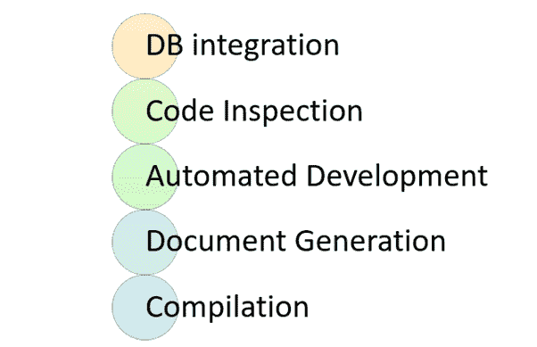
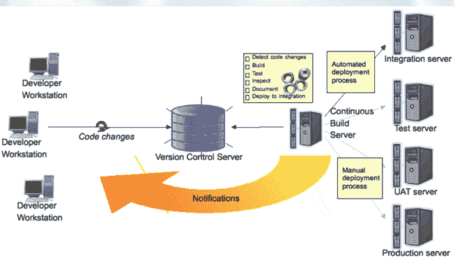
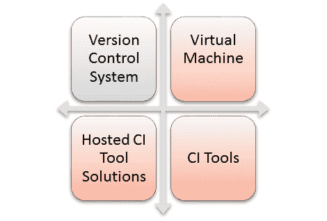
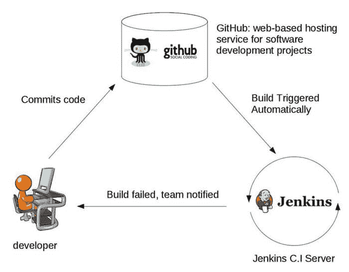

# 什么是持续集成？

> 原文： [https://www.guru99.com/continuous-integration.html](https://www.guru99.com/continuous-integration.html)

## 什么是持续集成？

**持续集成**是一种软件开发方法，团队成员每天至少可以集成一次他们的工作。 在这种方法中，每个集成都由自动构建检查以搜索错误。 CI 概念是在二十多年前首次引入的，以避免出现“集成地狱”，这种情况在集成推迟到项目结束时才会发生。

在提交代码后进行持续集成中，将立即构建并测试软件。 在具有许多开发人员的大型项目中，一天中要进行多次提交。 每次提交代码都会被构建和测试。 如果测试通过，则将对构建进行测试以进行部署。 如果部署成功，则将代码推送到生产环境。 这种提交，构建，测试和部署是一个连续的过程，因此称为连续集成/部署。

在此 CI 教程中，您将学习：

*   [什么是持续集成？](#1)
*   [不使用 CI 进行开发与使用 CI](#2) 进行开发
*   [编译和持续集成之间的区别](#3)
*   [您需要执行 CI 流程什么？](#4)
*   [持续集成如何工作？](#5)
*   [CI 的功能](#6)
*   [为什么使用 CI？](#7)
*   [使用 CI 的最佳做法](#8)
*   [CI 的缺点](#9)
*   [CI 处理工具](#10)

## 不使用 CI 进行开发与使用 CI 进行开发

这是使用 CI 或不使用 CI 进行开发之间的主要区别。

| **没有 CI 的开发** | **使用 CI 开发** |
| 很多虫子 | 更少的错误 |
| 不频繁的提交 | 定期提交 |
| 发行频率不高且缓慢 | 定期发布工作 |
| 整合困难 | 轻松有效的整合 |
| 测试发生晚 | 测试要尽早进行，而且经常进行。 |
| 提出的问题更难解决 | 更快，更有效地查找和解决问题。 |
| 项目可见性差 | 更好的项目可视性 |

## 编译与持续集成之间的区别

Activities in Continuous Integration

尽管编译仅编译代码，但 CI 会执行以下活动

**数据库集成**：

*   确保数据库和代码同步
*   自动创建数据库和测试数据。

**代码检查**：

*   确保健康的代码库
*   尽早发现问题并应用最佳实践

**自动部署**：

*   允许您随时发布产品
*   持续可演示状态，可在任何计算机上使用

**文件生成**：

*   确保文档是最新的
*   从显影剂中清除烧毁
*   生成构建报告和指标

**编译**：

编译是计算机将高级编程语言代码转换成计算机能够理解的机器语言的过程。 它确保了每个目标平台上的代码编译器。

### 我什么时候建造？

*   每次入住时
*   每当依赖项发生变化时

### 我该如何建造？

CI process

*   理想情况下，构建应来自命令行，并且不应依赖于 IDE。
*   构建应该使用专用的 Cl 服务器而不是 cron 作业连续进行。
*   每次登录时都应触发内置的 CI，而不仅仅是在午夜
*   该构建应立即提供反馈，并且无需开发人员的任何努力
*   识别关键指标并进行可视化跟踪。 更重要的是，立即对他们采取行动

## 您需要执行 CI 流程什么？

这里是执行整个 CI 流程所需的关键元素：

*   **版本控制系统（VCS）**：它提供​​了一种可靠的方法来集中和保留随时间推移对项目所做的更改。
*   **虚拟机**：您应该具有备用服务器或至少一个虚拟机来构建系统。
*   **托管 CI 工具解决方案**：为避免使用服务器或虚拟机，您应该使用托管 CI 工具解决方案。 该工具有助于维护整个过程，并提供更轻松的可伸缩性。
*   **工具**：如果选择自托管版本，则需要安装许多 CI 工具之一，例如 Jenkins，TeamCity，Bamboo，GitLab 等。

## 持续集成如何工作？

您肯定知道旧手机诺基亚。 诺基亚过去曾实施一个称为“每晚构建”的程序。 在白天，来自不同开发人员的多次提交后，该软件每晚都会生成。 由于该软件每天仅构建一次，因此，在大型代码库中隔离，识别和修复错误非常费力。

后来，他们采用了持续集成方法。 一旦开发人员提交代码，便立即构建并测试该软件。 如果检测到任何错误，则相应的开发人员可以快速修复缺陷。

Example of Continuous Integration

## CI 的功能

这是持续集成的重要功能

*   允许您仅维护一个源存储库
*   您可以测试生产环境的克隆
*   建筑环境应靠近生产环境。
*   当前版本的持续可用性
*   构建，测试和部署的完整过程应对所有堆栈持有者可见。

## 为什么使用 CI？

以下是使用持续集成的重要原因：

*   帮助您构建质量更高的软件
*   CI 流程有助于扩大工程团队的人员和交付产出。
*   CI 使软件开发人员可以独立地并行处理功能。
*   帮助您进行可重复的测试
*   增加可见性，实现更好的沟通
*   帮助开发潜在的可发货产品以实现全自动构建
*   通过使部署更快，更可预测来帮助您降低风险
*   问题到达时立即反馈
*   在发布日期和时间避免最后一分钟的混乱

## 使用 CI 系统的最佳实践

以下是实施过程中的一些重要最佳做法

*   尽早提交，而且经常提交，永不提交破损的代码
*   立即修复构建失败
*   根据指标采取行动
*   内置在每个目标环境中从每个构建中创建工件
*   需要以某种方式执行软件的构建，以便可以将其自动化
*   不依赖于 IDE
*   更改时构建并测试一切
*   数据库模式算是一切
*   帮助您找出关键指标并进行可视化跟踪
*   经常和提早入住
*   强大的源代码控制
*   每当您提交代码时，持续集成就会运行单元测试
*   自动化构建并测试每个人
*   通过自动部署保持快速构建

## CI 的缺点

这是持续集成过程的缺点/缺点：

*   需要初步设置时间和培训才能熟悉 Cl 服务器
*   制定合适的测试程序至关重要
*   完善的测试套件需要大量的 Cl 服务器资源
*   转换熟悉的流程
*   需要其他服务器和环境
*   当多个开发人员想要同时集成其代码时，可能会出现等待时间

## CI 处理工具

以下是一些最重要的 CI 工具：

### 詹金斯：

Jenkins 是一个开源的持续集成工具。 它是使用 Java 编程语言编写的。 它有助于在更大规模的代码库中实时测试和报告隔离的更改。 该软件可帮助开发人员快速找到并解决其代码库&中的缺陷，从而自动测试其构建。

### 竹：

Bamboo 是一个持续集成的构建服务器，可在单个位置执行-自动构建，测试和发布。 它与 JIRA 软件和 Bitbucket 无缝集成。 Bamboo 支持许多语言和技术，例如 CodeDeply，Ducker，Git，SVN，Mercurial，AWS 和 Amazon S3 存储桶。

### TeamCity：

TeamCity 是支持许多强大功能的持续集成服务器。 即使没有构建在运行，它也可以维持 CI 服务器的健康和稳定。 它为任何项目提供更好的代码质量

### 摘要：

*   持续集成是一种软件开发方法，团队成员可以每天至少一次集成他们的工作
*   不使用 CI 进行开发会产生许多错误，而使用 CI 进行开发会减少错误
*   持续集成的重要活动是 1）数据库集成，2）代码检查，3）自动部署，文档生成和编译。
*   构建应该使用专用的 Cl 服务器而不是 cron 作业连续进行。
*   CI 的重要元素是 1）版本控制系统 2）虚拟机 3）主机 CI 工具解决方案 4）工具
*   持续集成允许您仅维护一个源存储库
*   CI 流程可帮助您构建质量更高的软件
*   持续集成过程最重要的最佳实践是尽早提交，并且经常提交，永不提交破损的代码
*   CI 流程的主要缺点是，完善的测试套件需要 Cl 服务器大量资源
*   Jenkins，Bambok 和 Team City 是一些有用的持续集成工具。