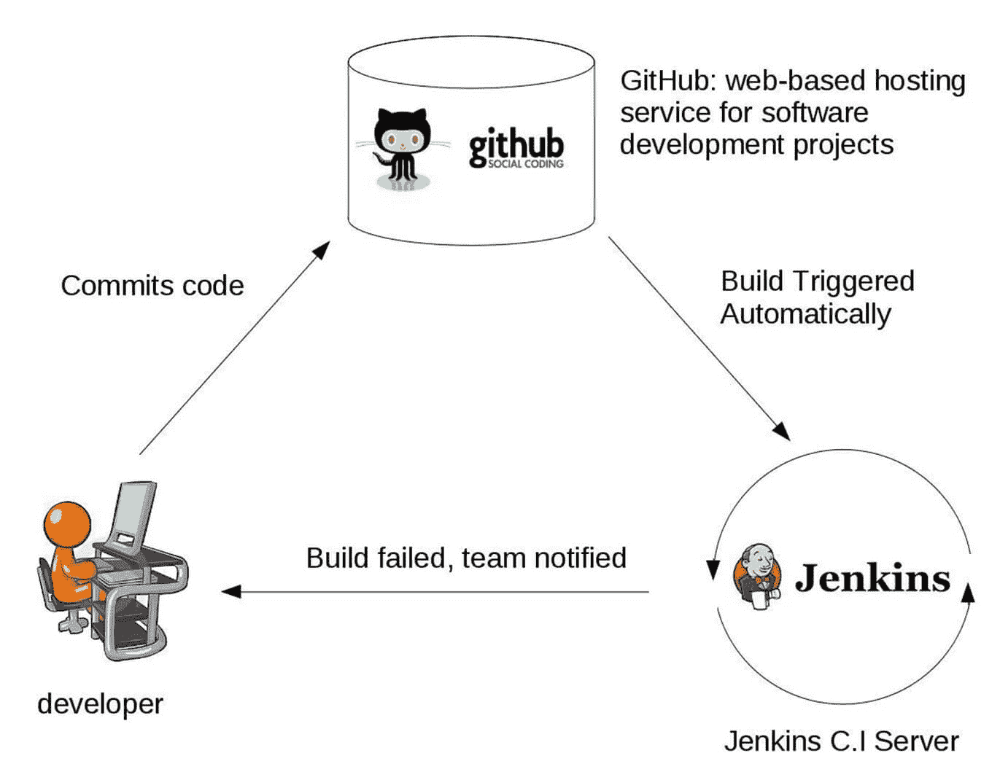
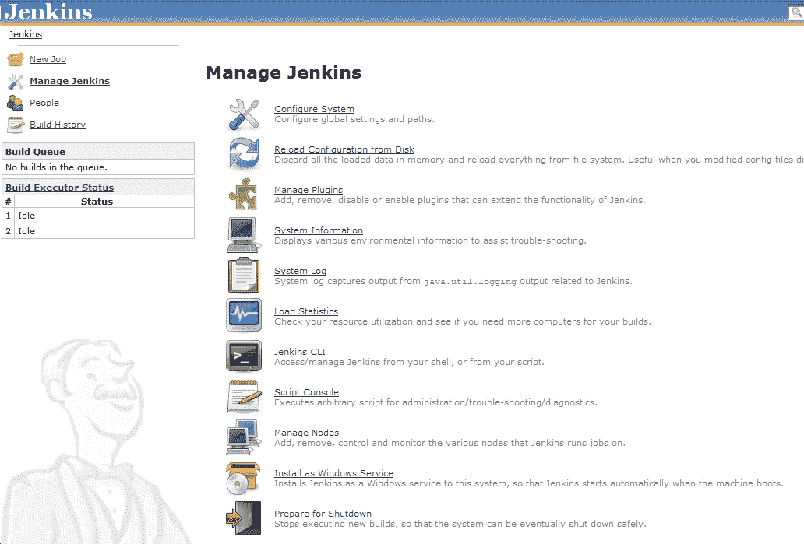

# 詹金斯是什么？ 持续集成（CI）工具

> 原文： [https://www.guru99.com/jenkin-continuous-integration.html](https://www.guru99.com/jenkin-continuous-integration.html)

## 什么是詹金斯？

**Jenkins** 是一款开源的持续集成服务器，能够编排一系列动作，这些动作有助于以自动化方式（不仅是自动）实现持续集成过程。

Jenkins 是免费的，完全用 Java 编写。 Jenkins 是全球范围内广泛使用的应用程序，其安装量约为 30 万，并且每天都在增长。

它是基于服务器的应用程序，需要 Web 服务器（如 Apache Tomcat）。 Jenkins 如此受欢迎的原因是它监视在项目开发过程中出现的重复任务。 例如，如果您的团队正在开发项目，则詹金斯将不断测试您的项目构建，并向您显示开发早期的错误。

通过使用 Jenkins，软件公司可以加快其软件开发过程，因为 Jenkins 可以快速自动构建和测试。 Jenkins 支持软件的完整开发生命周期，包括构建，测试，记录软件，部署和软件开发生命周期的其他阶段。

在本教程中，您将学习

*   [什么是詹金斯？](#1)
*   [什么是持续集成？](#2)
*   [詹金历史](#3)
*   [为什么将持续集成与 Jenkins 结合使用？](#4)
*   [持续集成的实际案例研究](#5)
*   [使用 Jenkins 的优点](#6)
*   [使用 Jenkins 的缺点](#7)

## 什么是持续集成？

在提交代码后进行持续集成中，将立即构建并测试软件。 在具有许多开发人员的大型项目中，一天中要进行多次提交。 每次提交代码都会被构建和测试。 如果测试通过，则将对构建进行测试以进行部署。 如果部署成功，则将代码推送到生产环境。 这种提交，构建，测试和部署是一个连续的过程，因此称为连续集成/部署。

持续集成流水线是一种功能强大的工具，它包含一组工具，这些工具旨在**托管**，**监控器**，**编译**和**测试**代码， 或代码更改，例如：

*   **持续集成服务器**（Jenkins，Bamboo，CruiseControl，TeamCity 等）
*   **源代码管理工具**（例如 CVS，SVN，GIT，Mercurial，Perforce，ClearCase 等）
*   **生成工具**（Make，ANT，Maven，Ivy，Gradle 等）
*   **自动化测试框架**（Selenium，Appium，TestComplete，UFT 等）

## 詹金历史

*   SUN Microsystems 的 Java 开发人员 Kohsuke Kawaguchi 厌倦了重复编写代码和修复错误的工作。 2004 年，创建了一个名为 Hudson 的自动化服务器，该服务器可以自动执行构建和测试任务。
*   2011 年，拥有 Sun Microsystems 的 Oracle 与 Hudson 开源社区发生了争执，因此他们将 Hudson 分叉并将其重命名为 Jenkins。
*   哈德森和詹金斯都继续独立运作。 但是在很短的时间内，詹金斯获得了许多项目和贡献者，而哈德森只剩下 32 个项目。 随着时间的流逝，詹金斯（Jenkins）变得越来越受欢迎，而哈德森（Hudson）不再保持。

## 为什么将持续集成与 Jenkins 结合使用？

有人可能认为老式的软件开发方法是更好的方法。 通过以下示例，让我们了解使用 Jenkins 的 CI 的优势

让我们想象一下，大约有 10 个开发人员正在使用共享存储库。 一些开发人员在 25 天之内完成任务，而其他开发人员则需要 30 天才能完成。

| **在詹金斯**之前 | **在詹金斯**之后 |
| 一旦所有开发人员都完成了分配的编码任务，他们通常会同时提交所有代码。 后来，对 Build 进行了测试和部署。

构建了代码提交，并且测试周期非常少见，并且几天之后就完成了一次构建。 | 一旦开发人员提交代码，便会构建并测试代码。 Jenkin 将在一天

中多次构建和测试代码。如果构建成功，则 Jenkins 将把源代码部署到测试服务器中，并通知部署团队。

如果构建失败，则 Jenkins 将错误通知开发人员团队。 |
| 由于代码是一次构建的，因此某些开发人员需要等到其他开发人员完成编码才能检查其构建 | 在任何开发人员提交之后，都会立即构建代码。 |
| 隔离，检测和修复多个提交的错误并非易事。 | 由于代码是在单个开发人员的每次提交之后构建的，因此很容易检测出导致构建失败的代码 |
| 代码构建和测试过程完全是手动的，因此有很多失败的机会。 | 自动化的构建和测试过程可节省时间并减少缺陷。 |
| 一旦修复并测试了所有错误，便会部署代码。 | 每次成功构建和测试后，都将部署代码。 |
| 开发周期慢 | 开发周期很快。 新功能更易于用户使用。 增加利润。 |

## 持续集成的实际案例研究

我相信你们所有人都知道旧手机诺基亚。 诺基亚过去曾实施一个称为“每晚构建”的程序。 在白天，来自不同开发人员的多次提交后，该软件每晚都会生成。 由于该软件每天仅生成一次，因此，在庞大的代码库中隔离，识别和修复错误非常痛苦。

后来，他们采用了持续集成方法。 一旦开发人员提交代码，便立即构建并测试该软件。 如果检测到任何错误，则相应的开发人员可以快速修复缺陷。

### Jenkins 插件

默认情况下，Jenkins 具有有限的功能集。 如果要将 Jenkins 安装与版本控制工具（如 Git）集成在一起，则需要安装与 Git 相关的插件。 实际上，为了与 Maven，Amazon EC2 之类的工具集成，您需要在 Jenkins 中安装相应的插件。

<figure style="margin-left: auto;margin-right: auto;">

 

詹金斯

中的插件集成

## 使用 Jenkins 的优点

*   Jenkins 由非常开放的社区管理。 每个月，他们都会举行公开会议，并听取公众对 Jenkins 项目开发的意见。
*   到目前为止，大约有 280 张门票已关闭，该项目每三个月发布一次稳定发布。
*   随着技术的发展，詹金斯也在发展。 到目前为止，Jenkins 在其插件数据库中发布了大约 320 个插件。 有了插件，Jenkins 变得更加强大且功能丰富。
*   Jenkins 还支持基于云的体系结构，因此您可以在基于云的平台中部署 Jenkins。
*   Jenkins 之所以受欢迎，是因为它是由开发人员为开发人员创建的。

## 使用 Jenkins 的缺点

尽管詹金斯是一个非常强大的工具，但它也有缺陷。

*   与当前的 UI 趋势相比，其界面已过时且不友好。
*   尽管 Jenkins 被许多开发人员所喜爱，但是维护它并不容易，因为 Jenkins 运行在服务器上，并且需要一些服务器管理员的技能来监视其活动。
*   许多人不实施 Jenkins 的原因之一是由于安装和配置 Jenkins 困难。
*   由于某些较小的设置变化，连续集成经常中断。 持续集成将被暂停，因此需要开发人员注意。

## 结论：

*   在持续集成中，在提交代码后，立即构建并测试软件
*   Jenkins 是一个开源的持续集成服务器，能够编排一系列动作
*   在詹金斯（Jenkins）所有开发人员都完成分配的编码任务之前，他们曾经同时提交所有代码。 后来，对 Build 进行了测试和部署。
*   在 Jenkins 之后，只要开发人员提交代码，便会构建代码并进行测试。 Jenkin 将在一天中多次构建和测试代码
*   默认情况下，Jenkins 具有有限的功能集。 如果要将 Jenkins 安装与版本控制工具（如 Git）集成，则需要安装与 Git 相关的插件
*   詹金斯（Jenkins）的最大优点是，它由社区管理，该社区举行公开会议并从公众那里获取对詹金斯项目发展的投入
*   Jenkin 的最大缺点是，与当前的 UI 趋势相比，其界面已过时且不友好。