# 如何下载&在 Windows 上安装 Jenkins

> 原文： [https://www.guru99.com/download-install-jenkins.html](https://www.guru99.com/download-install-jenkins.html)

Jenkins 可以安装在 Windows 或 Unix 平台上，但是我们仅关注 Windows 安装。

**先决条件：**

在继续在 Windows 系统中安装 Jenkins 之前，Jenkins 需要具备一些先决条件才能在计算机中安装 Jenkins。

**硬件要求：**

*   您的计算机或笔记本电脑中至少需要 256 MB 的 RAM 才能安装 Jenkins
*   Jenkins 的硬盘驱动器中至少需要 1 GB 的空间。

**软件要求：**

*   由于 Jenkins 在 Java 上运行，因此您需要最新版本的 Java Development Kit（JDK）或 Java Runtime Environment（JRE）。

**版本类型**

Jenkins 根据组织需求发布两种类型的版本。

*   长期支持发布
*   每周发布

**长期支持版本（LTS）：**

每 12 周提供一次长期支持版本。 它们很稳定，并经过了广泛的测试。 此版本面向最终用户。

**每周发布：**

通过修复早期版本中的错误，每周发布一次每周发布。 这些版本面向插件开发人员。

我们将使用 LTS 发行版，尽管每周发行版的过程保持不变。

## 如何下载詹金斯？

应该遵循以下步骤，以便成功安装 Jenkins：

**步骤 1）**转到 [https://jenkins.io/download/](https://jenkins.io/download/) 并选择平台。 在我们的例子中是 Windows

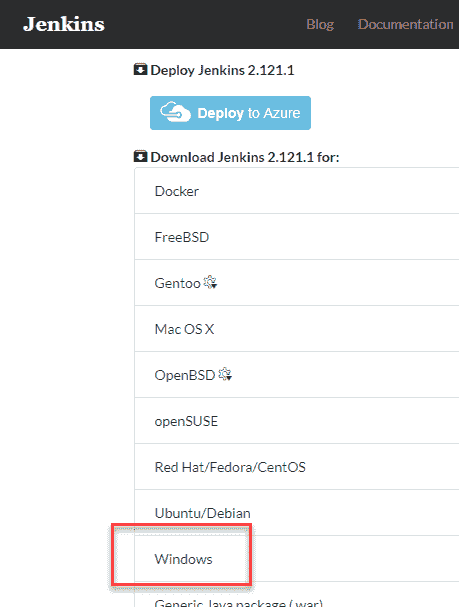

**步骤 2）**转到从本地计算机下载的位置并解压缩下载的软件包。 双击解压缩的 **jenkins.msi** 。 您也可以使用 WAR（Web 应用程序 ARchive）来使用 Jenkin，但不建议这样做。

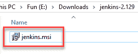

**步骤 3）**在 Jenkin 设置屏幕中，单击下一步。

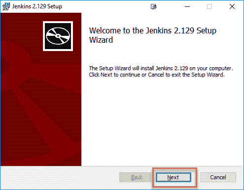

**步骤 4）**选择要安装 Jenkins 实例的位置（默认位置为 C：\ Program Files（x86）\ Jenkins），然后单击**下一个**按钮。

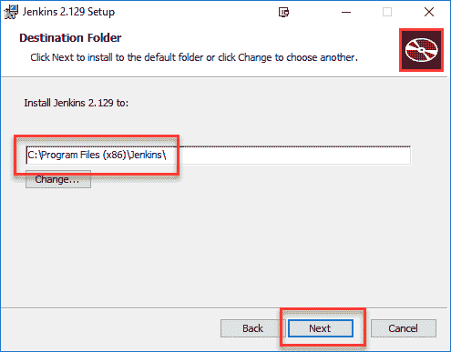

**步骤 5）**单击安装按钮。

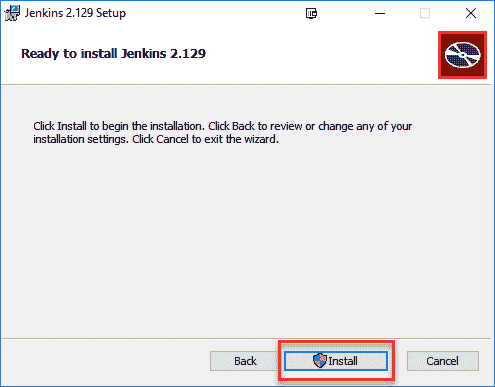

**步骤 6）**安装完成后，单击“完成”。

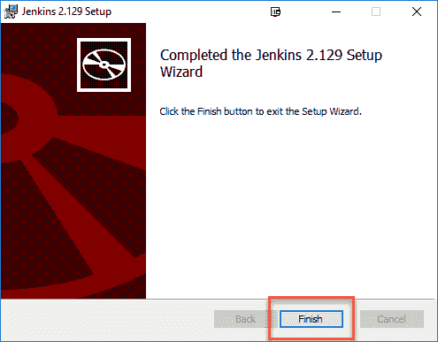

**步骤 7）**在安装过程中，可能会弹出一个信息面板，通知用户对于完整的安装，应在当前安装结束时重新引导系统。 弹出信息面板时，单击确定按钮：

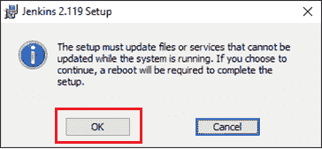

## 如何解锁詹金斯？

在完成 Jenkins 安装阶段之后，您应该继续进行并开始其配置。 后续步骤将指导您如何解除对 Jenkins 应用程序的阻止：

**步骤 1）**完成 Jenkins 安装过程后，将弹出一个浏览器选项卡，要求输入初始管理员密码。 要访问 Jenkins，您需要转到 Web 浏览器中的以下路径。

http：//本地主机：8080

如果您可以访问上面的 URL，那么它将确认 Jenkins 已成功安装在系统中。

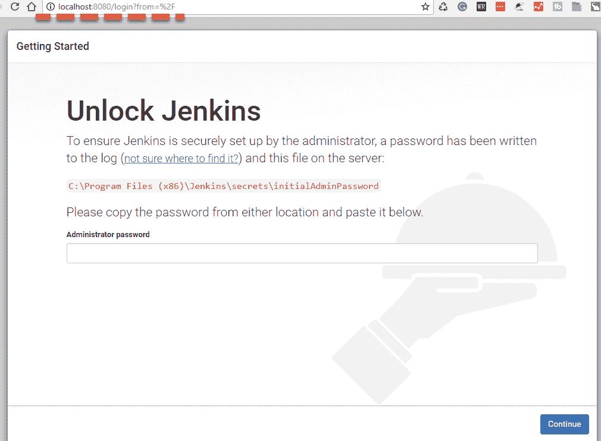

**步骤 2）**初始管理员密码应在 Jenkins 安装路径（在 Jenkins 安装中的步骤 4 设置）下找到。

对于 C：\ Program Files（x86）\ Jenkins 的默认安装位置，可以在 C：\ Program Files（x86）\ Jenkins \ secrets 下找到一个名为 **initialAdminPassword** 的文件。

但是，如果选择了 Jenkins 安装的自定义路径，则应检查 **initialAdminPassword** 文件的位置。

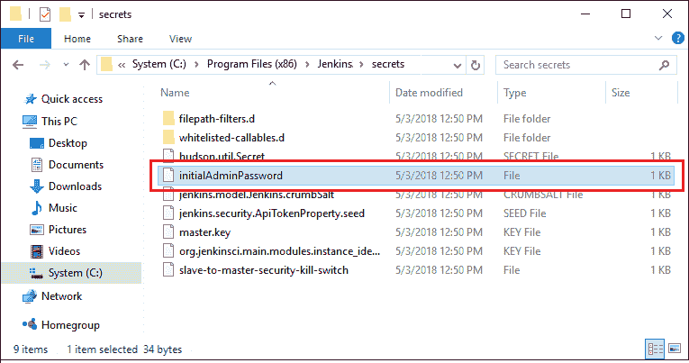

**步骤 3）**打开突出显示的文件，然后复制 **initialAdminPassword** 文件的内容。

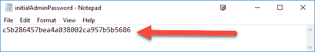

**步骤 4）**将密码粘贴到浏览器的弹出选项卡（ [http：// localhost：8080 / login？form =％2F](http://localhost:8080/login?form=%2F) ）中，然后单击“继续”按钮。

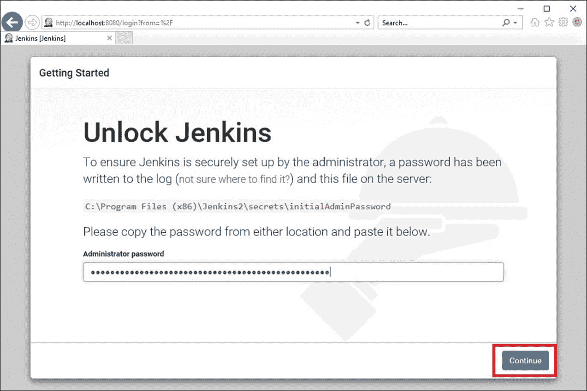

## 定制詹金斯

您还可以通过以下步骤自定义 Jenkins 环境：

**步骤 1）**单击“安装建议的插件”按钮，Jenkins 将检索并安装必要的插件

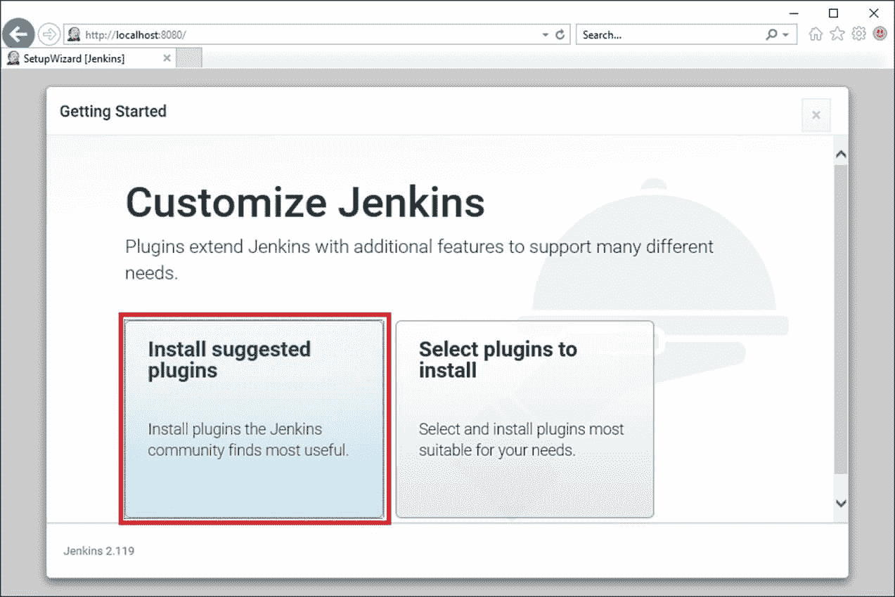

Jenkins 将开始下载并安装创建新 Jenkins Jobs 所需的所有必要插件。

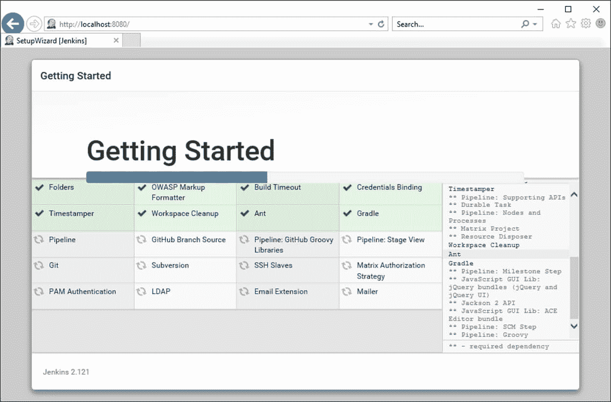

**注意**：您可以选择“选择要安装的插件”选项，然后选择要安装的插件

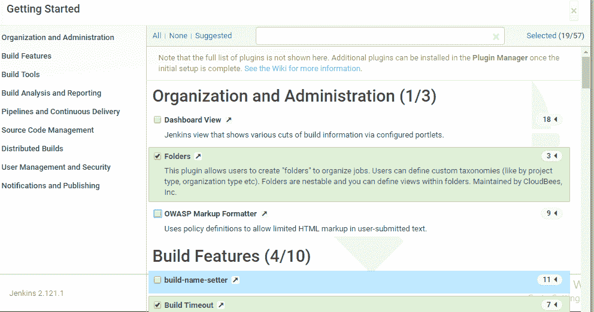

**步骤 2）**在安装了所有建议的插件之后，将显示“创建第一个管理员用户”面板。 在所有字段中填写所需的帐户详细信息，然后单击“ **保存并完成**”按钮。

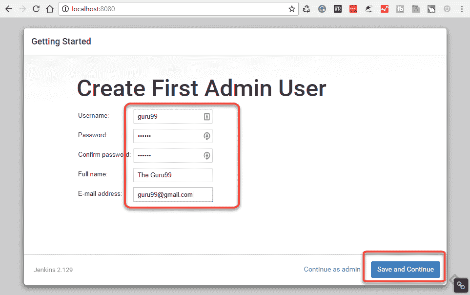

**步骤 3）**填写完以上数据后，最终它将询问 URL 信息，您可以在其中配置 Jenkins 的默认实例路径。 保持原样，以免以后造成任何混乱。 但是，如果另一个应用程序已经在使用 8080 端口，则可以将另一个端口用于 Jenkins，最后保存设置，并完成 Jenkins 的安装。 点击“ **保存并继续**”按钮：

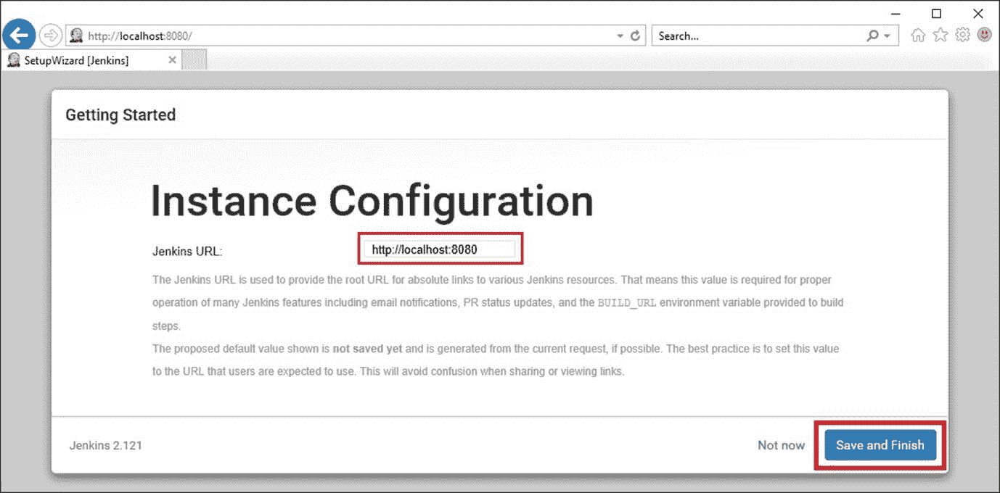

恭喜你！ 我们已经成功安装了新的 Jenkins 服务器。 点击“开始使用詹金斯”按钮。

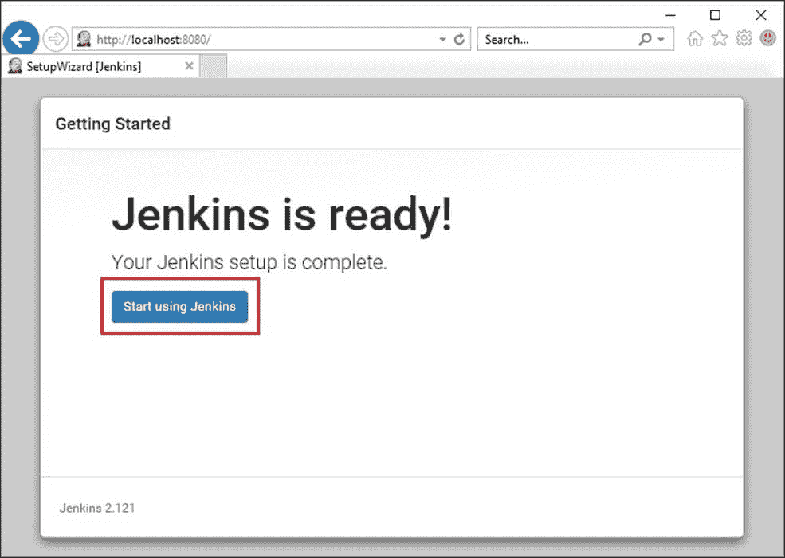

在下面，您可以找到启动并运行的 Jenkins 实例，准备创建第一个 Jenkins 作业：

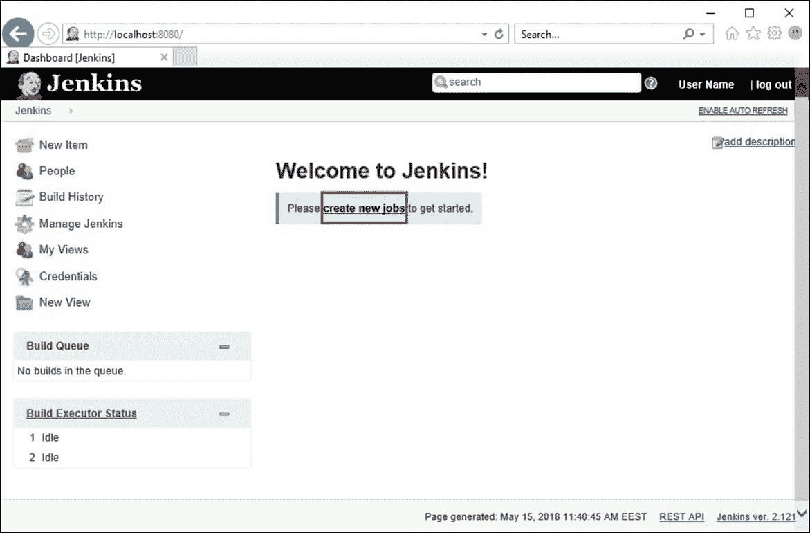