# Jenkins GitHub 集成：安装 Git 插件

> 原文： [https://www.guru99.com/jenkins-github-integration.html](https://www.guru99.com/jenkins-github-integration.html)

您已经从以前的 Guru99 教程中学到了 Jenkins 是什么以及如何将其安装到 Windows 系统上。 假设您已完成这些基本步骤，我们现在将继续进行插件管理。

Jenkins 具有出色的插件支持。 他们的网站上有成千上万的第三方应用程序插件。 要了解 Jenkins 是否支持您所考虑的第三方应用程序，请在 [https://wiki.jenkins-ci.org/display/JENKINS/Plugins](https://wiki.jenkins-ci.org/display/JENKINS/Plugins) 中检查其插件目录。

在本教程中，您将学习：

*   [在 Jenkins 中安装插件](#1)
*   [安装 GIT 插件](#2)
*   [将 Jenkins 与 GitHub 集成](#3)

## 在 Jenkins 中安装插件

Jenkins 提供了非常基本的设置，因此您将需要安装必需的插件以启用相应的第三方应用程序支持。

GitHub 是基于 Web 的代码存储库，在 DevOps 中起着重要作用。 它为从事同一代码/项目的多个开发人员提供了一个通用平台，以上传和检索更新的代码，从而促进了持续集成。

Jenkins 需要安装 GitHub 插件才能从 GitHub 存储库中提取代码。

如果您已经安装了 Git 插件来响应 Jenkins 安装设置中的提示，则无需安装 GitHub 插件。 但是，如果没有，这是在 Jenkins 中安装 GitHub 插件并从 GitHub 存储库中提取代码的方法。

## 安装 GIT 插件

**步骤 1：**单击 Jenkins 仪表板上的**管理 Jenkins** 按钮：

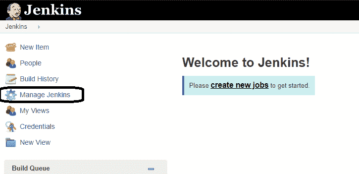

**步骤 2：**单击**管理插件**：

[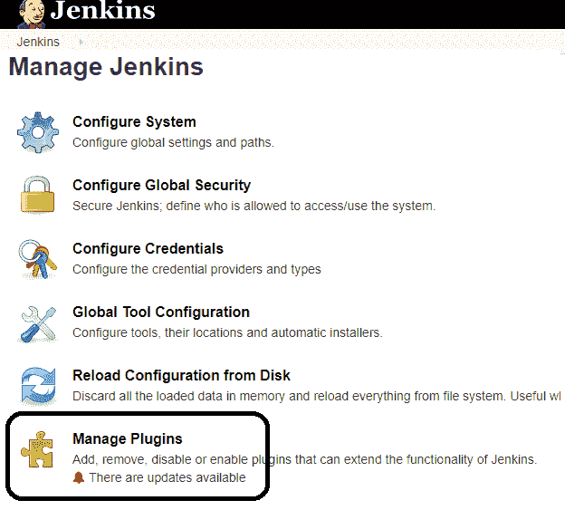 ](/images/1/091318_0440_JenkinsGitH3.png) 

**步骤 3：**在插件页面中

1.  选择 GIT 插件
2.  单击**安装，无需重新启动。** 该插件将需要一些时间才能完成下载，具体取决于您的 Internet 连接，并且该插件会自动安装。
3.  您还可以选择选项**立即下载和重新启动后安装**按钮。 重新启动后在哪个插件中安装
4.  如果您已经安装了 Git 插件，则会显示“无可用更新”消息。

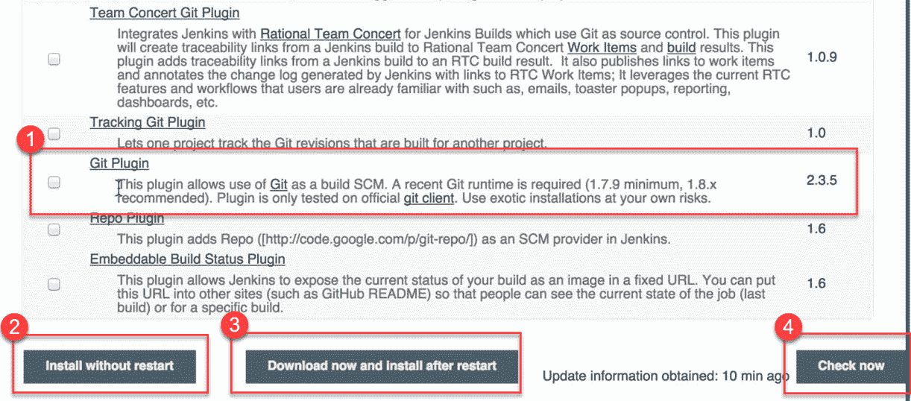

**步骤 4：**安装插件后，转到 Jenkins 仪表板上的**管理 Jenkins** 。 您将在其余列表中看到您的插件。

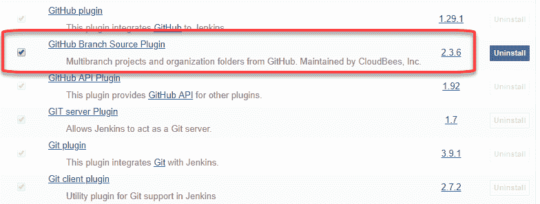

## 将 Jenkins 与 GitHub 集成

现在，我们将讨论在 Windows 系统中将 GitHub 集成到 Jenkins 中的过程。

**步骤 1）**在 Jenkins 中创建一个新作业，使用您的 Jenkins URL 打开 Jenkins 仪表板。 例如， [http：// localhost：8080 /](http://localhost:8080/)

单击**创建新作业**：

**步骤 2）**输入项目名称，选择作业类型，然后单击**确定**。 我们将以一个 Freestyle 项目为例。

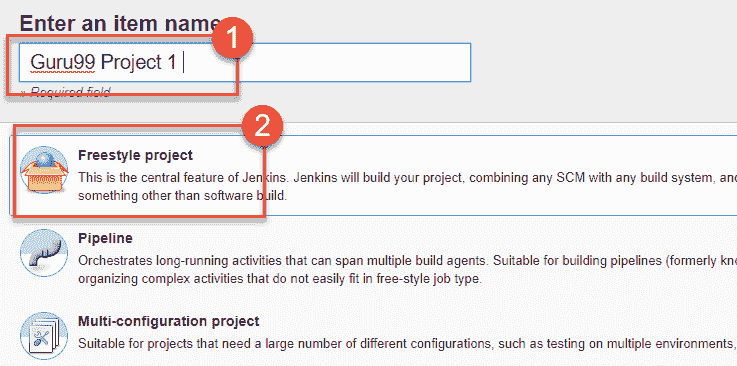

**步骤 3）**单击**确定，然后单击**，页面将重定向到其项目表单。 在这里您将需要输入项目信息：

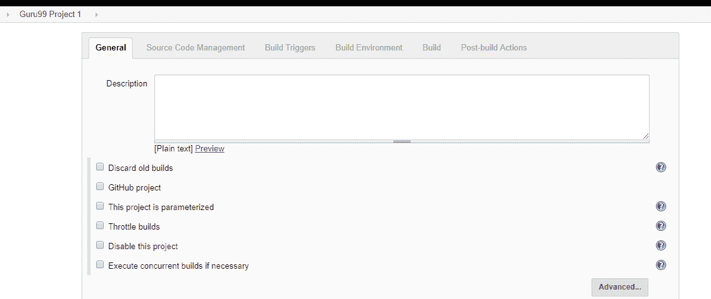

**步骤 4）**如果您的 Git 插件已安装在 Jenkins 中，您将在**源代码管理**下看到 **Git** 选项：

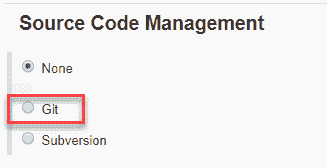

注意：如果 **Git** 选项没有出现，请尝试重新安装插件，然后重新启动并重新登录到 Jenkins 仪表板。 现在，您将能够看到如上所述的 **Git** 选项。

**步骤 5）**输入 Git 存储库 URL，以从 GitHub 中提取代码。

[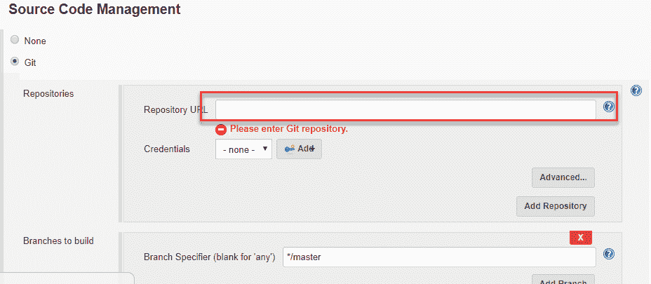 ](/images/1/091318_0440_JenkinsGitH10.png) 

**步骤 6）**首次输入存储库 URL 时，您可能会收到一条错误消息。 例如：

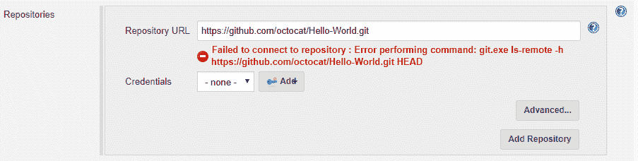

如果您的本地计算机上未安装 Git ，则会发生这种情况。 要在本地计算机上安装 Git，请转到 [https://git-scm.com/downloads](https://git-scm.com/downloads)

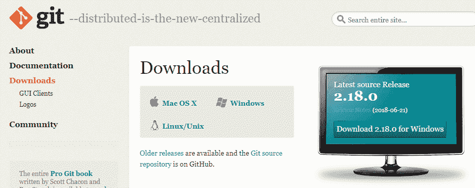

下载适合您的操作系统（在本例中为 Windows）的 Git 文件，并将其安装到运行 Jenkins 的本地计算机上。 按照屏幕上的说明安装 GIT。

**步骤 7）**一旦在计算机上安装了 Git，就可以在 Jenkins 中执行 Git 存储库。 要检查，是否已成功安装到系统上，请打开**命令提示符，**键入“ Git” ，然后按 Enter。 您应该看到 Git 出现了不同的选择：

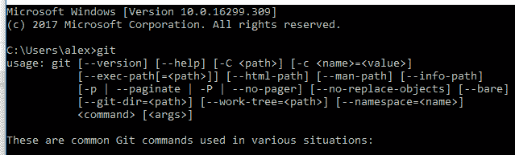

这意味着 Git 已安装在您的系统中。

注意：如果您的系统中已经安装了 GIT，则只需在“全局工具配置”中添加 git.exe 路径。

**步骤 8）**一切就绪后，尝试将 Git URL 添加到 Jenkins 中。 您将不会看到任何错误消息：

[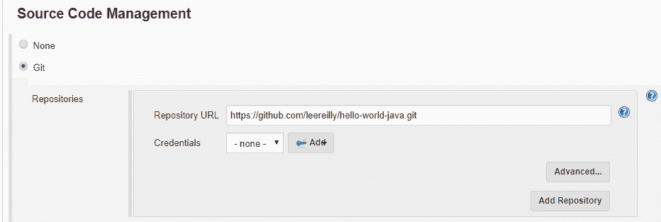 ](/images/1/091318_0440_JenkinsGitH15.png) 

现在已经在系统上正确配置了 Git。