# 如何创建用户&管理权限：角色策略插件

> 原文： [https://www.guru99.com/create-users-manage-permissions.html](https://www.guru99.com/create-users-manage-permissions.html)

通常，在大型组织中，有多个单独的团队来管理和运行 Jenkins 中的工作。 但是，管理大量用户并为其分配角色可能会很麻烦。

默认情况下，Jenkins 带有非常基本的用户创建选项。 您可以创建多个用户，但只能为其分配相同的全局角色和特权。 这并不理想，特别是对于大型组织而言。

**角色策略插件**使您可以为不同的用户**分配不同的角色和特权。** 您首先需要在 Jenkins 管理环境中安装插件。

在本教程中，您将学习

*   [如何创建/添加用户](#1)
*   [安装角色策略插件](#2)
*   [创建角色](#3)
*   [分配角色](#4)
*   [项目角色](#5)

## 如何创建/添加用户

**步骤 1）**通过访问 [http：// localhost：8080 /](http://localhost:8080/) 登录到 Jenkins 仪表板

如果尚未在本地服务器中安装 Jenkins，请转至相应的 URL 并使用登录凭据访问仪表板。

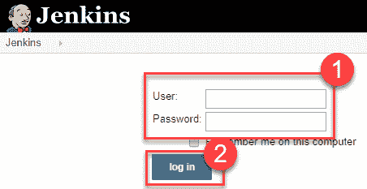

**步骤 2）**您现在将看到用于创建新用户和管理当前用户的选项。

**步骤 3）**

*   在“管理詹金斯”下，单击“创建用户”
*   输入用户详细信息，例如密码，名称，电子邮件等。
*   点击创建用户

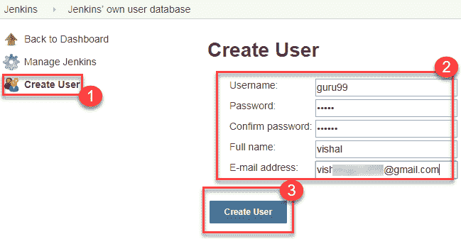

**步骤 4）**用户已创建

[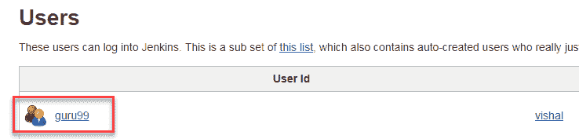 ](/images/1/091318_0444_HowtoCreate3.png) 

## 安装角色策略插件

在 Jenkins 中有两种安装插件的方法：

1.  通过 Jenkins 仪表板安装
2.  从 Jenkins 网站下载插件并手动安装。

**步骤 1）**

1.转到**管理詹金斯**

2.单击管理插件选项

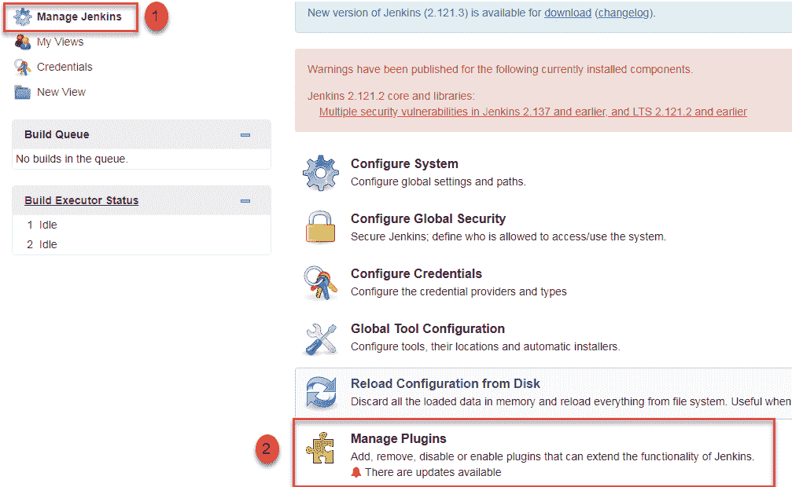

**步骤 2）**

1.  在可用部分中，屏幕搜索“角色”。
2.  选择基于角色**的授权策略**插件
3.  单击“ **，安装后不重新启动**”（确保您的 Internet 连接有效）

**Step 3)**

安装插件后，将显示“成功”状态。

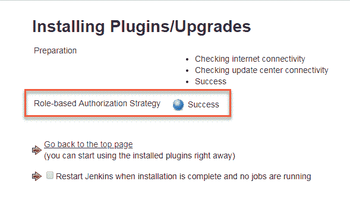

单击**返回首页。**

**步骤 4）**转到**管理 Jenkins->** 配置全局安全性->在**授权下，**选择**基于角色的策略**。 单击**保存**。

[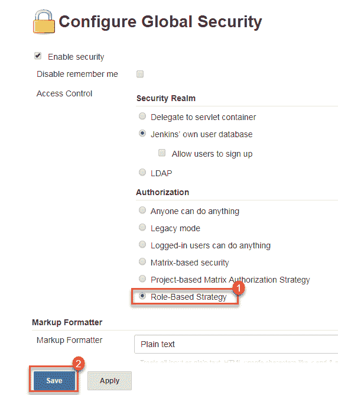 ](/images/1/091318_0444_HowtoCreate7.png) 

## 创建角色

在这一步中，我们将向单个用户或一组用户学习某些角色。

**Step 1)**

1.转到**管理詹金斯**

2.选择**管理和分配角色**

[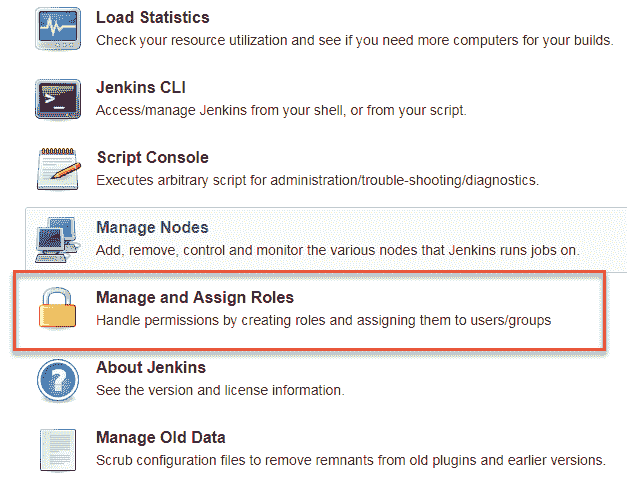 ](/images/1/091318_0444_HowtoCreate8.png) 

**注意**：仅在安装了角色策略插件后，**管理和分配角色**选项才可见。

**步骤 2）**单击**管理角色**，以根据您的组织添加新角色。

[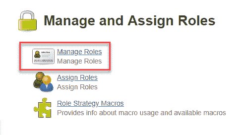 ](/images/1/091318_0444_HowtoCreate9.png) 

**步骤 3）**要创建一个称为“开发人员”的新角色，请选择

1.  在“角色”下键入“开发人员”。
2.  单击“添加”以创建新角色。
3.  现在，选择要分配给“开发人员”角色的权限。
4.  点击保存

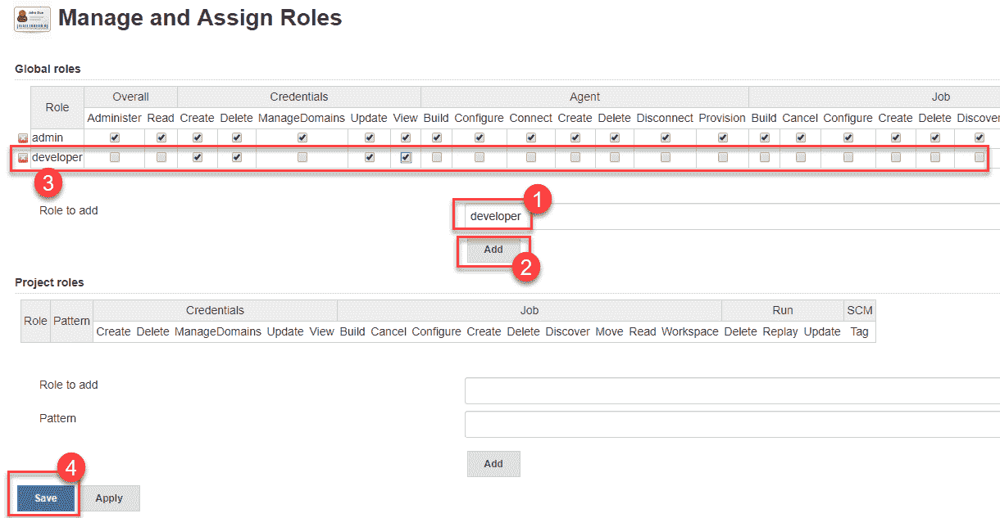

## 分配角色

**步骤 1）**现在您已经创建了角色，让我们将其分配给特定用户。

1.  转到**管理詹金斯**
2.  选择管理和分配角色

[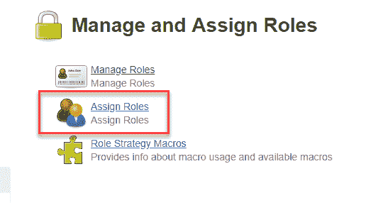 ](/images/1/091318_0444_HowtoCreate11.png) 

**步骤 2）**我们将向用户“ **guru99** ”添加新角色“开发人员”

1.  选择器开发人员角色复选框
2.  点击保存

[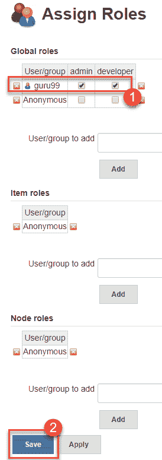 ](/images/1/091318_0444_HowtoCreate12.png) 

您可以根据需要将任何角色分配给任何用户。

## 项目角色

您可以在**项目角色下创建项目特定的角色。**

**步骤 1）**在 Jenkin 的“管理和分配角色”中

1.  输入“测试员”角色
2.  通过添加 **tester。*** 为其添加模式，以便将任何以“ tester”开头的用户名分配给您指定的项目角色。
3.  点击添加
4.  选择特权
5.  点击保存

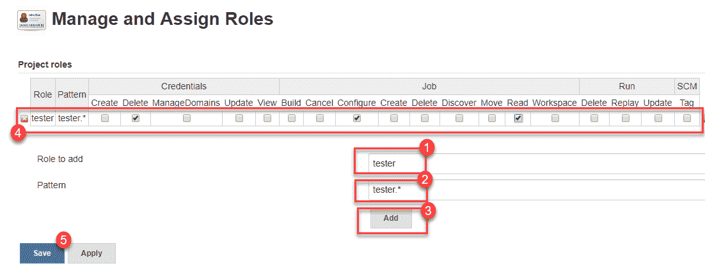