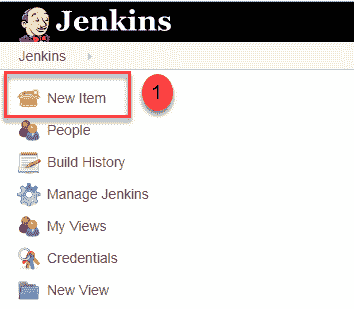
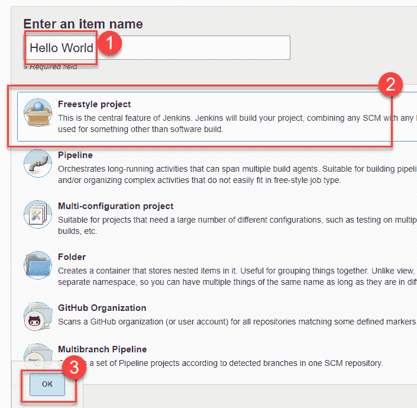
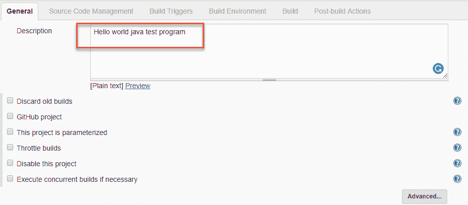
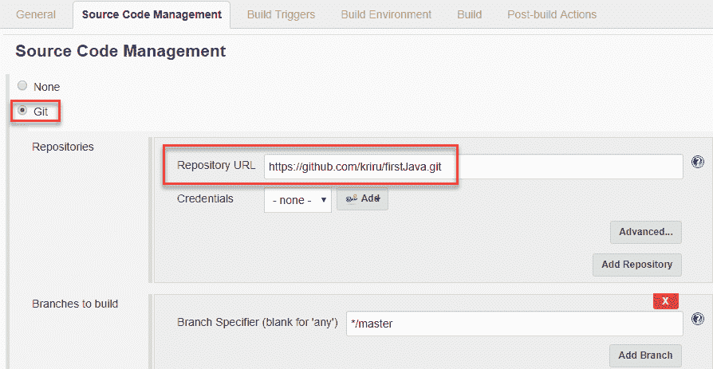
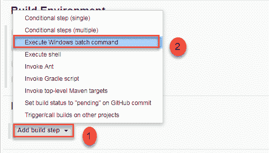
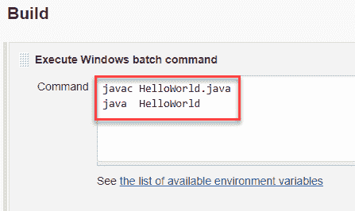
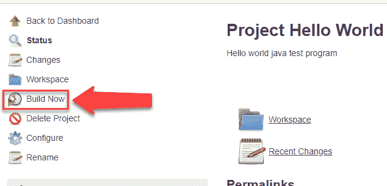
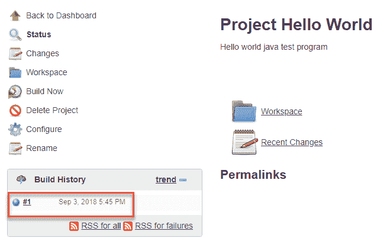
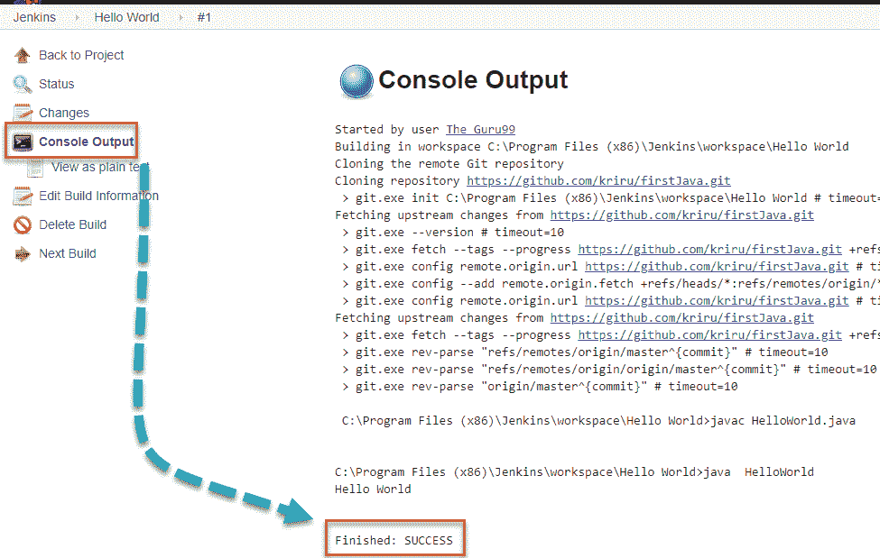

# 如何使用 Jenkins Freestyle 项目创建构建

> 原文： [https://www.guru99.com/create-builds-jenkins-freestyle-project.html](https://www.guru99.com/create-builds-jenkins-freestyle-project.html)

## 什么是 Jenkins 自由泳项目？

Jenkins 项目是可重复的构建作业，其中包含步骤和构建后操作。 在构建步骤或构建后操作中可以执行的操作类型非常有限。 Jenkins 自由式项目中提供了许多标准插件，可以帮助您克服此问题。 它们允许您配置构建触发器并为 Jenkins 项目提供基于项目的安全性。

## 创建自由式构建作业

自由式构建作业是高度灵活且易于使用的选项。 您可以将其用于任何类型的项目。 它很容易设置，并且它的许多选项都出现在其他构建作业中。

**步骤 1）**要创建 Jenkins 自由式作业，请访问 Jenkins 安装路径，以登录到 Jenkins 仪表板。 通常，它将在[上的 localhost 上托管 http：// localhost：8080](http://localhost:8080) 如果在其他路径中安装了 Jenkins，请使用适当的 URL 访问仪表板。

 

**步骤 2）**单击仪表板左上方的“ **New Item** ”。

**步骤 3）**在下一个屏幕中，

1.  输入您要创建的项目的名称。 在本演示中，我们将使用“ Hello world”。
2.  选择自由式项目
3.  单击确定

**步骤 4）**输入要测试的项目的详细信息。

**步骤 5）**在“源代码管理”下，输入存储库 URL。 我们的测试库位于 [https://github.com/kriru/firstJava.git](https://github.com/kriru/firstJava.git)

 

您也可以使用本地存储库。

如果您的 GitHub 存储库是私有的，Jenkins 将首先使用 GitHub 验证您的登录凭据，然后再从 GitHub 存储库中提取源代码。

**步骤 6）**现在，您已经提供了所有详细信息，是时候构建代码了。 调整 **build** 部分下的设置，以在需要的时间生成代码。 您甚至可以安排构建在设定的时间定期进行。

在**构建**下，

1.单击“ **添加构建步骤**”

2.单击“ **执行 Windows 批处理命令**”，然后添加要在构建过程中执行的命令。

在这里，我添加了 Java 命令来编译 Java 代码。

我添加了以下 Windows 命令：

javac HelloWorld.java

java HelloWorld

**步骤 7）**输入所有数据后，

1.  点击**应用**
2.  **保存**项目。

**步骤 8）**现在，在主屏幕中，单击左侧的**立即构建**按钮以构建源代码。

**步骤 9）**单击**现在生成的**后，您可以在**构建历史**下查看正在运行的构建的状态。

**步骤 10）**单击**内部版本号**和，然后单击单击**控制台输出**，以查看 建立您的运行。 只要您正确地进行了设置，它就会显示一条成功消息。

 

总之，我们已经执行了一个托管在 GitHub 上的 HelloWorld 程序。 Jenkin 从远程存储库中提取代码，并以您定义的频率连续构建。