# Jenkins 管道教程：JenkinsFile 示例

> 原文： [https://www.guru99.com/jenkins-pipeline-tutorial.html](https://www.guru99.com/jenkins-pipeline-tutorial.html)

## 什么是 Jenkins 管道？

在詹金斯（Jenkins）中，管道是一组事件或作业，它们按顺序相互链接。

简而言之，Jenkins 管道是插件的组合，支持使用 Jenkins 集成和实现**连续交付管道**。 管道具有可扩展的自动化服务器，用于通过管道 DSL（特定于域的语言）创建“作为代码”的简单或复杂的交付管道。

### 什么是连续交付管道？ 这个怎么运作？

在 Jenkins 管道中，每个作业或事件都至少依赖一个或多个事件。

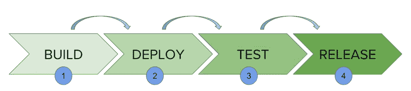

上图显示了詹金斯的连续交付流程。 它包含一组状态，称为构建，部署，测试和发布。 这些事件相互关联。 每个状态都有其事件，这些事件按称为连续交付管道的顺序工作。

连续交付管道是一种自动表达，可以显示您获取用于版本控制的软件的过程。 因此，您的软件中进行的每项更改都需要经过许多复杂的过程才能发布。 它还涉及以可靠且可重复的方式开发软件，以及通过多个测试和部署阶段来构建内置软件。

在本教程中，您将学习

*   [什么是 Jenkins 管道？](#1)
*   [什么是 JenkinsFile？](#2)
*   [为什么使用 Jenkin 的管道？](#3)
*   [詹金斯管道概念](#4)
*   [在 Jenkins 中安装构建管道插件](#5)
*   [如何创建 Jenkins 管道](#6)
*   [正在运行 Jenkins 管道](#7)
*   [使用 Jenkins 管道](#8)的最佳做法

## 什么是 JenkinsFile？

可以使用名为 **JenkinsFile 的文本文件来定义 Jenkins 管道。** 您可以使用 JenkinsFile 将流水线实现为代码，并且可以使用域特定语言（DSL）来定义。 使用 JenkinsFile，您可以编写运行 Jenkins 管道所需的步骤。

使用 J **enkinsFile 的好处是**：

*   您可以为所有分支自动创建管道，并仅使用一个 **JenkinsFile 执行拉取请求。**
*   您可以在管道上查看您的代码
*   您可以审核您的 Jenkins 管道
*   这是管道的唯一来源，可以由多个用户修改。

JenkinsFile 可以通过 Web UI 或 JenkinsFile 进行定义。

**声明式脚本脚本与脚本式管道语法：**

定义 JenkinsFile 有两种语法。

1.  陈述式
2.  脚本化

**声明：**

声明性管道语法提供了一种创建管道的简便方法。 它包含用于创建 Jenkins 管道的预定义层次结构。 它使您能够以简单，直接的方式控制管道执行的所有方面。

**脚本：**

脚本化的 Jenkins 管道在轻量级执行程序的帮助下在 Jenkins 主数据库上运行。 它使用很少的资源将管道转换为原子命令。 声明性语法和脚本化语法都彼此不同，并且定义完全不同。

## 为什么使用 Jenkin 的管道？

Jenkins 是一个开放的持续集成服务器，具有支持软件开发流程自动化的能力。 您可以在用例的帮助下创建多个自动化作业，并将其作为 Jenkins 管道运行。

这是您使用 Jenkins 管道的原因：

*   Jenkins 管道作为一种代码实现，允许多个用户编辑和执行管道过程。
*   管道功能强大。 因此，如果服务器意外重启，则管道将自动恢复。
*   您可以暂停管道流程，并等待恢复直到用户输入。
*   詹金斯管道支持大型项目。 您可以运行多个作业，甚至可以循环使用管道。

## 詹金斯管道概念

| **术语** | **说明** |
| 管道 | 管道是一组以代码形式给出的指令，用于持续交付，并且包括整个构建过程所需的指令。 使用管道，您可以构建，测试和交付应用程序。 |
| 节点 | 运行 Jenkins 的机器称为节点。 节点块主要用于脚本化管道语法。 |
| 阶段 | 阶段块在管道中包含一系列步骤。 也就是说，构建，测试和部署过程都在一个阶段中融合在一起。 通常，舞台块用于可视化詹金斯流水线过程。 |
| 步 | 步骤不过是在定义的时间执行特定过程的单个任务。 管道涉及一系列步骤。 |

## 在 Jenkins 中安装构建管道插件

使用**构建管道**插件，您可以创建传入和传出作业的管道视图，并创建需要手动干预的触发器。

这是在 Jenkins 中安装**构建管道**插件的方法：

**步骤 1** ）插件的设置可以在**管理 Jenkins >管理插件下找到。**

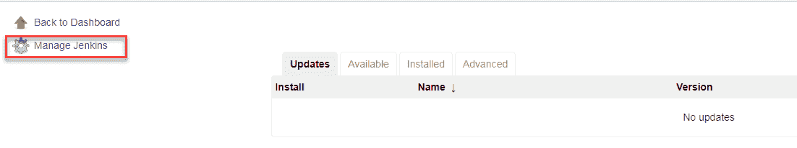

如果您已经安装了插件，它将显示在已安装的选项卡下。

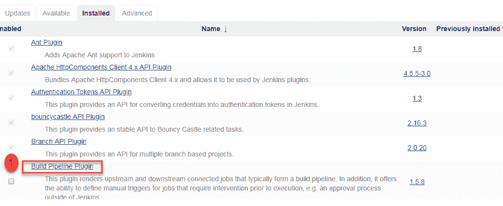

**步骤 2** ）如果您先前未安装插件，则该插件会显示在**可用**选项卡下。

在 Jenkins 中成功安装**构建管道**插件后，请按照以下步骤创建 Jenkins 管道：

## 如何创建 Jenkins 管道

登录到 Jenkins 仪表板后：

**步骤 1** ）单击 Jenkins 仪表板左侧的**“ +”** 按钮以创建管道。

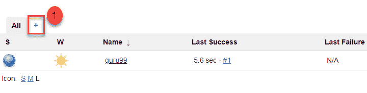

**步骤 2** ）

1.  系统将要求您为管道视图命名。 在本演示过程中，我们将其称为“ **Guru99 Pipeline** ”。
2.  在**选项**下选择**构建管道视图**
3.  点击**，然后点击**

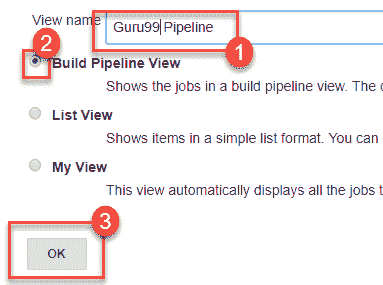

**步骤 4** ）在下一页中，系统将要求您提供更多详细信息，以配置 Jenkins 管道。 只需接受默认设置，并确保您在设置下选择第一个作业即可。

单击**应用**，然后单击 **OK** 。

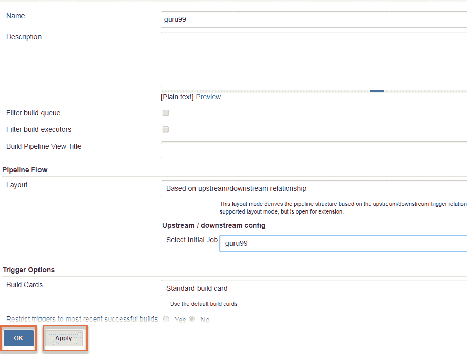

这将向您显示项目的示例管道视图，如下所示：

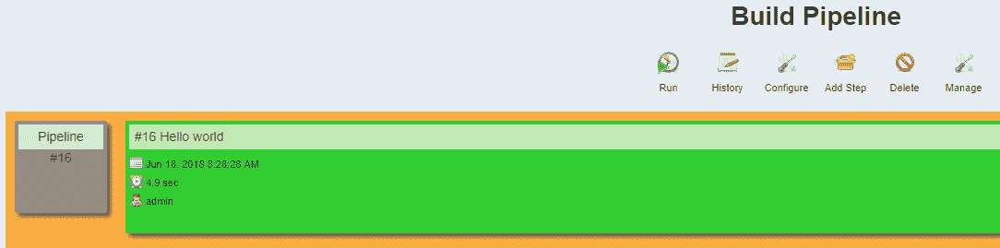

## 运行管道构建

**步骤 1** ）要运行管道构建，需要首先链接您的作业。 为此，请转到您的第一份工作，然后单击“配置”。

 

**步骤 2** ）现在，在**构建触发器**下，在构建其他项目后检查**构建**选项。

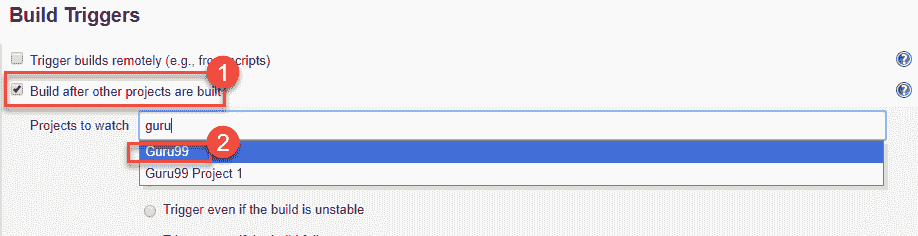

这样，就为您的所有工作创建了一个链。

**步骤 3** ）如果尚未安装**构建管道视图**插件，请安装它。

**步骤 4** ）转到您的 Jenkins 仪表板，然后单击“ **+** ”按钮来创建视图。 选择**构建管道视图**选项，然后单击 **OK** 。

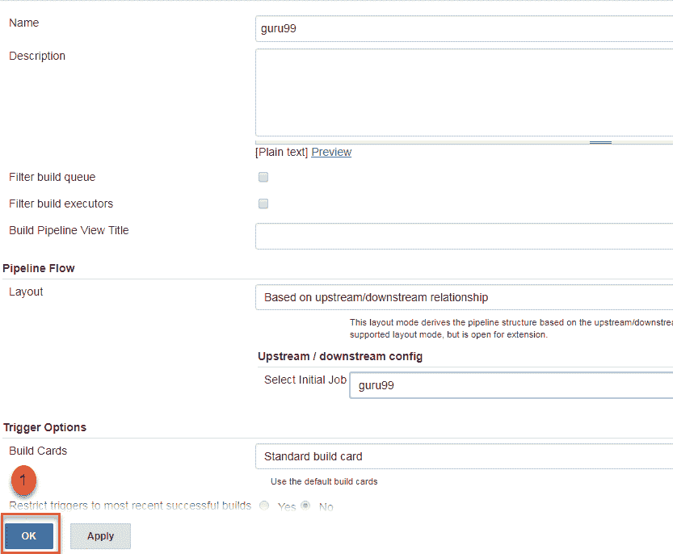

**步骤 5** ）在**管道视图配置**下，找到**管道流**。

在**管道流**下，选择要运行的初始作业。 现在，选择与其他作业具有链接的作业，如**步骤 1** 和**步骤 2** 中所示。

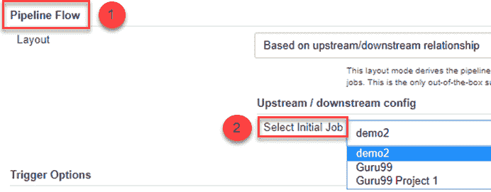

在这里，我们选择了 **Guru99 Project 1** 作为初始任务，并链接到其他任务。 因此，作业将在管道中逐一运行。

当詹金斯管道运行时，您可以借助红色和绿色状态符号检查其状态。 红色表示管道已失败，而绿色表示管道已成功。

在此示例中，我们看到按钮为绿色。 因此，管道成功。

[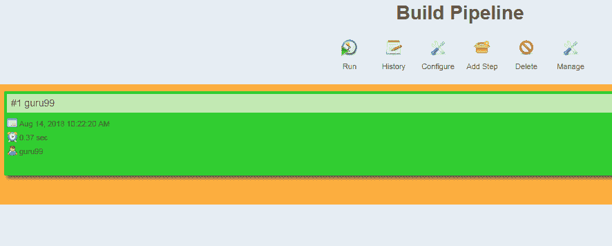 ](/images/1/091318_0510_JenkinsPipe12.png) 

## 运行 Jenkins 管道

单击**运行**以运行 Jenkins 管道。 它看起来像这样：

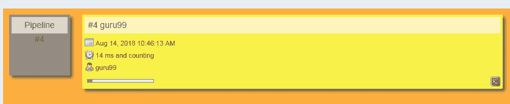

在上面的示例中，我们演示了一个简单的“ helloworld.java”程序。 但是在实时项目中，您将负责在 Jenkins 中创建和构建复杂的管道。 请参阅下面的示例管道视图。

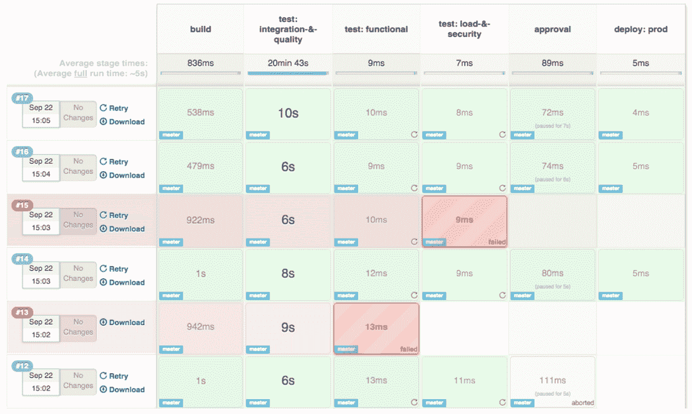

**使用 Jenkins 管道的最佳做法：**

*   使用真正的詹金斯管道
*   用代码开发管道
*   管道中的任何非设置工作都应在阶段块内进行。
*   管道中的任何重要工作都必须在节点块内执行。
*   不要在节点块内使用输入。
*   切勿使用 env 全局变量设置环境变量
*   将您的输入包装成超时