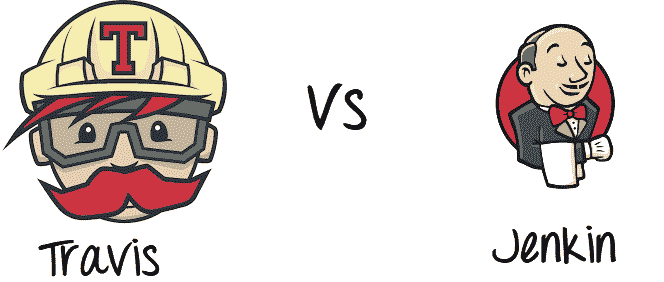
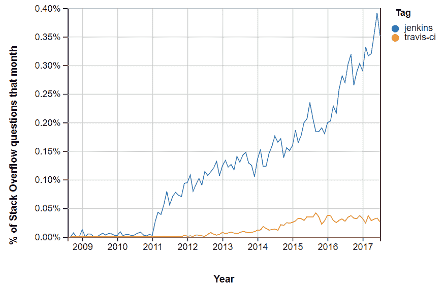

# Jenkins vs Travis-CI：有什么区别？

> 原文： [https://www.guru99.com/jenkins-vs-travis.html](https://www.guru99.com/jenkins-vs-travis.html)

## 什么是 CI？

持续集成是一种软件开发方法，团队成员每天至少可以集成一次他们的工作。 在这种方法中，每个集成都由自动构建检查以搜索错误。 CI 概念是在二十多年前首次引入的，以避免出现“集成地狱”，这种情况在集成推迟到项目结束时才会发生。

在本教程中，您将学习

*   [什么是 CI？](#1)
*   [什么是 Travis CI？](#2)
*   [什么是詹金斯？](#3)
*   [特拉维斯做什么？](#4)
*   [詹金做了什么？](#5)
*   [Travis CI 功能：](#6)
*   [Jenkin 功能：](#7)
*   [特拉维斯和詹金斯](#8)
*   [人气指数](#9)
*   [哪个更好？](#10)

**CI 如何工作？**

*   开发人员编写代码并将更改提交到共享存储库
*   之后，CI 服务器将监视存储库并评估所有更改
*   CI 构建系统并进行集成和单元测试
*   服务器发布可部署的工件
*   Continous 集成服务器将构建标记分配给版本和构建代码
*   然后，CI 服务器将报告有关成功构建的团队。 如果测试失败，则服务器将事件通知开发团队。 该团队将尽快解决问题。

## 什么是 Travis CI？

Travis CI 是第一个 CI 即服务工具。 它引入了一种在云中构建代码的新方法。 此 CI 工具允许用户注册，链接其存储库，构建以及测试其应用程序。

Travis CI 工具可以轻松地与 GitHub 和 Bitbucket 等常见的云存储库集成。 它提供了许多自动 CI 选项，由于 Travis CI 服务器托管在云中，因此无需专用服务器。 这使您可以在运行于不同操作系统上的不同计算机上的不同环境中进行测试。

[Travis CI](https://travis-ci.org/) 对于开源项目是免费的。 对于商业项目，您需要购买企业计划。

## 什么是詹金斯？

Jenkins 是屡获殊荣的持续集成工具，可监控部署周期的执行情况。 它最初是 Sun 软件工程师小组的附带项目。 后来，它被扩展为流行的开源 CI 工具之一，可帮助软件开发团队自动化其部署。

Jenkins 是基于 Java 的工具，这意味着您只需要 Java Runtime Environment 即可对其进行操作。 因此，Jenkins 可以安装在运行 Java 的任何操作系统上。

在此工具中，开发人员还可以指定自定义构建的条件。 Jenkins 支持大量的插件存档。 这使开发人员可以更改 Jenkin 的外观和操作方式。

此外，Jenkins Pipeline 插件套件附带了一些特殊工具，这些工具使开发人员可以使用 DSL（数字订户线）方法对易于复杂的传递管道进行建模。

## 特拉维斯做什么？

Travis CI 具有以下优点：

*   您可以监视 GitHub 项目
*   运行测试并快速生成结果。 可以并行执行测试。
*   构建工件&检查代码质量
*   轻松部署到云服务
*   它可以识别大小代码更改。
*   开发人员可以在运行时使用 Travis CI 观看测试。
*   该工具与 Slack，HipChat，Email 等集成。

## 詹金做什么？

Jenkins 允许您自动执行构建，测试和部署任务。 该工具支持 Windows，Mac OSX 和 Linux 系统等不同的操作系统。

此外，Jenkins 使您能够快速构建和测试代码，以获取有关是否已准备好投入生产的早期反馈。 在大多数情况下，Jenkin 会根据您的团队的自定义要求进行一些修改。

## Travis CI 功能：

*   与 GitHub 自动集成
*   存储库访问以构建请求请求
*   支持 21 种语言，例如 Android，C，C＃，C ++，Java，JavaScript（带有 Node.js），Perl，PHP，Python，R，Ruby 等
*   预安装的&测试工具
*   可用服务-数据库，消息队列等
*   部署到多个云服务
*   加密安全环境变量或文件
*   每次构建后都会重新创建虚拟机
*   CLI 客户端和用于脚本编写的 API
*   随附免费的基于云的托管，无需维护或管理。

## Jenkin 功能：

*   易于安装，升级和配置
*   分布式构建
*   监控外部工作
*   超过 600 个插件可自定义您的 Jenkins 环境
*   Github 上超过 1000 多个公共存储库，500 多个贡献者，强大的提交活动
*   支持各种身份验证方法，版本控制系统，通知等。
*   Jenkins 提供了远程访问 API 及其功能。
*   为大型项目提供强大的 CI / CD 工具
*   它支持各种作业模型，例如 Freestyle，Pipeline 等，
*   允许开发人员添加其扩展
*   与 Docker，Libvirt，Kubernetes 和许多其他程序兼容

## 特拉维斯 vs 詹金斯

| **参数** | **詹金** | **特拉维斯** |
| **费用** | 詹金斯是免费的。 但是开发团队需要运行和维护他们的专用服务器。 这可以被认为是额外的费用。 | Travis CI 企业套件的起价为每月 129 美元。 成本增加取决于您所需的支持水平。 |
| **设置时间** | Jenkins 需要精心设置。 因此，您将需要很长的等待时间才能完成完整的安装。 | 入门所需的时间非常少。 创建一个配置文件并开始集成。 |
| **效果** | 如果您正在寻找具有无限定制选项的 CI 工具，那么 Jenkins 是您的最佳选择。 | 如果您在一个开源项目中工作，Travis CI 是最佳选择。 |
| **工具类型** | 它是一个免费使用的开源工具。 | 这是一个商业 CI 工具 |
| **用法** | 易于使用 | 使用灵活 |
| **Github** | 对 Github 有好处 | 非常适合 Github |
| **支持** | 社区的广泛支持。 | 对社区的支持有限。 |
| **优点** | 

*   定制是 Jenkins CI 服务器的最大优势。

*   可以配置大量的插件档案来更改 Jenkins 的外观。

*   您还可以添加新功能，例如身份验证，警报和凭据。

 | 

*   与 GitHub 集成 & 云
*   具有完整功能的无限开源项目
*   通过.travis.ymi 文件进行广泛的项目配置
*   允许进行集群测试 并并行运行它们
*   多个构建环境和目标平台（即 Node 0.10,0.8,0.6，打开）。

 |
| **缺点** | 

*   詹金斯（Jenkins）进行持续集成的一个主要缺点是它的可配置性很高。 没有开箱即用的设置。 因此，要在系统中进行所有配置可能要花费两三个小时到几天的时间。

 | 安装 Travis CI 的最大弊端是其商业计划的起价为 1,29 / m，这是相当昂贵的。*   不适合高安全性项目*   与其他 CI 工具不同，它不提供 Bitbucket 支持。 |
| **使用计划** | 自由 | 对于开源项目免费。 但是，为企业付费。 |
| **服务器计算机** | 基于服务器 | 基于云的 |
| **自定义选项** | 更多 | 减 |
| **配置** | 完全可定制 | 亚姆拉 |
| **系统**上的控件 | 充分 | 非常少的 |

## 人气指数

在 Stack Overflow 中标记为 Jenkins 和 Travis 的问题数量。

## 哪个更好？

因此，通过上面的讨论，我们可以确定特拉维斯和詹金斯都提供了很棒的功能。 但是，小型开源项目最适合 Travis CI，因为它易于运行且设置迅速。 另一方面，大型企业最适合 Jenkins，因为它为私人项目提供免费许可并具有广泛的可定制功能。 因此，我们可以说这两种持续集成工具都很好。

## 关键区别

*   Travis CI 是商业 CI 工具，而 Jenkins 是开源工具。
*   詹金斯需要精心设置时，Travis CI 花费的时间很少。
*   Travis CI 提供较少的自定义选项，而 Jenkins 提供大量的自定义选项。
*   Travis CI 有一个 YAML 配置文件，而 Jenkins 为用户提供了完整的配置选项。