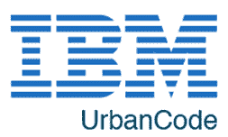
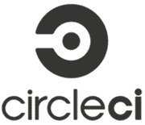
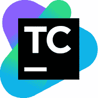
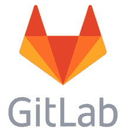

# 2020 年 15 种最佳詹金斯替代品

> 原文： [https://www.guru99.com/jenkins-alternative.html](https://www.guru99.com/jenkins-alternative.html)

Jenkins 是一个开源的持续集成平台，并且是 DevOps Lifecycle 中的一个关键工具。 但是，与当前的 UI 趋势相比，其界面已过时且不友好。 而且，Jenkin 的配置可能很棘手，它还有许多其他缺点。

这里是精选的 14 种可以替代 Jenkins 的工具的清单。 该列表包含具有流行功能和最新下载链接的商业以及开源持续集成工具。

### 1）[好友](https://bit.ly/2NJz4mx)

[Buddy](https://bit.ly/2NJz4mx) 是面向 Web 开发人员的智能 CI / CD 工具，旨在降低 DevOps 的进入门槛。 它使用交付管道来构建，测试和部署软件。 创建的管道具有 100 多种随时可以使用的操作，这些操作可以以任何方式进行排列-就像您盖砖瓦房一样。

*   15 分钟的配置，清晰的&告诉 UI / UX
*   基于变更集的快速部署
*   构建在具有缓存依赖项的隔离容器中运行
*   支持所有流行的语言，框架&任务管理器
*   Docker / Kubernetes 行动专用名单
*   与 AWS，Google，DigitalOcean，Azure，Shopify 和 WordPress 集成&更多
*   支持并行& YAML 配置

### 2）最终建造商：

[FinalBuilder](https://www.finalbuilder.com/) 是 Vsoft 的构建工具。 使用 FinalBuilder，无需编辑 XML 或编写脚本。 您可以在使用 Windows Scheduler 计划构建脚本或与 Jenkins，Continua CI 等集成时定义和调试构建脚本。

**功能**：

*   它在逻辑结构化的图形界面中展示了构建过程
*   它包括用于本地化错误处理的 try and catch 操作
*   它提供了与 Windows 计划服务的紧密集成，从而可以对构建进行计划
*   FinalBuilder 支持十几个版本控制系统
*   它提供脚本支持
*   构建过程中所有操作的输出将定向到构建日志。

**下载链接**： [https://www.finalbuilder.com/downloads/finalbuilder](https://www.finalbuilder.com/downloads/finalbuilder)

### 3）CruiseControl：

[CruiseControl](http://cruisecontrol.sourceforge.net/) 既是 CI 工具，也是可扩展的框架。 它用于构建自定义的连续构建过程。 它有许多用于各种源代码控制的插件，包括电子邮件和即时消息传递在内的构建技术。

**Features:**

*   与许多不同的 Source Control 系统集成，例如 vss，csv，svn，git，hg，perforce，clearcase，文件系统等。
*   它允许在单个服务器上构建多个项目
*   与其他外部工具（如 NAnt，NDepend，NUnit，MSBuild，MBUnit 和 Visual Studio）集成
*   提供对远程管理的支持

**下载链接**： [http://cruisecontrol.sourceforge.net/download.html](http://cruisecontrol.sourceforge.net/download.html)

### 4）诚信：

[Integrity](http://integrity.github.io/) 是一个持续集成服务器，仅适用于 GitHub。 在此 CI 工具中，只要用户提交代码，它就会生成并运行代码。 它还会生成报告并向用户提供通知。

**Features:**

*   此 CI 工具目前仅适用于 git，但可以轻松地与其他 SCM 镜像
*   此 CI 工具支持多种通知机制，例如 AMQP，电子邮件，HTTP，Amazon SES，Flowdock，Shell 和 TCP。
*   HTTP 通知程序功能将 HTTP POST 请求发送到特定 URL

**下载链接**： [http://integrity.github.io/](http://integrity.github.io/)

### 5）GoCD：

[GoCD](https://www.gocd.org/) 是一个开源持续集成服务器。 它用于轻松建模和可视化复杂的工作流程。 此 CI 工具允许连续交付，并提供用于构建 CD 管道的直观界面。

**Features:**

*   支持并行和顺序执行。 依赖关系可以轻松配置。
*   随时部署任何版本
*   使用价值流图实时可视化端到端工作流程。
*   安全地部署到生产中。
*   处理用户身份验证和授权
*   保持配置有序
*   大量插件可增强功能。
*   积极的社区寻求帮助和支持。

**下载链接**： [https://www.gocd.org/download/](https://www.gocd.org/download/)

### 6）Urbancode：

[IBM UrbanCode](https://developer.ibm.com/urbancode/) Deploy 是一个 CI 应用程序。 它将强大的可见性，可追溯性和审核功能组合到一个软件包中。

**Features:**

*   通过自动化，可重复的部署过程提高软件交付的频率
*   减少部署失败
*   简化多渠道应用到本地或云中所有环境的部署
*   企业级安全性和可伸缩性
*   混合云环境建模
*   拖放式自动化

**下载链接**： [https://www.ibm.com/ms-zh/marketplace/application-release-automation](https://www.ibm.com/ms-en/marketplace/application-release-automation)

### 7）Autorabit：

[AutoRABIT](https://www.autorabit.com/) 是一个端到端的持续交付套件，可加快开发过程。 它简化了完整的发布过程。 它可以帮助任何规模的组织实施持续集成。

**Features:**

*   该工具是专门为部署在 Salesforce 平台上而设计的
*   基于支持所有 120 多种支持的元数据类型的更改的精益和更快的部署。
*   从版本控制系统中获取更改并将其自动部署到沙盒中
*   直接从沙盒自动将更改提交到版本控制系统

**下载链接**： [https://www.autorabit.com/tag/autorabit-download/](https://www.autorabit.com/tag/autorabit-download/)

### 8）CircleCI：

[Circle CI](https://circleci.com/) 是一种灵活的 CI 工具，可在任何环境下运行，例如跨平台移动应用程序，Python API 服务器或 Docker 集群。 该工具减少了错误并提高了应用程序的质量。

**Features:**

*   允许选择构建环境
*   支持多种语言，例如 Linux，包括 C ++，Javascript，NET，PHP，Python 和 Ruby
*   对 Docker 的支持使您可以配置自定义环境
*   触发更新的版本时自动取消所有排队或正在运行的版本
*   它在多个容器之间拆分和平衡测试，以减少总体构建时间
*   禁止非管理员修改关键项目设置
*   通过发布无错误的应用程序来提高 Android 和 iOS 商店的评价。
*   最佳的缓存和并行性，可实现快速性能。
*   与 VCS 工具集成

**下载链接**： [https://circleci.com/](https://circleci.com/)

### 9）Buildkite：

[buildkite](https://buildkite.com/) 代理是可靠的跨平台构建运行器。 使用此 CI 工具，可以轻松地在基础架构上运行自动化构建。 它主要用于运行构建作业，报告作业的状态代码和输出日志。

**Features:**

*   此 CI 工具可在多种 OS 和体系结构上运行
*   它可以从任何版本控制系统运行代码
*   允许在任何计算机上运行任意数量的构建代理
*   它可以与 Slack，HipChat，Flowdock，Campfire 等工具集成
*   Buildkite 永远不会看到源代码或秘密密钥
*   它提供稳定的基础架构

**下载链接**： [https://buildkite.com/](https://buildkite.com/)

### 10）TeamCity

[TeamCity](https://www.jetbrains.com/teamcity/) 是支持许多强大功能的持续集成服务器。

**Features:**

*   可扩展性和定制
*   为任何项目提供更好的代码质量
*   即使没有构建在运行，它也可以保持 CI 服务器的健康和稳定
*   在 DSL 中配置内部版本
*   项目级云配置文件
*   全面的 VCS 集成
*   动态生成进度报告
*   远程运行和预先测试的提交

**下载链接**： [https://www.jetbrains.com/teamcity/download/#section=windows](https://www.jetbrains.com/teamcity/download/)

### 11）巫师

[Wercker](http://www.wercker.com/) 是一个 CI 工具，可自动构建和部署容器。 它创建可以通过命令行界面执行的自动管道。

**Features:**

*   与 Github & Bitbucket 完全集成
*   使用 Wercker CLI 进行更快的本地迭代
*   同时执行构建以保持团队前进
*   运行并行测试以减少团队的等待时间
*   与 100 多种外部工具集成
*   通过产品和电子邮件接收系统通知

**下载链接**： [http://www.wercker.com/](http://www.wercker.com/)

### 12）比特升

Bitrise 是一个持续集成和交付平台即服务。 它为您的整个团队提供了移动持续集成和交付。 它允许与许多流行的服务集成，例如 Slack，HipChat，HockeyApp，Crashlytics 等。

**Features:**

*   允许在终端中创建和测试工作流程
*   您无需手动控制即可获取应用程序
*   每个构建都在其自己的虚拟机中单独运行，并且在构建结束时将丢弃所有数据
*   支持第三方 Beta 测试和部署服务
*   支持 GitHub Pull Request

**下载链接**： [https://github.com/bitrise-io/bitrise#install-and-setup](https://github.com/bitrise-io/bitrise)

### 13）竹

[Bamboo](https://www.atlassian.com/software/bamboo) 是一个持续集成的构建服务器，可在单个位置执行-自动构建，测试和发布。 它与 JIRA 软件和 Bitbucket 无缝集成。 Bamboo 支持许多语言和技术，例如 CodeDeply，Ducker，Git，SVN，Mercurial，AWS 和 Amazon S3 存储桶。

**Features:**

*   运行并行批处理测试
*   设置 Bamboo 很简单
*   每个环境的权限功能允许开发人员和质量检查人员将其部署到他们的环境中
*   它可以根据存储库中检测到的更改触发构建，并从 Bitbucket 推送通知
*   提供托管或本地版本
*   促进实时协作并与 HipChat 集成。
*   内置的 Git 分支和工作流程。 它会自动合并分支。

**下载链接**： [https://www.atlassian.com/software/bamboo](https://www.atlassian.com/software/bamboo)

### 14）打架

[Strider](https://github.com/Strider-CD/strider) 是一个开源工具。 它用 Node.JS / JavaScript 编写。 它使用 MongoDB 作为后备存储。 因此，MongoDB 和 Node.js 对于安装此 CI 是必不可少的。 该工具提供了对支持修改数据库模式&注册 HTTP 路由的各种插件的支持。

**Features:**

*   Strider 与 GitHub，BitBucket，Gitlab 等许多项目集成。
*   允许添加挂钩以执行任意构建动作
*   持续构建和测试您的软件项目
*   与 Github 无缝集成
*   发布和订阅套接字事件
*   创建和修改 Striders 用户界面
*   强大的插件可自定义默认功能
*   支持 Docker

**下载链接**： [https://github.com/Strider-CD/strider](https://github.com/Strider-CD/strider)

### 15）Gitlab CI

[GitLab](https://gitlab.com/) CI 是 GitLab 的一部分。 它是带有 API 的 Web 应用程序，该 API 将其状态存储在数据库中。 它不仅具有 GitLab 所有功能的优势，而且还管理项目并提供友好的用户界面。

**Features:**

*   GitLab 容器注册表是 Docker 映像的安全注册表
*   GitLab 提供了一种方便的方法来更改问题或合并请求的元数据，而无需在注释字段中添加斜杠命令
*   它提供了大多数功能的 API，因此它使开发人员可以与产品进行更深入的集成
*   通过在开发过程中发现需要改进的方面来帮助开发人员将他们的想法付诸实践
*   它可以帮助您通过机密问题确保信息安全
*   GitLab 的内部项目允许促进内部资源库的内部采购。

**下载链接**： [https://about.gitlab.com/installation/](https://about.gitlab.com/installation/)