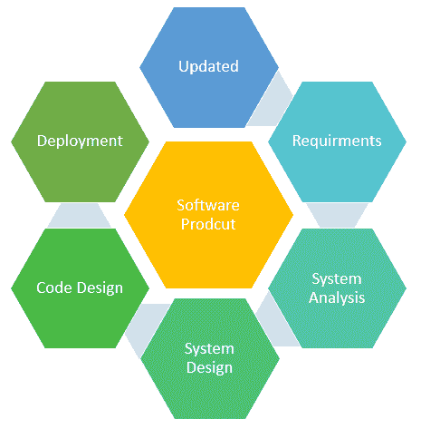

# 什么是软件工程？ 定义，基础，特征

> 原文： [https://www.guru99.com/what-is-software-engineering.html](https://www.guru99.com/what-is-software-engineering.html)

## 什么是软件工程？

软件工程定义为分析用户需求，然后设计，构建和测试满足这些需求的软件应用程序的过程。

让我们看一下软件工程的各种定义：

*   IEEE 在其标准 610.12-1990 中将软件工程定义为系统的，经过严格训练的应用程序，这是用于软件开发，操作和维护的可计算方法。
*   Fritz Bauer 将其定义为“机构并使用了标准工程原理。 它可以帮助您经济高效地获得可靠的软件，并可以在实际机器上高效地工作。
*   Boehm 定义了软件工程，其中涉及“将科学知识实际应用到计算机程序的创意设计和构建中。 它还包括开发，操作和维护它们所需的相关文档。”

在本软件工程教程中，您将学习：

*   [什么是软件工程？](#1)
*   [为什么选择软件工程？ 软件危机&及其解决方案](#2)
*   [为什么软件工程很受欢迎？](#3)
*   [软件工程与其他学科的关系](#4)
*   [软件工程的挑战](#5)
*   [软件产品的属性](#6)
*   [优质软件](#7)的特征

## 为什么选择软件工程？ 软件危机&及其解决方案：

### 什么是软件危机？

*   1960 年代后期，许多软件项目失败。
*   许多软件超出预算。 输出是不可靠的软件，维护成本很高。
*   较大的软件很难维护，而且价格昂贵。
*   许多软件无法满足客户不断增长的需求。
*   只要硬件功能增强，软件项目的复杂性就会增加。
*   与生成新软件的能力相比，对新软件的需求增长更快。

以上所有问题均导致“软件危机”。

### 解决方案

解决该问题的方法是将无组织的编码工作转变为软件工程学科。 这些工程模型有助于公司简化运营并交付满足客户要求的软件。

*   1970 年代后期，软件工程原理得到了广泛的应用。
*   在 1980 年代，看到了软件工程过程的自动化以及（CASE）计算机辅助软件工程的发展。
*   1990 年代，对项目质量和流程标准的“管理”方面越来越重视，就像 ISO 9001 一样

## 为什么软件工程很受欢迎？

以下是软件工程流行的重要原因：



*   **大型软件** –在我们的现实生活中，建造墙壁比建造房屋或建筑物要舒适得多。 同样，随着软件大小的增加，软件工程可以帮助您构建软件。
*   **可伸缩性-**如果软件开发过程是基于科学和工程概念的，则重新创建新软件以扩展现有软件更容易。
*   **适应性**：每当软件过程基于科学和工程技术时，都可以借助软件工程技术轻松地重新创建新软件。
*   **成本-**硬件行业已显示出其技能，而庞大的制造工艺降低了计算机和电子硬件的成本。
*   **动态特性**-始终在增长和适应软件的特性。 这取决于用户的工作环境。
*   **质量管理**：提供更好的软件开发方法，以提供高质量的软件产品。

## 软件工程与其他学科的关系

在这里，软件工程与其他学科如何相关：

*   **计算机科学**：为电气工程提供了科学基础，因为电气工程主要依靠物理学。
*   **管理科学**：软件工程是一项劳动密集型工作，需要技术和管理控制。 因此，它被广泛应用于管理科学。
*   **经济学**：在该行业中，软件工程可帮助您进行资源估计和成本控制。 必须开发计算系统，并应在给定的预算内定期维护数据。
*   **系统工程**：大多数软件是大型系统的组成部分。 例如，行业监视系统中的软件或飞机上的飞行软件。 软件工程方法应应用于此类系统的研究。

## 软件工程的挑战

这是软件工程师面临的一些关键挑战：

*   在诸如航天，航空，核电站等对安全至关重要的领域中，由于生命危险，软件故障的成本可能很高。
*   市场需求增加，以加快周转时间。
*   处理对新应用程序的软件需求日益增加的复杂性。
*   软件系统的多样性应该相互通信。

## 软件产品的属性

任何软件产品的特征都包括产品在安装和使用时所显示的功能。

它们不是产品提供的服务。 相反，它们与产品的动态行为和产品的使用有关。

这些属性的示例是：

```
Efficiency, reliability, robustness, maintainability, etc. 

```

但是，这些特性的相对重要性从一个软件系统到另一个软件系统都不同。

| **产品特性** | **说明** |
| 可维护性 | 该软件应不断发展以满足客户不断变化的需求。 |
| 可靠性 | 可靠性包括各种特征。 可靠的软件在系统出现故障时绝不会造成任何物理或经济损失。 |
| 效率 | 软件应用程序应该过度使用系统资源，例如内存和处理器周期。 |
| 易用性 | 该软件应用程序应具有特定的 UI 和文档。 |

优化以上属性非常具有挑战性。 例如，提供更好的 UI 可能会降低系统效率。

## 好的软件的特征

任何软件都应根据其提供的功能以及帮助您使用该软件的方法进行判断。

每个软件必须满足以下属性：

*   操作
*   过渡性的
*   保养

这是由软件专业人员开发的优质软件的一些重要特征

**运作中的**

这个特性让我们知道软件在以下方面的运行状况如何：

*   预算
*   效率
*   易用性
*   可靠性
*   正确性
*   功能性
*   安全
*   安全

**过渡性**

当软件从一个平台迁移到另一个平台时，这是一个重要方面：

*   互通性
*   可重用性
*   可移植性
*   适应性

**维护**

此方面讨论软件在快速变化的环境中如何适应自身的能力：

*   灵活性
*   可维护性
*   模块化
*   可扩展性

#### 摘要

*   软件工程是分析用户需求，然后设计，构建和测试将满足该需求的软件应用程序的过程
*   使用软件工程的重要原因是：1）大型软件，2）可伸缩性 3）适应性 4）成本和 5）动态性。
*   在 1960 年代后期，许多软件超出了预算。 因此，它提供了不可靠的软件，维护成本很高。
*   1970 年代后期，软件工程原理得到了广泛的应用。
*   软件工程概念 1）计算机科学 2）管理科学 3）系统工程和 4）经济学
*   市场对快速周转时间的需求是软件工程领域的最大挑战。
*   1）可维护性 2）可靠性 3）效率 4）可用性是软件产品最重要的属性。
*   好的软件的三个最重要的特征是 1）操作 2）过渡 3）维护。