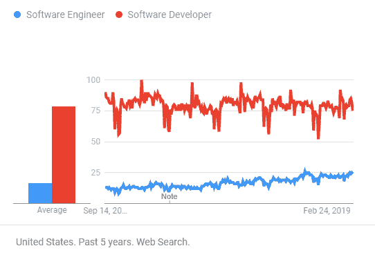

# 软件工程师与软件开发人员：有什么区别？

> 原文： [https://www.guru99.com/difference-software-engineer-developer.html](https://www.guru99.com/difference-software-engineer-developer.html)

## 什么是软件工程师？

软件工程师是将软件工程原理应用于计算机软件的设计，开发，维护，测试和评估的专业人员。

在本教程中，您将学习：

*   [什么是软件工程师？](#1)
*   [什么是软件开发人员？](#2)
*   [软件工程师与。 开发人员](#3)
*   [软件工程师的最佳做法](#4)
*   [适用于软件开发人员的最佳做法](#5)
*   [软件工程师的挑战](#6)
*   [软件开发人员](#7)的挑战
*   [软件工程师和开发人员的角色和职责](#8)

## 什么是软件开发人员？

软件开发人员是构建可在各种类型的计算机上运行的软件的专业人员。 他们从头开始编写代码。 该应用程序可以是 Photoshop 等桌面应用程序，Instagram 等移动应用程序，Facebook 等 Web 应用程序和 Twitter。

## 关键区别

*   软件工程师是将软件工程原理应用于计算机软件的设计，开发，维护，测试和评估的专业人员，而软件开发人员是构建可在各种类型的计算机上运行的软件的专业人员。
*   软件工程师是团队活动，而软件开发人员主要是单独活动。
*   软件工程师与硬件系统的其他组件一起工作，而软件开发人员则编写完整的程序。
*   软件工程师创建工具来开发软件，而软件开发人员使用现成的工具来构建应用程序。
*   软件工程师倾向于以更大的规模解决问题，而软件开发人员倾向于以有限的规模来完成工程师所做的一切。

Google Trends Software engineer vs. Software Developer

## 软件工程师。 开发者

这是软件工程师和软件开发人员之间的一些重要区别：

| **参数** | **软件工程师** | **软件开发人员** |
| --- | --- | --- |
| 度 | 软件工程学士学位比软件开发学士学位有更多好处。 | 软件开发学位被视为信息技术或计算机编程的专业。 |
| 活动类型 | 软件工程是团队活动。 | 发展主要是一项单独的活动。 |
| 工作过程 | 软件工程师参与了整个过程 | 开发是软件项目构建过程的一方面。 |
| 工作作风 | 软件工程师与其他工程师一起使用组件来构建系统。 | 开发人员编写完整的程序。 |
| 职业路线 | 

*   软件工程师
*   首席软件工程师
*   首席软件开发工程师

 | 

*   软件架构师
*   开发人员

 |
| Working style | 工程师倾向于更大范围地解决问题。 因此，创意解决方案没有太多余地，相反，它们需要更加系统化，并且正在思考。 | 开发人员倾向于做工程师要做的所有事情，但是规模有限。 这使他们比工程师更富有创造力，提出了解决方案。 |
| 工具类 | 软件工程师负责创建用于开发软件的工具，例如 Visual Studio 和 Eclipse。 | 他们使用软件工具来开发 Web，移动和桌面应用程序。 |
| 薪水 | 在美国，软件工程师的平均工资为每年 105,861 美元。 | 在美国，软件开发人员的平均工资为每年 92,380 美元。 |

## 软件工程师最佳做法：

以下是软件工程师的一些最佳做法：

*   软件工程师应该采取对客户和雇主都有利的方式行事。
*   确保软件产品和相关修改应符合最高的专业标准。
*   软件工程师应能够在其专业方法中保持完整性和独立性。
*   能够推广和以道德的方式进行软件开发和维护。
*   软件工程师应支持其同事。

## 软件开发人员最佳实践

以下是软件开发人员的一些重要最佳实践：

*   了解您的代码如何帮助推动整体业务。
*   在项目中有效使用代码
*   写下您的每日编码目标
*   计划如何处理您的即时编码任务
*   从项目中最难的部分开始项目

## 软件工程师的挑战

这是软件工程师面临的一些关键挑战：

*   在诸如太空，核电站等对安全至关重要的领域中，由于生命危险，软件故障的成本可能很高。
*   市场需求的增长对软件工程师来说是一个很大的挑战。
*   处理日益增加的软件复杂性总是需要新的应用程序。
*   软件系统的多样性应该相互通信。

## 软件开发人员的挑战

以下是软件开发人员面临的一些常见挑战：

*   最终用户要求的解释有误
*   无法应对不断变化的需求
*   处理无法站在一起的模型
*   难以维护或扩展的软件
*   后期发现一些重要的项目缺陷
*   软件质量差是软件经常面临的另一个常见挑战，特别是在低成本项目中

## 软件工程师和开发人员的角色和职责

### 软件工程师和开发人员技能

*   应该具有出色的分析能力
*   该人员应具有创建和维护 IT 架构和数据库的经验。
*   基于云的基础架构的模式设计和经验。
*   在多核 CPU 上的实践经验。
*   专业人士应该能够使用各种软件开发方法，例如敏捷，Scrum，看板

### 角色与职责

*   跨团队合作以提供技术指导并支持产品的整个开发过程。
*   制定周到的计划，以帮助客户制定出满足客户需求的程序
*   准备培训手册，供应用程序用户使用。
*   参加与客户，计算机程序员和其他人员的会议。
*   通过完成系统分析工作来改善操作。
*   从供应商处获取相关数据后，获取软件并进行许可。
*   通过收集，分析和总结服务和开发问题来提供相关数据
*   构建工具以提高内部生产率