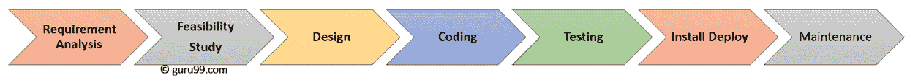

# SDLC（软件开发生命周期）教程：什么是阶段，模型

> 原文： [https://www.guru99.com/software-development-life-cycle-tutorial.html](https://www.guru99.com/software-development-life-cycle-tutorial.html)

## 什么是 SDLC？

**SOFTWARE DEVELOPMENT LIFECYCLE (SDLC)** is a systematic process for building software that ensures the quality and correctness of the software built. SDLC process aims to produce high-quality software that meets customer expectations. The system development should be complete in the pre-defined time frame and cost. SDLC consists of a detailed plan which explains how to plan, build, and maintain specific software. Every phase of the SDLC life cycle has its own process and deliverables that feed into the next phase. SDLC stands for Software Development Lifecycle.

在本软件开发生命周期教程中，您将学习

*   [为什么选择 SDLC？](#2)
*   [SDLC 阶段](#3)
*   [阶段 1：需求收集和分析](#4)
*   [第 2 阶段：可行性研究](#5)
*   [阶段 3：设计](#6)
*   [阶段 4：编码](#7)
*   [阶段 5：测试](#8)
*   [阶段 6：安装/部署](#9)
*   [阶段 7：维护](#10)
*   [流行的 SDLC 型号](#11)

### 为什么选择 SDLC？

这是 SDLC 对于开发软件系统很重要的主要原因。

*   它为项目计划，计划和评估提供了基础
*   为一组标准的活动和可交付成果提供框架
*   它是项目跟踪和控制的机制
*   增强开发过程中所有相关利益相关者的项目计划可见性
*   增加并提高开发速度
*   改善客户关系
*   帮助您降低项目风险和项目管理计划的开销

## SDLC 阶段

整个 SDLC 流程分为以下几个阶段：

*   阶段 1：需求收集和分析
*   阶段 2：可行性研究：
*   阶段 3：设计：
*   阶段 4：编码：
*   阶段 5：测试：
*   阶段 6：安装/部署：
*   阶段 7：维护：

在本教程中，我已经解释了所有这些阶段

### 阶段 1：需求收集和分析：

该要求是 SDLC 流程的第一步。 它由高级团队成员进行，并得到业界所有利益相关者和领域专家的投入。 在此阶段，还需要进行质量保证要求的规划和对所涉及风险的识别。

此阶段可以更清楚地了解整个项目的范围以及引发该项目的预期问题，机会和指示。

需求收集阶段需要团队来获取详细而精确的需求。 这有助于公司确定必要的时间表以完成该系统的工作。

### 阶段 2：可行性研究：

一旦需求分析阶段完成，下一步就是定义和记录软件需求。 该过程是在“软件需求规范”文档（也称为“ SRS”文档）的帮助下进行的。 它包括在项目生命周期中应设计和开发的所有内容。

**可行性检查主要有五种类型：**

*   **经济：**我们能否在预算范围内完成项目？
*   **法律：**我们能否以网络法和其他监管框架/法规来处理此项目。
*   **操作可行性：**我们可以创建客户期望的操作吗？
*   **技术：**需要检查当前的计算机系统是否可以支持该软件
*   **时间表：**决定是否可以在给定时间表内完成项目。

### 阶段 3：设计：

在此第三阶段，根据需求规范文档准备系统和软件设计文档。 这有助于定义整体系统架构。

此设计阶段用作模型下一阶段的输入。

在此阶段开发了两种设计文档：

高级设计（HLD）

*   每个模块的简要说明和名称
*   有关每个模块功能的概述
*   接口关系和模块之间的依赖关系
*   确定数据库表及其关键元素
*   完整的架构图以及技术细节

低层设计（LLD）

*   模块的功能逻辑
*   数据库表，包括类型和大小
*   界面完整细节
*   解决所有类型的依赖性问题
*   错误消息清单
*   每个模块的完整输入和输出

### 阶段 4：编码：

一旦系统设计阶段结束，下一个阶段便是编码。 在此阶段，开发人员通过使用所选编程语言编写代码来开始构建整个系统。 在编码阶段，任务被分为单元或模块，并分配给各个开发人员。 这是软件开发生命周期过程的最长阶段。

在此阶段，开发人员需要遵循某些预定义的编码准则。 他们还需要使用诸如编译器，解释器，调试器之类的编程工具来生成和实现代码。

### 阶段 5：测试：

软件完成后，就可以将其部署在测试环境中了。 测试团队开始测试整个系统的功能。 这样做是为了验证整个应用程序是否可以根据客户要求工作。

在此阶段，质量检查和测试团队可能会发现一些错误/缺陷，并与开发人员进行交流。 开发团队修复了该错误，然后将其发送回质量保证进行重新测试。 该过程将一直持续到该软件无缺陷，稳定并根据该系统的业务需求运行为止。

### 阶段 6：安装/部署：

一旦软件测试阶段结束并且系统中没有错误或错误，则最终的部署过程开始。 根据项目经理的反馈，发布最终软件并检查是否存在部署问题。

### 阶段 7：维护：

一旦部署了系统，并且客户开始使用开发的系统，则会发生以下 3 个活动

*   错误修复-由于某些未经完全测试的方案而报告错误
*   升级-将应用程序升级到软件的较新版本
*   增强功能-在现有软件中添加了一些新功能

此 SDLC 阶段的主要重点是确保继续满足需求，并确保系统按照第一阶段中提到的规范继续运行。

## 流行的 SDLC 型号

这是 SDLC 生命周期的一些最重要的阶段：

**瀑布模型**

瀑布是广为接受的 SDLC 模型。 在这种方法中，软件开发的整个过程分为多个阶段。 在此 SDLC 模型中，一个阶段的结果用作下一阶段的输入。

该 SDLC 模型是文档密集型的，早期阶段记录了后续阶段需要执行的操作。

**增量方法**

增量模型不是单独的模型。 本质上是一系列瀑布循环。 在项目开始时，需求被分为几组。 对于每个小组，都遵循 SDLC 模型来开发软件。 SDLC 过程重复进行，每个版本都增加了更多功能，直到满足所有要求为止。 在这种方法中，每个周期都充当先前软件版本的维护阶段。 对增量模型的修改允许开发周期重叠。 在那之后的下一个周期可以在前一个周期完成之前开始。

**V 型**

在这种类型的 SDLC 模型测试和开发中，该阶段是并行计划的。 因此，一侧有验证阶段，另一侧有验证阶段。 V 模型通过编码阶段加入。

**敏捷模型**

敏捷方法论是一种在任何项目的 SDLC 流程中促进开发与测试之间持续交互的实践。 在敏捷方法中，整个项目分为小的增量构建。 所有这些构建都是迭代提供的，每个迭代持续一到三周。

**螺旋模型**

螺旋模型是一种风险驱动的过程模型。 此 SDLC 模型可帮助团队采用一个或多个过程模型的元素，例如瀑布，增量，瀑布等。

该模型采用了原型模型和瀑布模型的最佳功能。 螺旋方法论是快速原型设计与并发设计和开发活动的结合。

**大爆炸模型**

大爆炸模型专注于软件开发和编码中的所有类型的资源，而没有计划或计划很少。 需求一经理解就实现了。

此模型最适合具有较小规模开发团队并正在协同工作的小型项目。 它对于学术软件开发项目也很有用。 这是理想的模型，其中要求未知或没有给出最终发布日期。

**结论**

*   SDLC 是用于构建软件的系统过程，可确保所构建软件的质量和正确性
*   完整格式的 SDLC 是软件开发生命周期。
*   SDLC 流程为一组标准的活动和可交付成果提供了框架
*   SDLC 分为七个不同的阶段：1）需求收集和分析 2）可行性研究：3）设计 4）编码 5）测试：6）安装/部署和 7）维护
*   高级团队成员进行需求分析阶段
*   可行性研究阶段包括在项目生命周期中应设计和开发的所有内容
*   在设计阶段，根据需求规范文件准备系统和软件设计文件
*   在编码阶段，开发人员通过使用所选编程语言编写代码来开始构建整个系统。
*   测试是下一个阶段，该阶段用于验证整个应用程序是否可以根据客户要求工作。
*   当软件测试阶段结束并且没有系统中的错误或错误时，开始安装和部署工作
*   维护面上涉及的错误修复，升级和参与操作
*   瀑布，增量，敏捷，V 模型，螺旋，大爆炸是一些流行的 SDLC 模型
*   SDLC 包含详细的计划，该计划说明了如何计划，构建和维护特定的软件