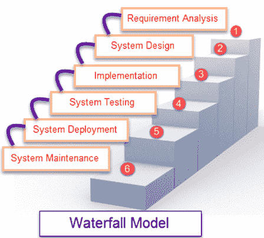

# SDLC 中的瀑布模型是什么？ 优点&缺点

> 原文： [https://www.guru99.com/what-is-sdlc-or-waterfall-model.html](https://www.guru99.com/what-is-sdlc-or-waterfall-model.html)

## 什么是瀑布模型？

**瀑布模型**是将软件开发划分为预定义阶段的顺序模型。 每个阶段都必须完成，然后下一个阶段才能开始且各阶段之间没有重叠。 每个阶段都旨在在 SDLC 阶段执行特定的活动。 它是由 Winston Royce 于 1970 年推出的。

### **软件工程中瀑布模型的不同阶段**

| **不同的相位** | **在每个阶段进行的活动** |
| **需求收集阶段** | 

*   在此阶段，从客户端

收集了要开发的软件系统的详细要求。 |
| **设计阶段** | 

*   规划编程语言，例如 [Java](/java-tutorial.html) ， [PHP](/php-tutorials.html) ，.net
*   或诸如 Oracle，MySQL 等的数据库。

*   或项目

的其他高级技术细节 |
| **内置舞台** | 

*   在设计阶段之后，它是构建阶段，只不过是对软件

进行编码 |
| **测试阶段** | 

*   在此阶段，您将测试软件以验证其是否根据客户端给出的规范进行了构建。

 |
| **部署阶段** | 

*   在相应的环境中部署应用程序

 |
| **维护阶段** | 

*   一旦您的系统准备就绪，可以稍后根据客户要求更改代码。

 |

### **何时使用 SDLC 瀑布模型**

瀑布模型可以在什么时候使用

*   需求变化不大
*   申请并不复杂
*   项目短
*   要求很明确
*   环境稳定
*   使用的技术和工具并非动态且稳定
*   资源可用并经过培训

### **瀑布模型**

的优缺点

| 

**优势**

 | 

**缺点**

 |
| 

*   在下一阶段的开发之前，必须完成每个阶段

 | 

*   仅在阶段

期间可以修复错误 |
| 

*   适合要求明确定义的较小项目

 | 

*   对于需求经常变化的复杂项目，这是不希望的。

 |
| 

*   他们应在完成每个阶段之前执行质量保证测试（验证和确认）

 | 

*   测试阶段在开发过程中相当晚

 |
| 

*   在软件开发周期的每个阶段都制作详尽的文档

 | 

*   文档占用开发人员和测试人员的大量时间

 |
| 

*   项目完全依赖项目团队，而客户干预最少

 | 

*   客户宝贵的反馈意见无法纳入正在进行的开发阶段

 |
| 

*   在开发过程中对软件进行任何更改

 | 

*   完整软件中发生的细微更改或错误可能会引起很多问题。

 |