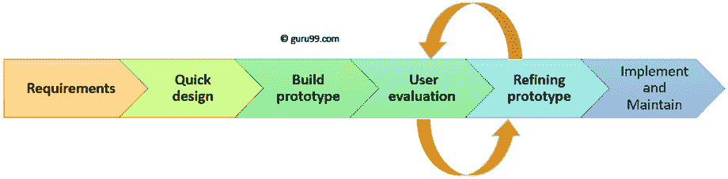

# 软件工程中的原型模型：方法论，过程，方法

> 原文： [https://www.guru99.com/software-engineering-prototyping-model.html](https://www.guru99.com/software-engineering-prototyping-model.html)

## 什么是软件原型模型？

原型方法被定义为一种软件开发模型，在该模型中构建，测试原型，然后在需要时进行重新加工，直到获得可接受的原型。 它还为产生最终系统奠定了基础。

在不了解项目需求的情况下，软件原型模型最有效。 这是在开发人员和客户端之间进行的迭代，尝试和错误方法。

在本教程中，您将学习

*   [什么是软件原型模型？](#1)
*   [原型模型阶段](#2)
*   [原型类型](#3)
*   [原型制作的最佳做​​法](#4)
*   [原型模型](#5)的优势
*   [原型模型](#6)的缺点

## 原型模型阶段

原型模型具有以下六个 SDLC 阶段：

### 步骤 1：需求收集和分析

原型模型始于需求分析。 在此阶段，将详细定义系统要求。 在此过程中，对系统的用户进行了采访，以了解他们对系统的期望。

### 步骤 2：快速设计

第二阶段是初步设计或快速设计。 在此阶段，将创建系统的简单设计。 但是，它不是完整的设计。 它向用户简要介绍了系统。 快速设计有助于开发原型。

### 步骤 3：建立原型

在此阶段，将根据快速设计中收集的信息来设计实际的原型。 这是所需系统的小型工作模型。

### 步骤 4：初始使用者评估

在此阶段，将建议的系统提供给客户进行初始评估。 它有助于找出工作模型的优缺点。 意见和建议从客户那里收集并提供给开发人员。

### 步骤 5：精制原型

如果用户对当前原型不满意，则需要根据用户的反馈和建议来完善原型。

在满足用户指定的所有要求之前，此阶段不会结束。 一旦用户对所开发的原型感到满意，便会基于批准的最终原型来开发最终系统。

### 步骤 6：实施产品并进行维护

一旦基于最终原型开发了最终系统，便会对其进行全面测试并部署到生产中。 该系统经过例行维护，以最大程度地减少停机时间并防止大规模故障。

## 原型模型的类型

原型模型有四种类型：

1.  快速抛弃型原型
2.  进化原型
3.  增量原型
4.  极限原型

### 快速抛弃原型

快速丢弃是基于初步要求。 它可以快速发展以显示需求的外观。 客户的反馈有助于推动对需求的更改，然后再次创建原型直到需求被基线化。

用这种方法，开发的原型将被丢弃，并且不会成为最终接受的原型的一部分。 该技术对于探索想法并获得客户需求的即时反馈很有用。

### 进化原型

在此，根据客户的反馈逐步完善所开发的原型，直到最终被接受。 它可以帮助您节省时间和精力。 这是因为对于流程的每个交互从头开始开发原型有时会非常令人沮丧。

该模型对于使用尚未被很好理解的新技术的项目很有帮助。 它也用于复杂的项目，其中每个功能都必须检查一次。 当需求在初始阶段不稳定或不清楚时会很有帮助。

### 增量原型

在增量原型中，最终产品将被抽取为不同的小型原型，并分别进行开发。 最终，将不同的原型合并为一个产品。 此方法有助于减少用户与应用程序开发团队之间的反馈时间。

### 极限原型：

极限原型方法主要用于 Web 开发。 它包括三个连续的阶段。

1.  具有所有现有页面的基本原型以 HTML 格式显示。
2.  您可以使用原型服务层来模拟数据过程。
3.  这些服务已实现并集成到最终原型中。

## 原型制作的最佳做​​法

这是在原型制作过程中应注意的一些事项：

*   当需求不清楚时，您应该使用原型
*   执行计划的和受控的原型制作很重要。
*   定期会议对于确保项目按时进行并避免代价高昂的延迟至关重要。
*   用户和设计者应注意原型设计的问题和陷阱。
*   在非常早期的阶段，您需要批准原型，然后才允许团队继续进行下一步。
*   在软件原型制作方法中，如果需要部署新的想法，则永远不要害怕更改早期的决策。
*   您应该为每个版本选择适当的步长。
*   尽早实施重要功能，以便在没有时间的情况下仍然拥有一个有价值的系统

## 原型模型的优势

这里是使用原型模型的重要优点/好处：

*   用户积极参与开发。 因此，可以在软件开发过程的初始阶段检测到错误。
*   可以识别缺少的功能，这有助于降低失败的风险，因为原型设计也被视为降低风险的活动。
*   帮助团队成员有效沟通
*   之所以存在客户满意度，是因为客户可以在很早的阶段就感觉到产品。
*   几乎没有任何软件被拒绝的机会。
*   更快的用户反馈有助于您获得更好的软件开发解决方案。
*   允许客户端比较软件代码是否符合软件规范。
*   它可以帮助您找出系统中缺少的功能。
*   它还确定了复杂或困难的功能。
*   鼓励创新和灵活的设计。
*   这是一个简单的模型，因此很容易理解。
*   无需专业专家来建立模型
*   原型是得出系统规范的基础。
*   该原型有助于更好地了解客户的需求。
*   原型可以更改，甚至可以丢弃。
*   原型还可以作为操作规范的基础。
*   原型可以为软件系统的未来用户提供早期培训。

## 原型模型的缺点

这里是原型模型的重要缺点/缺点：

*   原型制作是一个缓​​慢且耗时的过程。
*   开发原型的成本是全部浪费，因为最终将原型扔掉了。
*   原型设计可能会鼓励过多的变更请求。
*   有时，客户可能不愿意在更长的时间段内参与迭代周期。
*   每次客户评估原型时，软件要求的变化可能太多。
*   文档不佳，因为客户的需求在变化。
*   对于软件开发人员而言，要适应客户要求的所有更改非常困难。
*   在看到早期的原型模型之后，客户可能认为实际产品将很快交付给他。
*   如果客户对初始原型不满意，则可能会对最终产品失去兴趣。
*   想要快速构建原型的开发人员可能最终会构建不合标准的开发解决方案。

## 摘要

*   在软件工程中，原型方法学是一种软件开发模型，其中构建，测试原型，然后在需要时进行重新加工，直到获得可接受的原型。
*   1）需求收集和分析； 2）快速设计； 3）建立原型； 4）初始用户评估； 5）完善原型； 6）实施产品和维护； 原型制作过程的 6 个步骤
*   原型模型的类型为 1）快速抛弃型原型 2）进化型原型 3）增量型原型 4）极限型原型
*   定期召开会议对于保持项目按时进行并避免原型设计方法造成代价高昂的延迟至关重要。
*   可以识别缺少的功能，这有助于降低失败的风险，因为原型开发在 SDLC 中也被视为降低风险的活动。
*   原型设计可能会鼓励过多的变更请求。