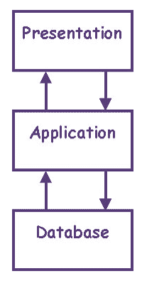
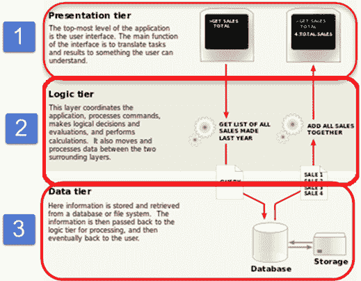
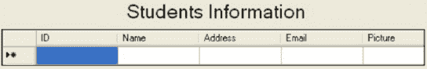

# N 层（多层），3 层，2 层架构（带示例）

> 原文： [https://www.guru99.com/n-tier-architecture-system-concepts-tips.html](https://www.guru99.com/n-tier-architecture-system-concepts-tips.html)

## 什么是 N 层？

**N 层应用程序**程序是在分布式网络中的三台或更多台单独的计算机中分发的程序。

n 层的最常见形式是 3 层应用程序，它分为三类。

*   用户计算机中的用户界面编程
*   更加集中的计算机中的业务逻辑，以及
*   管理数据库的计算机中的必需数据。

该体系结构模型为软件开发人员提供了最大的灵活性来创建可重用的应用程序/系统。

在 **N 层中，“ N”** 指的是正在使用的许多层或层，例如– **2 层，3 层或 4 层等**。 它也被称为“ **多层** **体系结构”** 。

**n 层体系结构**是行业认可的软件体系结构模型。 通过提供可伸缩性，安全性，容错性，可重用性和可维护性解决方案，它适合支持企业级客户端-服务器应用程序。 它帮助开发人员创建灵活且可重用的应用程序。

在本教程中，您将学习-

*   [什么是 N 层？](#1)
*   [N 层架构](#2)
*   [N 层架构的类型](#3)

*   [3 层架构](#3-Tier)
*   [2 层架构](#2-Tier)
*   [单层或 1 层架构](#1-Tier)

*   [多层体系结构的优缺点](#4)
*   [N 层架构提示和开发](#5)

## N 层架构

n 层系统的图形表示在此处描述–表示层，应用程序层和数据库层。

<figure align="center"> 

N 层架构图


根据需要，可以将这三个层进一步细分为不同的子层。

一些采用这种架构的热门网站是

*   MakeMyTrip.com
*   Sales Force 企业应用
*   印度铁路– IRCTC
*   Amazon.com 等

记住一些常用术语，以便更清楚地理解该概念。

*   **分布式网络：**这是一种网络体系结构，其中位于网络计算机上的组件仅通过传递消息来协调和传达其动作。 它是位于不同节点上的多个系统的集合，但对用户而言似乎是一个系统。
    *   它提供了一个单一的数据通信网络，可以由不同的网络分别进行管理。
    *   分布式网络的示例–在局域网的体系结构中，不同的客户端一方面连接，另一方面，它们与包含服务节点的服务器机架连接到高速交换机。
*   **Client-Server Architecture:** It is an architecture model where the client (one program) requests a service from a server (another program) **i.e.** It is a request-response service provided over the internet or through an intranet.

    在此模型中，**客户端**将用作一组程序/代码，它们通过网络执行一组动作。 而**服务器**是另一个程序集，该程序将请求的结果集发送到客户端系统。

    *   在这种情况下，客户端计算机向最终用户提供接口，以从服务器请求服务或资源，另一方面，服务器随后处理该请求并将结果显示给最终用户。
    *   客户端-服务器模型的一个示例-ATM 机。 银行是用于处理大型客户数据库中的应用程序的服务器，而 ATM 机是具有用户界面和一些简单应用程序处理功能的客户端。

*   **平台：**在计算机科学或软件行业中，平台是可以在其上运行应用程序的系统。 它由硬件和软件的组合组成，它们具有用于处理器/微处理器执行特定操作的内置指令。
    *   简而言之，平台是可以运行和执行任何应用程序以获取特定任务的系统或基础。
    *   平台示例–装有 Windows 2000 或 Mac OS X 的个人计算机，作为 2 个不同平台的示例。

*   **数据库：**它是按组织方式收集的信息，以便可以轻松访问，管理和更新。
    *   数据库的示例– MySQL， [SQL](/sql.html) 服务器和 Oracle 数据库是一些常见的 Db。

## N 层架构的类型

有多种类型的 N 层架构，例如 **3 层架构，2 层架构和 1 层架构。**

首先，我们将看到 3 层架构，这非常重要。

### 3 层架构

通过查看下图，您可以轻松识别 **3 层体系结构**具有三个不同的层。

*   表示层
*   业务逻辑层
*   数据库层

<figure style="text-align: center;">

 

3 层架构图


在这里，我们以学生形式的简单示例来理解所有这三个层次。 它具有有关学生的信息，例如–名称，地址，电子邮件和图片。

**用户界面层或表示层**



**表示层**

```
private void DataGrid1_SelectedIndexChanged(object sender, System.EventArgs e)
{
// Object of the Property layer
clsStudent objproperty=new clsStudent();
// Object of the business layer
clsStudentInfo objbs=new clsStudentInfo();
// Object of the dataset in which we receive the data sent by the business layer
DataSet ds=new DataSet();
// here we are placing the value in the property using the object of the
//property layer
objproperty.id=int.Parse(DataGridl.SelectedItem.Cells[1].Text.ToString());

// In this following code we are calling a function from the business layer and 
// passing the object of the property layer which will carry the ID till the database.
ds=objbs.GetAllStudentBsIDWise(objproperty);

// What ever the data has been returned by the above function into the dataset
//is being populate through the presentation laye.
txtId.Text=ds.Tables[0].Rows[0][0].ToString();
txtFname.Text=ds.Tables[0].Rows[0][1].ToString();
txtAddress.Text=ds.Tables[0].Rows[0][2].ToString();
txtemail.Text=ds.Tables[0].Rows[0][3].ToString();
```

**代码说明**

*   上面的代码定义了应用程序前端视图的基本设计以及其他层功能的调用，以便它们可以彼此集成。

**业务访问层-**

这是业务层的功能，该功能从应用程序层接收数据并将其传递到数据层。

*   业务逻辑充当客户端层和数据访问层之间的接口
*   所有业务逻辑（例如数据验证，计算，数据插入/修改）都写在业务逻辑层下。
*   它使客户端和数据层之间的通信更快，更轻松
*   定义完成任务所需的适当工作流程活动。

```
// this is the function of the business layer which accepts the data from the 
//application layer and passes it to the data layer.
public class clsStudentInfo
{
	public DataSet GetAllStudentBsIDWise(clsStudent obj)
	{
	 DataSet ds=new DataSet();
	 ds=objdt.getdata_dtIDWise(obj);// Calling of Data layer function
	 return ds;
	}
}
```

**代码**的说明

该代码正在使用业务层的功能，该功能将接受应用程序层的数据并将其传递给数据层。 业务层代码充当表示层和数据层中定义的功能之间的中介，反之亦然。

**数据访问层**

这是数据层功能，它从业务层接收数据并在数据库中执行必要的操作。

```
// this is the datalayer function which is receiving the data from the business 
//layer and performing the required operation into the database

public class clsStudentData // Data layer class 
{
	// object of property layer class
	public DataSet getdata_dtIDUise(clsStudent obj)
	{
	 DataSet ds;
	 string sql;
	 sql="select * from student where Studentld=" +obj.id+ "order by Studentld;
	 ds=new DataSet();
	//this is the datalayer function which accepts the sql query and performs the 
	//corresponding operation
		ds=objdt.ExecuteSql(sql); 
		return ds;
	}
}
```

**Explanation of code**

在上面的数据集层中定义的代码接受整个请求：由系统请求并在数据库中执行所需的操作。

### 2 层架构：

这就像客户端-服务器体系结构，在客户端和服务器之间进行通信。

在这种类型的软件体系结构中，表示层或用户界面层在客户端运行，而数据集层在服务器端执行并存储。

客户端和服务器之间没有业务逻辑层或直接层。

### 单层或 1 层架构：

这是最简单的一种，因为它等效于在个人计算机上运行该应用程序。 一个应用程序要运行的所有必需组件都在单个应用程序或服务器上。

表示层，业务逻辑层和数据层都位于一台计算机上。

## 多层体系结构的优缺点

| **优势** | **劣势** |
| 

*   可扩展性

 | 

*   努力的增加

 |
| 

*   数据完整性

 | 

*   复杂度增加

 |
| 

*   可重用性

 |   |
| 

*   减少发行量

 |   |
| 

*   增强的安全性

 |   |
| 

*   改进的可用性

 |   |

因此，它是程序的一部分，该程序对现实世界中的业务问题进行加密，并确定如何更新，创建，存储或更改数据以完成完整的任务。

## N 层架构提示与开发

考虑到软件专业人员必须对架构的所有层都拥有完全控制权，因此有关 n 层架构的提示如下所示

1.  通过使用诸如 soap XML 之类的技术，尝试将层与另一层尽可能地分离。
2.  使用一些自动化工具在业务逻辑层和关系数据库层（数据层）之间生成映射。 可以帮助建模这些映射技术的工具包括– Entity Framework 和 Hibernate for .Net 等。
3.  在客户端展示者层中，尽可能将所有客户端的通用代码放在单独的库中。 这将使所有类型的客户端的代码可重用性最大化。
4.  可以将缓存层添加到现有层中以提高性能。

**摘要：**

N 层体系结构有助于一站式管理应用程序的所有组件（业务层，表示层和数据库层）。

在局域网上使用少量用户的应用程序可以从 n 层体系结构中受益。

这样的体系结构设计可以确保在 Internet 上高效地维护，扩展和部署应用程序。