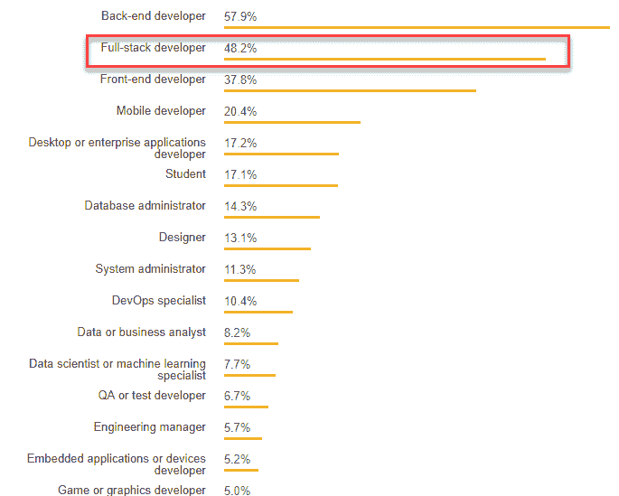
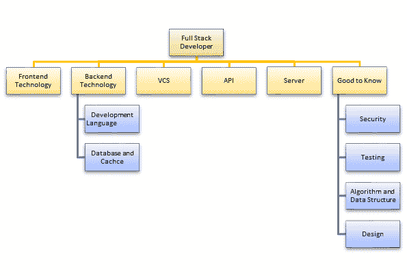

# 什么是全栈开发人员？ 成为 Web 开发人员的技能

> 原文： [https://www.guru99.com/full-stack-developer.html](https://www.guru99.com/full-stack-developer.html)

## 什么是全栈开发人员？

**FULL STACK DEVELOPER** 是一位同时在客户端和服务器端软件上工作的工程师。 这种类型的软件开发人员可以在应用程序的完整堆栈上工作，这意味着前端技术，后端开发语言，数据库，服务器，API 和版本控制系统。 因此，名称为“ Full Stack” Developer。

全栈开发人员将用户需求转换为整体体系结构并实施新系统。 **全栈开发人员不一定掌握所有技术。** 但是，期望专业人员在客户端和服务器端工作，并了解开发应用程序时发生的情况。 他或她应该对所有软件技术都有真正的兴趣。

[开发人员资料的 Stackoverflow 调查](https://insights.stackoverflow.com/survey/2018/)

在本教程中，您将了解有关-

*   [为什么需要全栈开发人员？](#2)
*   [成为全栈开发人员所需的技能集](#3)
*   [什么是软件堆栈？ 我应该学习哪个堆栈？](#4)
*   [灯泡堆栈](#5)
*   [MERN 堆栈](#6)
*   [普通堆栈](#61)
*   [全栈开发人员做什么？](#7)
*   [全栈开发人员薪水](#8)
*   [关于全栈工程师](#9)的神话

## 为什么需要全栈开发人员？

以下是您应聘请全栈开发专业人员的一些突出原因：

*   全栈开发人员可帮助您使系统的各个部分保持平稳运行
*   全栈开发人员可以为团队中的每个人提供帮助，并大大减少团队沟通的时间和技术成本
*   如果一个人扮演不同的角色，则可以节省公司的人员，基础架构和运营成本

## 成为全栈开发人员所需的技能

Full Stack Developer Skill Set

**1）前端技术**

全栈开发人员应该掌握诸如 HTML5，CSS3，JavaScript 之类的基本前端技术。 希望了解 jQuery，LESS，Angular 和 React JS 等第三方库

**2）开发语言**

全栈工程师应该至少了解一种服务器端编程语言，例如 Java，Python，Ruby，.Net 等。

**3）数据库和缓存**

对各种 DBMS 技术的了解是全栈开发人员的另一个重要需求。 MySQL，MongoDB，Oracle，SQLServer 被广泛用于此目的。 熟悉诸如清漆，Memcached，Redis 等缓存机制。

**4）基本设计能力**

为了成为成功的全栈开发人员，还建议您具备设计知识。 此外，人们应该了解基本原型设计和 UI / UX 设计的原理。

**5）服务器**

需要接触 Apache 或 nginx 服务器。 Linux 的良好背景可以极大地帮助管理服务器。

**6）版本控制系统（VCS）**

版本控制系统允许完整的堆栈开发人员跟踪代码库中所做的所有更改。 **Git** 的知识可帮助整个堆栈的开发人员了解如何获取最新代码，更新部分代码，对其他开发人员的代码进行更改而不会造成任何麻烦。

**7）使用 API​​（REST & SOAP）：**

Web 服务或 API 的知识对于全栈开发人员也很重要。 需要有关 REST 和 SOAP 服务的创建和使用方面的知识。

**其他难题：**

1.  编写质量**单元测试**的能力
2.  他或她应完全了解用于构建测试，文档和大规模部署的自动化流程
3.  了解**安全性**的问题很重要，因为每一层都有其自身的漏洞
4.  对**算法**和数据结构的了解也是专业全栈开发人员的基本需求

## 什么是软件堆栈？ 我应该学习哪个堆栈？

软件堆栈是程序的集合，这些程序一起使用可以产生特定的结果。 它包括一个操作系统及其应用程序。 例如，智能手机软件堆栈包括操作系统以及电话应用程序，Web 浏览器和默认应用程序。

上面列出的全栈工程师技能集可能令人生畏。 您需要根据您的职业目标，项目和公司要求掌握软件堆栈。 以下是流行的软件堆栈列表。

无论您选择哪种堆栈，都可以在不同堆栈上找到架构和设计模式上的相似之处

## 灯泡堆栈

LAMP 是 Web 服务堆栈的一种广泛使用的模型。 它的名称“ LAMP”是四个开源组件的首字母缩写。

*   L = Linux：一种开源操作系统
*   A = Apache：广泛使用的 Web 服务器软件
*   M = MySQL：流行的开源数据库
*   P = PHP：服务器端开源脚本语言

这些上面讨论的组件相互支持。 许多流行的网站和 Web 应用程序都在 LAMP 堆栈上运行，例如：Facebook。

## MERN 堆栈

MERN 是基于 JavaScript 的技术的集合：

*   M = MongoDB：流行的 NoSQL 数据库
*   E = Express：轻便的可移植 Web 程序框架
*   R =反应：用于构建用户界面的 JavaScript 库
*   N = Node.js：服务器端 JavaScript 运行时

由于广泛用于开发 Web 应用程序，因此目前对该堆栈有巨大的需求。

## 平均值堆栈

MEAN Stack 应用程序开发正在见证使用量的增长趋势。 MEAN 是以下各项的缩写：

*   M = MongoDB：nosql 数据库
*   E = Express：易于使用的轻便且可移植的 Web 程序框架
*   A = Angular.js：用于开发 HTML5 和 JavaScript- Web 程序的强大框架
*   N = Node.is：服务器端 JavaScript 运行时

## 全栈开发人员做什么？

作为全栈开发人员，您可能会参与以下活动：

*   将用户需求转化为新系统的总体架构和实施
*   管理项目并与客户协调
*   用 Ruby，Python，Java，PHP 语言编写后端代码
*   编写优化的前端代码 HTML 和 JavaScript
*   了解，创建和调试与数据库相关的查询
*   创建测试代码以根据客户要求验证应用程序。
*   监视 Web 应用程序&基础结构的性能
*   快速，准确地解决 Web 应用程序故障

## 全栈开发人员薪水

作为全栈开发人员，您每年可能赚取$ 112000。

Full Stack Developer Salary

在这个英国，薪金范围为£40,000-£70,000

## 关于全栈工程师的神话

误解：全栈开发人员正在自己编写所有类型的代码。

事实：他或她可能知道不同的技术，但不编写每个代码。

误区二：编写前端和后端代码。

如果某些全栈开发人员以自由职业者的身份工作，则可能会对整个网站进行编码。 但这不是强制性地编写前端和后端代码的原因。

Full Stack Developer 是“万事通，万事通”。

不，FSD 是几堆纸的主人，其余的人都很满意。 实际上，作为全栈工程师，您可以 360 度查看使软件产品成功的不同组件。 基于这种认识，与后端或前端工程师相比，全栈开发人员可以快速创建原型。 他们对产品设计和体系结构的观点非常明确和有益。

误解：如果您在外包公司工作，您将无法成为全职开发人员

这是一种思维定势，而不是立场。 为了成为全栈开发人员，您需要正确的技术知识组合。

### 重要说明：

*   全栈 Web 开发人员是技术专家，可以在任何应用程序的前端&后端中工作。
*   全栈开发人员可帮助您保持系统的各个部分平稳运行。
*   成为全栈开发人员所需的技能集是前端技术，开发语言，数据库，基本设计能力，服务器，使用 API​​和版本控制系统。
*   软件堆栈是程序的集合，这些程序一起使用可以产生特定的结果。
*   LAMP 代表 Linux，Apache，MYSQL 和 PHP。
*   MERN 是 MongoDB，Express，React，Node.js 的完整形式。
*   MEAN 代表 MongoDB，Express，Angular.js 和 Node.js。
*   FULL STACK DEVELOPER 每年最多可赚取$ 112000。
*   关于全栈开发人员的最大神话是，他们自己编写了所有类型的代码，这是不正确的。