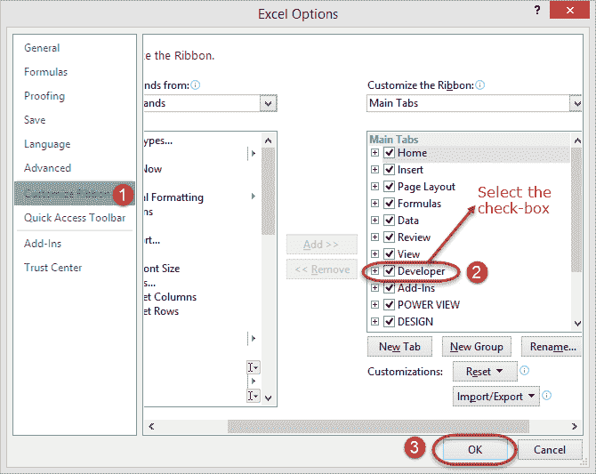
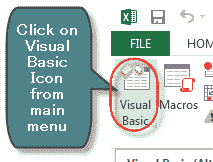
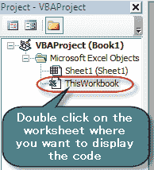
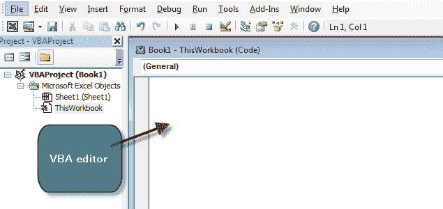
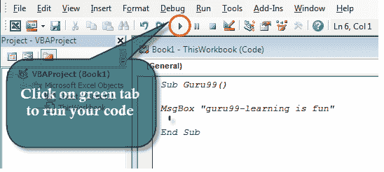
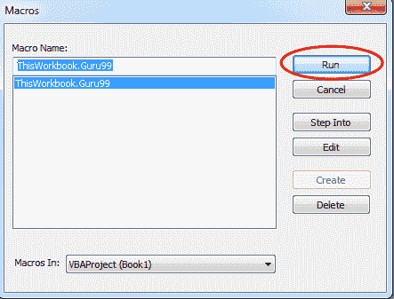
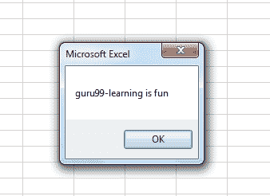

# 如何使用示例在 Excel 中创建 Visual Basic for Applications（VBA）

> 原文： [https://www.guru99.com/creating-your-first-visual-basic-for-applications-vba-in-excel.html](https://www.guru99.com/creating-your-first-visual-basic-for-applications-vba-in-excel.html)

```
Everybody in this country should learn how to program a computer... because it teaches you how to think." -Steve Jobs
```

我想表达史蒂夫·乔布斯的明智话，并说世界上每个人都应该学习如何对计算机编程。 您可能不必完全以程序员的身份工作或编写程序，但是它将教会您如何思考。

在本教程中，我们将涵盖以下主题。

*   [什么是 VBA？](#1)
*   [为什么使用 VBA？](#2)
*   [VBA 在 excel](#3) 中的个人&商业应用
*   [Visual Basic for Applications VBA 基础知识](#4)
*   [在 Excel 中创建简单的 EMI 计算器的分步示例](#5)

## 什么是 VBA？

**VBA 代表 Visual Basic for Applications** 。 在进一步研究细节之前，让我们看一下外行语言中的计算机编程。 假设你有一个女佣。 如果您想让女佣打扫房间并洗衣服。 您用英语告诉她该怎么做，而她会为您完成工作。 在使用计算机时，您将需要执行某些任务。 就像您告诉女仆做家务一样，您也可以告诉计算机为您完成任务。

告诉计算机您想要它为您做什么的过程称为计算机编程。 就像您用英语告诉女仆该做什么一样，您也可以使用类似英语的陈述来告诉计算机该做什么。 像英语一样的陈述属于高级语言类别。 VBA 是一种高级语言，您可以用来将 excel 屈服于所有强大的意志。

VBA 实际上是 Visual Basic 6.0 BASIC 的子集，代表 **B** 实例 **A** 通用 **S** 符号 **I** 指令 **C** ode。

## 为什么使用 VBA？

*   它使用类似英语的语句来编写指令
*   创建用户界面就像使用绘画程序。 您只需要拖放，对齐图形用户界面控件即可。
*   学习曲线短。 从您开始学习的第一天起，您就可以立即开始编写简单的程序。
*   通过允许您使 excel 表现出所需的方式来增强 excel 的功能

## VBA 在 Excel 中的个人&业务应用程序

对于个人用途，您可以将其用于简单的宏，这些宏将自动执行大多数例行任务。 阅读有关宏的文章，以获取有关如何实现此目的的更多信息。

对于商业用途，您可以创建由 excel 和 VBA 支持的完整，功能强大的程序。 这种方法的优点是您可以在自己的自定义程序中利用 excel 的强大功能。

## Visual Basic for Applications VBA 基础

在编写任何代码之前，我们需要首先了解基础知识。 以下基础知识将帮助您入门。

*   **变量** –在中学时，我们学习了代数。 查找（x + 2y）其中 x = 1 和 y =3。在此表达式中，x 和 y 是变量。 如本例所示，它们可以被分配任何数字，即分别为 1 和 3。 它们也可以分别更改为 4 和 2。 简而言之，变量是存储位置。 在使用 VBA 时，也将需要声明变量，就像在代数类中一样
*   **创建变量的规则**
    *   不要使用保留字-如果您是学生，则不能使用职称讲师或校长。 这些头衔仅供讲师和学校当局使用。 保留字是在 Vba 中具有特殊含义的那些字，因此，不能将它们用作变量名。
    *   变量名称不能包含空格–您不能定义名为第一个数字的变量。 您可以使用 firstNumber 或 first_number。
    *   使用描述性名称-以您自己的名字命名变量很诱人，但请避免这样做。 使用描述性名称，例如数量，价格，小计等，这将使您的 VBA 代码易于阅读
*   算术运算符-除法乘法，加法和减法（BODMAS）的括号规则适用，因此在使用使用多个不同算术运算符的表达式时，请记住应用它们。 就像在 excel 中一样，您可以使用
    *   +用于加法
    *   -减法
    *   *用于乘法
    *   /用于划分。
*   逻辑运算符-早期教程中介绍的逻辑运算符的概念在使用 VBA 时也适用。 其中包括
    *   如果陈述
    *   要么
    *   不
    *   和
    *   真正
    *   假

## 启用开发者选项

*   创建一个新的工作簿
*   单击功能区开始按钮
*   选择选项
*   单击自定义功能区
*   选中开发者复选框，如下图所示
*   点击确定



现在，您将能够在功能区中看到“开发人员”选项卡

### VBA Hello world

现在，我们将演示如何在 VBA 中编程。 VBA 中的所有程序都必须以“ Sub”开头，并以“ End sub”结尾。 这里的名称是您要分配给程序的名称。 sub 代表一个子例程，我们将在本教程的后面部分学习该子例程。

```
Sub name()
.
.
. 
End Sub
```

我们将创建一个基本的 VBA 程序，该程序将显示一个输入框，询问用户名，然后显示问候消息

本教程假定您已完成 excel 中有关宏的教程，并已在 excel 中启用了 DEVELOPER 选项卡。

*   创建一个新的工作簿
*   将其保存为启用了 Excel 宏的工作表格式* .xlsm
*   单击开发人员选项卡
*   单击控件功能区栏下的 INSERT 下拉框
*   选择一个命令按钮，如下图所示

 in Excel")

在工作表上的任意位置绘制命令按钮

您将获得以下对话窗口

 in Excel")

*   将宏名称重命名为 btnHelloWorld_Click
*   点击新按钮
*   您将获得以下代码窗口

 in Excel")

输入以下指令代码

```
Dim name As String
name = InputBox("Enter your name")
MsgBox "Hello " + name
```

这里，

*   **“将名称作为字符串存储”** 创建一个名为 name 的变量。 该变量将接受文本，数字和其他字符，因为我们将其定义为字符串
*   **“名称= InputBox（“输入您的名称”）“** 调用内置函数 InputBox，该功能显示带有标题输入您的名称的窗口。 输入的名称然后存储在名称变量中。
*   “ **MsgBox” Hello“ +名称”** 调用内置函数 MsgBox，该函数显示 Hello 和输入的名称。

您的完整代码窗口现在应如下所示

 in Excel")

*   关闭代码窗口
*   右键单击按钮 1 并选择编辑文本
*   输入问好

 in Excel")

*   点击说你好
*   您将获得以下输入框

 in Excel")

*   输入您的名字，即乔丹
*   您将收到以下消息框

 in Excel")

恭喜，您刚刚在 excel 中创建了您的第一个 VBA 程序

## 在 Excel 中创建简单的 EMI 计算器的分步示例

在本教程中，我们将创建一个简单的程序来计算 EMI。 EMI 是“每月等额分期付款”的缩写。 这是您获得贷款时每月偿还的金额。 下图显示了用于计算 EMI 的公式。

 in Excel")

上面的公式很复杂，可以用 excel 编写。 好消息是 excel 已经解决了上述问题。 您可以使用 PMT 函数来计算上述值。

PMT 功能的工作方式如下

```
=PMT(rate,nper,pv)
```

**此处，**

*   **“费率”** 这是月费率。 利率除以每年的还款次数
*   **“ nper”** 是付款总数。 这是贷款期限乘以每年的还款次数
*   **“ pv”** 当前值。 这是实际的贷款额

使用 excel 单元创建 GUI，如下所示

 in Excel")

在第 7 行和第 8 行之间添加命令按钮

给按钮宏名称 btnCalculateEMI_Click

点击编辑按钮

输入以下代码

```
Dim monthly_rate As Single, loan_amount As Double, number_of_periods As Single, emi As Double
monthly_rate = Range("B6").Value / Range("B5").Value
loan_amount = Range("B3").Value
number_of_periods = Range("B4").Value * Range("B5").Value 
emi = WorksheetFunction.Pmt(monthly_rate, number_of_periods, -loan_amount)
Range("B9").Value = emi
```

**HERE,**

*   **“ Dim month_rate as Single，…”** Dim 是用于在 VBA 中定义变量的关键字，monthly_rate 是变量名称，Single 是表示变量将接受数字的数据类型。
*   **“ monthly_rate = Range（” B6“）。Value / Range（” B5“）。Value”** Range 是用于从 VBA 访问 Excel 单元格的函数，Range（“ B6”）。Value 引用 B6 中的值
*   **“ WorksheetFunction.Pmt（…）”** WorksheetFunction 是用于访问 excel 中所有功能的函数

下图显示了完整的源代码

 in Excel")

*   单击保存并关闭代码窗口
*   如下面的动画图像所示测试您的程序

 in Excel")

## 示例 2

**步骤 1）**在主菜单的“开发人员”选项卡下，单击“ Visual Basic”图标，它将打开您的 VBA 编辑器。



**步骤 2）**将打开 VBA 编辑器，从中可以选择要在其中运行代码的 Excel 工作表。 要打开 VBA 编辑器，请双击工作表。



它将在文件夹的右侧打开一个 VBA 编辑器。 它将看起来像一个空白。



**步骤 3）**在这一步中，我们将看到第一个 VBA 程序。 要阅读和显示我们的程序，我们需要一个对象。 在 VBA 中，该对象或媒体位于 MsgBox 中。

*   首先，输入“ Sub”，然后输入“程序名称”（Guru99）
*   在 MsgBox 中写任何您想显示的内容（学习 guru99 很有趣）
*   通过 End Sub 结束程序


**步骤 4）**在下一步中，您必须通过单击编辑器菜单顶部的绿色运行按钮来运行此代码。



**步骤 5）**运行代码时，将弹出另一个窗口。 在这里，您必须选择要在其中显示程序的工作表，然后单击“运行”按钮



**步骤 6）**单击运行按钮时，程序将被执行。 它将在 MsgBox 中显示味精。



[下载上面的 Excel 代码](https://drive.google.com/uc?export=download&id=0BwL5un1OyjsddWN3Szc3TE9RTTg)

## 摘要

VBA 代表 Visual Basic for Application。 它是 Visual Basic 编程语言的子组件，可用于在 excel 中创建应用程序。 使用 VBA，您仍然可以利用 excel 的强大功能，并在 VBA 中使用它们。