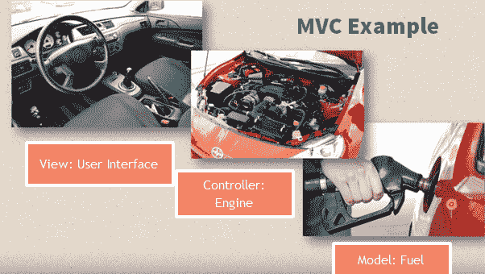

# MVC 初学者教程：什么是架构&示例

> 原文： [https://www.guru99.com/mvc-tutorial.html](https://www.guru99.com/mvc-tutorial.html)

## 什么是 MVC 框架？

**模型-视图-控制器（MVC）**框架是一种架构模式，可将应用程序分为三个主要的逻辑组件：模型，视图和控制器。 因此缩写为 MVC。 每个体系结构组件均构建为处理应用程序的特定开发方面。 MVC 将业务逻辑层和表示层彼此分离。 传统上，它用于桌面图形用户界面（GUI）。 如今，MVC 体系结构已成为设计 Web 应用程序和移动应用程序的流行方法。

在本教程中，您将了解有关-

*   [MVC 的历史](#2)
*   [MVC 的功能](#3)
*   [MVC 架构](#4)
*   [MVC 示例](#5)
*   [流行的 MVC Web 框架](#6)
*   [MVC 的优势：主要优势](#7)
*   [使用 MVC 的缺点](#8)
*   [3 层架构与 MVC 架构](#9)

## MVC 的历史

*   MVC 架构于 1979 年由 Trygve Reenskaug 首次讨论
*   MVC 模型于 1987 年以 Smalltalk 编程语言首次引入。
*   1988 年，MVC 首次被接受为一般概念
*   近年来，MVC 模式被广泛用于现代 Web 应用程序中

## MVC 的功能

*   简便，无摩擦的可测试性。 高度可测试，可扩展和可插入的框架
*   提供对 HTML 以及 URL 的完全控制
*   利用 ASP.NET，JSP，Django 等提供的现有功能。
*   逻辑分离清晰：模型，视图，控制器。 应用程序任务的分离即。 业务逻辑，UI 逻辑和输入逻辑
*   SEO 友好 URL 的 URL 路由。 强大的 URL 映射，可理解和可搜索的 URL
*   支持测试驱动开发（TDD）

## MVC 架构

<figure style="margin-left: auto;margin-right: auto;">


MVC Architecture Diagram


三个重要的 MVC 组件是：

*   模型：包括所有数据及其相关逻辑
*   查看：向用户显示数据或处理用户交互
*   控制器：模型和视图组件之间的接口

让我们详细了解一下此组件：

### 视图

视图是应用程序中代表数据表示的部分。

视图是通过从模型数据收集的数据创建的。 视图请求模型提供信息，以便其将输出呈现重新呈现给用户。

该视图还表示聊天，图表和表中的数据。 例如，任何客户视图都将包括所有 UI 组件，例如文本框，下拉菜单等。

### 控制者

控制器是应用程序中处理用户交互的部分。 控制器解释来自用户的鼠标和键盘输入，通知模型和视图以进行适当更改。

控制器向模型发送命令以更新其状态（例如，保存特定文档）。 控制器还将命令发送到其关联的视图，以更改视图的显示方式（例如，滚动特定文档）。

### 模型

模型组件存储数据及其相关逻辑。 它表示在控制器组件或任何其他相关业务逻辑之间传输的数据。 例如，一个 Controller 对象将从数据库中检索客户信息。 它处理数据并发送回数据库或使用它来呈现相同的数据。

它响应来自视图的请求，也响应来自控制器的指令以更新自身。 这也是负责维护数据的模式的最低级别。

## MVC 示例

让我们从日常生活中看一下 Model View Controller：

### 范例 1：

[ ](/images/1/122118_0445_MVCTutorial2.png) 

*   假设您去一家餐馆。 您不会去厨房准备食物，而您肯定可以在家中做饭。 相反，您只需要去那里等服务员来。
*   现在服务员来找您，您只需点菜。 服务员不知道你是谁，你不想要什么，他只是写下了食物单​​的细节。
*   然后，服务员搬到厨房。 在厨房服务员不要准备食物。
*   厨师准备食物。 服务员会得到您的点菜以及餐桌号码。
*   然后做饭为您准备食物。 他用食材烹饪食物。 假设您点了一份蔬菜三明治。 然后他需要面包，西红柿，土豆，辣椒，洋葱，小块，奶酪等，这些都是从冰箱中获取的
*   厨师最后把食物交给服务员。 现在，这是服务员的工作，要把这些食物移到厨房外面。
*   现在服务员知道您点了哪些食物以及如何食用。

在这种情况下，

```
View= You
Waiter= Controller
Cook= Model
Refrigerator= Data

```

再看一个例子

### 范例 2：

[ ](/images/1/122118_0445_MVCTutorial3.png) 

汽车驱动机制是 MVC 模型的另一个示例。

*   每辆汽车都由三个主要部分组成。
*   View =用户界面：（变速杆，面板，方向盘，制动器等）
*   控制器机制（引擎）
*   型号存储（汽油或污水箱）

汽车由发动机驱动，从存储中获取燃料，但只能使用上述用户界面设备运行。

## 流行的 MVC Web 框架

这里是一些流行的 MVC 框架的列表。

*   [Ruby on Rails](http://www.rubyonrails.org))
*   [Django](http://www.djangoproject.org)
*   [CakePHP](http://www.cakephp.org)
*   [这个](http://www.yiiframework.com)
*   [CherryPy](https://cherrypy.org/)
*   [Spring MVC](http://www.springsource.org)
*   [催化剂](http://www.catalyst.org)
*   滑轨
*   Zend 框架
*   CodeIgniter
*   拉拉韦尔
*   加油 PHP
*   交响乐

## MVC 的优势：主要优势

这是使用 MVC 架构的主要好处。

*   易于代码维护，易于扩展和增长
*   MVC 模型组件可以与用户分开测试
*   对新型客户的支持更加轻松
*   各种组件的开发可以并行执行。
*   通过将应用程序划分为三个单元，可以帮助您避免复杂性。 模型，视图和控制器
*   它仅使用通过单个控制器处理 Web 应用程序请求的 Front Controller 模式。
*   为测试驱动的开发提供最佳支持
*   它适用于大型 Web 设计人员和开发人员团队支持的 Web 应用程序。
*   提供关注点的清晰分离（SoC）。
*   搜索引擎优化（SEO）友好。
*   所有的分类和对象彼此独立，因此您可以分别对其进行测试。
*   MVC 允许将控制器上相关动作的逻辑分组在一起。

## 使用 MVC 的缺点

*   难以读取，更改，进行单元测试和重用此模型
*   框架导航可能会花费一些时间，因为它引入了新的抽象层，这要求用户适应 MVC 的分解标准。
*   没有正式的验证支持
*   数据的复杂性和效率提高
*   在现代用户界面上使用 MVC 的困难
*   需要多个程序员进行并行编程。
*   需要具备多种技术知识。
*   维护控制器中的许多代码

## 3 层架构与 MVC 架构

| **参数** | **3 层架构** | **MVC 架构** |
| 通讯 | 这种类型的架构模式永远不会直接与数据层通信。 | 所有层都使用三角形拓扑直接通信。 |
| 用法 | 3 层：广泛用于 Web 应用程序，其中客户端，数据层和中间件在物理上独立的平台上运行。 | 通常用于在单个图形工作站上运行的应用程序。 |

## 摘要

*   MVC 是一种架构模式，可将应用程序分为 1）模型，2）视图和 3）控制器
*   模型：包括所有数据及其相关逻辑
*   查看：向用户显示数据或处理用户交互
*   控制器：模型和视图组件之间的接口
*   MVC 架构于 1979 年由 Trygve Reenskaug 首次讨论
*   MVC 是一个高度可测试，可扩展和可插入的框架
*   一些流行的 MVC 框架是 Rails，Zend 框架，CodeIgniter，Laravel，Fuel PHP 等。