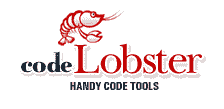
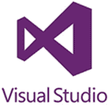

# 2020 年 21 种最佳软件开发工具

> 原文： [https://www.guru99.com/software-development-tools.html](https://www.guru99.com/software-development-tools.html)

有大量的软件开发工具，选择最佳工具可能是一个挑战。 以下是 21 种顶级软件开发工具的精选列表。

我们涵盖了以下类别的软件开发工具

*   [推荐工具](#11)
*   [IDE（集成开发环境）](#1)
*   [框架](#2)
*   [云工具](#3)
*   [数据科学](#4)
*   [源代码控制](#5)
*   [原型制作](#6)
*   [DevOps](#7)
*   [通知](#8)
*   [UML](#9)

## 推荐工具

### 1） [Linx：](https://bit.ly/2QVNQY7)

[Linx](https://bit.ly/2QVNQY7) 是低代码 IDE 和服务器。 IT 专业人员使用 Linx 快速创建自定义的自动化业务流程，集成应用程序，公开 Web 服务并有效地处理高工作量。

*   易于使用的拖放式界面
*   超过 100 种预建功能和服务，可快速发展
*   直接从 IDE 一键式部署到任何本地或远程 Linx Server
*   输入和输出几乎包括所有 SQL & NoSQL 数据库，众多文件格式（文本和二进制）或 REST 和 SOAP Web 服务
*   逐步调试逻辑进行实时调试
*   通过计时器，目录事件或消息队列自动化后端过程，或公开 Web 服务，并通过 HTTP 请求调用 API

* * *

### 2）[好友](https://bit.ly/2LGS1IE)

[Buddy](https://bit.ly/2LGS1IE) 是面向 Web 开发人员的智能 CI / CD 工具，旨在降低 DevOps 的进入门槛。 它使用交付管道来构建，测试和部署软件。 创建的管道具有 100 多种随时可以使用的操作，这些操作可以以任何方式进行排列-就像您盖砖瓦房一样。

*   15 分钟的配置，清晰的&告诉 UI / UX
*   基于变更集的快速部署
*   构建在具有缓存依赖项的隔离容器中运行
*   支持所有流行的语言，框架&任务管理器
*   Docker / Kubernetes 行动专用名单
*   与 AWS，Google，DigitalOcean，Azure，Shopify 和 WordPress 集成&更多
*   支持并行& YAML 配置

* * *

### 3） [HeadSpin](https://bit.ly/2S2pRtg)

[HeadSpin](https://bit.ly/2S2pRtg) 是世界上第一个互联智能平台 TM ，它提供 Web，移动，IoT 和 5G 解决方案，以统一跨应用程序，设备和网络的测试，监视和分析。 HeadSpin 支持开发，质量保证，运营和产品团队，以优化关联体验并确保数字业务成功。

**功能：**

*   在共享设备云上访问 30 多个国家/地区的 300 多个设备：
*   远程调试
*   支持 Real SIM 的 Android 和 iOS 设备
*   500 多个并行测试
*   回归测试
*   自动化
*   本地化测试
*   本地调试和代码分析

* * *

## IDE（集成开发环境）

### 4）NetBeans：

[NetBeans](https://netbeans.org/) 是一种流行的免费开放源代码 IDE。 它允许开发桌面，移动和 Web 应用程序。

**Features:**

*   支持快速&智能代码编辑
*   简单的&高效的项目管理流程
*   快速的用户界面开发
*   有助于编写无错误的代码
*   NetBeans IDE 为 C / C ++和 PHP 开发人员提供了出色的支持
*   它可以安装在任何支持 Java 的操作系统上，从 Windows 到 Linux 到 Mac OS X 系统。

**下载链接：** [https://netbeans.org/downloads/index.html](https://netbeans.org/downloads/index.html)

* * *

### 5）Cloud9 IDE：

[Cloud9 IDE](https://c9.io/) 是一个在线集成软件开发环境。 它支持许多编程语言，例如 C，C ++，PHP，Ruby，Perl，Python，JavaScript 和 Node.js。

**Features:**

*   允许克隆整个开发环境
*   命令行向导的内置终端
*   代码完成建议可帮助软件开发人员更快地编写代码并避免输入错误
*   调试器可帮助开发人员设置断点，并检查任何 JS / Node.js 应用程序的变量
*   只需拖动任何文件或终端即可创建多个拆分视图
*   开发人员可以选择广泛的默认运行程序集来执行应用程序，例如 Ruby，Python，PHP / Apache

**下载链接：** [https://c9.io/pricing](https://c9.io/pricing)

* * *

### 6）发送工作室：

[Zend Studio](https://www.zend.com/en/products/studio) 使软件开发人员可以更快地编写代码，更轻松地调试。 它是下一代 PHP IDE，旨在创建可提高开发人员生产力的应用程序。 它根据基础操作系统的 DPI 设置进行缩放。

**Features:**

*   加快代码编写速度，并在索引编制，验证和搜索 PHP 代码方面提高了性能
*   通过 Xdebug，Zend Debugger 和 Z-Ray 集成提供调试功能
*   大型 Eclipse 生态系统提供的广泛插件
*   它支持包括 Docker 和 Git Flow 在内的开发工具
*   在适用于 Amazon AWS 和 Microsoft Azure 的任何服务器上部署 PHP 应用程序

**下载链接：** [https://www.zend.com/downloads](https://www.zend.com/downloads)

* * *

### 7）原子：

[Atom](https://atom.io/) 是可靠的全方位文本编辑器。 它是完全免费和开源的。 可以对其进行自定义以执行任何操作，而无需修改配置文件。

**Features:**

*   Atom 可在许多流行的操作系统（例如 OS X，Windows 或 Linux）上运行
*   它通过智能，灵活的自动完成功能帮助开发人员更快地编写代码
*   在一个窗口中轻松浏览和打开整个项目或多个项目
*   可以将 Atom 界面拆分为多个窗格，以比较和编辑文件中的代码
*   在文件或整个项目中查找，预览和替换文本类型

**下载链接：** [https://atom.io/](https://atom.io/)

* * *

### 8）Spiralogics 应用架构：

[Spiralogics 应用程序体系结构](https://www.gotosaa.com/)（SAA）是基于云的软件开发工具。 它允许用户在线构建和自定义其应用程序并进行部署。 它还允许用户从一组预构建的应用程序中进行选择，或者从头开始对其进行自定义。

**Features:**

*   创建自定义页面
*   内置 HTML 编辑器
*   交互式仪表板构建器
*   发布应用程序之前预览更改
*   预定义的过程，例如保存，删除，接受，拒绝和电子邮件
*   允许自定义页面组件的外观
*   创建尚未定义的自定义流程

**下载链接：** [https://www.gotosaa.com/](https://www.gotosaa.com/)

* * *

### 9）CodeLobster：

[Codelobster](http://www.codelobster.com/) 简化并简化了 PHP 软件开发。 处理。 它支持 Wordpress，Drupal，Joomla 和 Magento 等 CMS。

**Features:**

*   PHP，HTML，JavaScript，CSS 代码突出显示
*   自动完成标签，当前标签的属性，结束标签。
*   使用 Inspector 可以很容易地找到隐藏在页面深处的 HTML 元素及其样式
*   自动完成样式属性名称和值
*   它允许自动填充关键字，DOM 元素及其属性
*   它提供 PHP Advanced 自动完成功能

**下载链接：** [http://www.codelobster.com](http://www.codelobster.com)

* * *

### 10） [CodeCharge Studio：](https://bit.ly/2RXWBDz)

[CodeCharge Studio](https://bit.ly/2RXWBDz) 提供了构建应用程序的最快方法。 该工具有助于开发数据驱动的网站或企业 Internet 和 Intranet 系统。

**Features:**

*   通过生成一致的结构良好的代码，避免代价高昂的错误和拼写错误
*   消除耗时的编程任务，并构建可扩展的，强大的 Web 应用程序
*   有助于在极短的时间内将任何数据库转换为 Web 应用程序
*   分析和修改生成的代码以学习 Web 技术并在任何环境中进行编程项目

**下载链接：** [http://www.codecharge.com/download/index.php](https://bit.ly/2RXWBDz)

* * *

## 框架

### 11）引导程序：

[Bootstrap](http://getbootstrap.com/) 是用于使用 HTML，CSS 和 JS 开发的响应框架。 它具有许多内置组件，您可以轻松地拖放它们以组装响应式网页。

**功能：**

*   Bootstrap 支持利用现成的代码块
*   无论谁在项目上工作，它都能确保一致性
*   它提供了广泛的组件列表
*   大多数 HTML 元素的基本样式
*   Bootstrap 可以根据项目的特定需求进行定制

**下载链接：** [http://getbootstrap.com/docs/4.0/getting-started/download/](http://getbootstrap.com/docs/4.0/getting-started/download/)

* * *

### 12）Expression Studio：

[Expression Studio](http://www.microsoft.com/en-in/download/details.aspx?id=5915) 是一组面向专业设计师的开发人员的工具。 它是一款强大的专业设计工具，可为开发人员提供创作自由。

**Features:**

*   它彻底改变了原型制作的速度
*   它允许使用示例数据创建有效的 UI
*   快速，灵活，无缝的工作流程有助于优化整个开发过程
*   这些工具可节省创建网站的时间，以更快地获得结果
*   先进的视觉诊断可加快调试速度
*   它提供团队 Foundation Server 集成
*   丰富的基于标准的网页设计&技术
*   它提供精确的布局控制并支持多种技术。
*   它通过高级视觉诊断有助于加速跨浏览器的调试

**下载链接：** [http://www.microsoft.com/zh-cn/download/details.aspx](http://www.microsoft.com/en-in/download/details.aspx?id=5915)

* * *

### 13）HTML5 Builder：

HTML5 Builder 是用于构建 Web 和移动应用程序的软件解决方案。 它可以使用单个 HTML5，CSS3，JavaScript 和 PHP 代码库开发应用程序。 它有助于定位多个移动操作系统，设备和 Web 浏览器。

**Features:**

*   这是使用灵活的云服务开发跨平台应用程序的最快方法
*   单一视觉框架提高了开发速度
*   将设计师和开发人员带入协作的工作流程
*   创建企业或 ISV Web 和移动应用程序
*   使用 HTML5 Builder 中的地理位置组件创建基于位置的浏览器和移动应用程序

**下载链接：** [https://www.embarcadero.com/products/rad-studio/start-for-free](https://www.embarcadero.com/products/rad-studio/start-for-free)

* * *

### 14）在线视觉：

[Visual Studio Online](https://www.visualstudio.com/team-services/) 是服务的集合。 它可以跨各种平台快速，轻松地计划，构建和交付软件。 这些软件开发工具使组织可以创建完美的开发环境。

**Features:**

*   使用敏捷工具跟踪和管理看板或 Scrum 板上的所有创意
*   提高代码质量并尽早发现问题
*   构建，管理，保护和共享软件组件
*   自动化和简化 Azure 部署
*   手动，性能和自动化测试工具
*   它提供了一个带有免费专用存储库的集中式版本控制系统。

**下载链接：** [https://www.visualstudio.com/downloads/](https://www.visualstudio.com/downloads/)

* * *

## 云工具

### 15）遵循：

[Kwatee](http://www.kwatee.net/) 敏捷部署是一种软件开发工具。 它将应用程序或微服务自动化到任意数量的服务器。 它完全自动化了来自任意数量目标服务器的文本和二进制文件的部署。

**Features:**

*   它允许为您的应用程序管理特定于环境的配置参数
*   它允许生成命令行安装程序以用于环境上的部署
*   该软件开发工具无需安装&配置。 它也消除了软件开发过程中的许多操作风险
*   它是一个友好的 Web 界面，可让您轻松高效地配置部署
*   它支持广泛的操作系统，包括 Linux，Windows，Mac OS X，Solaris 等。

**下载链接：** [http://www.kwatee.net/#download](http://www.kwatee.net/)

* * *

### 16）Azure：

Microsoft [Azure](https://azure.microsoft.com/) 被开发人员广泛用于构建，部署和管理 Web 应用程序。

**Features:**

*   它支持广泛的操作系统，编程语言，框架和设备
*   允许快速轻松地构建应用
*   轻松检测和缓解威胁
*   依靠最受信任的云
*   允许主动管理应用
*   有助于无缝交付移动应用程序

**下载链接：** [https://azure.microsoft.com/en-in/free/](https://azure.microsoft.com/en-in/free/)

* * *

## 数据科学

### 17）数据工作室：

[Dataiku DSS](https://www.dataiku.com/) 是一个协作数据科学软件平台。 数据科学家，数据分析师和工程师使用它来探索，原型化，构建和交付其数据产品。

**Features:**

*   在分析的每个阶段直观地分析数据
*   使用 80 多种内置函数来准备，丰富，融合和清除数据
*   将整个工作流程捆绑为一个可部署的软件包，以进行实时预测
*   使用 Python 或 R 构建&优化模型，并通过代码 API 集成任何外部 ML 库

**下载链接：** [https://www.dataiku.com/dss/trynow/](https://www.dataiku.com/dss/trynow/)

* * *

## 源代码管理

### 18）Github：

[GitHub](https://github.com/) 允许开发人员查看代码，管理项目和构建软件。 它为不同的开发工作提供了正确的工具。

**Features:**

*   轻松协调，保持一致并使用 Gi​​tHub 的项目管理工具完成工作
*   简单的文档和高质量的编码
*   允许所有代码在一个地方
*   开发人员可以直接从存储库托管其文档

**下载链接：** [https://github.com/](https://github.com/)

* * *

### 19）BitBucket：

[Bitbucket](https://bitbucket.org/) 是版本控制工具。 它促进了软件开发团队之间的轻松协作。 它与著名的项目和问题管理应用 JIRA 很好地集成在一起。

**Features:**

*   具有分支权限访问权限，以确保只有正确的人才能更改代码
*   通过将存储库组织到项目中，帮助开发团队专注于目标，产品或过程
*   它可以显示 CI 系统的构建结果
*   集成到现有工作流程中，以简化软件开发流程

**下载链接：** [https://bitbucket.org/](https://bitbucket.org/)

* * *

### 20）Cloudforge：

[CloudForge](http://www.cloudforge.com/) 是用于应用程序开发的软件即服务产品。 它集成和管理各种开发工具。

**Features:**

*   集成和管理各种开发工具
*   弹性扩展开发团队，项目和流程
*   将代码部署到公共云和私有云
*   只需单击一下即可使用各种协议（包括 FTP，SCP，SSH 和 Rsync）将源代码部署到运行时环境
*   CloudForge Publisher 允许并行部署到多个服务器

**下载链接：** [https://app.cloudforge.com/trial_signup/new/](https://app.cloudforge.com/trial_signup/new/)

* * *

## 原型设计

### 21）Axure：

[Axure](https://www.axure.com/) 提供了生产线框，原型和创建文档的功能。 全世界的业务分析师，产品经理和 IT 顾问都使用此工具。

**Features:**

*   Axure RP 生成 HTML 原型并提供共享链接
*   它允许多个人同时处理同一个文件
*   它可以在具有 MySQL 或 Microsoft SQL Server 数据库的 Microsoft IIS 上运行
*   它有助于创建和维护小部件库

**下载链接：** [https://www.axure.com/](https://www.axure.com/)

* * *

## DevOps

### 22）Codenvy：

[Codenvy](https://codenvy.com/) 自动将应用程序或微服务应用于任何数量的服务器。 它完全自动化了来自任意数量目标服务器的文本和二进制文件的部署。

**Features:**

*   它允许为您的应用程序管理特定于环境的配置参数
*   它允许生成命令行安装程序以用于在任何环境中的部署
*   该软件开发工具无需安装&配置。
*   它消除了软件开发过程中的许多操作风险
*   友好的 Web 界面可让您轻松高效地配置部署
*   它支持广泛的操作系统，包括 Linux，Windows，Mac OS X，Solaris 等。

**下载链接：** [https://codenvy.com/](https://codenvy.com/)

* * *

## 通知

### 23）SendBird：

[Sendbird](https://sendbird.com/) 用作移动应用程序和网站的消息传递和聊天 API。 它为大量受众提供了可伸缩性。 它还可以防止聊天室的垃圾邮件泛滥。

**Features:**

*   阅读并跟踪发送给用户的消息的状态
*   集成机器人以协助客户支持和产品推荐
*   提供推送通知&回调
*   读取回执&交付状态
*   根据观众人数自动拆分或合并聊天室，以提供持续参与

**下载链接：** [**https://sendbird.com/**](https://sendbird.com/)

* * *

## UML

### 24）企业架构师：

[Enterprise Architect](http://www.sparxsystems.com/products/ea/) 是需求管理工具。 通过在模型中创建需求，它与其他开发工具无缝集成。

**Features:**

*   允许构建健壮且可维护的系统
*   它可以在几秒钟内加载超大型模型
*   全球有效合作
*   提供完整的可追溯性
*   改善业务成果
*   有效地建模和管理复杂数据
*   支持单击 HTML 和文档生成
*   代码执行到可视化图

**下载链接：** [http://www.sparxsystems.com/products/ea/](http://www.sparxsystems.com/products/ea/)