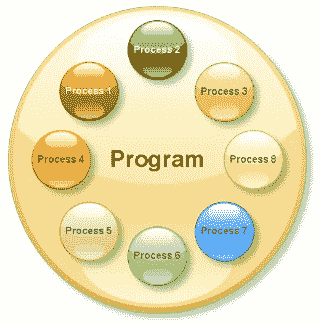

# 程序与程序之间的区别

> 原文： [https://www.guru99.com/program-vs-process-difference.html](https://www.guru99.com/program-vs-process-difference.html)

## 什么是程序？

程序是一个可执行文件，其中包含一组特定指令，以完成计算机上的特定作业。 例如，谷歌浏览器 chrome.exe 是一个可执行文件，其中存储了一组写入其中的指令，这些指令使您可以查看网页。

程序永远不会存储在计算机的主内存中。 而是将它们存储在 PC 或笔记本电脑的磁盘或辅助存储器上。 它们是从主内存中读取并由内核执行的。

在本教程中，您将学习

*   [什么是程序？](#1)
*   [什么是流程？](#2)
*   [程序](#3)的功能
*   [流程](#4)的功能
*   [程序与过程之间的差异](#5)

## 什么是流程？

进程是任何特定程序的执行。 它被认为是执行应用程序目的的活动实体。 多个进程可能与同一程序相关。

例如，如果您双击 PC 或笔记本电脑上的 Google Chrome 浏览器图标，则会启动一个将运行 Google Chrome 程序的过程。 当您打开另一个 Chrome 实例时，实际上是在创建两个进程。

## 程序功能

*   程序是被动实体。 它存储一组要执行的指令。
*   各种过程可能与同一程序有关。
*   用户可以运行多个程序，其中操作系统可以简化其内部编程活动，例如内存管理。
*   该程序必须运行才能执行任何操作。 需要执行它以实现其中提到的步骤。
*   操作系统分配主内存来存储程序指令。

## 处理功能

*   流程的寿命非常有限
*   它们还会生成一个或多个子进程，并且它们像人一样死亡。
*   像人类一样，甚至进程也具有以下信息：创建时谁是父进程，分配的内存的地址空间，包括所有权凭证和特权的安全属性。
*   进程被分配了系统资源，例如文件描述符和网络端口。

## 程序 Vs。 处理

程序和过程之间的一些重要区别如下：

| **参数** | **处理** | **程序** |
| --- | --- | --- |
| 定义 | 程序的执行部分称为过程。 | 程序是一组实现编程目标的有序操作。 |
| 性质 | 该过程是正在执行的程序的一个实例。 | 程序的性质是被动的，因此在执行之前不可能做任何事情。 |
| 资源管理 | 在过程中，资源需求很高。 | 该程序仅需要内存即可存储。 |
| 开销 | 流程有相当大的开销。 | 没有显着的间接费用。 |
| 寿命 | 该过程的寿命较短，并且非常有限，因为它在任务完成后终止。 | 程序存储在内存中的寿命更长，直到不手动删除它为止。 |
| 创建 | 新流程需要复制父流程。 | 不需要这种重复。 |
| 所需程序 | 进程拥有 CPU，内存地址，磁盘，I / O 等资源。 | 该程序存储在磁盘上的某个文件中，不需要任何其他资源。 |
| 实体类型 | 流程是动态或活动的实体。 | 程序是被动或静态实体。 |
| 包含 | 一个进程包含许多资源，例如内存地址，磁盘，打印机等。 | 程序需要磁盘上的存储空间来存储所有指令。 |

## 关键区别

*   流程是程序的执行部分，而程序是一组为了实现编程目标的有序操作。
*   该过程的寿命较短且最小，而程序的寿命较长。
*   进程包含许多资源，例如内存地址，磁盘，打印机，而程序需要磁盘上的内存空间来存储所有指令。
*   流程是一个动态或主动实体，而程序是一个被动或静态实体。
*   流程有相当大的开销，而程序没有太大的开销。