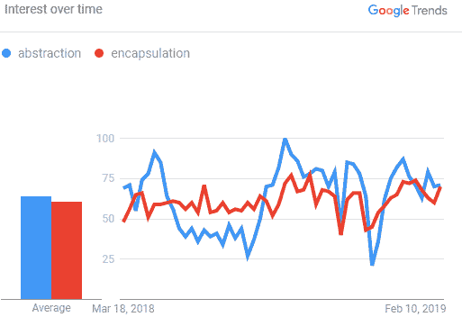
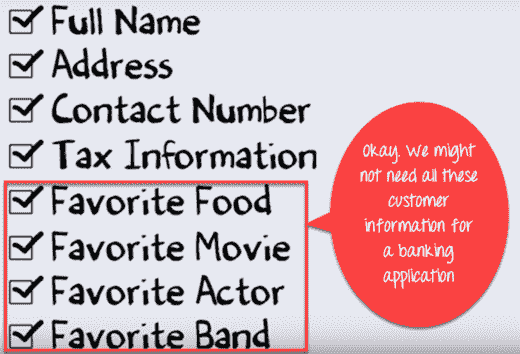

# 抽象与封装之间的区别

> 原文： [https://www.guru99.com/difference-between-abstraction-and-encapsulation.html](https://www.guru99.com/difference-between-abstraction-and-encapsulation.html)

## 抽象的定义

抽象是一种 OOP 概念，仅关注对象的相关数据。 它隐藏了背景细节，并强调了重要的数据点，以降低复杂性并提高效率。 它通常仅保留与该特定过程最相关的信息。 抽象方法主要集中在概念上，而不是实际功能上。

在本教程中，您将学习

*   [抽象的定义](#1)
*   [封装的定义](#2)
*   [为什么需要抽象？](#3)
*   [为什么需要封装？](#4)
*   [抽象示例](#5)
*   [封装示例](#6)
*   [抽象与。 封装](#7)

## 封装的定义

封装是一种使最终用户更容易处理复杂系统的方法。 用户不必担心系统的内部细节和复杂性。 封装是将数据和代码打包的过程，这些数据和代码将对数据进行操作的单个实体包装在一起。 您可以将其视为保护性包装器，以阻止对该包装器外部定义的代码进行随机访问。

<figure style="margin-left: auto;margin-right: auto;">

Abstraction vs. Encapsulation

## 为什么需要抽象？

这是面向对象编程中需要抽象的主要原因：

*   帮助您简化域模型的表示。
*   抽象隐藏了代码中不相关的细节。
*   抽象可以帮助您将程序划分为许多独立的概念。
*   在不同情况下使用 ADT（抽象数据类型）对象时提供最大的灵活性

## 为什么需要封装？

封装的主要优点是

*   它提高了应用程序的可维护性。
*   为用户提供灵活性，使其可以轻松地使用系统
*   帮助开发人员更好地组织代码
*   使整个编码过程更容易，因为您仅关注另一个类的工作，而不关注它的工作方式
*   这种方法有助于开发人员更加“客观”和面向结果。
*   封装的代码非常灵活，易于根据新要求进行更改。
*   封装使单元测试变得容易。
*   它使您减少模块之间的耦合并增加模块内部的内聚力，因为一件东西的所有部件都封装在一个地方。
*   封装可帮助您更改部分代码，而不影响其他部分代码。
*   提高应用程序的代码可读性
*   增强的安全性并使应用程序的维护更加容易
*   封装接口仅允许定义明确的交互。

## 抽象示例

假设您要创建一个银行应用程序，并且要求您收集有关客户的所有信息。 您有机会提供有关客户的以下信息。

但是，并非所有上述信息都是创建银行应用程序所必需的。

因此，您只需要从该池中为银行应用程序选择有用的信息。 诸如名称，地址，税务信息等数据对于银行应用程序是有意义的。

由于我们已经从更大的资源池中获取/删除/选择了客户信息，因此该过程称为“抽象”。

但是，一旦提取相同的信息，便可以用于广泛的应用程序。 例如，您可以对医院应用程序，工作门户网站应用程序，政府数据库等使用相同的数据，而几乎不需要修改。 因此，它成为您的主数据。 这是抽象的优点。

## 封装示例

让我们以移动设备为例。 在移动设备的帮助下，您可以执行各种功能，例如拍照，发送消息，录制视频/音频，访问网络等等。

上面提到的功能是大多数智能手机的功能。 但是，在使用此程序之前，您不需要了解这些功能的内部功能细节。 例如，您不需要知道相机如何计算伽玛校正或识别图像中的人脸。 您只需要学习软件界面。 这是封装。

## 抽象与。 封装形式

| **参数** | **抽象** | **封装** |
| 用来 | 抽象解决了设计阶段出现的问题。 | 封装解决了在实施阶段出现的问题。 |
| 焦点 | 抽象使您可以专注于对象的功能，而不是对象的工作方式 | 通过封装，您可以将代码和数据隐藏到一个单元中，以保护外界的数据安全。 |
| 实作 | 您可以通过接口和抽象类使用抽象。 | 您可以使用访问修饰符（公共的，受保护的&私有的）实现封装。 |
| 重点 | 主要集中在应该做什么。 | 主要集中于应如何做。 |
| 应用 | 在设计阶段。 | 在实施阶段。 |

## 关键区别

*   通过提供最必要的细节，抽象仅显示有用的数据，而封装将代码和数据包装为必要的信息。
*   抽象主要集中在应该做什么，而封装则集中在应该怎样做。
*   抽象为您提供了更抽象的图片，从而掩盖了复杂性，而封装则隐藏了内部工作，以便您以后可以进行更改。
*   抽象可以帮助您将程序划分为许多独立的部分，而封装很容易随新要求而变化。
*   抽象在设计级别解决问题，而封装在实现级别解决问题。
*   抽象隐藏了代码中不相关的细节，而封装则帮助开发人员轻松地组织整个代码。