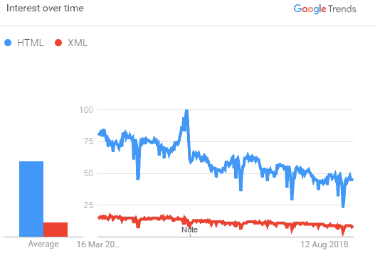
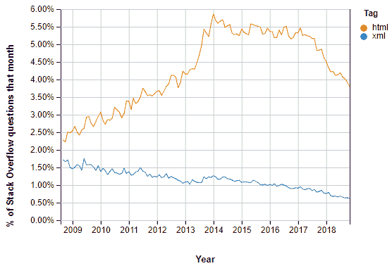
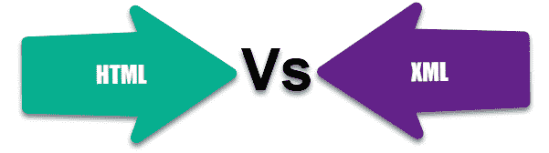

# XML 和 HTML 之间的区别

> 原文： [https://www.guru99.com/xml-vs-html-difference.html](https://www.guru99.com/xml-vs-html-difference.html)

## 什么是 XML？

XML 是一种标记语言，旨在存储数据。 它是常用的数据传输方式。 区分大小写。 XML 提供您定义标记元素并生成自定义标记语言的功能。 XML 中的基本单位称为元素。 XML 文件的扩展名为.xml

在本教程中，您将学习

*   [什么是 XML？](#1)
*   [什么是 HTML？](#2)
*   [XML](#3) 的功能
*   [HTML](#4) 的功能
*   [XML 示例：](#5)
*   [HTML 的示例：](#6)
*   [XML 与 HTML](#7)
*   [使用 XML 的优势](#8)
*   [使用 HTML 的优点](#9)
*   [使用 XML 的缺点](#10)
*   [使用 HTML](#11) 的缺点
*   [版本历史 HTML 和 XML](#12)

## 什么是 HTML？

HTML 是一种标记语言，可以帮助您创建和设计 Web 内容。 它具有各种标记和属性，用于定义 Web 文档的布局和结构。 它旨在以格式化的方式显示数据。 HTML 文档的扩展名为.htm 或.html。

您可以使用任何基本代码编辑器甚至记事本来编辑 HTML 代码。 可以在任何浏览器中执行已编辑的代码。 浏览器呈现使用的标签，并显示要显示的内容（采用或不采用应用格式）。

## XML 的功能

<figure style="margin-left: auto;margin-right: auto;">



Google Trends HTML vs XML


*   XML 标签未预定义。 您需要定义自定义标签。
*   XML 被设计为承载数据，而不是显示该数据。
*   XML 的标记代码对于人类来说很容易理解。
*   结构良好的格式易于从程序中读取和写入。
*   XML 是一种可扩展的标记语言，例如 HTML。

## HTML 的功能

<figure style="margin-left: auto;margin-right: auto;">



Stack Overflow Questions HTML vs XML


*   它是一种支持网页创作的简单语言。
*   足够丰富，可以为文档中的多媒体嵌入提供支持
*   足够灵活以支持超文本链接

## XML 的示例

```
<?xml version="1.0>
<address>
<name> Krishna Rungta</name> 
<contact>9898613050</contact>
<email>This email address is being protected from spambots. You need JavaScript enabled to view it.
	 </email>
<birthdate>1985-09-27</birthdate>
</address>

```

## HTML 示例

```
<!DOCTYPE html>
<html>
<head>
<title> Page title </title> </head>
<body>
<hl> First Heading</hl> <p> First paragraph.</p> </body>
</html>

```

## XML 与 HTML



| **参数** | **XML** | **HTML** |
| 语言种类 | XML 是用于指定标记语言的框架。 | HTML 是预定义的标记语言。 |
| 语言类型 | 区分大小写 | 不区分大小写 |
| 结构细节 | 提供 | 没有提供。 |
| 目的 | 资料传输 | 数据表示 |
| 编码错误 | 不允许编码错误。 | 小错误将被忽略。 |
| 空格 | 您可以在代码中使用空格。 | 您不能在代码中使用空格。 |
| 套料 | 应该适当地做。 | 对代码没有任何影响。 |
| 通过驱动 | XML 是内容驱动的‭‬‬‬‬‬‬‬‬‬‬‬‬‬‬‬ | HTML 是格式驱动的 |
| 标签结尾 | 结束标签对于格式良好的 XML 文档至关重要。 | 结束标记并非总是必需的。 < HTML >标签需要等效的< / HTML >标签，但< br >标签不需要< / br >标签 |
| 行情 | XML 属性值附近需要使用引号。 ‬‬‬‬‬‬‬‬‬‬‬‬‬‬‬ | 属性‭的值不需要引号。 |
| 对象支持 | 对象必须由约定表示。 主要使用属性和元素。 | 提供本机对象支持 |
| 空支持 | 需要在 XML 实例文档中的元素上使用 xsi：nil，还需要导入相应的名称空间。 | 本机识别空值。 |
| 命名空间 | XML 提供对名称空间的支持。 与其他文档结合使用时，它可以帮助您消除名称冲突的风险。 | 不支持名称空间的概念。 使用对象成员名称中的前缀或嵌套对象都可以避免命名冲突。 |
| 格式决定 | 需要付出更大的努力才能将应用程序类型映射到 XML 元素和属性。 | 提供应用程序数据的直接映射。 |
| 尺寸 | 文档通常很长，特别是在格式化中使用以元素为中心的方法时。 | 语法非常简短，并产生带格式的文本。 |
| 用 Javascript 解析 | 需要 XML DOM 实现和应用程序代码才能将文本映射回 JavaScript 对象。 | 解析文本不需要额外的应用程序代码。 为此，可以使用 JavaScript 的 eval 函数。 |
| 学习曲线 | 由于您需要学习 XPath，XML Schema，DOM 等技术非常困难。 | HTML 是开发人员熟悉的简单技术堆栈。 |

## 使用 XML 的优势

这是使用 XML 的显着优势：

*   使文档可跨系统和应用程序传输。 借助 XML，您可以在不同平台之间快速交换数据。
*   XML 将数据与 HTML 分开
*   XML 简化了平台变更流程

## 使用 HTML 的优点

以下是使用 HTML 语言的优点：

*   HTML 文档浏览器界面易于构建
*   它可以在不相关的系统上运行。
*   HTML 易于理解，因为它具有非常简单的语法
*   您可以使用许多标签来制作网页。
*   允许您使用各种颜色，对象和布局

## 使用 XML 的缺点

这里是使用 XML 的一些缺点：

*   XML 需要处理应用程序
*   XML 语法与其他替代的“基于文本”的数据传输格式非常相似，有时会造成混淆
*   不支持内在数据类型
*   XML 语法是多余的
*   不允许用户创建他的标签。

## 使用 HTML 的缺点

这是使用 HTML 的一些弊端：

*   HTML 缺少语法检查和结构
*   HTML 不适合数据交换
*   HTML 不支持上下文
*   HTML 不允许我们描述信息内容或文档的语义
*   HTML 不是面向对象的，因此它不是可扩展且非常不稳定的语言
*   使用 HTML 无法进行数据存储和数据交换。

## 版本历史 HTML 和 XML

| **版本** | **年** |
| 的 HTML | 1991 |
| HTML 2.0 | 1995 |
| HTML 3.2 | 1997 |
| HTML 4.01 | 1999 |
| XHTML | 2000 |
| HTML5 | 2014 |

**XML 的历史**

| **版本** | **Year** |
| XML 1.0 | 1998 |
| XML 1.1 | 2004 |

## 关键区别

*   XML 是可扩展标记语言的缩写，而 HTML 则是超文本标记语言的缩写。
*   XML 主要关注数据的传输，而 HTML 关注数据的表示。
*   XML 是内容驱动的‭‬‬‬‬‬‬‬‬‬‬‬‬‬‬‬，而 HTML 是格式驱动的‭‬‬‬‬‬‬‬。
*   XML 区分大小写，而 HTML 不区分大小写。
*   XML 提供名称空间支持，而 HTML 不提供名称空间支持。
*   XML 是严格的结束标记，而 HTML 不是严格的。
*   XML 标签是可扩展的，而 HTML 标签是有限的。
*   XML 标签不是预定义的，而 HTML 具有预定义的标签。