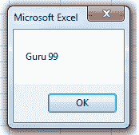
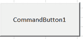
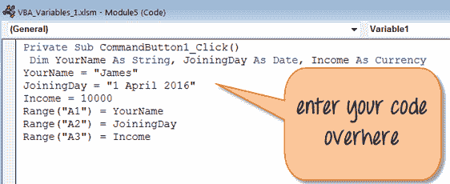
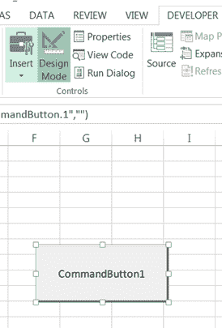
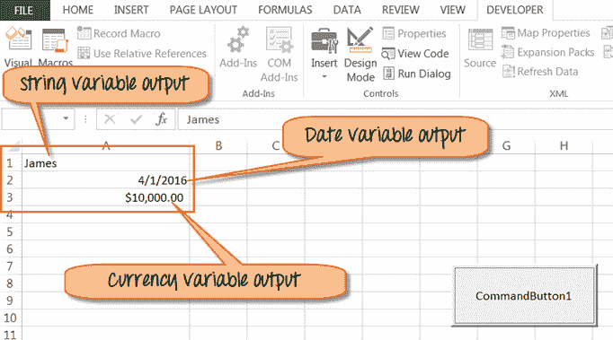

# Excel VBA 变量，数据类型&常量

> 原文： [https://www.guru99.com/vba-data-types-variables-constant.html](https://www.guru99.com/vba-data-types-variables-constant.html)

几乎所有计算机程序中都使用变量，VBA 也不例外。 在过程开始时声明变量是一个好习惯。 这不是必需的，但有助于识别内容的性质（文本，​​数据，数字等）

在本教程中，您将学习-

*   [VBA 变量](#1)
*   [VBA 数据类型](#2)
*   [VBA 中的常量](#3)

## VBA 变量

变量是存储在计算机内存或存储系统中的特定值。 以后，您可以在代码中使用该值并执行。 计算机将从系统中获取该值并显示在输出中。 必须为每个变量指定一个名称。

要在 VBA 中命名变量，您需要遵循以下规则。

*   不得超过 255 个字符
*   不允许有空格
*   它不能以数字开头
*   期间不允许

这是 VBA 中变量的有效名称和无效名称的一些示例。

| [ ](/images/vba/062416_1101_VBADataType1.png) **有效名称** | [ ](/images/vba/062416_1101_VBADataType2.png) **无效名称** |
| 我的手表 | My.Watch |
| 新车 1 | 1_NewCar（不以数字开头） |
| 员工 ID | 员工编号（不允许空格） |

在 VBA 中，我们需要在使用变量之前声明变量，方法是分配名称和数据类型。

在 VBA 中，变量是隐式或显式声明的。

*   **Implicitly**: Below is an example of a variable declared Implicitly.
    *   标签= Teacher99
    *   音量= 4
*   **显式**：以下是显式声明的变量的示例。 您可以在语法中使用“昏暗”关键字
    *   **昏暗** Num 为整数
    *   **昏暗**密码为字符串

VBA 变量与其他编程语言没有区别。 要在 VBA 中声明变量，请使用关键字**“ Dim”。**

VBA 变量的**语法**

要在 VBA 中声明变量，请键入 Dim，然后输入名称：

```
Sub Exercise ()
        Dim <name>
End Sub
```

在执行变量之前，我们必须在 Excel 中记录一个宏。 要记录宏，请执行以下操作-

**步骤 1）**：记录宏 1

**步骤 2）**：停止宏 1

**步骤 3）**：打开宏编辑器，在 Macro1 中输入变量代码

**步骤 4）**：执行宏 1 的代码

示例，对于 VBA 变量

```
Sub Macro1()
	Dim Num As Integer
	Num = 99
	MsgBox " Guru " & Num
End Sub

```

运行此代码时，您将在工作表中获得以下输出。



## Excel VBA 数据类型

计算机无法区分数字（1,2,3 ..）和字符串（a，b，c，..）。 为了进行区分，我们使用数据类型。

VBA 数据类型可以分为两种类型

*   **数值数据类型**

| **类型** | **储存空间** | **值范围** |
| 字节 | 1 个字节 | 0 至 255 |
| 整数 | 2 字节 | -32,768 至 32,767 |
| Long | 4 字节 | -2,147,483,648 至 2,147,483,648 |
| 单 | 4 bytes | -3.402823E + 38 至-1.401298E-45（负值）1.401298E-45 至 3.402823E + 38（正值）。 |
| 双 | 8 字节 | -1.79769313486232e + 308 至-4.94065645841247E-324 为负值 4.94065645841247E-324 至 1.79769313486232e + 308 为正值。 |
| 货币 | 8 bytes | -922,337,203,685,477.5808 至 922,337,203,685,477.5807 |
| 小数 | 12 字节 | +/- 79,228,162,514,264,337,593,543,950,335（如果不使用小数点）+/- 7.9228162514264337593543950335（小数点后 28 位） |

*   **非数值数据类型**

| **数据类型** | **使用的字节数** | **值范围** |
| 字符串（固定长度） | 字符串长度 | 1 至 65,400 个字符 |
| 字符串（可变长度） | 长度+ 10 个字节 | 0 至 20 亿个字符 |
| 布尔型 | 2 bytes | 对或错 |
| 日期 | 8 bytes | 100 年 1 月 1 日至 9999 年 12 月 31 日 |
| 目的 | 4 bytes | 任何嵌入式对象 |
| 变体（数字） | 16 字节 | 任何与 Double 一样大的值 |
| 变体（文字） | 长度+ 22 个字节 | 与可变长度字符串相同 |

在 VBA 中，如果未指定**数据类型，它将自动将变量声明为 Variant。**

让我们看一个有关如何在 VBA 中声明变量的示例。 在此示例中，我们将声明三种类型的变量字符串，即连接日期和货币。

**步骤 1）**就像在上一个教程中一样，我们将在我们的 Excel 工作表中插入 commandButton1。



**步骤 2）**在下一步中，右键单击按钮，然后选择查看代码。 它将打开代码窗口，如下所示。



**步骤 3）**在此步骤中，

*   通过单击保存按钮  保存文件
*   然后在同一窗口中单击 Excel 图标  以返回 Excel 工作表。
*   您可以看到设计模式以绿色突出显示为“打开”



**步骤 4）**在单击命令按钮之前，关闭设计模式


**步骤 5）**关闭设计模式后，将单击 commandButton1。 它将显示以下变量作为我们在代码中声明的范围的输出。

*   Name
*   加盟日期
*   货币收入



## VBA 中的常量

常量就像变量一样，但是您不能对其进行修改。 要在 VBA 中声明常量，请使用关键字 **Const** 。

常数有两种类型，

*   应用程序提供的内置或内置的。
*   符号或用户定义

您可以将范围默认指定为**私有**或**公共**。 例如，

年公共公休日= 365

私人监工工作日= 250

下载包含以上代码的 Excel

[下载上面的 Excel 代码](https://drive.google.com/uc?export=download&id=0ByI5-ZLwpo25Q0loZ2VFZ2tUNkU)

**摘要**：

*   变量是存储在计算机内存或存储系统中的特定值。
*   您可以在语法中使用“ Dim”关键字来显式声明变量
*   VBA 数据类型可以分为两种类型
    *   数值数据类型
    *   非数值数据类型
*   在 VBA 中，如果未指定数据类型。 它将自动将变量声明为 Variant
*   常量就像变量一样，但是您不能对其进行修改。 要在 VBA 中声明常量，请使用关键字 **Const** 。