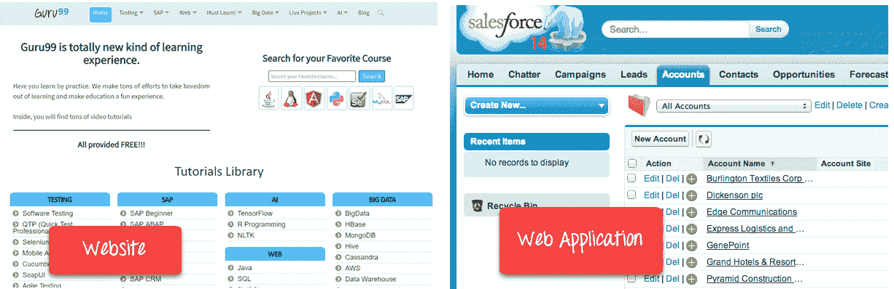

# 网站和 Web 应用程序之间的区别

> 原文： [https://www.guru99.com/difference-web-application-website.html](https://www.guru99.com/difference-web-application-website.html)

## 什么是网站？

网站是一组具有单个域名的可全局访问的，相互链接的网页。 它可以由个人，企业或组织开发和维护。 该网站旨在满足各种目的。 示例：博客。

网站托管在单个或多个 Web 服务器上。 可通过互联网（如 Internet）或专用局域网（通过 IP 地址）进行访问。

在本教程中，您将学习，

*   [什么是网站？](#1)
*   [什么是 Web 应用程序？](#2)
*   [为什么需要一个网站？](#3)
*   [为什么需要 Web 应用程序？](#4)
*   [网站](#5)的功能
*   [网络应用程序](#6)的功能
*   [Web 应用程序与网站](#7)
*   [网站](#8)的劣势
*   [Web 应用程序的缺点](#9)

## 什么是 Web 应用程序？

Web 应用程序是可以使用任何 Web 浏览器访问的软件或程序。 它的前端通常使用主要浏览器支持的语言（例如 HTML，CSS，Javascript）创建。 尽管后端可以使用 LAMP，MEAN 等任何编程堆栈。与移动应用程序不同，没有用于开发 Web 应用程序的特定 SDK。

随着软件即服务（SaaS）运动的到来，Web 应用程序引起了人们的关注。

## 为什么需要一个网站？

以下是您需要网站的主要原因：

*   展示您的产品和服务的有效方法
*   开发网站可帮助您创建社交证明
*   帮助您建立业务品牌
*   帮助您实现业务目标
*   让您增加客户支持

## 为什么需要 Web 应用程序？

Web 应用程序之所以流行，是因为以下原因：

*   与桌面应用程序相比，Web 应用程序在整个应用程序中使用相同的代码，因此更易于维护。 没有兼容性问题。
*   Web 应用程序可以在任何平台上使用：Windows，Linux，Mac…，因为它们都支持现代浏览器。
*   Web 应用程序不需要移动应用商店批准。
*   随时以任何形式发布。 无需提醒用户更新其应用程序。
*   您一年 365 天，每天 24 小时均可从任何 PC 上访问这些 Web 应用程序。
*   您可以使用计算机或移动设备来访问所需的数据。
*   Web 应用程序是任何组织的一种经济高效的选择。 台式机软件的席位许可价格昂贵，而 SasS 通常随用随付。
*   基于 Web 的应用程序是支持 Internet 的应用程序，可通过移动设备的 Web 浏览器进行访问。 因此，您不需要下载或安装它们。

<figure style="margin-left: auto;margin-right: auto;">

Guru99 is a website while Salesforce is a Web Application

## 网站的特征

*   质量和相关的 Web 内容可以丰富显示。
*   用户友好的导航和网页设计
*   可以使用 Google 等搜索引擎轻松搜索。

## Web 应用程序的特征

*   云托管且高度可扩展
*   多为跨平台
*   模块化和松散耦合
*   它可以通过自动化测试轻松进行测试。

## Web 应用程序与网站

以下是 Web 应用程序与网站之间的主要区别：

| **参数** | **Web 应用程序** | **网站** |
| --- | --- | --- |
| 专为 | Web 应用程序旨在与最终用户进行交互 | 网站主要由静态内容组成。 所有访客都可以公开访问。 |
| 用户互动 | 在 Web 应用程序中，用户不仅可以读取页面内容，还可以处理受限数据。 | 网站提供视觉&文本内容，用户可以查看和阅读，但不影响其功能。 |
| 认证方式 | Web 应用程序需要身份验证，因为它们提供的选择范围比网站要广泛得多。 | 信息性网站不强制要求进行身份验证。 用户可能会要求注册以获得常规更新或访问其他选项。 未注册的网站访问者无法使用此功能。 |
| 任务与复杂性 | 与网站相比，Web 应用程序的功能要高得多且复杂。 | 该网站在特定页面上显示收集的数据和信息。 |
| 软件种类 | Web 应用程序开发是网站的一部分。 它本身不是一个完整的网站。 | 该网站是一个完整的产品，您可以在浏览器的帮助下进行访问。 |
| 汇编 | 在部署之前，必须对站点进行预编译 | 该网站无需预先编译 |
| 部署方式 | 所有更改都需要重新编译和部署整个项目。 | 较小的更改永远不需要完全重新编译和部署。 您只需要更新 HTML 代码。 |

## 网站的缺点

*   网站可能会崩溃，这对任何人都不利。 这是您业务的最大弊端
*   在您的网站上发布的联系表可能会邀请许多垃圾电子邮件。
*   如果未定期更新，则任何网站上的信息可能都不可靠。

## Web 应用程序的缺点

*   无法保证安全性，因此容易受到未经授权的访问。
*   该 Web 应用程序可能不支持具有相同优先级的多个浏览器。
*   Web 应用程序是为特定操作系统显式构建的，因此很难从应用程序商店中发现。
*   访问设备功能的范围有限。

## 摘要：

*   网站是一组具有单个域名的可全局访问的，相互链接的网页。
*   Web 应用程序是可以使用任何 Web 浏览器访问的软件或程序。
*   开发您的网站可帮助您建立业务品牌。
*   Web 应用程序不需要 App Store 批准
*   质量和相关的 Web 内容是好的网站的最重要特征。
*   由云托管和高度可扩展性是好的 Web 应用程序最重要的特征。