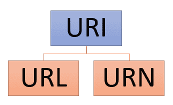
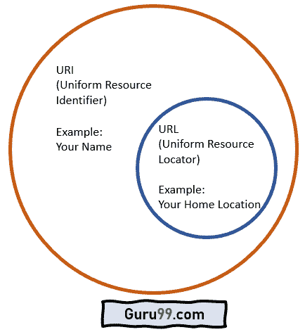

# URL 与 URI：您必须知道的最重要的区别

> 原文： [https://www.guru99.com/url-vs-uri-difference.html](https://www.guru99.com/url-vs-uri-difference.html)

## URL 是什么？

URL 是用于检索计算机网络上资源的文档和协议的全局地址。 URL 相对于网页（HTTP）最为常见，但也可用于通过 JDBC，电子邮件（mailto），文件传输（FTP）和许多其他应用程序进行数据库访问。 URL 代表统一资源定位符。

在此网址中。 URI 教程，您将学习：

*   [URL 是什么？](#1)
*   [什么是 URI？](#2)
*   [URI 和 URL 的 Ven 图](#3)
*   URL 的[语法](#4)
*   [URI 的语法](#5)
*   [对 URN 的困惑](#6)
*   [为什么使用 URL？](#7)
*   [为什么使用 URI？](#8)
*   [URL 与。 URI](#9)

## 什么是 URI？

URI 是一个字符串，其中包含标识物理或逻辑资源的字符。 URI 遵循语法规则以确保一致性。 此外，它还通过分层命名方案保持可扩展性。 URI 的完整形式是统一资源标识符。




Types of URI


如上图所示，URI 有两种类型：

1.  **URL**： URL 指定计算机网络上的位置及其检索技术。
2.  **URN**：统一资源名称（URN）是指定 URN 方案的 Internet 资源。

## URI 和 URL 的 Ven 图




Ven diagram of URI and URL


如上图所示，“您的名字”可以是 URI，因为它可以识别您。 它不能为 URL，因为它不能帮助任何人找到您的家庭位置。

另一方面，“您的家庭位置”可以是 URI 以及 URL。 原因既可以识别您的身份，又可以为您提供家庭住所。

## URL 的语法

这是 URL 的语法：

**http://www.domainname.com/folder-name/web page-file-name.htm**

我们可以将上述网址分为以下几部分：

*   **协议**：它是 URL 的第一部分。 在这里，协议名称是超文本传输​​协议（HTTP）。
*   **http://www.domainname.com/**：这是您的域名。 也称为服务器 ID 或主机。
*   **/ folder-name /**：它表示 Web 服务器上给定文件夹中“已归档”引用的网站页面。
*   **网页文件名.htm**：实际上是一个网页文件名。 “ .htm”是 HTML 文件的扩展名，表明该文件是静态网页。 文件名可以具有不同的扩展名，或者取决于您如何设置 Web 服务器。 根本没有扩展名，URL 可以以斜线（/）结尾。

**示例**：

此示例 URL 有一个文件夹，但没有扩展名

```
https://career.guru99.com/category/heavy-industries/
```

此示例 URL 没有文件夹

```
https://www.guru99.com/what-is-sap.html
```

此示例网址无扩展名

```
https://career.guru99.com/top-33-investment-banking-interview-questions-answers/
```

## URI 的语法

这是 URI 的语法：

**URI = scheme：[// authority] path [？query] [＃fragment]**

URI 包括以下部分：

*   **Scheme component**: It is a non-empty component followed by a colon (:). Scheme contains a sequence of characters starting with a letter and followed by any combination of digits, letters, period (.), hyphen (-), or plus (+).

    众所周知的方案的示例包括 HTTP，HTTPS，mailto，文件，FTP 等。URI 方案必须在 Internet 号码分配机构（IANA）中注册。

*   **授权组件**：这是一个可选字段，其前面带有//。 它包括

1.  可选的 userinfo 子组件，可能由用户名和密码组成（可选）。
2.  包含 IP 地址或注册名称的主机子组件。
3.  可选端口子组件，后跟冒号（:)

*   **路径**：路径包含一系列由斜杠分隔的段。
*   **查询组件**：它是可选的，并在前面带有问号（？）。 查询组件包含非分层数据的查询字符串。
*   **片段组件**：这是一个可选字段，并在其后加上一个哈希（＃）。 片段组件包括片段标识符，该片段标识符给出了辅助资源的方向。

**URI** 的示例

未提及协议

```
www.guru99.com

```

未提及网域

```
what-is-sap.html

```

协议提及

```
ldap://[2001:db8::7]/c=GB?objectClass?one
mailto:This email address is being protected from spambots. You need JavaScript enabled to view it.

tel:+1-816-555-1212   
telnet://192.0.2.16:80/ 

```

## 关于 URN 的困惑

关于 URN，如果您实现诸如 https，ftp 等协议，则存在混淆，即使它是 URI，也被称为 URL。

这种争论的问题在于，适当的 [RFC](https://www.ietf.org/rfc/rfc2141.txt) 非常密集，有时甚至是矛盾的。 例如，RFC 3986 表示，URI 可以是名称，定位符或两者都可以。

## 为什么使用 URL？

以下是使用 URL 的重要原因：

*   URL 中写的信息使您只需单击一下鼠标即可从一个网页切换到另一个网页。
*   URL 告诉您如何访问特定资源。
*   每当您在浏览器中键入 URL 或单击任何超文本链接时，Web 浏览器都会向 Web 服务器发送请求以下载一个或多个文件。
*   每个 URL 都是唯一的，并且标识一个特定文件。
*   网站 URL 或域是网站最重要的部分之一。 通过使用通常以.org，.com 或.net 结尾的简单单词或字符串，您将能够吸引网站访问量。

## 为什么使用 URI？

以下是使用 URI 的重要原因：

*   统一资源标识符对于语义 Web 是必不可少的，因为它可以防止歧义。
*   URI 会以统一格式搜索名称或资源或文件的位置。
*   它具有用于特定文件名和路径的字符串。
*   URI 提供了一种方法，供其他系统通过万维网或网络访问资源。 Web 浏览器和 P2P（对等）文件共享软件使用它来查找和下载文件。
*   URI 允许在不影响旧文件的情况下定义新文件类型。
*   您可以分配单个资源以与多个表示形式关联。

## URLVs。 URI


这是 URL 和 URI 之间的主要区别：

| **网址** | **URI** |
| URL 代表统一资源定位符。 | URI 代表统一资源标识符。 |
| URL 是 URI 的子集，用于指定资源的位置以及检索资源的机制。 | URI 是 URL 的超集，它通过 URL 或 URN（统一资源名称）或两者来标识资源。 |
| 主要目的是获取资源的位置或地址 | URI 的主要目的是查找资源，并使用名称或位置将其与其他资源区分开。 |
| URL 仅用于定位网页 | 用于 HTML，XML 和其他文件 XSLT（可扩展样式表语言转换）等。 |
| 该方案必须是 HTTP，FTP，HTTPS 等协议。 | 在 URI 中，方案可以是协议，规范，名称等之类的东西。 |
| 协议信息在 URL 中给出。 | URI 中没有给出协议信息。 |
| 网址示例： [https://google.com](https://google.com) | URI 的示例：urn：isbn：0-486-27557-4 |
| 它包含诸如协议，域，路径，哈希，查询字符串等组件。 | 它包含诸如方案，权限，路径，查询，片段组件等组件。 |
| 所有网址都可以是 URI | 并非所有 URI 都是 URL，因为 URI 可以是名称而不是定位符。 |

## 关键区别：

*   URL 是 URI 的子集，用于指定资源存在的位置以及检索资源的机制，而 URI 是用于标识资源的 URL 的超集。
*   URL 的主要目的是获取资源的位置或地址，而 URI 的主要目的是查找资源。
*   URL 仅用于定位网页，而 HTML，XML 和其他文件中使用 URI。
*   URL 包含协议，域，路径，哈希，查询字符串等组件，而 URI 包含方案，权限，路径，查询等组件。
*   URL 的示例是： [https://google.com](https://google.com) ，而 URI 的示例是：urn：isbn：0-486-27557-4。