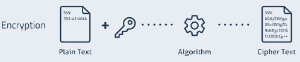
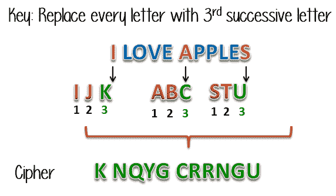

# 加密与解密：有什么区别？

> 原文： [https://www.guru99.com/difference-encryption-decryption.html](https://www.guru99.com/difference-encryption-decryption.html)

之前，我们了解了加密与解密，让我们先了解一下-

## 什么是密码术？

密码术用于在通信期间保护和保护数据。 防止未经授权的个人或用户组访问任何机密数据很有帮助。 加密和解密是密码学的两个基本功能。

通过网络发送的消息将转换为无法识别的加密消息，称为数据加密。 在接收端，接收到的消息被转换为其原始形式，称为解密。

在本教程中，您将学习

*   [什么是密码术？](#1)
*   [加密是什么意思？](#2)
*   [解密是什么意思？](#3)
*   [为什么使用加密和解密？](#4)
*   [键的类型](#5)
*   [加密和解密之间的区别](#6)

## 加密是什么意思？

加密是将原始信息转换为无法识别的形式的过程。 消息的这种新形式与原始消息完全不同。 这就是为什么黑客无法通过发送者使用加密算法来读取数据的原因。 加密通常使用密钥算法来完成。

数据被加密以使其不被窃取。 但是，许多知名公司还对数据进行加密，以保持其商业竞争者的机密。

<figure style="margin-left: auto;margin-right: auto;">

 

加密过程

## 解密是什么意思？

解密是一种以人类或计算机可读和理解的形式转换编码/加密数据的过程。 通过手动取消加密文本或使用用于加密原始数据的密钥来执行此方法。

<figure style="margin-left: auto;margin-right: auto;">

 

解密过程

## 为什么使用加密和解密？

以下是使用加密的重要原因：

*   帮助您保护您的机密数据，例如密码和登录 ID
*   提供私人信息的机密性
*   帮助您确保文档或文件没有被更改
*   加密过程还可以防止窃并保护 IP
*   有助于进行网络通信（例如互联网），并且黑客可以在其中轻松访问未加密的数据。
*   这是一种必不可少的方法，因为它可以帮助您安全地保护您不希望其他人访问的数据。

## 按键类型

### 对称密钥：

对称密钥加密是使用相同的加密密钥进行明文加密和密文解密的算法。

### 非对称密钥：

非对称加密使用 2 对密钥进行加密。 公钥对任何人都可用，而秘密密钥仅对消息的接收者可用。 这引导了安全性。

### 公钥：

公钥密码术是一种基于两对密钥的加密系统。 公共密钥用于加密接收者的消息。

### 私钥：

私有密钥可以是公共/私有非对称密钥对的一部分。 它可以用于非对称加密，因为您可以使用同一密钥来加密和解密数据。

### 预共享密钥：

在密码术中，预共享密钥（PSK）是共享的机密，在使用之前，它曾在两方之间使用安全通道共享。

## 加密和解密之间的区别

| **参数** | **加密** | **解密** |
| --- | --- | --- |
| 什么是 | 这是将普通数据转换为不可读形式的过程。 它可以帮助您避免任何未经授权的数据访问 | 它是一种将无法读取/编码的数据转换为其原始格式的方法。 |
| 处理 | 每当在两台单独的计算机之间发送数据时，都会使用密钥自动对其进行加密。 | 数据的接收者自动允许您将数据从代码转换为原始格式。 |
| 转换地点 | 将数据发送到目的地的人。 | 接收器接收数据并将其转换。 |
| 例 | 员工正在向其经理发送基本文件。 | 经理正在从其员工那里收到基本文件。 |
| 使用算法 | 具有相同密钥的相同算法用于加密-解密过程。 | 唯一的单一算法用于通过一对密钥进行加密和解密，其中每个密钥用于加密和解密。 |
| 主要功能 | 将人类可以理解的消息转换为无法理解的难以理解和模糊的形式。 | 它是将晦涩的信息转换为易于理解的形式。 |

## 摘要

*   密码术用于在通信期间保护和保护数据。
*   加密是将原始信息转换为无法识别的形式的过程。
*   解密是一种以人类或计算机可读和理解的形式转换编码/加密数据的过程。
*   加密方法可帮助您保护您的机密数据，例如密码和登录 ID。
*   公共，专用，预共享和对称是加密中使用的重要密钥。
*   员工将基本文件发送给他/她的经理是加密方法的一个示例。
*   经理正在从其员工那里接收必要的加密文档，并将其解密是解密方法的一个示例。

## 关键区别

*   加密是将普通数据转换为不可读形式的过程，而解密是将不可读/编码数据转换成其原始形式的方法。
*   加密是由将数据发送到目的地的人员完成的，但是解密是由接收数据的人员完成的。
*   具有相同密钥的相同算法用于两个加密-解密过程。