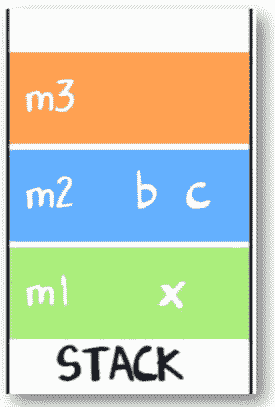
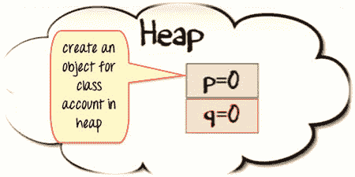

# 堆叠与堆：了解差异

> 原文： [https://www.guru99.com/stack-vs-heap.html](https://www.guru99.com/stack-vs-heap.html)

## 什么是堆栈？

堆栈是计算机内存的一个特殊区域，用于存储由函数创建的临时变量。 在堆栈中，在运行时声明，存储和初始化变量。

它是一个临时存储内存。 计算任务完成后，变量的内存将被自动擦除。 堆栈部分主要包含方法，局部变量和引用变量。

在本教程中，您将学习，

*   [什么是堆栈？](#1)
*   [什么是堆？](#2)
*   [堆栈和堆之间的关键区别](#3)
*   [使用堆栈](#4)的优势
*   [使用堆](#5)的优势
*   [使用堆栈](#6)的缺点
*   [使用堆](#7)的缺点
*   [何时使用堆或堆栈？](#8)

## 什么是堆？

堆是编程语言用来存储全局变量的内存。 默认情况下，所有全局变量都存储在堆内存空间中。 它支持动态内存分配。

不会自动为您管理堆，CPU 也不会对其进行严格管理。 它更像是一个自由浮动的内存区域。

## 堆栈和堆之间的关键区别

| **参数** | **堆栈** | **堆** |
| --- | --- | --- |
| 数据结构类型 | 堆栈是线性数据结构。 | 堆是分层数据结构。 |
| 存取速度 | 高速存取 | 比堆栈慢 |
| 空间管理 | 操作系统可有效管理空间，因此内存永远不会碎片化。 | 堆空间使用效率不高。 内存可能会变得碎片化，因为首先分配然后释放的内存块。 |
| 访问 | 仅局部变量 | 它允许您全局访问变量。 |
| 空间大小的限制 | 堆栈大小限制取决于操作系统。 | 对内存大小没有特定限制。 |
| 调整大小 | 变量无法调整大小 | 变量可以调整大小。 |
| 内存分配 | 内存在连续的块中分配。 | 内存以任何随机顺序分配。 |
| 分配和解除分配 | 由编译器指令自动完成。 | 它是由程序员手动完成的。 |
| 解除分配 | 不需要取消分配变量。 | 需要显式取消分配。 |
| 成本 | 减 | 更多 |
| 实作 | 可以使用基于内存的动态数组和基于链表的简单数组三种方式实现堆栈。 | 可以使用数组和树来实现堆。 |
| 主要问题 | 内存不足 | 内存碎片 |
| 参考地点 | 自动编译时间指令。 | 充足 |
| 灵活性 | 固定尺寸 | 可以调整大小 |
| 访问时间 | 快点 | 慢点 |

## 使用堆栈的优势

这里是使用堆栈的优点/好处：

*   帮助您以“后进先出”（LIFO）方法管理数据，这是“链接列表”和“数组”无法实现的。
*   调用函数时，局部变量存储在堆栈中，一旦返回，它将自动销毁。
*   当未在该函数外部使用变量时，将使用堆栈。
*   它使您可以控制内存的分配和释放方式。
*   堆栈会自动清理对象。
*   不容易损坏
*   变量无法调整大小。

## 使用堆的优点

使用堆内存的优点/好处是：

*   堆可以帮助您找到最大和最小数量
*   垃圾回收在堆内存上运行以释放对象使用的内存。
*   优先级队列中也使用了堆方法。
*   它允许您全局访问变量。
*   堆对内存大小没有任何限制。

## 使用堆栈的缺点

使用堆栈存储器的缺点/缺点是：

*   堆栈内存非常有限。
*   在堆栈上创建太多对象会增加堆栈溢出的风险。
*   随机访问是不可能的。
*   变量存储将被覆盖，这有时会导致函数或程序的不确定行为。
*   堆栈将落在内存区域之外，这可能导致异常终止。

## 使用堆的缺点

使用堆内存的缺点/缺点是：

*   它可以提供操作系统可以提供的最大内存
*   计算需要更多时间。
*   内存管理在堆内存中更为复杂，因为它是全局使用的。
*   与堆栈相比，执行需要花费太多时间。

## 何时使用堆或堆栈？

当您需要分配大块内存时，应使用堆。 例如，您要创建一个大型数组或大型结构，以使该变量保持较长时间，然后应将其分配到堆上。

但是，如果您正在使用相对较小的变量，则仅在使用它们的函数处于活动状态之前才需要。 然后，您需要使用堆栈，它更快，更容易。

## 关键区别

*   堆栈是线性数据结构，而堆是分层数据结构。
*   堆栈内存永远不会变得零碎，而堆内存可能会变得零碎，因为先分配然后释放内存块。
*   堆栈仅在堆允许您全局访问变量时访问局部变量。
*   堆栈变量不能调整大小，而堆变量可以调整大小。
*   堆栈内存按连续块分配，而堆内存按任意随机顺序分配。
*   堆栈不需要取消分配变量，而在堆中则需要取消分配。
*   堆栈分配和取消分配由编译器指令完成，而堆分配和取消分配由程序员完成。