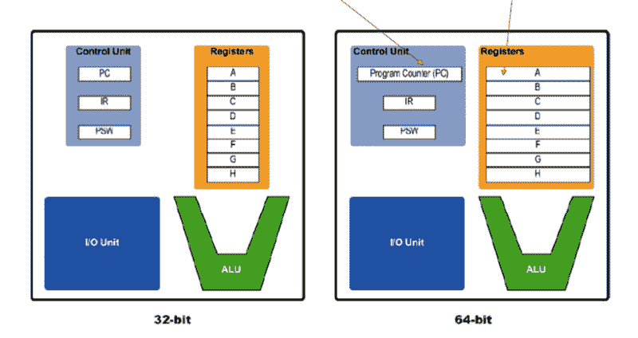

# 32 位和 64 位：主要区别

> 原文： [https://www.guru99.com/32-bit-vs-64-bit-operating-systems.html](https://www.guru99.com/32-bit-vs-64-bit-operating-systems.html)

## 什么是 32 位？

32 位是一种能够传输 32 位数据的 CPU 体系结构。 它是您的 CPU 在执行操作时可以处理的信息量。

在本教程中，您将学习

*   [什么是 32 位？](#1)
*   [什么是 64 位？](#2)
*   [32 位与 64 位之间的差异](#3)
*   [32 位处理器](#4)的优势
*   [64 位处理器](#5)的优势
*   [32 位处理器](#6)的缺点
*   [64 位处理器](#7)的缺点
*   [我应该升级到 64 位计算机吗？](#8)

## 什么是 64 位？

在计算机体系结构中，64 位是指应并行处理或传输的位数，或用于数据格式中单个元素的位数。 64 位微处理器允许计算机处理以 64 位表示的数据和内存地址。

## 32 位的历史

这里是 32 位处理器历史上的重要里程碑：

*   32 位处理器是 1990 年代初期在世界范围内广泛使用的主处理器。
*   在 2000 年，AMD 处理器和 Intel Pentium 处理器也开始使用 32 位处理器。

## 64 位的历史

这是 64 位处理器历史上的重要里程碑：

*   自 1970 年代以来，64 位 CPU 已在超级计算机中使用。
*   1990 年代初，它用于基于 RISC（精简指令集计算）的工作站和服务器。
*   第一个基于 AMD64 的处理器 Opteron 于 2003 年 4 月发布。
*   针对智能手机和平板电脑的 ARM 架构于 2013 年 9 月首次销售

## 32 位和 64 位操作系统之间的差异

32 位和 64 位处理器之间的区别是：

| **参数** | **32 位处理器** | **64 位处理器** |
| 可寻址空间 | 它具有 4 GB 的可寻址空间 | 64 位处理器具有 16 GB 的可寻址空间 |
| 应用支持 | 64 位应用程序和程序将无法运行 | 32 位应用程序和程序将运行 |
| 操作系统支持 | 需要一个 32 位操作系统。 | 它可以在 32 位和 64 位操作系统上运行。 |
| 支持多任务 | 不是压力测试和多任务处理的理想选择。 | 最适合执行多任务和压力测试。 |
| 操作系统和 CPU 要求 | 32 位操作系统和应用程序需要 32 位 CPU | 64 位 OS 需要 64 位 CPU，而 64 位应用程序需要 64 位 OS 和 CPU。 |
| 系统可用 | 支持 Windows 7、8 Vista，XP 和 Linux。 | Windows XP Professional，Windows Vista，Windows 7，Windows 8，Windows 10，Linux 和 Mac OSX。 |
| 内存限制 | 32 位系统限于 3.2 GB RAM 32 位 Windows。 它解决了限制，使您无法使用完整的 4GB 物理内存空间。 | 64 位系统将使您能够存储多达 170 亿 GB 的 RAM。 |

## 32 位处理器的优势

这是 32 位处理器的重要优点\优点：

*   可以提及的唯一优点是，它与 2000 年初和 1990 年底开发的所有较旧的设备兼容。

## 64 位处理器的优势

这是使用 64 位处理器的好处\优点：

*   提高程序性能，并帮助您利用 64 位操作系统
*   增强的安全功能
*   具有现代 64 位处理器的 Windows 64 位使您能够获得 32 位用户不可用的附加保护。
*   64 位处理器提供安全保护，而不仅限于硬件内核补丁保护。
*   64 位处理器使您可以创建 16TB 的虚拟内存。 尽管为用户进程分配了 8 TB 的空间，但保留了 8 TB 的空间来执行内核进程。
*   64 位处理器提供高级功能。 它允许您存储 264 个计算值。
*   一台 64 位计算机上最多可能有 16.8 TB 的 RAM。
*   64 位处理器提供双核，六核，四核和八核版本
*   多核支持可帮助您增加可以执行的计算数量，这可以提高处理能力，从而使计算机运行更快。
*   需要各种类型的软件才能平稳运行的软件程序可以在多核 64 位处理器上高效运行。
*   允许您访问每个进程的虚拟内存。

## 32 位处理器的缺点

以下是使用 32 位操作系统的重要利弊：

*   最大的缺点是供应商不再为 32 位操作系统开发应用程序。
*   许多处理器需要 64 位操作系统。
*   由于缺乏市场需求或其产品，制造商通常不为其硬件提供 32 位驱动程序版本。

## 64 位处理器的缺点

这是使用 64 位处理器的一些可能的缺点：

*   64 位驱动程序不太可能用于较旧的系统和硬件。
*   某些旧的 32 位软件无法顺利过渡到 64 位。

## 我应该升级到 64 位计算机吗？

如果您想更换旧计算机以获得更好的性能，并且您的软件与 64 位处理器兼容，则应更好地升级到 64 位计算机。

今天售出的大多数计算机都将配备 64 位处理器以及越来越多的 64 位版本可用的软件。 因此，您必须确保所需的所有软件都能够在 64 位版本上运行。

## 关键区别

*   32 位处理器具有 4 GB 的可寻址空间，而 64 位处理器具有 16 GB 的可寻址空间。
*   32 位系统限于 3.2 GB 的 RAM，而 64 位系统将使您能够存储多达 170 亿 GB 的 RAM
*   32 位处理器需要 32 位操作系统，而 64 位处理器可以在 32 或 64 个 64 位操作系统上运行。
*   32 位处理器不是压力测试和多任务处理的理想选择，而 64 位处理器最适合执行多任务和压力测试。
*   32 位操作系统和应用程序需要 32 位 CPU，而 64 位 OS 需要 64 位 CPU