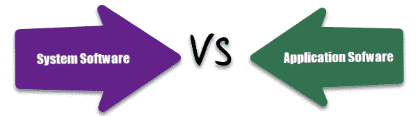

# 系统软件和应用程序软件之间的区别

> 原文： [https://www.guru99.com/difference-system-software-application-software.html](https://www.guru99.com/difference-system-software-application-software.html)

## 什么是系统软件？

系统软件是控制和管理计算机硬件操作的一组程序。 它还可以帮助应用程序正确执行。

系统软件旨在控制计算机系统的操作并扩展其处理功能。 系统软件使计算机的运行更加快捷，有效和安全。 示例：操作系统，编程语言，通讯软件等

在本教程中，您将学习：

*   [什么是系统软件？](#1)
*   [什么是应用程序软件？](#2)
*   [系统软件的类型](#3)
*   [应用程序软件](#4)的类型
*   [应用程序软件](#5)的功能
*   [系统软件的功能](#6)
*   [系统软件与应用程序软件](#7)

## 什么是应用程序软件？

应用程序软件是为用户做实际工作的程序。 它主要是为了执行用户的特定任务而创建的。

应用软件充当最终用户和系统软件之间的中介。 也称为应用程序包。 此类软件是使用高级语言（如 C，Java，VB）编写的。 网络等。它是特定于用户的，旨在满足用户的要求。

您也可以在单个系统软件上安装多个应用程序软件。 您可以将此类软件存储在 CD，DVD，闪存衍生产品或钥匙串存储设备上。 示例：文字处理，电子表格，数据库等

## 系统软件的类型

以下是重要的系统软件类型：

*   **操作系统：-**操作系统软件可帮助您有效利用计算机系统的所有硬件和软件组件。
*   **编程语言转换器：-**将开发人员以编程语言编写的指令转换为可以由计算机系统解释或编译和执行的形式。
*   **通信软件：-**通信软件使我们可以将数据和程序从一个计算机系统传输到另一个计算机系统。
*   **实用程序**：-实用程序是一组程序，可帮助用户进行系统维护任务和执行常规任务。

## 应用程序软件的类型

这里是一些重要的应用软件类型

*   **文字处理软件：-**它使用计算机来创建，修改，查看，存储，检索和打印文档。
*   **电子表格软件：-**电子表格软件是一种数字数据分析工具，可让您创建计算机分类帐。
*   **数据库软件：-**数据库软件是根据用户需求存储和检索的相关数据的集合。
*   **图形软件：-**它允许计算机系统创建，编辑，绘图，图形等。
*   **教育软件：-**教育软件允许将计算机用作学习和教学工具。
*   **娱乐软件：-**这种类型的应用程序允许将计算机用作娱乐工具。

## 应用程序软件的功能

应用软件的重要功能：

*   执行更专业的任务，例如文字处理，电子表格，电子邮件，照片编辑等。
*   它需要更大的存储空间，因为它更大
*   易于设计，用户更具交互性
*   通常以高级语言编写

## 系统软件功能

系统软件的重要功能是：

*   系统软件离系统更近
*   通常用低级语言编写
*   系统软件难以设计和理解
*   速度快
*   互动性较差
*   尺寸更小
*   难以操纵

## 系统软件与应用程序软件

这是系统软件和应用程序软件之间的主要区别：

| **系统软件** | **应用软件** |
| 它们旨在管理系统资源，例如内存和进程管理，安全性等。 | 它们旨在满足用户执行特定任务的要求。 |
| 它以机器或汇编语言等低级语言编写。 | 使用高级语言编写应用程序软件。 |
| 系统软件在系统打开电源时开始运行，并一直运行到系统关闭电源为止。 | 应用软件在用户开始时启动，在用户停止时结束。 |
| 系统软件是通用软件 | 应用软件是专用软件。 |
| 它分为包装程序或定制程序。 | 它分为分时共享，资源共享，客户端服务器。 |
| 在安装操作系统时安装在计算机系统上。 | 根据用户要求安装。 |
| 能够独立运行。 | 不能独立运行。 |
| 用户永远不会与系统软件交互，因为它在后台运行。 | 用户在使用特定应用程序时与应用程序软件进行交互。 |
| 系统软件独立于应用程序软件 | 应用程序软件需要系统软件才能运行。 |
| 系统软件对于系统的有效运行至关重要。 | 应用软件对于系统的功能并不是非常重要。 |

## 关键区别：

*   系统软件旨在管理系统资源，例如内存和流程管理，安全性等，而应用软件旨在满足用户执行特定任务的需求。
*   系统软件是通用软件，而应用软件是专用软件。
*   系统软件是用机器或汇编语言等低级语言编写的，而应用软件是用于编写应用程序软件的高级语言。
*   系统软件能够独立运行，而应用软件不能独立运行。
*   系统软件在系统开机时开始运行，并一直运行到系统关机为止，而在用户开始时应用程序软件启动，当用户停止时应用程序软件终止。
*   系统软件独立于应用程序软件，而应用程序软件需要系统软件才能运行。