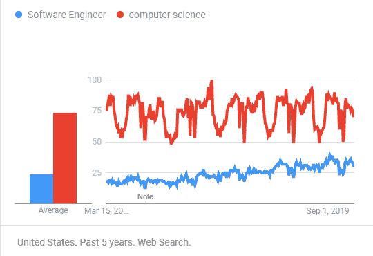
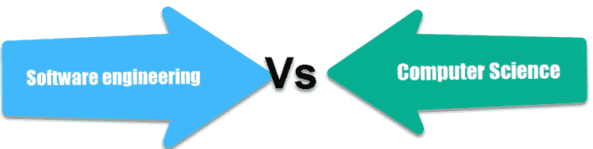

# 软件工程与计算机科学：简介&的差异

> 原文： [https://www.guru99.com/computer-science-vs-software-engineering.html](https://www.guru99.com/computer-science-vs-software-engineering.html)

## 什么是软件工程？

软件工程是分析用户需求，然后设计，构建和测试满足这些需求的软件应用程序的过程。

它涉及创建将在现实世界中使用的新软件。 您将需要与团队合作构建最终用户会从中受益的新应用程序。

在本教程中，您将学习：

*   [什么是软件工程？](#1)
*   [什么是计算机科学？](#2)
*   [为什么需要软件工程？](#3)
*   [为什么需要计算机科学？](#4)
*   [软件工程与计算机科学之间的区别](#5)
*   [软件工程的挑战](#6)
*   [计算机科学的挑战](#7)
*   [软件工程最佳实践](#8)
*   [计算机科学最佳实践](#9)

## 什么是计算机科学？

计算机科学是一门涉及计算机和计算过程的设计和理解的学科。 这是一个广泛的科学主题。 它包括研究如何处理数据，网络的安全性，组织数据库，人工智能等。

就像其他形式的科学一样，计算机科学对计算机和计算机编程采取一种抽象的方法。 它探讨了计算机如何根据算法和通过理论处理数据的计算工作。

## 为什么需要软件工程？

这里是使用软件工程方法的原因：

*   它使您可以提高软件产品的质量。
*   提高生产率&
*   为软件专业人员提供工作满意度。
*   它使您能够控制软件计划并有效地进行计划。
*   它有助于降低软件开发成本。
*   让您满足客户的需求和要求。
*   它可以帮助您系统有效地支持工程师的活动。

## 为什么需要计算机科学？

以下是使用计算机科学的原因：

*   它在研究，学习和行业参与方面的卓越成就享誉国际。
*   帮助您从数学和逻辑上学习基础计算机基础。
*   提供有关计算机实际功能的深入知识

## 软件工程与计算机科学之间的差异

以下是软件工程与计算机科学之间的重要区别：

| **参数** | **软件工程** | **计算机科学** |
| --- | --- | --- |
| 定义 | 软件工程定义为分析用户需求，然后设计，构建和测试软件应用程序的过程。 | 计算机科学是一门涉及计算机和计算过程的设计和理解的学科。 |
| 意义 | 软件工程是关于如何构建软件系统的研究。 | 计算机科学是对计算机如何执行理论和数学工作的研究。 |
| 选拔 | 如果要了解特定软件的构建和维护的整个生命周期，则应选择“软件工程”。 | 如果要进入 CS 的专业领域（如人工智能，机器学习，安全性或图形），则应选择“计算机科学”。 |
| 项目管理 | 软件工程专业的学生很可能会在本科和研究生课程中学习项目管理课程。 | 项目管理通常包含在计算机科学课程中。 通常是软件工程课程的一部分。 |
| 课程包括 | 在软件工程中，您还将学习编程语言和通用计算原理。 | 计算机科学专业的学生将学习如何在其他各种计算设备上存储，处理和应用数据。 |
| 范围 | 与软件工程相关的新兴职业取决于未来的软件和技术状况。 | 它是计算机科学领域，其中还包括云计算和 AI 技术的职业。 |
| 开发者 | 在美国，计算机科学家的平均工资为每年 103,643 美元。 | 软件工程师的平均工资为每年 107,932 美元。 |

## 软件工程的挑战

这是软件工程的一些重要挑战：

*   在诸如航天，航空，核电站等对安全至关重要的领域中，由于生命危险，软件故障的成本可能很高。
*   市场需求增加，以加快周转时间。
*   软件系统的多样性应该相互通信。

## 计算机科学的挑战

以下是计算机科学的一些重要挑战：

*   互联网的基础设施将需要更新以匹配“新互联网”。
*   越来越多的客户正在使用移动应用程序，因此对移动平台和云服务的同理心很重要。
*   到 2020 年，将有 1000 亿个对象连接到 Internet
*   专业人士将数据泄漏和敏感信息暴露视为最高关注点

## 软件工程的最佳实践

以下是软件工程师的一些最佳做法：

*   软件工程师应该采取对客户和雇主都有利的方式行事。
*   允许您开发软件产品和相关的修改，这些软件和软件应符合最高的专业标准。
*   它可以帮助您在其专业方法中保持诚信和独立性。
*   促进软件开发和维护的道德方法。

## 计算机科学最佳实践

以下是计算机科学专业人士的一些关键最佳实践：

*   进行增量更改。
*   仅在软件可以正常工作后对其进行优化。
*   文档设计和目的，而不是机制。
*   合作。

## 关键区别：

*   软件工程是分析，设计，构建和测试软件应用程序的过程，而计算机科学则涉及对计算过程的设计和理解。
*   软件工程是关于如何构建软件系统的研究，而计算机科学是关于计算机如何执行理论和数学任务的研究。
*   您应选择软件工程以了解特定软件的整体工作原理，而应选择计算机科学以了解 AI 和机器学习。
*   软件工程专业的学生可以参加有关项目管理的课程，而该课程通常包含在计算机科学课程中。