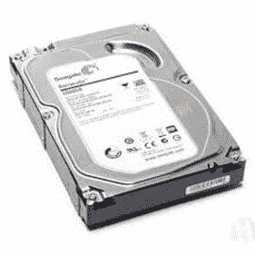
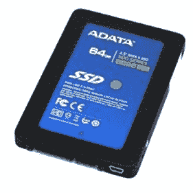

# SSD 与 HDD：选择哪一个？

> 原文： [https://www.guru99.com/ssd-vs-hdd.html](https://www.guru99.com/ssd-vs-hdd.html)

## 什么是 HDD？

HDD 利用磁性，使您可以将数据存储在旋转的磁盘上。 它具有一个读/写头，该头浮在旋转的磁盘上方，用于读取和写入数据。 磁盘旋转得越快，HDD 可以执行得越快。 HDD 还包括一个 I / O 控制器和固件，它们告诉硬件该怎么做并与其余系统通信。 完整的 HDD 形式是硬盘驱动器

在此 HDD vs.SDD 文章中，您将学到：

*   [什么是 HDD？](#1)
*   [什么是 SSD？](#2)
*   [硬盘如何工作？](#3)
*   [SSD 如何工作？](#4)
*   [HDD 和 SSD 之间的区别](#5)
*   [硬盘的优点](#6)
*   [SSD 的优势](#7)
*   [HDD 的缺点](#8)
*   [SSD 的缺点](#9)

## 什么是 SSD？

固态驱动器（ **SSD** ）是一种非易失性存储设备，可在固态闪存上不断存储和检索数据。 但是，此数据存储在互连的闪存芯片上，而不是存储在磁盘上，这使它们比 HDD 更快。 与 HDD 相比，它提供了更好的性能。

## 硬盘如何工作？

How Hard Drive Work

硬盘由存储数据的多个旋转磁片和在磁盘表面上移动的机械臂上的多个读/写头组成。

为了在盘片的某个扇区上读取或写入数据，磁头需要移动到适当的位置，然后在盘片旋转时需要等待该扇区通过它下面。

## SSD 如何工作？

How SSD works?

SSD 驱动器的工作原理与 HDD 完全不同。 它使用固态介质，通常为 NAND（通常称为闪存）。 控制器将数据写入 NAND 或从 NAND 读取数据，该控制器被视为设备的大脑。

使用 SSD 时，没有可变的寻道时间或旋转等待时间，因为可以在相同的时间内访问 SSD 的所有部分。 SSD 的读写速度不均匀，因此数据读取非常快，但是 SSD 的写入速度却很慢。 这是因为 SSD 存储由单独的 NAND 单元组成，这可以帮助您存储一位数据，并且单元组被组织为页面。 此外，页面组被组织成块。

## HDD 和 SSD 之间的区别

这是 HDD 与 SSD 之间的区别

| **硬盘驱动器** | **固态硬盘** |
| HDD 的读写时间更长。 | SSD 的读写时间较短。 |
| HDD 具有更高的延迟。 | SSD 具有较低的延迟。 |
| HDD 支持每秒更少的 I / O 操作（IOPS）。 | SSD 支持每秒更多的 I / O 操作（IOPS）。 |
| 在更长的时间内，随着更大的文件存储在 HDD 上，碎片的可能性很高。 | SSD 驱动器上不会发生碎片。 |
| HDD 具有各种不同的容量。 | SSD 驱动器提供有限的存储容量。 |
| HDD 代表硬盘驱动器。 | SSD 代表固态硬盘。 |
| HDD 的读取和写入数据速度较慢。 | SSD 读取和写入数据的速度更快。 |
| HDD 的重量更大。 | SDD 驱动器没有 HDD 驱动器，因为它们没有旋转磁盘主轴和镜像。 |
| HDD 驱动器的性能由于碎片而变差。 | SSD 驱动器性能永远不会受到碎片影响。 |
| HDD 的活动部件使它们容易因振动而崩溃和损坏。 | SSD 驱动器可以承受高达 2000Hz 的振动，这比 HDD 更大。 |
| HDD 包含移动的机械零件，例如手臂。 | SSD 不包含机械零件，仅包含 IC 之类的电子零件。 |
| HDD 驱动器更旧，更传统。 | SSD 是更新的存储驱动器类型。 |
| 硬盘驱动器会由于机械运动而产生噪音。 | SSD 不会产生噪音。 |
| 台式机和笔记本电脑的 HDD 通常为 3.5 英寸和 2.5 英寸。 | SDD 提供 2.5 英寸，1.8 英寸和 1.0 英寸两种尺寸，从而增加了计算机（尤其是台式机或服务器）中的可用空间。 |
| HDD 具有活动部件和磁性盘片。 随着更多的使用，它们很容易失败。 | SDD 驱动器没有活动部件。 随着用途的增多，它们失败的可能性也就较小。 |

## 硬盘的优点

以下是使用 HDD 的优点/好处：

*   它提供了很大的存储容量。
*   即使关闭计算机，存储的项目也不会丢失。
*   它固定在计算机内部，因此不会丢失。
*   计算机可以轻松地与他们进行通信。
*   它可以存储文本文档，图像，视频等数据。
*   HDD 设备可以存储操作系统文件和软件相关文件。
*   它的尺寸非常小，并且便于携带。
*   与 SSD 相比，它们更便宜。

## SSD 的优势

以下是使用 SSD 驱动器的优缺点：

*   SSD 驱动器提供 35 到 100 微秒的访问速度。 因此，它的性能是 HDD 的 100 倍
*   SSD 具有更轻巧的组件或活动部件，因为它们对移动设备更友好，并且更适合持续行驶。
*   SSD 驱动器坚固耐用
*   SDD 使用闪存存储数据，从而提供更高的可靠性

## 硬盘的缺点

以下是使用 HDD 的缺点/缺点：

*   如果硬盘崩溃，计算机将无法工作。
*   如果 HDD 驱动器崩溃/损坏，您将丢失重要数据。
*   在硬盘故障的情况下，很难执行数据恢复。
*   常规的“磁头”可能会崩溃，从而损坏磁盘表面。
*   硬盘固定在计算机内部，因此您无法转移到另一台计算机。

## SSD 的缺点

这里是使用 SSD 的缺点/缺点

*   SDD 的前期成本比 HDD 高得多
*   SSD 可以将数据写入，擦除和重写到驱动器的一部分的次数有限。
*   SSD 的最大容量是有限的。 但是，闪存的进步不断提高了 SSD 的存储容量。

## 关键区别：

*   HDD 读取和写入数据的速度较慢，而 SSD 读取和写入数据的速度较快。
*   HDD 具有较高的延迟，而 SSD 具有较低的延迟。
*   HDD 支持每秒更少的 I / O 操作（IOPS），而 SSD 支持每秒更多的 I / O 操作（IOPS）。
*   另一方面，HDD 会由于机械运动而产生噪音，而 SSD 不会产生此类噪音。
*   HDD 的移动部件使它们容易遭受崩溃和损坏，但 SSD 驱动器可以承受高达 2000Hz 的振动。
*   HDD 代表硬盘驱动器，SSD 代表固态驱动器。

## 选择哪一个？

如果价格不受限制，我们的投票将投给 SSD。 它们超快速，耐用，可靠。

如果您的应用程序需要大量存储而又没有频繁的读写操作（例如，归档/备份），请使用 HDD。

尽管 SSD 是我们的第一选择