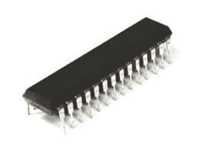

# SRAM 与 DRAM：了解差异

> 原文： [https://www.guru99.com/sram-vs-dram-difference.html](https://www.guru99.com/sram-vs-dram-difference.html)

在首先了解 SDRAM 和 DRAM 之前，我们需要了解 RAM

## 什么是 RAM？

当关闭 PC 或笔记本电脑的电源时，存储在此类存储器中的信息将会丢失。 可以在 BIOS 的帮助下检查 RAM 中存储的信息。 通常被称为计算机系统的主存储器或临时存储器或高速缓存存储器或易失性存储器。 RAM 的完整形式是随机存取存储器。

RAM 主要有两种

1.  耻辱
2.  戏剧。

在本教程中，您将学习：

*   [什么是 RAM？](#1)
*   [什么是 SRAM？](#2)
*   [什么是 DRAM？](#3)
*   [SRAM](#4) 的特性
*   [DRAM](#5) 的特性
*   [SRAM 和 DRAM](#6) 之间的差异
*   [SRAM](#7) 的优势
*   [DRAM](#8) 的优点
*   [SRAM](#9) 的缺点
*   [DRAM](#10) 的缺点

## 什么是 SRAM？

SRAM image

SRAM 是一种半导体存储器，它使用双稳态锁存电路来存储每个位。 在这种类型的 RAM 中，使用六个晶体管存储单元存储数据。 静态 RAM 通常用作处理器（CPU）的缓存。

SRAM 相对比其他 RAM 类型（例如 DRAM）要快。 它还消耗更少的功率。 SRAM 的完整形式是静态随机存取存储器。

## 什么是 DRAM？

DRAM image

它是一种 RAM，可让您将数据的每个位存储在特定集成电路内的单独电容器中。

它是任何现代台式计算机的标准计算机内存。 DRAM 的完整形式是动态随机存取存储器。

DRAM 是使用电容器和一些晶体管构建的。 在这种类型的 RAM 中，电容器用于存储数据，其中位值表示电容器已充电，而位值 0 表示电容器已放电。

## SRAM 的特性

这里是 SRAM 的重要特征

*   SRAM 比 DRAM 快
*   价格比 DRAM 高出几倍
*   比 DRAM 占用更多的空间
*   比 DRAM 消耗更多功率
*   用法：1 级或 2 级缓存
*   与 DRAM 相比，周期时间要短得多，因为它不需要在两次访问之间暂停。
*   它通常仅用作内存缓存

## DRAM 的特性

这里是 DRAM 的重要特征

*   高性价比
*   数据寿命短
*   需要刷新
*   比 SRAM 慢
*   耗电量少

## SRAM 和 DRAM 之间的区别

这里是 SRAM 与 DRAM 之间的区别

| **SRAM** | **DRAM** |
| SRAM 的访问时间较短，比 DRAM 更快。 | DRAM 具有更长的访问时间。 它比 SRAM 慢。 |
| SRAM 比 DRAM 贵。 | 与 SRAM 相比，DRAM 的成本更低。 |
| SRAM 需要恒定的电源，这意味着它消耗更多的功率。 | DRAM 要求减少功耗，因为信息存储在电容器中。 |
| SRAM 提供低封装密度。 | DRAM 提供高封装密度。 |
| 使用晶体管和锁存器。 | 使用电容器和很少的晶体管。 |
| L2 和 L3 CPU 缓存单元是 SRAM 的一些常规应用。 | DRAM 主要用作计算机的主内存。 |
| SRAM 的存储容量为 1MB 至 16MB。 | DRAM 的存储容量为 1 GB 到 16GB。 |
| SRAM 采用片上存储器的形式。 | DRAM 具有片外存储器的特性。 |
| SRAM 在处理器上广泛使用，或者位于计算机的主内存和处理器之间。 | DRAM 放在主板上。 |
| SRAM 的尺寸较小。 | DRAM 具有更大的存储容量。 |
| 此类 RAM 的工作原理是改变通过开关的电流方向。 | 这种类型的 RAM 可用于保存费用。 |

## SRAM 的优势

这里是使用 SRAM 的优缺点：

*   就速度而言，SRAM 性能优于 DRAM。 这意味着其运行速度更快。
*   SRAM 用于创建对速度敏感的高速缓存。
*   它具有中等功耗。

## DRAM 的优势

以下是 DRAM 的优点/优点：

*   比 SRAM 便宜。
*   具有更高的存储容量。 因此，它用于创建更大的 RAM 空间系统。
*   提供简单的结构
*   不需要刷新内存内容
*   您不需要刷新内存内容，并且访问时间更快
*   需要逻辑或电路，因此内存模块本身更简单

## SRAM 的缺点

这里是使用 DRAM 的缺点/缺点

*   它比 SRAM 慢，因此需要更多时间来访问数据或信息。
*   电源关闭时，您将丢失数据。
*   与 SRAM 相比，它具有更高的功耗。

## DRAM 的缺点

这里是使用 DRAM 的缺点/缺点：

*   与 DRAM 相比，它的成本更高。
*   它是易失性的，因此当内存未通电时，您将丢失数据。
*   DRAM 不提供刷新程序。
*   存储容量低。
*   SRAM 提供了更复杂的设计。
*   降低内存密度

## 关键区别：

*   与 SRAM 相比，SRAM 具有更短的访问时间和更快的速度，而 DRAM 具有更长的访问时间和更慢的速度。
*   SRAM 使用晶体管和锁存器，而 DRAM 使用电容器和很少的晶体管。
*   L2 和 L3 CPU 缓存单元是 SRAM 的一些常规应用，而 DRAM 主要是计算机中的主内存。
*   SRAM 提供低封装密度，而 DRAM 提供高封装密度。
*   SRAM 采用片上存储器的形式，但是 DRAM 具有片外存储器的特性。