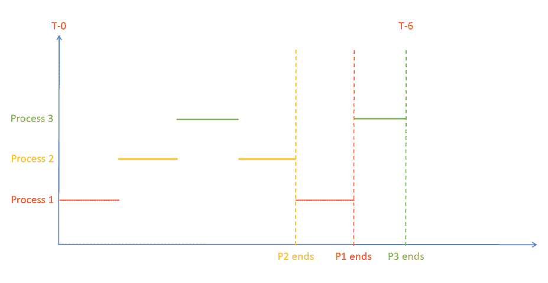
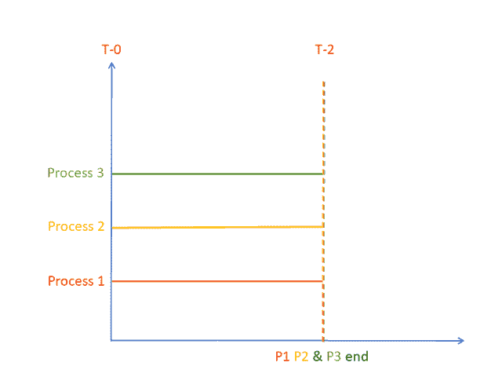

# CPU 核心，多核心，线程，核心与线程，超线程

> 原文： [https://www.guru99.com/cpu-core-multicore-thread.html](https://www.guru99.com/cpu-core-multicore-thread.html)

## 什么是并发或单核？

在操作系统中，并发定义为系统在重叠的时间阶段中运行两个或多个程序的能力。

<figure style="margin-left: auto;margin-right: auto;">

 

带有时间分片的并发执行

如您所见，在任何给定时间，只有一个进程正在执行。 因此，并发只是实际并行执行的广义近似。 这种情况可以在具有单核处理器的系统中找到。

在本并发教程中，您将学习

*   [什么是并发或单核？](#1)
*   [什么是并行执行或（多核）？](#2)
*   [什么是线程？](#3)
*   [什么是多线程？](#4)
*   [多线程如何工作？](#5)
*   [什么是 CPU 核心？](#6)
*   [单核的主要问题是什么？](#7)
*   [多核提供的解决方案：](#8)
*   [多核处理器](#9)的优势
*   [核心与线程之间的差异](#10)
*   [什么是超线程？](#11)

## 什么是并行执行或（多核）？

在并行执行中，将由一个进程执行的任务分解为多个子部分，并且多个 CPU（或多个内核）恰好在同一时间处理每个子任务。

<figure style="margin-left: auto;margin-right: auto;">

Parallel Execution

如您所见，在任何给定时间，所有进程都在执行中。 实际上，并行执行的是流程的子任务，但是为了更好地理解，您可以将它们可视化为流程。

因此，并行性是可以同时处理多个任务的真实方式。 这种情况可以在具有多核处理器的系统中找到，该系统包括几乎所有现代的商用处理器。

## 关键区别

*   内核增加了一次完成的工作量，而线程则提高了吞吐量和计算速度。
*   核心是实际的硬件组件，而线程是管理任务的虚拟组件。
*   内核使用内容切换，而线程使用多个 CPU 来操作多个进程。
*   内核仅需要一个信号处理单元，而线程则需要多个处理单元。

## 什么是线程？

线程是并发编程的执行单元。 多线程是一种允许 CPU 同时执行一个进程的许多任务的技术。 这些线程可以在共享资源的同时单独执行。

## 什么是多线程？

多线程是指在操作系统中运行多个执行线程的常见任务。 它可以包含多个系统进程。

## 多线程如何工作？

例如，大多数现代 CPU 支持多线程。 智能手机上的简单应用程序可以为您提供实时演示。

当您打开需要从互联网上获取一些数据的应用程序时，该应用程序的内容区域将被微调框替换。 这将旋转直到获取并显示数据为止。

在后台，有两个线程：

*   一个从网络获取数据，
*   一种渲染显示微调器的 GUI

这两个线程一个接一个执行，给人以并行执行的错觉。

## 什么是 CPU 核心？

CPU 内核是其存在或特性的核心部分。 以与计算机系统相同的方式，CPU 也称为核心。

核心处理器基本上有两种类型：

1.  单核处理器
2.  多核处理器

## 单核的主要问题是什么？

单核主要存在两个问题。

*   为了更快地执行任务，您需要增加时钟时间。
*   时钟时间的增加将功耗和散热量提高到极高的水平，从而使处理器效率低下。

## 多核提供的解决方案：

*   在同一个芯片上创建两个或更多内核，以提高处理能力，同时也将时钟速度保持在有效水平。
*   具有两个以高效速度运行的内核的处理器可以以与单核处理器相似的速度处理指令。 它的时钟速度是原来的两倍，但是多核进程消耗的能量更少。

## 多核处理器的优势

这是多核处理器的一些优点：

*   每个选择更多的晶体管
*   连接短
*   较低的电容
*   小电路可以快速工作

## 核心与线程之间的差异

| **参数** | **核心** | **线程** |
| 定义 | CPU 核心意味着实际的硬件组件。 | 线程是指管理任务的虚拟组件。 |
| 处理 | 从线程向 CPU 馈送任务。 因此，仅当第一线程发送的信息不可靠时，才访问第二线程。 | CPU 如何与多个线程进行交互有许多不同的变体。 |
| 实作 | 通过交错操作实现 | 通过起诉多个 CPU 来执行 |
| 效益 | 一次增加完成的工作量。 | 提高吞吐量，加快计算速度。 |
| 利用 | 核心使用内容切换 | 使用多个 CPU 来运行多个进程。 |
| 所需处理单位 | 只需要信号处理单元。 | 需要多个处理单元。 |
| 例 | 同时运行多个应用程序。 | 在群集上运行 Web 搜寻器。 |

## 什么是超线程？

超线程是英特尔将并行计算引入最终用户 PC 的第一项努力。 它于 2002 年首次在奔腾 4 上用于台式机 CPU。

当时的奔腾 4 仅具有一个 CPU 内核。 因此，它仅执行单个任务，无法执行任何类型的多种操作。

具有超线程的单个 CPU 看起来像是操作系统的两个逻辑 CPU。 在这种情况下，CPU 是单个，但是 OS 为每个核心考虑两个 CPU，并且 CPU 硬件为每个 CPU 核心具有一套执行资源。

因此，CPU 假定比其具有多个核心，并且操作系统为每个单个 CPU 核心假定两个 CPU。

#### 摘要：

*   线程是并发编程的执行单元。
*   多线程是指在操作系统中运行多个执行线程的常见任务
*   如今，许多现代 CPU 支持多线程
*   超线程是英特尔将并行计算引入最终用户 PC 的第一项努力。
*   CPU 核心是其存在或特征的核心部分
*   在其中，操作系统并发定义为系统在重叠的时间阶段中运行两个或多个程序的能力。
*   在并行执行中，将由流程执行的任务分为多个子部分。
*   单核处理器的主要问题是，为了更快地执行任务，您需要增加时钟时间。
*   多核通过在同一裸片上创建两个或更多核以提高处理能力来解决此问题，并将时钟速度保持在有效水平。
*   多核系统的最大好处是，它可以帮助您根据选择创建更多的晶体管
*   CPU 核心是指实际的硬件组件，而线程是指管理任务的虚拟组件。