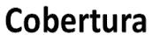
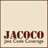
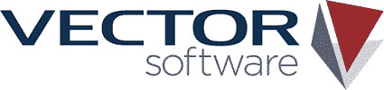
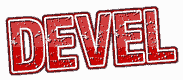
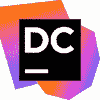
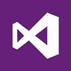
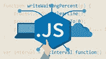

# 2020 年面向 Java，C，C ++，C＃，Python 的 13 种最佳代码覆盖工具

> 原文： [https://www.guru99.com/code-coverage-tools.html](https://www.guru99.com/code-coverage-tools.html)

代码覆盖率是量化程序源代码经过测试的程度的一项重要措施。 市场上有大量的代码覆盖工具，为您的项目选择一个可能是一个挑战。

以下是精选的 13 种精选代码覆盖率工具的列表，这些工具具有流行的功能和最新的下载链接

### 1）[可可](https://bit.ly/2sGGdKW)

[Coco 平台](https://bit.ly/2sGGdKW)是一种多语言代码覆盖工具。 自动源代码检测可以帮助您评估语句，分支和条件的测试覆盖率。

**功能：**

*   Coco 允许您执行语句覆盖率，分支覆盖率，MC / DC 和其他级别
*   Coco 支持 C，C ++，C＃，Tcl 和 QML
*   帮助您合并多个执行报告以提供高级分析

### 2）覆盖范围

 

Cobertura 是一种流行的开源代码覆盖工具。 它允许您通过 Maven 和 Ant 或 Cobertura CLI 执行任务。 您可以嵌入其他多个质量检查工具。

**Features:**

*   无需源代码即可测量覆盖率
*   帮助您查找 Java 程序的哪些部分缺少测试范围
*   允许您以 HTML 和 XML 格式表示报告
*   帮助您测试类&方法的行和分支

下载链接： [https://cobertura.github.io/cobertura/](https://cobertura.github.io/cobertura/)

### 3) Coverage.py

 

Coverage.py 是另一个有用的代码覆盖工具。 它可以帮助您监视 Python 程序，并注意其中部分代码已被执行。

**Features:**

*   Coverage.py 可帮助您通过配置文件指定要分析的源文件
*   它还可以帮助您分析源代码，以找出可能已执行但未执行的代码。

**下载链接：** [https://coverage.readthedocs.io/](https://coverage.readthedocs.io/)

### 4）JaCoCo

JaCoCo 是根据 Eclipse Public License 发布的免费 Java 代码覆盖工具。 它是 EclEmma 制作的 Java 开源免费代码覆盖工具。

**Features:**

*   JaCoCo 提供说明，线路和分支机构覆盖范围
*   它支持 Java 7 和 Java 8
*   帮助您测试类&方法的行和分支
*   提供易于浏览的 HTML 或 XML 报告

下载链接： [https://www.eclemma.org/jacoco/](https://www.eclemma.org/jacoco/)

### 5）OpenClover

 

OpenClover 工具可帮助您测量 Java 和 Groovy 的代码覆盖率，并收集 20 多个代码指标。 它可以帮助您显示应用程序的未测试区域。 它可以帮助您将覆盖率和指标结合起来以找到风险最高的代码。

**Features:**

*   帮助您更快地运行测试
*   使您可以集中精力进行测试
*   分支和语句覆盖率支持
*   允许您生成基于 XML 的报告，将其与 ReportGenerator 结合使用，以生成基于 TML 的覆盖率报告
*   帮助您在应用程序和测试之间保持平衡

下载链接： [http://openclover.org/](http://openclover.org/)

### 6）靶心覆盖

BullseyeCoverage 是用于 C ++和 C 的代码覆盖软件，可以告诉您测试了多少源代码。 该工具允许您执行单元测试，集成测试和最终发布。

**Features:**

*   提供更好的覆盖范围测量
*   帮助您创建更可靠的代码并节省时间
*   允许您包括或排除项目代码的任何部分
*   合并分布式测试的结果

**下载链接：** [http://www.bullseye.com/](http://www.bullseye.com/)

### 7）NCover

NCover 是用于.Net 程序和应用程序的高级代码覆盖工具。 它提供对语句覆盖率和分支覆盖率的支持。 此代码覆盖率工具可在开源和商业许可中使用。

**Features:**

*   .NET 代码覆盖率可根据您的自定义需求
*   帮助您测试，跟踪和管理整个团队的统一保险号码
*   有关覆盖率的详细和集中数据
*   广泛的文档和用户支持
*   此工具可帮助您执行手动和覆盖率测试
*   在敏捷环境中更快，更自信地将产品投放市场

下载链接： [http://www.ncover.com/](http://www.ncover.com/)

### 8）矢量软件

 

VectorCAST 允许您实施一致的流程来管理测试活动和报告关键质量指标。 该软件测试工具为单元测试，回归管理和代码覆盖率分析提供了一种经济高效的方法。

**Features:**

*   轻松的测试协作
*   系统测试自动化
*   质量趋势&变化影响分析
*   允许并行测试
*   基于 Web 的质量仪表板

**下载链接：** [https://www.vectorcast.com/software-testing-products/vectorcast-analytics-web-based-metrics-quality-and-testing](https://www.vectorcast.com/software-testing-products/vectorcast-analytics-web-based-metrics-quality-and-testing)

### 9）开发：封面

Devel Coverage 提供了 Perl 的代码覆盖率指标。 借助此代码覆盖工具，您可以发现测试未执行的代码区域。 它可以帮助您进行测试以增加覆盖范围。

**Features:**

*   提供一些报告，其中包括各种类型的 HTML 输出，文本报告
*   报告语句，分支，条件，子例程和 pod 覆盖范围信息

**下载链接：** [http://search.cpan.org/~pjcj/Devel-Cover-1.23/lib/Devel/Cover.pm](http://search.cpan.org/~pjcj/Devel-Cover-1.23/lib/Devel/Cover.pm)

### 10）dotCover

 

JetBrains 提供的 dotCover 是一个.NET 单元测试运行程序和代码覆盖率工具。 它使您可以与 Visual Studio 的 Jet 大脑骑手集成。 您还可以在.NET，Silverlight 或.NET Core 的应用程序中计算报表语句级别的代码覆盖率。

**Features:**

*   使您可以根据业务需求可视化代码覆盖率
*   提供控制台实用程序以与 Continuous Integration 服务器一起使用
*   使用覆盖率过滤器帮助您自定义覆盖率分析
*   允许您使用快捷方式来找出哪些单元测试涵盖了特定的语句

**下载链接：** [https://www.jetbrains.com/dotcover/](https://www.jetbrains.com/dotcover/)

### 11）Visual Studio 的

 

Visual Studio 的代码覆盖功能可帮助您确定项目编码的哪一部分已通过诸如单元测试之类的编码测试进行了测试。 该工具使您可以查看上一组结果。

**Features:**

*   帮助您查看上一组结果
*   使结果可读为文本，选择导出代码覆盖率结果
*   允许您合并几次运行的结果
*   允许您导出代码覆盖率结果以保存合并操作的结果

**下载链接：** [https://msdn.microsoft.com/en-IN/library/dd537628.aspx](https://msdn.microsoft.com/en-IN/library/dd537628.aspx)

### 12）伊斯坦布尔

 

Istanbul 是用于 Javascript 的代码覆盖工具。 它使用 babel-plugin 支持 ES6 / ES2015 +。 该工具提供所有 javascript 工具库，可帮助您跟踪语句，分支和函数覆盖率。

**Features:**

*   记者集合提供终端和 HTML 输出
*   支持最流行的 JavaScript 测试框架
*   使用 NYC 命令行界面支持检测子流程

**下载链接：** [https://istanbul.js.org/](https://istanbul.js.org/)