# VBA Excel 表单控件& ActiveX 控件

> 原文： [https://www.guru99.com/vba-operators.html](https://www.guru99.com/vba-operators.html)

## 在 Excel 中创建 VBA 表单/ GUI 控件

GUI 是图形用户界面的缩写。 GUI 是用户与之交互的程序的一部分。 GUI 由控件组成。 这些控件可以在窗体中使用。 下表显示了 VBA 中一些最常用的 GUI 控件。

| **S / N** | **控件** | **说明** |
| 1 | 命令 | 用于执行代码 |
| 2 | 组合框 | 用于向用户显示下拉列表 |
| 3 | 复选框 | 用于 true 或 false 值。 多个复选框可以同时具有真实值。 |
| 4 | 列表框 | 用于向用户显示简单列表 |
| 5 | 文本框 | 用于接受用户输入 |
| 6 | 滚动条 | 用于提供滚动条以进行导航。 |
| 7 | 旋转按钮 | 通过单击旋转按钮中出现的向上或向下箭头来增加或减少数值 |
| 8 | 选项按钮 | 用于 true 或 false 值。 一次只能有一个选项按钮具有真实值。 |
| 9 | 标签 | 用于向用户显示静态文本 |
| 10 | 图片 | 用于显示图像 |
| 11 | 切换按钮 | 具有按下和未按下状态的按钮。 |

在 GUI 控件中，

1.  点击开发者标签
2.  单击插入下拉按钮

您将获得以下下拉面板

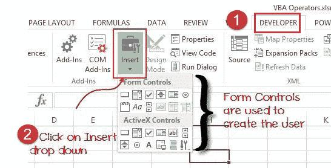

如果将鼠标悬停在控件上，则控件的名称将显示如下：

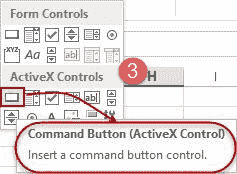

### 将 GUI 控件添加到电子表格

现在，我们将一个命令按钮添加到我们的工作簿中，为此，我们必须

*   单击插入下拉菜单
*   单击命令按钮（ActiveX 控件），如上图所示
*   在工作表上拖动并绘制按钮

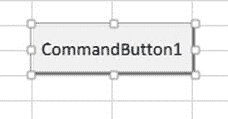

### 设置 GUI 控件属性

现在，我们将按钮的标题设置为更具描述性的内容

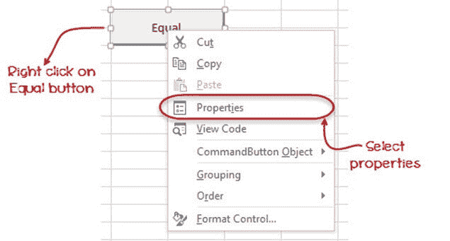

1.  右键单击我们刚刚创建的等号按钮
2.  选择属性菜单
3.  您将获得以下属性窗口

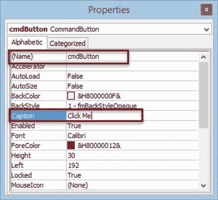

*   将名称属性设置为 btnButton。 name 属性用于在代码窗口中标识控件。 btn 是按钮的前缀。
*   将标题属性设置为单击我。 caption 属性中的文本是用户将在按钮上看到的内容。

完成后关闭窗口。

您将得到以下结果。

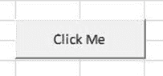

## 如何在 VBA 中使用 ActiveX 控件

在本节中，我们将看到如何在 VBA 中合并“ commandclick”按钮并使用该按钮执行程序。

**步骤 1）**在此步骤中，单击 Active X 控件中的“插入按钮”选项。 然后从中选择命令按钮选项。

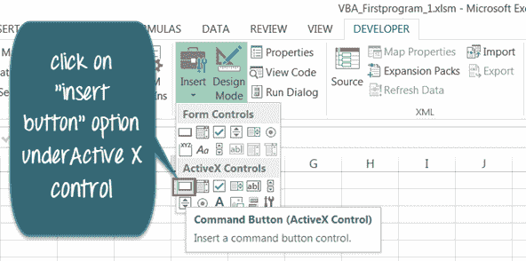

**步骤 2）**要插入“ clickcommandbutton1”，请将鼠标光标拖到 Excel 工作表中。

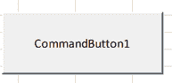

**步骤 3）**然后右键单击命令按钮，然后选择选项“查看代码”。

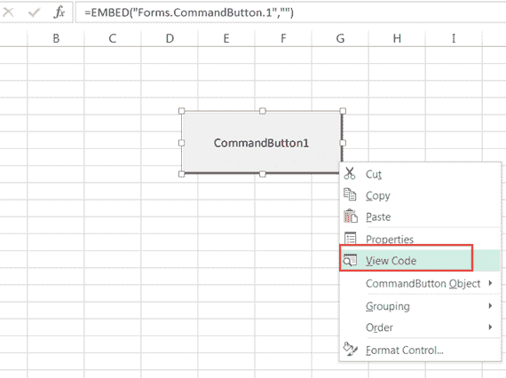

**步骤 4）**检查您在右页上。 代码编辑器将打开。 输入您的代码。

*   在代码中，我们定义了范围 A1 至 A10。
*   此范围定义 Excel 工作表中“ A1 至 A10”的单元格编号。
*   接下来，我们在代码中定义字符串“ Guru99 VBA Tutorial”
*   因此，当您单击 Excel 中的“命令按钮”时。 它应该在单元格区域“ A1 至 A10”中打印“ Guru99 VBA 教程”。

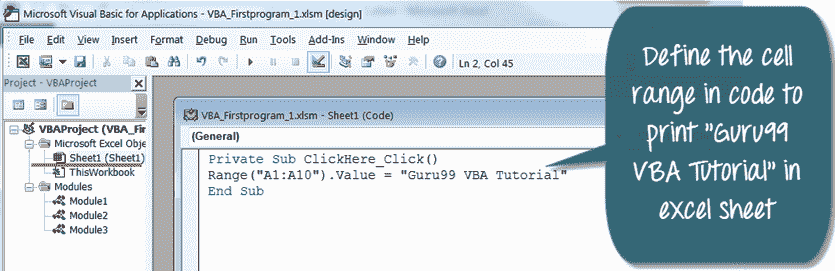

**步骤 5）**在下一步中，保存代码文件，然后退出编辑器。 要返回 Excel 文件，请单击最左侧的 Excel 工作表图标  。

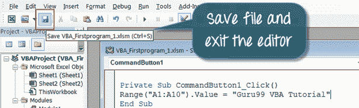

**步骤 6）**在 Excel 工作表中，您将看到“设计模式”选项卡处于打开状态。 确保它为“ OFF”，否则您的代码将无法工作。

[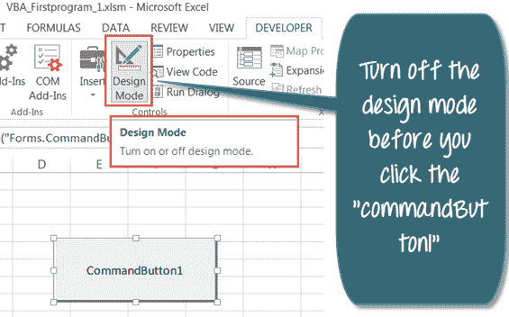 ](/images/vba/062416_1048_WhatisVBA18.png) 

**步骤 7）**关闭设计模式时，其上将没有绿色突出显示。 现在，您可以单击命令按钮。

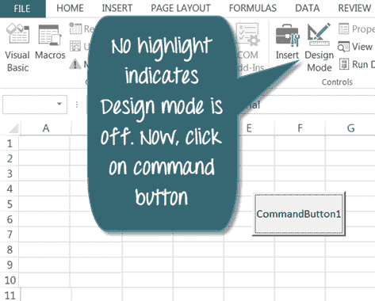

**步骤 8）**单击“ CommandButton1”。 它将在单元格范围“ A1 至 A10”中打印“ Guru99 VBA 教程”。

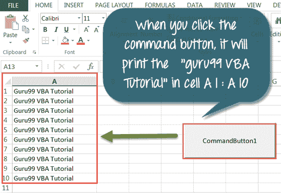

[下载上面的 Excel 代码](https://drive.google.com/uc?export=download&id=0BwL5un1OyjsdRjlVZDRaQlpFNHc)

## 先决条件

##### 配置 Microsoft Excel

正如我们在上一教程中所看到的，请确保您的功能区上具有“开发人员”图标，如下所示。

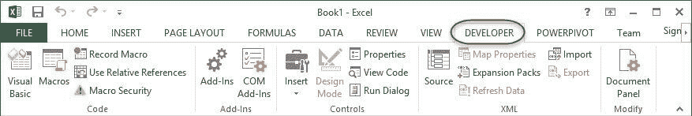

现在，将 sheet1 重命名为“ VBA Operator”，如下面的屏幕截图所示。 将工作簿保存在 Excel 启用宏的工作簿（* .xlsm）文件扩展名中。 （请参见下图）。

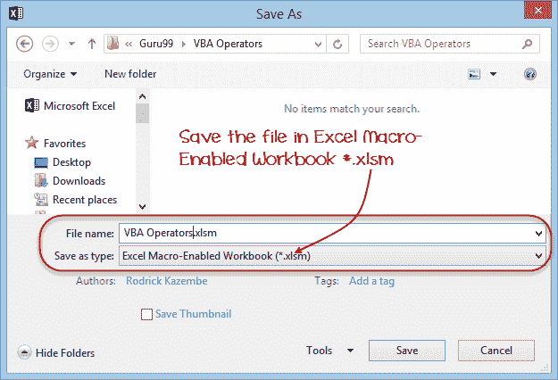

之后，点击保存按钮。