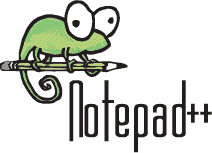
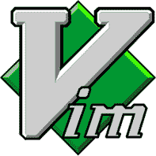

# 15 个适用于 Windows 的最佳免费代码编辑器& Mac [2020 更新]

> 原文： [https://www.guru99.com/best-free-code-editors-windows-mac.html](https://www.guru99.com/best-free-code-editors-windows-mac.html)

每年都会发布许多新的代码编辑器，而开发人员发现选择一个代码挑战性很大。 以下是针对 Windows 和 Mac 平台的排名前 15 位的源代码和文本编辑器软件的精选列表。 列表中的所有编辑器均可免费使用。 代码编辑器可以是独立的，也可以集成到 IDE 中。

**Best Free Code Editors for Windows & Mac**

<link href="https://schema.org/ItemListOrderAscending" itemprop="itemListOrder">
*   

    ### 1）记事本++

     

    [记事本++](https://notepad-plus-plus.org/) 是一种流行的免费使用 C ++编写的代码编辑器。 它使用纯 Win32 API，可提供更高的执行速度和较小的程序尺寸。 它仅在窗口环境中运行，并且使用 GPL 许可证。

    **平台**：Windows

    **价格**：免费

    **功能：**

    *   支持针对 PHP，JavaScript，HTML 和 CSS 等语言的语法突出显示
    *   自动完成：单词完成，功能完成
    *   宏录制和播放
    *   用户定义的语法突出显示和折叠
    *   完全可定制的 GUI
    *   多视图和多语言支持

    **下载链接： [https://notepad-plus-plus.org/](https://notepad-plus-plus.org/)**

*   

    ### 2）原子

     

    [Atom](https://atom.io/) 是程序员首选的有用的代码编辑器工具，因为与其他编辑器相比，它的界面简单。 Atom 用户可以提交软件包，并为软件提交软件包。

    **平台**：Windows，Mac，Linux

    **Price**: Free

    **Features:**

    *   集成了软件包管理器以支持插件
    *   智能自动补全功能
    *   支持命令面板
    *   多个窗格
    *   允许跨平台编辑

    **下载链接：** [https://atom.io/](https://atom.io/)

*   

    ### 3）Visual Studio 代码[VS 代码]

     

    [Visual Studio Code](https://code.visualstudio.com/) 是由 Microsoft 开发的开源代码编辑器软件。 它提供对 TypeScript，JavaScript 和 Node.js 的内置支持。 它具有 IntelliSense 功能自动完成功能，可根据变量类型，基本模块和功能定义提供智能完成功能。

    **平台：** Mac，Windows，Linux

    **价格：**免费

    **Features:**

    *   与 Git 和其他 SCM（软件配置管理）提供商轻松协作
    *   代码重构&调试
    *   易于扩展和定制

    **下载链接：** [https://code.visualstudio.com/](https://code.visualstudio.com/)

*   

    ### 4）支架

     

    [括号](http://brackets.io/)是 Adobe 开发的轻量级工具。 最好的文本编辑器是开源的。 它允许您在源代码和浏览器视图之间切换。

    **Platform:** Mac, Windows, Linux

    **Price:** Free

    **Features:**

    *   快速编辑 UIfeature 将特定于上下文的代码和工具内联
    *   提供实时预览，预处理器支持和内联编辑器
    *   令人愉悦的用户界面
    *   专为 macOS 开发的工具
    *   它带有内置的扩展管理器，用于快速有效的&扩展管理。

    **下载链接：** [http://brackets.io/](http://brackets.io/)

*   

    ### 5）NetBeans

     

    [NetBeans](https://netbeans.org) 是一个开放源代码编辑器工具，用于使用 Java，PHP，C ++和其他编程语言进行开发。 使用此编辑器，代码分析器和转换器。 它允许您升级应用程序以使用新的 Java 8 语言构造。

    **平台：** Mac Windows Linux

    **价格：免费**

    **Features:**

    *   简单&高效的项目管理
    *   提供快速的&智能代码编辑
    *   快速的用户界面开发
    *   帮助您编写无错误的代码

    **下载链接：** [https://netbeans.org](https://netbeans.org)

*   

    ### 6）蓝鱼

     

    [Bluefish](http://bluefish.openoffice.nl/index.html) a 是一个跨平台编辑器，它是一种快速的工具，可以同时处理数十个文件。 该工具允许开发人员进行远程编辑。 该代码编辑器工具为 s 程序员和 Web 开发人员提供了许多选择，以编写网站，脚本和编程代码。

    **Price: Free**

    **平台：** Mac Windows Linux

    **Features:**

    *   在几秒钟内加载数百个文件
    *   在崩溃，终止或关闭后自动恢复修改后的文档中的更改。
    *   项目支持功能可帮助您有效地处理多个项目。
    *   无限的撤消/重做功能。

    **下载链接： [http://bluefish.openoffice.nl/index.html](http://bluefish.openoffice.nl/index.html)**

*   

    ### 7）VIM

     

    [Vim](https://www.vim.org/) 是高级文本编辑器开源工具，从其角度来看，它也被视为 IDE。 该工具允许使用 vim 编辑器和 UNIX 系统管理文本编辑活动，这些编辑器可以在内部使用或在线使用。

    **Price: Free**

    **平台：** Linux

    **Features:**

    *   广泛的插件支持
    *   强大的搜索和替换
    *   与许多工具集成
    *   宏录制和播放
    *   支持数百种编程语言和文件格式

    **下载链接： [https://www.vim.org/](https://www.vim.org/)**

*   

    ### 8）盖尼

     

    [Geany](https://www.geany.org) 是使用 GTK +工具箱的文本编辑器。 它还具有集成开发环境的某些基本功能。 该工具支持许多文件类型，并具有一些不错的功能。

    **价格：**免费

    **平台：** Mac，Windows，Linux

    **Features:**

    *   允许您添加注释以在项目首选项中应用缩进设置
    *   浏览源代码
    *   允许在消息窗口笔记本和边栏上弹出菜单
    *   在尝试执行空上下文操作时显示状态消息

    **下载链接： [https://www.geany.org](https://www.geany.org)**

*   

    ### 9）科莫多 Edit

     

    [Komodo 编辑](https://www.activestate.com/komodo-edit)是易于使用且功能强大的代码编辑工具。 它允许您进行调试，单元测试，代码重构。 它还提供了代码配置文件，以及与 Grunt，PhoneGap，Docker，Vagrant 等其他技术的集成。

    **价格：**免费试用

    **Platform:** Mac, Windows, Linux

    **功能：**

    *   多国语言编辑器
    *   许多现代配色方案
    *   本机 Unicode 支持和 Unicode 兼容性检查
    *   轻松集成到桌面环境中。

    **下载链接： [https://www.activestate.com/products/komodo-edit/](https://www.activestate.com/products/komodo-edit/)**

*   

    ### 10）埃马克斯

     

    [Emacs](https://www.gnu.org/software/emacs/) 是基于 Unix 的文本编辑器工具，程序员，工程师，学生和系统管理员均可使用。 它允许您添加，修改，删除，插入，单词，字母，行和其他文本单元。

    **Price: Free**

    **平台：** Mac，Windows，Linux

    **Features:**

    *   完整的内置文档
    *   对许多人工脚本的完全 Unicode 支持
    *   高度可定制，使用 Emacs Lisp 代码。
    *   用于安装和下载扩展的打包系统

    **下载链接： [https://www.gnu.org/software/emacs/](https://www.gnu.org/software/emacs/)**

*   

    ### 11）jEdit

     

    [jEdit](http://www.jedit.org/) 是用 Java 编写的代码编辑器程序。 这个开源工具支持数百个插件和宏。 它提供了由全球开发人员团队维护的大量插件。

    **Features:**

    *   内置宏语言&可扩展的插件架构
    *   允许复制和粘贴无限数量的剪贴板
    *   您可以在插件管理器的帮助下下载插件。
    *   寄存器内容在整个编辑会话中保存。
    *   允许自动缩进，并突出显示 200 多种语言的语法

    **Price:** Free

    **平台：** Mac，Windows & Linux

    **下载链接： [http://www.jedit.org/](http://www.jedit.org/)**

*   

    ### 12）TextMate

     

    [TextMate](http://macromates.com/) 是适用于 mac 的多功能纯文本编辑器，具有独特的创新功能。 该工具支持多种编程语言，以结构化格式编写散文，例如博客，运行 SQL 查询，编写剧本等。

    **Price:** Free

    **平台：** MAC

    **Features:**

    *   自动缩进常见动作
    *   类似于 CSS 的选择器，可找到操作和设置的范围
    *   使用多个文件的动态大纲
    *   功能弹出窗口，用于快速概览和导航
    *   从文档中运行 Shell 命令
    *   可视书签在文件中的位置之间跳转

    **下载链接： [http://macromates.com/](http://macromates.com/)**

*   

    ### 13）gedit

     

    [Gedit](https://wiki.gnome.org/Apps/Gedit) 工具设计为通用文本编辑器。 它提供了简单易用的 GUI。 它包括用于编辑源代码和结构化文本（如标记语言）的功能。

    **Price:** Free

    **平台：** Mac & Windows

    **Features:**

    *   支持 C，C ++，Java，HTML，XML，Python 等语言的语法突出显示
    *   从远程位置编辑文件
    *   支持文本换行和自动缩进
    *   搜索并替换为正则表达式
    *   灵活的插件系统，可让您添加新功能

    **下载链接： [https://wiki.gnome.org/Apps/Gedit](https://wiki.gnome.org/Apps/Gedit)**

*   

    ### 14）灯桌

     

    [Light Table](http://lighttable.com/) 是用于编码软件的 IDE 和文本编辑器工具。 该工具提供快速反馈，并允许即时执行，调试和访问文档。

    **Price: Free**

    **Platform:** Mac, Windows, Linux

    **Features:**

    *   在线评估
    *   轻便桌是一个轻巧，干净，光滑的界面。
    *   强大的编辑和插件管理器
    *   println 的功能可跟踪代码中的关键值

    **下载链接： [http://lighttable.com/](http://lighttable.com/)**

*   

    ### 15）蓝色狮 riff

     

    [BlueGriffon](http://bluegriffon.org) 是由 Gecko（Firefox 的渲染引擎）支持的开源 HTML 编辑器。 它具有简单的界面和创建符合 W3C Web 标准的网页所需的最常用功能。

    **Platform:** Mac, Windows, Linux

    **Features:**

    *   轻松更改字体颜色或调整边框样式
    *   打开上次会话的标签
    *   CSS 编辑的快捷方式
    *   源视图的多个主题

    **下载链接： [http://bluegriffon.org](http://bluegriffon.org)**