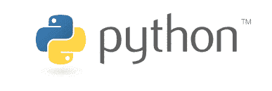
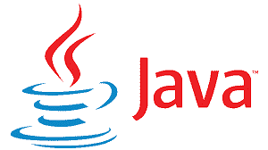
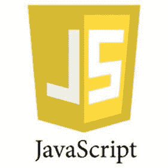
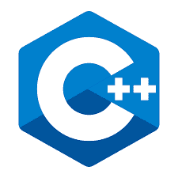
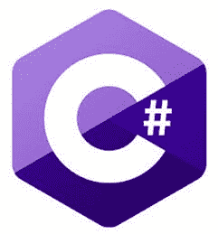
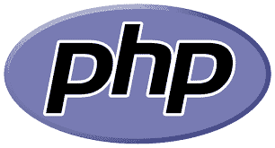
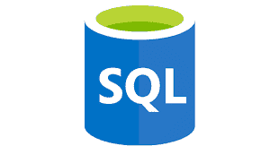

# 2020 年学习的 10 种最佳编程语言

> 原文： [https://www.guru99.com/best-programming-language.html](https://www.guru99.com/best-programming-language.html)

随着时间的流逝，旧的编程语言随着新的编程语言的发布而变得过时，但它们从未受到关注。 在初学者（和程序员）中，一个普遍的问题是他们应该投资学习的编程语言，即需求，稳定的前景和大量的工作。

以下是您应该学习的十大语言列表：

### 1）Python

**创建：**由 Guido van Rossum 开发的 Python 语言。 它于 1991 年首次发布。

**优点：**

*   支持多种系统和平台
*   驱动了面向对象的编程（OOP）。
*   帮助提高程序员的生产力
*   使您甚至可以轻松扩展最复杂的应用程序
*   广泛的支持库

**缺点：**

*   注意移动计算的理想选择
*   Python 的数据库访问层还不够完善和原始。

**用法/应用程序：** Web 和 Internet 开发，科学和数字应用程序，桌面 GUI，业务应用程序。 它被广泛用于 AI 和机器学习领域。

**薪水：**美国任何 Python 开发人员的平均年薪为$ 114,383。

**学习困难：**容易

**选定原因：**机器学习，人工智能和数据科学正在兴起，而 Python 是此类软件程序中的主要编程语言。

### 2）Java

**创立者：** James Gosling 于 1996 年在 Sun Microsystems 最初设计了 Java。

**专业版。**

*   面向对象的语言
*   Java 提供了用于不同活动的 API，例如数据库连接，网络，XML 解析，实用程序等。
*   强大的开源快速开发工具
*   大量的开源库

**缺点。**

*   Java 中的内存管理非常昂贵
*   没有模板会限制您创建高质量的数据结构。

**用法/应用程序：** Java 主要用于开发 Android 应用程序，Web 应用程序和大数据。

**薪水：**美国任何 Java 开发人员的平均年薪为$ 101,013。

**学习困难：**学习 Java 很简单。

选择**的原因：** Java 的使用范围越来越广泛。 有并且永远不会缺少需要 Java 技能的工作。

### 3）R

 

**创建：** R 由奥克兰大学的 Robert Gentleman 和 Ross Ihaka 设计。 这个项目是 1992 年构思的，但其最初版本于 1995 年发布，而稳定的 beta 版本则于 2000 年发布。

**Pros:**

*   R 是一种全面的统计分析语言，可鼓励您发展新想法
*   作为一种统计语言，被认为非常易于编码
*   R 是开源软件。 因此，任何人都可以使用和更改它
*   R 适用于 GNU / Linux 和 Microsoft Windows。
*   R 是跨平台的，这意味着它可以在不同的操作系统上无缝运行。

**Cons:**

*   在 R 中，某些包装的质量达不到标准
*   R 没有最佳的内存管理。 因此，它可能会消耗所有可用的内存。

**用法/应用程序：**数据科学项目，统计计算，机器学习

**薪水：**任何 R 开发人员的平均工资每年大约为 90,042 美元至 136,616 美元

**学习困难**：很难

选择**的原因：**数据科学是一个蓬勃发展的领域，R 主要用于数据分析。

### 4）Javascript

 

**创建：** JavaScript 在 1995 年 9 月首次随 Netscape Navigator 2.0 一起提供时被称为 LiveScript。后来，它被重命名为 JavaScript。

**Pros:**

*   客户端 JavaScript 非常快，因为它可以在客户端浏览器中快速运行
*   JavaScript 比较容易学习。
*   它可以与其他语言顺利协作，并可以用于多种应用程序中。
*   润滑猴子支持以编写可在特定网页上执行的 JavaScript 代码段

**Cons:**

*   JavaScript 仅允许单一继承，因此无法进行多重继承
*   JavaScript 中没有复制或相等方法。
*   不同浏览器对 JavaScript 的解释不同。

**用法/应用程序：** JavaScript 的用法包括 Web /移动应用程序开发，游戏开发和桌面应用程序开发。

**薪水：**美国 Javascript 开发人员的平均年薪约为 110,981 美元

**学习难度：**简单

**选定原因：**使用 NodeJS 的 JavaScript 现在也支持服务器端脚本。 JavaScript 是必不可少的语言，始终需要 JS 技能。

### 5）迅捷

 

**创建：** Swift 由 Apple 在 2010 年 7 月开发，因此 iOS 开发人员无需使用 Objective-C。

**Pros:**

*   Swift 程序代码接近自然英语，因此易于阅读
*   易于向该语言添加新功能，从而使快速的高级语言成为可能
*   该语言没有很长的代码行。
*   自动内存管理功能可防止内存泄漏。

**Cons:**

*   随着苹果 Swift 版本的不断更新，Swift 有点不稳定
*   由于它是一种新的编程语言，因此 Swift 开发人员的数量非常有限

**使用应用程序：**

Swift 是专门设计的语言，可与 Apple 的 Cocoa 和 Cocoa Touch 框架配合使用，以创建所有类型的 iOS 应用程序。

**Salary：**美国 iOS 开发人员的平均年薪约为$ 130,801

**学习难度：**简单

**选定原因：**苹果！ 我们应该说更多吗？

### 6）C ++

 

**已创建：**

C ++是由 Bjarne Stroustrup 于 1983 年开发的一种编程语言。

**Pros:**

*   它是一种流行的语言，因此，有许多编译器和库
*   其他编程语言（例如 C，C＃和 Java）与 C ++的语法非常相似，因此对于熟悉 C ++的每个人来说都很容易学习。
*   没有垃圾收集器在后台运行。

**缺点**

*   语法复杂，标准库很小，这对于初学者来说很难学习。
*   C ++程序不支持垃圾回收或动态内存分配
*   与其他语言相比，C ++中的面向对象系统是不必要的基础。

**用法应用程序：C ++广泛用于游戏开发，**高级计算和图形编译器

**薪金：**

美国 C ++开发人员的平均年薪为 113,865 美元。

**学习困难：**艰苦

选择**的原因：** C ++是健壮的语言，已广泛用于各个领域。 永远不会过时

### 7）C＃

 

**创建年份：**

C＃是一种计算机编程语言。 它是 2001 年发布的第一个版本。

**Pros:**

*   C＃使用了几乎跟 C 相似的语法，因此对于那些懂 C 语言的人来说很容易理解
*   与 Windows 轻松集成
*   与.NET 库完全集成，该库提供对功能和支持存储库的访问。
*   比指针名称（C / ++）更安全，因为不允许使用指针类型

**Cons:**

*   它允许指针位于“不安全”的块中

**使用应用程序：广泛用于**企业跨应用程序开发，Web 应用程序

**Salary:**

“ C＃开发人员”的平均工资从每年$ 66,493 到每年$ 101,775 不等

**Learning Difficulty:** Hard

**选定原因：**广泛用于企业软件中，需要此技能。

### 8）PHP

 

**创建年份：**

Rasmus Lerdorf 在 1994 年创建了 PHP

**Pros:**

*   使用 PHP 运行很简单
*   功能和面向对象的编程
*   大型开源软件社区
*   可用于测试和部署的合理良好的自动化工具系统

**Cons:**

*   由于 PHP 缺少调试工具，错误处理工具的质量很差
*   PHP 不安全，因为它是一种开源语言
*   使用 PHP Web Development 开发网站比其他编程语言要慢。

**使用应用程序：** Web 应用程序，内容管理系统，电子商务应用程序

**Salary:**

在美国，PHP 开发人员的平均年薪为 84,727 美元

**学习困难：**简单

**选定原因：**最受欢迎的脚本语言。 WordPress，Facebook 都是使用 PHP 创建的。 从不缺少 PHP 职位。

### 9）SQL

 

**创建：** SQL 由 Donald D. Chamberlin 和 Raymond F. Boyce 在 IBM 开发。 该语言于 1979 年公开提供。

**Pros:**

*   强大的查询语言
*   针对大量表格行进行了优化
*   快速搜索和查询数据
*   高可用性和数据一致性
*   快速从多个表中检索数据

**Cons:**

*   难以将数据从对象转换为数据库表
*   它只能在单个服务器上运行，因此提高速度意味着需要升级硬件。
*   由于 SQL 数据库在单个服务器上运行，因此如果服务器停止工作，则不应访问该数据库

**用法应用程序：**在任何数据库中使用

**薪金：**在美国，SQL Developer 的平均工资为每年$ 84,792

**Learning Difficulty:** Easy

**选定原因：**无论选择哪种配置文件/语言作为软件开发人员，都需要了解数据库和 SQL。

### 10）去

 

**创建：** Go 语言（又称 golang）是由 Robert Griesemer，Ken Thompson 和 Rob Pike 于 2009 年在 Google 开发的。

**Pros:**

*   Go 是一种非常快速的语言，因为它已编译为机器代码
*   与其他语言相比，它的语法很小，而且很容易学习。
*   提供标准库以提供方便的内置函数来处理基本类型
*   Go 使并发编程变得容易。

**Cons:**

*   图书馆支持不佳
*   接口是隐式的
*   脆弱的依赖管理

**使用应用程序：**控制台实用程序，GUI 应用程序和 Web 应用程序

**Salary:**

在美国，GO Developer 的平均工资为每年 94,082 美元

**学习困难：**困难

**所选原因：**来自 Google 的即将使用的语言。