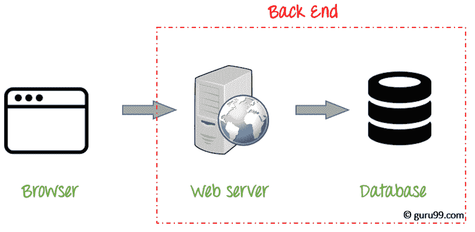
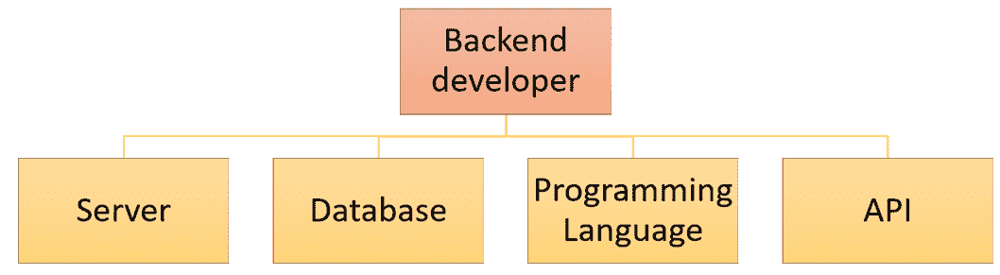

# 什么是后端开发人员？ 成为 Web 开发人员的技能

> 原文： [https://www.guru99.com/what-is-backend-developer.html](https://www.guru99.com/what-is-backend-developer.html)

## 什么是后端开发？

后端开发是指服务器端开发。 它是用于在网站上执行任何操作时发生的幕后活动的术语。 它可以登录到您的帐户或从在线商店购买手表。

后端开发人员专注于数据库，脚本和网站的体系结构。 后端开发人员编写的代码有助于将数据库信息传达给浏览器。

**示例**：

后端编程的最常见示例是在博客上阅读文章时。 字体，颜色，设计等构成此页面的前端。 而文章的内容是从服务器呈现并从数据库中获取的。 这是应用程序的后端部分。

在本教程中，您将学习

*   [什么是后端开发？](#1)
*   [成为后端开发人员所需的技能集](#2)
*   [后端开发人员](#3)的角色和职责
*   [前端开发人员与后端开发人员](#4)

## 成为后端开发人员所需的技能

后端开发人员可以处理以下内容

*   网络开发语言
*   数据库和缓存
*   服务器
*   API（REST & SOAP）

**开发语言**

后端工程师应该至少了解一种服务器端编程语言，例如 Java，Python，Ruby 、。 网等

**数据库和缓存**

各种 DBMS 技术的知识是后端开发人员的另一个重要需求。 MySQL，MongoDB，Oracle，SQLServer，Redis 被广泛用于此目的。 熟悉诸如清漆，Memcached，Redis 等缓存机制。

**服务器**

暴露于处理 Apache，Nginx，IIS 服务器，Microsoft IIS

是可取的。 Linux 的良好背景可以极大地帮助管理服务器。

**API（REST & SOAP）**：

Web 服务或 API 的知识对于全栈开发人员也很重要。 需要有关 REST 和 SOAP 服务的创建和使用方面的知识。

**其他难题**：

*   诸如 Django for Python，Larval for PHP 等框架的工作经验
*   编写质量**单元测试**的能力
*   对**算法**和数据结构的了解也是任何专业的全栈开发人员的基本需求
*   了解**安全性**的问题很重要，因为每一层都有其漏洞
*   应该知道多个交付平台（例如移动设备与台式机）之间的区别
*   希望对 HTML 和 CSS 等前端技术有基本了解。
*   分布式服务器环境中会话管理的知识

## 后端开发人员的角色和职责

*   后端开发人员的工作是了解网站的目标并提出有效的解决方案
*   存储数据并确保将其显示给应该有权访问该数据的用户
*   负责开发付款处理系统，例如接受数据，安全地存储该信息以及对该付款进行收费
*   管理可跨设备使用的 API 资源
*   他或她可能参与了系统的架构和数据科学分析。
*   开发人员负责组织运行在各种设备上的系统逻辑
*   后端开发人员还需要参与构建框架或体系结构，以使其易于编程。
*   后端开发人员应具有实现算法和解决系统相关问题的技能。

### 后端开发人员薪水

作为后端开发人员，您可能每年可以赚$ 120,798。

在这个英国，薪金范围为£40,000-£70,000

## 前端开发人员与后端开发人员

| **参数** | **前端** | **后端** |
| **技能组** | 前端 Web 开发人员应熟悉的语言是 HTML，CSS 和 JavaScript。 | 数据库，服务器，API 等 |
| **小组** | 前端开发人员通过获取用户输入并通过测试对其进行修改来设计网站的外观。 | 后端开发人员开发支持前端的应用程序。 它还应提供支持，安全性和内容管理。 |
| **独立服务** | 前端开发服务不能独立提供。 | 后端开发可以以 BaaS 的形式作为独立服务提供（后端即服务）。 |
| **目标** | 前端开发人员应确保所有用户都可以访问该网站，并且该网站在所有视图（移动设备和台式机）中都保持响应。 | 后端团队可能需要围绕前端创建一个应用程序并提供支持。 此外，他们需要确保网站打开并正常运行。 |
| **平均薪金** | 每年$ 104,405 | 每年$ 120,798 |
| **三种最受欢迎​​的工具** | jQuery，HTML5， | MySQL，PHP |

**摘要**

*   后端开发是指服务器端开发
*   后端开发人员使用开发语言，数据库和缓存，服务器，API（REST & SOAP）等。
*   后端 Web 开发人员应了解网站的目标并提出有效的解决方案
*   前端开发人员应熟悉的语言是 HTML，CSS 和 JavaScript，而后端开发人员应熟悉数据库，服务器，API 等。
*   不能独立提供前端开发服务，但我们可以独立提供后端开发服务