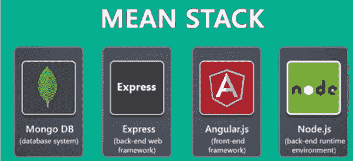
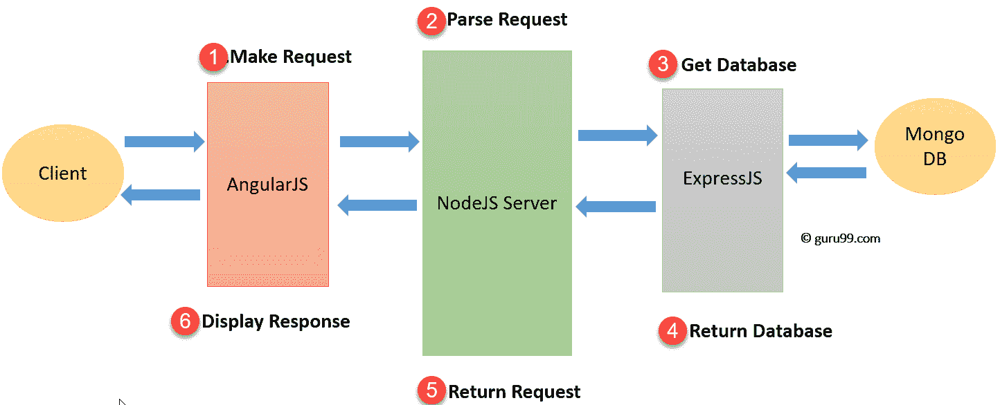

# 什么是平均堆栈开发人员？ 技能，薪水，成长

> 原文： [https://www.guru99.com/mean-stack-developer.html](https://www.guru99.com/mean-stack-developer.html)

在了解 MEAN Stack Developer 之前，让我们了解一下-

## 什么是平均堆栈？

均值堆栈是指用于开发 Web 应用程序的 JavaScript 技术的集合。 因此，从客户端到服务器再到数据库，一切都基于 JavaScript。 MEAN 是用于开发快速而强大的 Web 应用程序的全栈开发工具包。

MEAN 是用户友好的堆栈，是构建动态网站和应用程序的理想解决方案。 这个免费的开源堆栈提供了一种快速而有组织的方法，可以为基于 Web 的应用程序创建快速原型。

MEAN 包含四种不同的技术：

*   **M** ongoDB express 是无模式的 NoSQL 数据库系统
*   **E** xpress JS 是一个用于在 Node 中构建 Web 应用程序的框架
*   **ngularJS 是 Google 开发的 JavaScript 框架**
*   **N** ode.js 是服务器端 JavaScript 执行环境

在本教程中，您将学习：

*   [什么是平均堆栈？](#1)
*   [什么是 Mean Stack Developer？](#2)
*   [什么是 MongoDB？](#3)
*   [什么是 Express.JS？](#4)
*   [什么是 Angular JS？](#5)
*   [什么是 Node JS？](#6)
*   [均值堆栈体系结构](#7)
*   [堆栈开发人员的平均收入是多少？](#8)
*   [均值堆栈开发人员](#9)的技能
*   [平均堆栈开发者的未来是什么？](#10)
*   [均值堆栈](#11)的优势
*   [均值堆栈](#12)的缺点

## 什么是 Mean Stack Developer？

Mean Stack Developer 是使用 MEAN 堆栈的程序员。 他在应用程序的后端和前端工作。

它们都是基于 JavaScript 的，因此 MEAN 开发人员应该具有良好的 JS 知识。

## 什么是 MongoDB？

MongoDB 是一个用 C ++编写的开源，跨平台数据库。 它使用二进制数据类型（如 JSON）将数据存储在键值对中。 它是面向文档的 NoSQL 数据库。 MongoDB 中的文档类似于 OOPS 中的对象

Mongo DB 是需要管理具有数百万个数据的大型表的数据库系统的理想选择。 此外，将字段包含到 Mongo DB 更加容易，因为它不需要更新整个表。 使用 Mongo DB，您可以仅使用一个应用程序（即 JavaScript）来开发整个应用程序。

## 什么是 Express.JS？

Express 是成熟，灵活，轻便的服务器框架。 它设计用于构建单页，多页和混合 Web 应用程序。 这个轻量级的框架使用 Pug 引擎提供对模板的支持。

Express 是 Nodejs 的实际框架，并从流行的 Ruby 框架 Sinatra 汲取了很多灵感。

## 什么是 Angular JS？

Angular JS 是一个开源 JavaScript 框架。 Angular 由 Google 维护。 该框架的目标是在基于浏览器的应用程序中引入 MVC（模型视图控制器）体系结构，从而简化开发和测试过程。 该框架可帮助您创建支持个性化的更智能的 Web 应用程序。

AngularJS 允许我们使用 HTML 作为模板语言。 因此，您可以扩展 HTML 的语法来表达应用程序的组件。 依赖项注入和数据绑定之类的角度功能消除了您需要编写的大量代码。

## 什么是 Node JS？

Node.js 允许开发人员创建 Web 服务器并在其上构建 Web 应用程序。 这是服务器端 Javascript 执行环境。

Node.js 使用非阻塞且事件驱动的 I / O 模型。 这使其轻巧高效，非常适合跨分布式设备运行的数据密集型实时应用程序。

它允许开发人员创建在分布式设备上运行的数据密集型实时应用程序。 您可以在 Microsoft Windows，OS X 和 Linux 上运行 Node.js 运行时。

## 均值堆栈体系结构

均值堆栈体系结构的各个组件的主要功能如下：

**Angular JS** ：接受请求并向最终用户显示结果

**NodeJS** ：处理客户端和服务器请求

**Express JS** ：向数据库发出请求并返回响应

**MongoDB** ：存储和检索数据。

Mean Stack Architecture Diagram

1.  首先，客户端发出一个由 AngularJS 处理的请求
2.  之后，请求移至 NodeJS，它将解析请求。
3.  ExpressJ 将调用 MongoDB 以获取或设置数据。
4.  MongoDB 将检索请求的数据并将该请求返回给 Express JS
5.  NodeJS 将请求返回给客户端。
6.  在客户端，AngularJS 会显示从 MongoDB 获取的结果。

## 什么是 Stack Developer 平均工资？

在美国，“平均堆栈开发人员”的平均年薪约为 90,148 美元。

## 均值堆栈开发人员的技能

*   意味着堆栈开发人员应该在前端和后端流程上工作
*   意味着 Stack 开发人员应该能够使用 HTML & CSS
*   他/她应该了解编程模板和体系结构设计准则
*   Web 开发，持续集成和云技术方面的知识
*   对数据库架构有很好的了解
*   SDLC 知识和在敏捷环境中开发的经验
*   与 IT 团队合作构建强大的系统来支持业务目标
*   当然，您可以在 Mongo，Express，Angular，Node 上亲身体验。

## 均值堆栈开发者的未来是什么？

是的，Mean 堆栈开发人员是非常需要的，具有挑战性的职业。 因此，如果您准备使用各种技能，并具有使用各种代码语言和应用程序的经验，那么您将成为成功的 MEAN 堆栈开发人员。

应用程序架构（技术架构师）是您在成为普通堆栈开发人员的经验之后，可以轻松在将来发展的领域。

## 均值堆栈的优点

这是使用均值堆栈技术的一些最重要的原因

*   允许创建一个简单的开源解决方案，该解决方案可用于构建可靠且可维护的解决方案。
*   帮助快速开发应用程序
*   MEAN 是全栈 JavaScript，它是 100％免费的。 利用 JavaScript 的受欢迎程度
*   在整个堆栈中使用统一的语言
*   使用极低的内存占用/开销
*   帮助您避免不必要的基础工作并使应用程序井井有条
*   MongoDB 是为云构建的
*   Node.js 简化了服务器层
*   MEAN 使代码同构

## 均值堆的缺点

*   对于中小型应用程序，MongoDB 可能是理想的选择。 但是，对于大规模应用程序来说，这不是最佳选择。
*   没有特定的通用 JS 编码准则
*   一旦您使用 Mean Stack 技术开发了第一个站点，就很难回到原来的方法
*   它很难将服务器与业务逻辑隔离
*   您可能会丢失记录

## 摘要

*   平均值堆栈是指用于开发 Web 应用程序的 JavaScript 技术的集合
*   MongoDB 是一个用 C ++编写的开源，跨平台数据库
*   Express 是成熟，灵活，轻便的服务器框架。 设计用于构建单页，多页和混合 Web 应用程序
*   Angular JS 是 Google 维护的开源 JavaScript 框架
*   Node.js 允许开发人员创建 Web 服务器并在其上构建 Web 应用程序。 这是服务器端 JavaScript 执行环境
*   Mean Stck 架构由 MongoDB，Express JS，Angular JS 和 NodeJS 组成
*   平均堆栈（全堆栈开发人员）应在前端和后端上工作
*   MEAN 是用户友好的堆栈，是构建动态网站和应用程序的理想解决方案。
*   使用 Mean stack 框架的最大缺点是，没有特定的通用 JS 编码准则