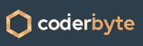

# 初学者竞争性编程：Topcoder 挑战

> 原文： [https://www.guru99.com/competitive-programming-topcoder.html](https://www.guru99.com/competitive-programming-topcoder.html)

## 什么是竞争编程？

竞争性编程正在使用算法和数据结构来解决编码问题。 参与者需要在各种限制下编写代码，例如内存限制，执行时间，编码限制，空间等。

宣布获胜者的依据是一些已解决的问题和花费在编写成功的编程解决方案上的时间。 但是，它还包括其他因素，例如产生的输出质量，执行时间，程序大小等。

在本教程中，您将学习

*   [什么是竞争编程？](#1)
*   [竞争编程考试的好处](#2)
*   [竞争性编程的历史](#3)
*   [竞争性编程考试中的技能检查](#4)
*   [如何开始？](#5)
*   [如何为竞争性编程做准备？](#6)
*   [竞争性编程的神话与现实](#7)
*   [竞争编码考试的最佳做法](#8)
*   [竞争性编程的缺点](#9)

## 竞争编程的好处

以下是参加比赛的好处：

*   竞争性编程可以帮助您提高逻辑和分析能力
*   它可以提高您的算法知识。
*   这是对您的简历的绝佳补充。
*   改善您对编程也充满热情的朋友网络
*   它得到了 Google，Amazon，Facebook，IBM 等世界知名组织的支持。

## 竞争性编程的历史

在竞争激烈的程序世界中，最古老的竞赛是 ACM-ICPC（国际大学生编程竞赛）。 它起源于 1970 年代，现已发展到横跨 88 个国家。

在 2000 年之后，人们对编程挑战的兴趣大为增加。这可能是由于 Internet 的增长。 它允许编码竞赛站点在网上举行国际竞赛。

## 竞争编程考试所需的技能

| **技能** | **详情** |
| 重要技巧 | 

*   算法技能
*   基本数学技能
*   编程技能
*   打字速度技能
*   调试技能

 |
| 完成搜寻 | 

*   使用整个搜索空间进行蛮力搜索
*   超越时限
*   优化搜索

 |
| 分而治之 | 

*   将编码问题分成较小的部分
*   二进制搜索

 |
| 动态编程 | 

*   确定问题状态
*   更快，更复杂的递归回溯

 |

## 如何开始？

在开始进行竞争性编程之前，这里是一些有用的技巧，您应该知道：

*   选择最适合自己的编程语言至关重要
*   在任何在线编码挑战网站上注册并开始解决他们的练习问题
*   您需要了解对于解决复杂的编码问题至关重要的数据结构。
*   您需要了解程序复杂性的概念。
*   学习重要的编程模式，例如递归，动态编程等。

## 顶级竞争编程网站

最重要的最佳编码挑战站点是：

*   TopCoder
*   编码字节
*   密码战
*   厨师长
*   编码部队
*   黑土

### 顶部编码器：

Topcoder 是用于竞争性编程的广泛流行的平台。 它提供了许多算法挑战，您可以使用他们的代码编辑器工具自行完成。 该网站更适合高级受众。

**访问此处：** [https://www.topcoder.com/](https://www.topcoder.com/)

### 编码字节

Coderbyte 提供了 200 多种不同类型的编码挑战，您可以使用 10 种不同的编程语言在在线编辑器中解决这些挑战。 它提供了官方解决方案和超过 800,000 个用户创建的解决方案。

**访问此处：** [https://coderbyte.com/](https://coderbyte.com/)

### 密码战

Codewar 提供了大量的编码挑战。 您可以提交挑战，这些挑战将由社区进行编辑。 它使您可以使用其 20 多种编程语言的编辑器在线解决这些挑战。

**访问此处：** [https://www.codewars.com/](https://www.codewars.com/)

### 厨师长

CodeChef 提供了数百种竞争性编程挑战。 它使您可以在他们的在线编辑器中编写代码，并查看一系列挑战。 根据您的技能水平，编码问题分为不同的类别。

**访问此处：** [https://www.codechef.com/](https://www.codechef.com/)

### 代码部队

Codeforces 是俄罗斯基础竞争性编程网站。 它定期举办编码竞赛，来自世界各地的竞争程序员。

**访问此处：** [https://codeforces.com/](https://codeforces.com/)

### 黑客世界：

HackerEarth 提供企业软件解决方案。 它可以帮助公司或个人满足创新管理和技术招聘的需求。 到目前为止，HackerEarth 已经进行了 10,000 多次编程挑战。

**访问此处：** [https://www.hackerearth.com/](https://www.hackerearth.com/)

## 竞争性编程的神话与现实

| **神话** | **现实** |
| 现在开始竞争性编程已经为时已晚 | 在您的编程生涯中尽早开始，最好的年龄没有固定的年龄。 |
| 这是获得软件编程工作的绝佳方法 | 不，这是不正确的，因为它是一项可能有益的运动。 但是，它不提供工作保障。 |
| 开始竞争性编程之前，您需要解决许多计算程序。 | 您可以学习理论，但是解决计算难题将无济于事，因为每场比赛都是独特的挑战。 |
| 您需要算法专家 | 您需要能够解决问题 |
| 有竞争力的程序员都是有经验的程序员。 | 不，它适合所有人，即使是初学者代码也可以参与 |
| 这只是一种爱好或游戏 | 相比之下，竞争性编程涵盖了计算机科学课程中讲授的某些相同技能，但涵盖的范围更广。 因此，您不能将其称为游戏。 |

## 竞争编码考试的最佳做法

尽管没有固定的规则，但仍应遵循一些最佳实践：

*   尝试学习新的高效算法，并在需要时实施它们。
*   对列表，树和图等数据结构有深入的了解
*   注册前，请从竞争性编程网站上阅读隐私信息，并与他们联系。
*   您应该选择一个可以找到解决方案的问题，并可能对这些解决方案进行解释。
*   编写问题的测试用例，并在提交之前使用这些测试用例测试您的逻辑。
*   您需要维护标准算法，必要的标头，函数等的预写模板。
*   使用函数/方法并尽量减少代码重复。
*   测试您的代码是否出现最坏的情况，并尝试找出针对这种情况的最佳解决方案

## 竞争性编程的缺点

*   输入错误的问题导致的运行时错误很难调试。
*   您已经习惯了小额报酬和短期目标。 在现实生活中，当您从事任何项目时，通常需要两到三个月的时间才能获得所从事项目的奖励
*   您可能会成为编码大师，但是您将不知道任何框架（对于实际项目很重要）
*   参与非常耗时且乏味，您需要重复进行。

## 摘要

*   竞争性编程正在使用算法和数据结构来解决编码问题。
*   编码竞赛可帮助您提高逻辑和分析能力。
*   ICPC 起源于 1970 年代，现已发展到横跨 88 个国家/地区。
*   在竞争性编程考试中，必须具备算法技能，基本数学技能，编程技能，打字速度技能。
*   选择最适合自己的编程语言至关重要
*   最重要的最佳编码挑战站点是：1）TopCoder 2）Coderbyte 3）Codewars 4）CodeChef 5）Codeforce 6）Hackerearth。
*   一个普遍的神话是现在开始竞争性编程为时已晚。 但是，现实是没有固定的年龄。
*   对列表，树和图形等数据结构有深入的了解是竞争性编码考试的一种很好的最佳实践。