# 14 本 BEST 算法&数据结构书籍（2020 清单）

> 原文： [https://www.guru99.com/data-structure-algorithms-books.html](https://www.guru99.com/data-structure-algorithms-books.html)

算法是定义明确的计算过程，该过程将某些值作为输入并生成一些值作为输出。 简而言之，是将输入转换为输出的一系列计算步骤。

这是一本精选的 14 本有关算法和数据结构培训的书籍的精选清单，这些书籍应该属于任何开发人员的库。

### 1）简化[数据结构和算法：数据结构和算法难题](https://geni.us/yxIWMy)

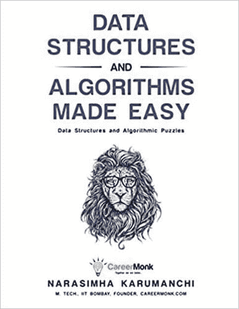

轻松实现数据结构和算法：数据结构和算法难题”是 Narasimha Karumanchi 写的一本书。

每个问题都有许多不同的解决方案，并且本书以 C / C ++编写。 这本书非常适合作为计算机科学家的面试和考试指南。

这本算法书提供了各种复杂数据结构和算法问题的解决方案。 该参考书还可以作为准备面试，考试和校园工作的指南。

[Check Latest Price and User Reviews on Amazon](https://geni.us/yxIWMy)

* * *

### 2）[算法简介](https://geni.us/c1NnXML)

《算法入门》一书深入探讨了各种算法。 本书的每一章都是相对独立的，可以用作学习材料。 本书以英文和伪代码描述了算法。

本书提供了动态编程和贪婪算法的处理方法以及基于边缘的流的新概念。 学习材料还提供许多练习，问题和解决方案。

[Check Latest Price and User Reviews on Amazon](https://geni.us/c1NnXML)

* * *

### 3）[算法](https://geni.us/6ezgzO)

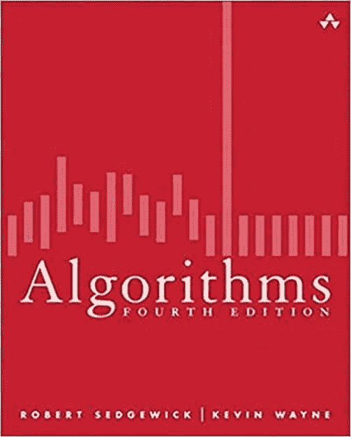

Algorithms 是 Robert Sedgewick 和 Kevin Wayne 撰写的书。 本书涵盖了当前使用的所有最重要的计算机算法。

这本书教您搜索，排序，图形处理和字符串处理。 本教程包括每个程序员都应该知道的算法。 它使世界各地的人们都能发现新的学习和教学方式。

[Check Latest Price and User Reviews on Amazon](https://geni.us/6ezgzO)

* * *

### 4）[主算法：对终极学习机的追求将如何重塑我们的世界](https://geni.us/cGjWTbp)

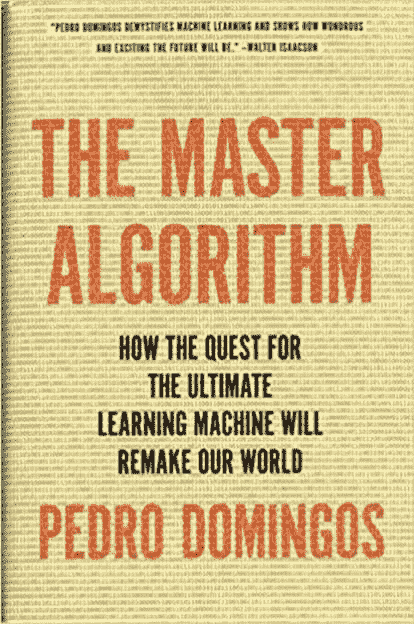

主算法是 Pedro Domingos 写的一本书。 这本书让我们了解了为 Google，亚马逊和您的智能手机提供支持的学习机。 《主算法》一书-讨论了它对商业，科学和社会的意义。

该书包括诸如机器学习革命，精通算法，无师自学等主题。

[Check Latest Price and User Reviews on Amazon](https://geni.us/cGjWTbp)

* * *

### 5） [Grokking 算法：针对程序员和其他好奇心人士的插图指南](https://geni.us/TQYtL)

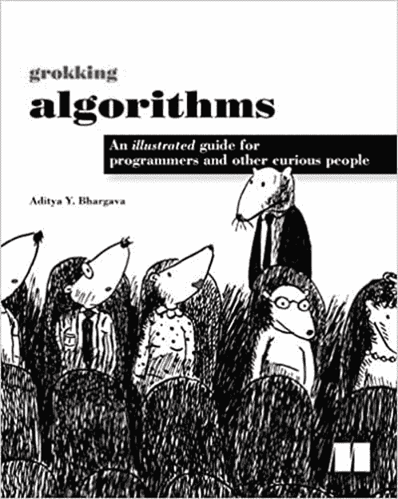

Grokking 算法由 Aditya Bhargava 撰写。 在本教程书中，您将学习如何将常见算法应用于每天遇到的实际编程问题。 您可以从诸如排序和搜索之类的任务开始。

该书可帮助您解决更复杂的问题，例如数据压缩和人工智能。 每个呈现的示例都包含有用的图和 Python 中带完整注释的代码示例。 在本书的最后，您可以了解适用的算法以及何时使用它们。

[Check Latest Price and User Reviews on Amazon](https://geni.us/TQYtL)

* * *

### 6）[算法设计手册](https://geni.us/ZZCRzp)

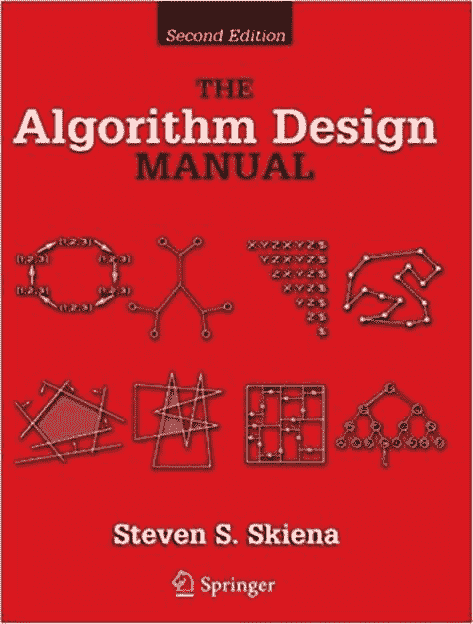

算法设计手册是由 Steven S S. Skiena 撰写的书。 本书现在是任何算法设计课程的理想参考书之一。 它可以帮助您维持作为算法的主要实用参考指南的地位。 这个畅销的经典作品消除了设计算法和分析算法效率的“奥秘”。

[Check Latest Price and User Reviews on Amazon](https://geni.us/ZZCRzp)

* * *

### 7）Java 中的[数据结构和算法](https://geni.us/yTJifB)

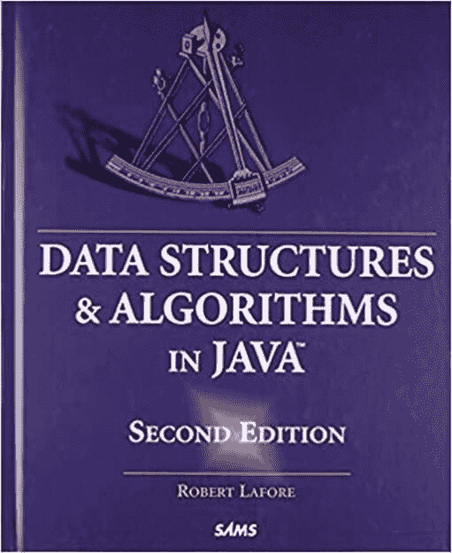

Java 中的数据结构和算法是 Robert Lafore 撰写的书。 尽管主题本身很复杂，但本书的设计易于阅读和理解。

本书提供了简单明了的示例程序。 您还将获得一个研讨会，它是一个可以在 Web 浏览器上执行的小型演示程序。

此外，本书中的程序以图形方式演示了数据结构的样子以及它们如何操作

[Check Latest Price and User Reviews on Amazon](https://geni.us/yTJifB)

* * *

### 8）[您好世界：算法时代的人类](https://geni.us/VvTS)

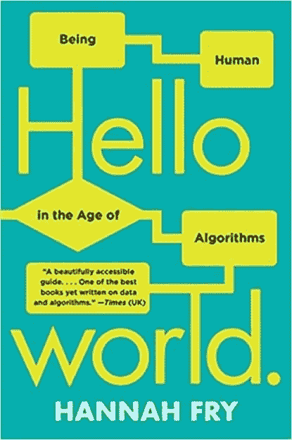

你好世界书由汉娜·弗莱（Hannah Fry）撰写。 这是为代码规范的世界解决道德困难的必要准备。 汉娜·弗莱（Hannah Fry）带我们参观了围绕我们的算法的优劣，丑陋。

[Check Latest Price and User Reviews on Amazon](https://geni.us/VvTS)

* * *

### 9）阐明的[算法：第 1 部分：基础知识](https://geni.us/TNaAVk)

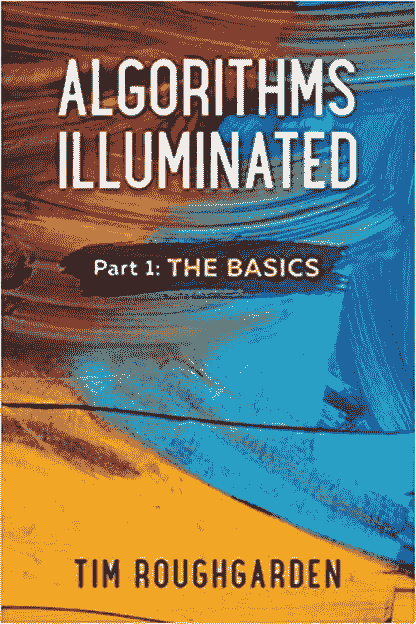

光照算法是蒂姆·罗格加登（Tim Roughgarden）撰写的书。 本书包含所有测验和选定问题的解决方案，并附有作者的一系列 YouTube 视频。

第 1 部分介绍了渐近分析和 big-O 表示法，分而治之算法，以及主方法，随机算法。 本书以几种著名的排序和选择算法结尾。

[Check Latest Price and User Reviews on Amazon](https://geni.us/TNaAVk)

* * *

### 10）[算法设计：Pearson 新国际版](https://geni.us/wdm21)

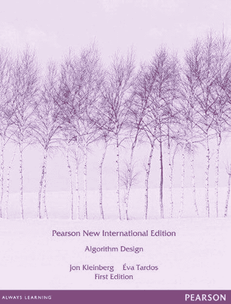

Algorithm Design 是 Jon Kleinberg 写的一本书。 这本书教给学生一系列设计和分析技术。 此方法帮助他们解决在计算应用程序中执行时出现的问题。

该算法书还介绍了算法的设计过程和作用。 本书包括诸如算法分析基础，分而治之，动态编程，网络流等主题。

[Check Latest Price and User Reviews on Amazon](https://geni.us/wdm21)

* * *

### 11）[算法](https://geni.us/lMvuL)

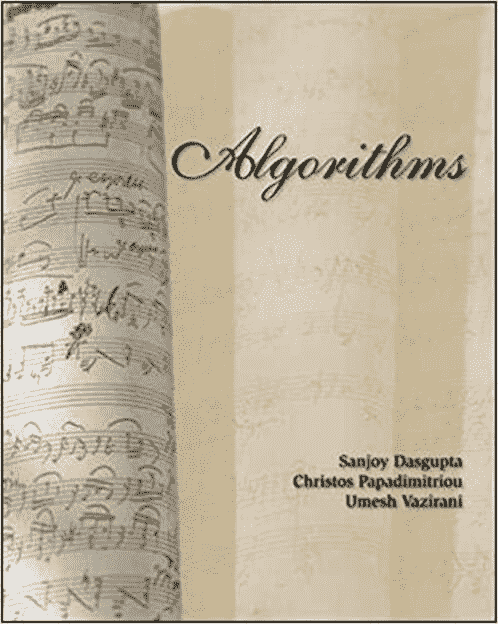

算法是 Sanjoy Dasgupta 写的一本书。 这本书在故事情节中教您算法的基础知识，使材料变得令人愉快且易于消化。

本书的重点是理解每种算法背后的数学思想。 它可以帮助您直观地学习该主题，而无需过于正式。

这本书包括对所使用算法的描述以及数学上精巧的偏移。 这本算法书提供了《解决方案手册》，可在在线学习中心上获得。

[Check Latest Price and User Reviews on Amazon](https://geni.us/lMvuL)

* * *

### 12）[解锁的算法（麻省理工学院出版社）](https://geni.us/MEE9B)

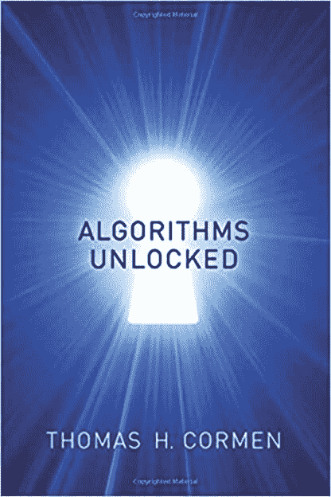

托马斯·科门（Thomas Cormen）写的《算法解开》一书 它以有限的数学方式提供了有关算法如何使计算机解决问题的一般说明。

您还将找到在计算机上搜索信息的简单方法。 在本书中，您将学习密码学背后的基本原理以及数据压缩的基础。 本书包括许多复杂的问题及其在合理时间内解决的方法。

[Check Latest Price and User Reviews on Amazon](https://geni.us/MEE9B)

* * *

### 13）[使用 Python 解决算法和数据结构问题](https://geni.us/qeuRK)

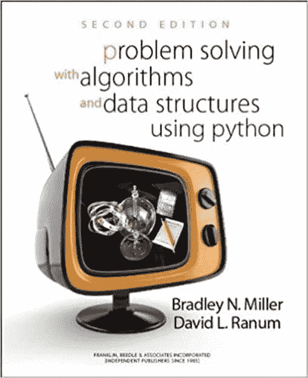

使用 Python 解决算法和数据结构的问题由 Bradley N. Mille 撰写。 它还涉及 Python，以及对算法和数据结构的研究。 了解计算机科学的全部内容至关重要。 学习计算机科学并非永远都不是要学习任何其他类型的主题。

本书旨在为我们提供有关数据结构和算法的第一门课程的教材。 该书还介绍了抽象数据类型和数据结构，编写算法以及解决问题。

[Check Latest Price and User Reviews on Amazon](https://geni.us/qeuRK)

* * *

### 14）简而言之[算法：实用指南](https://geni.us/ABOd2q)

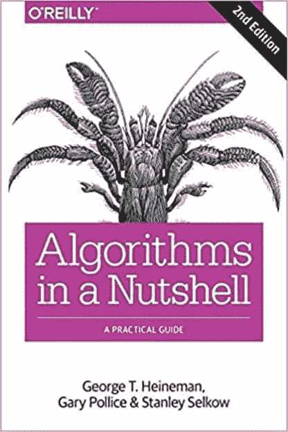

简而言之，算法是乔治·海涅曼（George T. Heineman）所写的书。 该书可帮助您创建需要使用高效算法的强大软件。 但是，程序员经常考虑它们，直到出现问题为止。 本书包含大量解决各种问题的现有算法。

本书仅需足够的数学就可以帮助您选择并实施适合您需要的算法。 它使您能够了解和分析算法性能。

[Check Latest Price and User Reviews on Amazon](https://geni.us/ABOd2q)