# 2020 年面向初学者的 50 多个 BEST Freelance 网站

> 原文： [https://www.guru99.com/best-freelance-websites-for-beginners.html](https://www.guru99.com/best-freelance-websites-for-beginners.html)

自由职业者网站是您可以自己赚钱而不是为特定公司赚钱的地方。 它使自由职业者可以搜索各种各样的工作。

如果您是初学者，那么自由职业者的网站是一种在线赚钱的简便方法。 这些平台非常容易浏览和查找与您的技能匹配的工作。

以下是针对初学者的顶级自由职业者网站的精选列表。

这是自由职业的类别列表

*   [自由设计和开发人员职位（网站）](#1)
*   [自由设计工作（网站）](#2)
*   [自由开发人员工作（网站）](#3)
*   [一般自由职业（网站）](#4)
*   [自由视频编辑工作（网站）](#5)
*   [自由图形工作（网站）](#6)
*   [自由市场营销职位（网站）](#7)
*   [SEO 工作（网站）](#8)
*   [虚拟助手职位（网站）](#9)
*   [自由写作工作（网站）](#10)
*   [自由测试工作（网站）](#11)

## 自由设计和开发人员职位（网站）

### 1）[粉碎杂志](https://www.smashingmagazine.com/jobs/)

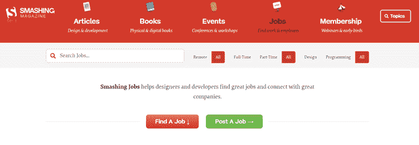

Smashing Magazine 是一个网站，为 UX 设计人员，Web 设计人员，JavaScript 开发人员，Java 开发人员，移动应用程序开发人员等提供职位。 您可以按照自己喜欢的时间轻松地搜索远程，全职和兼职工作。

**链接**： [https://www.smashingmagazine.com/jobs/](https://www.smashingmagazine.com/jobs/)

### 2） [10 倍管理](https://www.10xmanagement.com/)

10x Management 是一家可帮助开发人员，设计师和编码人员获得工作的机构。 当您在该网站上注册时，您会得到代表的支持，他们会回答您的问题并给出解决方案。 完成项目后，您将从雇主那里获得付款。

**链接**： [https://www.10xmanagement.com/](https://www.10xmanagement.com/)

## 自由设计工作（网站）

### 1） [99 个设计](https://99designs.qvig.net/GLDP2)

[99designs](https://99designs.qvig.net/GLDP2) 是一个自由的平台，用于连接图形设计师和客户。 它提供了徽标设计，Web 应用程序设计，艺术创作和插图等众多工作类别。在这里，设计师要支付的平台费取决于他们的设计师级别，例如顶级（5％），中级（10％）， 和入门级（15％）。 客户发布竞赛，设计师可以将其作品作为申请提交。

**链接**： [https://99designs.com/](https://99designs.qvig.net/GLDP2)

### 2） [Envato Studio](https://studio.envato.com/)

Envato Studio 是设计师和开发人员的社区。 您可以从事徽标设计，网站设计，着陆页设计等工作。 对于初学者来说，该平台非常易于使用。 该站点使您可以在约定的周转时间和修订总数内完成工作。

**链接**： [https://studio.envato.com/](https://studio.envato.com/)

### 3）[盘带](https://dribbble.com/)

运球是寻求自由职业的人们的聚集地。 在这里，您可以轻松地与雇主共享您的网页设计工作，并找到最相关的工作机会。 该网站包含许多针对 UI & UX 设计师，产品设计师，视觉设计师，品牌设计师等的项目。

**链接**： [https://dribbble.com/](https://dribbble.com/)

### 4） [Coroflot](https://www.coroflot.com/)

Coroflot 使您可以担任网页设计师，时装设计师，艺术总监，创意总监等工作。 它可以帮助您将设计师与世界各地的众多机会联系起来。 Coroflot 对您的个人信息和薪水保密。

**链接**： [https://www.coroflot.com/](https://www.coroflot.com/)

## 自由开发人员工作（网站）

### 1）[天使名单](https://angel.co/jobs)

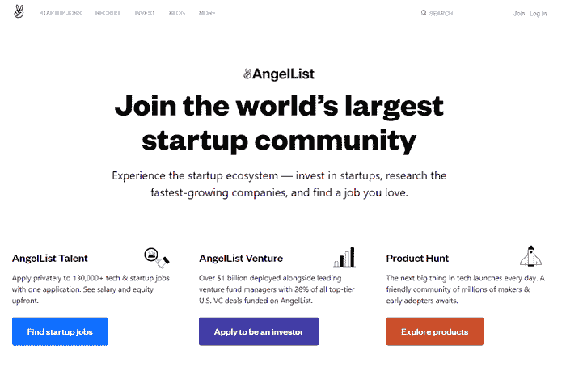

Angel List 平台使求职者可以与初创公司合作。 您可以访问该网站以申请网站和软件开发工作。 您可以按位置，技术，薪水，市场等搜索工作。如果任何公司对您的服务感兴趣，您将通过电子邮件收到通知。

**链接**： [https://angel.co/jobs](https://angel.co/jobs)

### 2） [Gun.io](https://www.gun.io/)

Gun.io 是专业自由职业者的地方。 它为正在寻找自由职业者的公司和正在申请这份工作的开发人员提供选择过程。 一旦接受了审查，Gun.io 的团队将使您的技能与雇主的工作相匹配。 它确保了雇员和雇主之间的持久关系。

**链接**： [https://www.gun.io/](https://www.gun.io/)

### 3） [lorem](https://www.asklorem.com/)

Asklorem 是自由职业者的地方。 他们可以轻松地搜索网站开发工作。 该网站提供了一种将自由职业者与客户联系起来的简单方法。 初学者可以找到工作，例如建立新网站，对其进行自定义，制定营销策略，调试错误等。

**链接**： [https://www.asklorem.com/](https://www.asklorem.com/)

### 4）[可编码](https://codeable.io/freelancers/)

可编码站点可帮助您找到 WordPress 开发人员的工作。 在这里，您必须解决与 WordPress 相关的问题。 在分配工作之前，为该站点工作的团队将使您的编程技能与招聘人员的需求相匹配。

**链接**： [https://codeable.io/freelancers/](https://codeable.io/freelancers/)

### 5） [Gigster](https://gigster.com/)

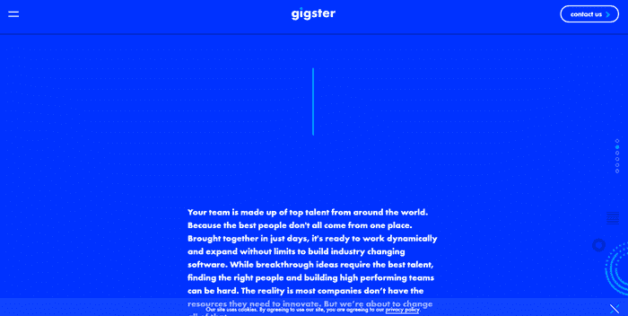

Gigster 帮助 Web 开发人员和软件开发人员找到工作。 它具有筛选过程，可以使自由职业者与项目更容易匹配。 Gigster 的团队处理销售和行政事务，因此您可以专注于核心工作。

**链接**： [https://gigster.com/](https://gigster.com/)

## 一般自由职业（网站）

### 1）[加工](https://www.upwork.com/)

Upwork 是获取自由职业的门户。 Upwork 提供与 IT 和网络，数据科学，管理工作，会计，翻译等有关的常规工作。

您可以使用该网站向客户发送无限的建议。 与新客户开始关系后，将向您收取 20％的费用。 对于初学者来说，这是一个非常友好的网站。

**链接**： [https://www.upwork.com/](https://www.upwork.com/)

### 2）[自由职业者](https://www.freelancer.com/)

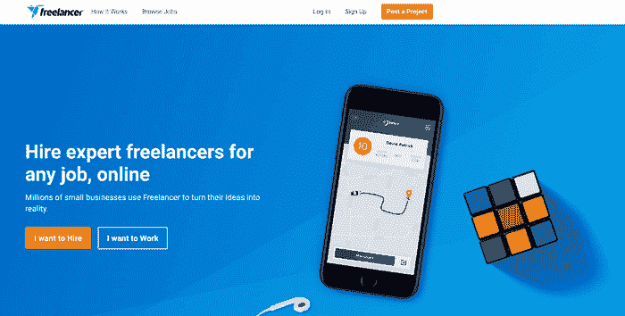

该网站提供数据录入，产品采购，销售和营销，人力资源，内容撰写，会计翻译等工作。一旦注册并登录 Freelancer，就可以免费获得 8 个应用程序，而无需支付会员费。 如果要在此站点上进行自由职业，则必须竞标费用并提出建议。 它有一个专门的顾问团队，可以帮助您更快地被录用。

**链接**： [https://www.freelancer.com/](https://www.freelancer.com/)

### 3） [Fiverr](https://bit.ly/3hBZoxx)

Fiverr 是一个可帮助您自由职业的网站。 它提供与数字营销，写作，翻译，音频编辑，视频编辑等相关的工作。想要赚钱的人。 他们需要知道如何以正确的方式使用 Fiverr。 该站点还提供了一种构建令人印象深刻的产品组合的简单方法。

**链接**： [https://www.fiverr.com/](https://bit.ly/3hBZoxx)

### 4）[老师](https://www.guru.com/)

Guru 是一个自由职业者网站，可以帮助初学者创建个人资料。 在此网站上，自由职业者可以从事财务，市场营销，工程管理等工作。

它提供了一种与潜在雇主联系的简便方法。 该平台每天发布大量工作。 成功完成任务后，Guru 会扣除您获得的 5％至 9％的付款。

**链接**： [https://www.guru.com/](https://www.guru.com/)

### 5） [Servicescape](https://www.servicescape.com/)

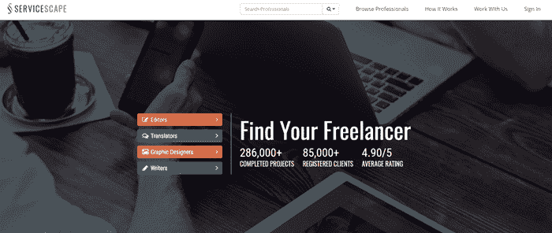

Servicescape 自由职业者网站，用于与初创公司和 SMB 合作。 该网站为编辑，翻译，图形设计师，作家等提供工作。您可以通过发送消息，拨打电话等多种方式与客户互动。

**链接**： [https://www.servicescape.com/](https://www.servicescape.com/)

### 6）[每小时](https://www.peopleperhour.com/)

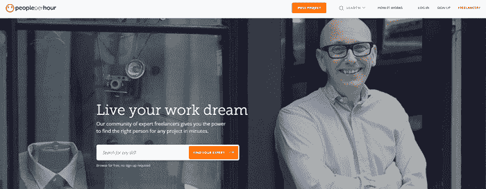

PeoplePerHour 是一个基于英国的平台，可为对自由职业感兴趣的人们提供业务访问。

它可以帮助这些人与客户建立联系。 该站点可让您展示按项目或按小时招聘的人才。

**链接**： [https://www.peopleperhour.com/](https://www.peopleperhour.com/)

### 7）[哈斯达夫人才](https://talent.hubstaff.com/)

Hubstaff Talent 是一个平台，使人们可以按小时合同和固定价格全职工作。 您可以找到网络和基础架构经理，服务台经理，接待员，客户经理，产品营销等工作。

您只需填写您的个​​人详细信息，技能和可用性，就会在有人喜欢您的服务时通过电子邮件通知您。

**链接**： [https://talent.hubstaff.com/](https://talent.hubstaff.com/)

### 8）[顶部](https://www.toptal.com/)

Toptal 是一个自由职业者金融专家，产品经理等的网络。您可以轻松地找到许多行业的工作，例如医疗保健，电子商务，银行业等等。 进入 Topal 站点的申请人在申请工作之前已经过测试和审查。 许多知名公司在 Toptal 上为他们的项目雇用自由职业者。

**链接**： [https://www.toptal.com/](https://www.toptal.com/)

### 9） [CloudPeeps](https://www.cloudpeeps.com/)

CloudPeeps Web 门户专注于与市场营销，文案写作，社交媒体，电子邮件营销等有关的一般自由职业工作。它有超过一千名从事自由职业者的专业人员。 该站点使您可以远程工作。

**链接**： [https://www.cloudpeeps.com/](https://www.cloudpeeps.com/)

### 10） [Truelancer](https://www.truelancer.com/)

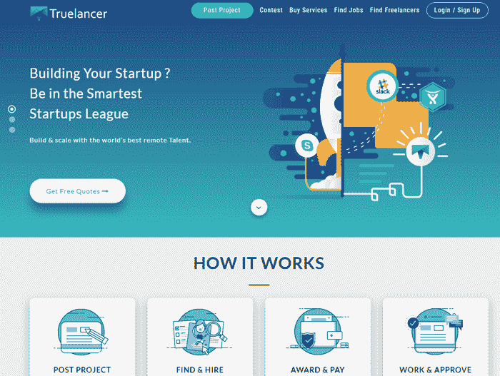

Truelancer 是自由职业者和雇主共同为自由职业工作的平台。 它提供在线工作，家庭工作，虚拟协助工作，市场培训师等。 通过在 Truelancer 上进行工作，您可以轻松赚钱。 您可以从浏览器，Android 和 iPhone 设备访问它。

**链接**： [https://www.truelancer.com/](https://www.truelancer.com/)

### 11） [Flexjobs](https://www.flexjobs.com/)

Flexjobs 是一个门户网站，可帮助您找到自由职业，灵活的计划工作等。 登录此网站后，您可以无限制地访问工作。 它具有简单快速的个人资料制作流程，可让您找到雇主。 当雇主发布新工作时，Flexjobs 网站会发出电子邮件警报。

**链接**： [https://www.flexjobs.com/](https://www.flexjobs.com/)

### 12） [Zeerk](https://zeerk.com)

Zeerk 网站提供了许多类别，例如网站评论，写作，发布文章或博客，数据输入，促销等。一旦卖方批准您的任务，您就可以申请提款请求。 它包含一个内置的交易和对话管理系统，可以向雇主提供反馈。

**链接**： [https://zeerk.com](https://zeerk.com)

## 自由视频编辑工作（网站）

### 1） [ProductionHUB](https://www.productionhub.com/jobs)

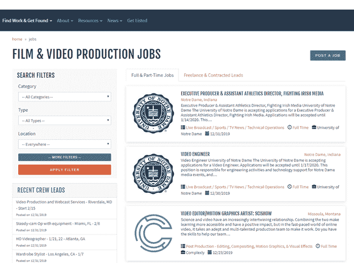

ProductionHUB 是一个供喜欢视频编辑的人使用的网络。 您可以简单地展示您的作品，并在此网站上与客户建立联系。 在这里，您必须创建一个配置文件以对项目进行响应或竞标。 ProductionHUB 可帮助您找到全职和兼职工作的申请。

### 2） [Media Bistro](https://www.mediabistro.com/)

Media Bistro 是一个自由职业的工作平台，提供包括写作和编辑在内的各种类别。 如果您对管理社交媒体或编辑内容有一点了解，那么您可以轻松地工作。

**链接**： [https://www.mediabistro.com/](https://www.mediabistro.com/)

### 3） [Mandy](https://www.mandy.com/)

Mandy 网站专门致力于电视和电影的制作工作。 在此网站上，您可以找到许多工作，包括作曲家，演员助理，编辑等。 该站点的主要优点是您不必对不适当的工作进行分类。

**链接**： [https://www.mandy.com/](https://www.mandy.com/)

### 3）[阶段 32](https://www.stage32.com/welcome/)

Stage 32 是一个位于美国的网站，面向从事电视，电影和戏剧创作的人们。 它可以帮助您开始视频编辑事业。 这个站点有许多短片，纪录片剪辑师，电影制作设计师，编剧等工作。

**链接**： [https://www.stage32.com/welcome/](https://www.stage32.com/welcome/)

### 4）[组装](https://www.assemble.tv/)

Assemble 是一个由创意人组成的网络，包括导演，创意摄像师，编辑，动作艺术家等。Assemble 为雇主和寻求自由职业机会的人提供无缝的协作功能。

**链接**： [https://www.assemble.tv/](https://www.assemble.tv/)

## 自由图形工作（网站）

### 1）[行为](https://www.behance.net/)

 

Behance 可以帮助您全职担任平面设计师，自由职业者或实习项目。 您可能会在各种类别中找到工作，例如建筑，品牌，时尚，插画，摄影等。 它支持美国，阿富汗，比利时，澳大利亚，加拿大等国家。

**链接**： [https://www.behance.net/](https://www.behance.net/)

## 自由市场营销职位（网站）

### 1） [Zirtual](https://www.zirtual.com/jobs)

Zirtual 帮助人们轻松地找到全职工作。 它使您可以远程工作。 您可以找到许多营销类别，例如电子邮件管理，日程安排，研究，活动计划等。雇主仅雇用居住在美国的候选人。

**链接**： [https://www.zirtual.com/jobs](https://www.zirtual.com/jobs)

### 2） [Clickworker](https://www.clickworker.com/)

 

Clickworker 是营销人员的平台。 您可以在此门户网站上注册而无需付费。 它使您能够以灵活的时间表独立工作。 Clickworker 允许您在具有 Internet 连接的 PC 或手机上工作。 自由职业者可以决定您的工作时间以及您希望工作的时间。

**链接**： [https://www.clickworker.com/](https://www.clickworker.com/)

## SEO 职位（网站）

### 1） [Konker](https://www.konker.io/)

 

Konker 是一个在线平台，专注于与 SEO（搜索引擎优化）相关的内容。 您可以申请创建反向链接，内容，使用 YouTube SEO 进行营销，关键字研究，网站优化等。它提供在线和离线工作机会。

**链接**： [https://www.konker.io/](https://www.konker.io/)

### 2） [SEOclerk](https://bit.ly/3fyq8gw)

SEOclerk 是专门为 SEO 服务设计的市场。 它使您可以按价格，级别等筛选工作。求职者可以搜索页面 SEO，建立反向链接，增加网站流量，在线营销等。 您可以收到与所应用作业相似的作业的电子邮件。

**链接**： [https://www.seoclerk.com/](https://bit.ly/3fyq8gw)

## 虚拟助手职位（网站）

### 1）[花式手](https://www.fancyhands.com/job/apply)

Fancy Hands 在美国提供虚拟助理工作。 在这里，您可以找到数据输入，送餐，呼叫中心，产生潜在客户，安排约会等工作。如果您具有良好的互联网研究技能和良好的电话沟通能力，则可以迅速被 Fancy Hands 的雇主聘用。 。 该公司将为您支付$ 3.00 至$ 7 每个任务。

**链接**： [https://www.fancyhands.com/](https://www.fancyhands.com/job/apply)

## 自由写作工作（网站）

### 1） [Blogging Pro](https://www.bloggingpro.com/jobs/)

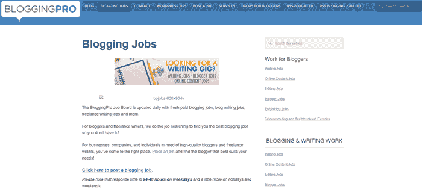

在 Blogging Pro 中，您可以找到写作博客，内容编辑，技术写作，故事写作等工作。这是一个免费网站，使您可以从事博客工作。 该公司帮助博客作者和自由职业者找到他们想要的工作。 您可以将工作发布到 Blogging Pro 中，然后在 2-3 天内获得答复。

### 2） [Pro Blogger](https://problogger.com/jobs/)

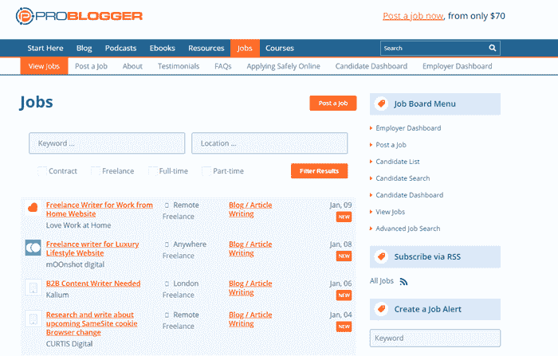

Pro Blogger 帮助自由职业者找到在家工作，文案写作，博客写作，文章写作等工作。 候选人可以轻松地在 Pro Blogger 上创建简历。 他们甚至可以保存和添加书签。 该网站的优点之一是您可以管理工作警报。 Pro Blogger 具有一个仪表板来管理您申请的工作。

**链接**： [https://problogger.com/jobs/](https://problogger.com/jobs/)

### 3）[到期](https://due.com/freelancer/)

Due 是技术作家的自由职业者网站。 您可以做一些工作，例如编写有关付款，区块链货币，发票等的有用指南。 它使您可以为客户或公司独立工作。 该站点可帮助您午餐事业并获得您感兴趣的自由职业。

**链接**： [https://due.com/freelancer/](https://due.com/freelancer/)

### 4） [Pub Loft](https://publoft.com/writers)

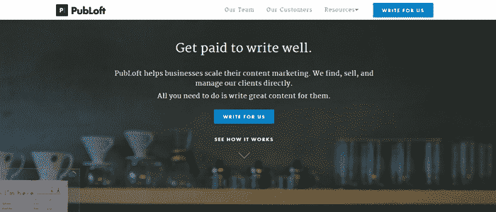

PubLoft 是为客户寻找自由职业的地方。 在申请这份工作之前，您必须通过审查程序（在雇用之前检查背景）。 在这里，您每两周就会收到付款，因此您不必担心月收入。

**链接**： [https://publoft.com/writers](https://publoft.com/writers)

### 5）[自由写作](https://www.freelancewriting.com/)

自由写作是自由职业者写作工作的来源。 过滤所需的工作类型和经验非常容易。 该网站对寻求指导设计师，技术作家，汽车作家，产品编辑等工作的人员免费。

**链接**： [https://www.freelancewriting.com/](https://www.freelancewriting.com/)

### 6）[所有自由写作](https://www.freelancewriting.com/)

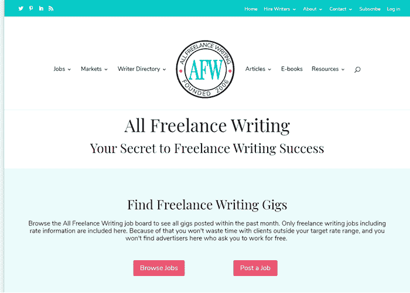

All Freelance Writing 是一个使您能够找到自由写作工作的网站。 您可以根据日期和付款范围快速找到工作。 对于初学者而言，诸如艺术&新闻写作，书籍编辑，与生活方式相关的写作之类的工作可以轻松完成。

**链接**： [https://allfreelancewriting.com/](https://allfreelancewriting.com/)

### 7）[自由撰稿人](https://www.freelancewritinggigs.com/)

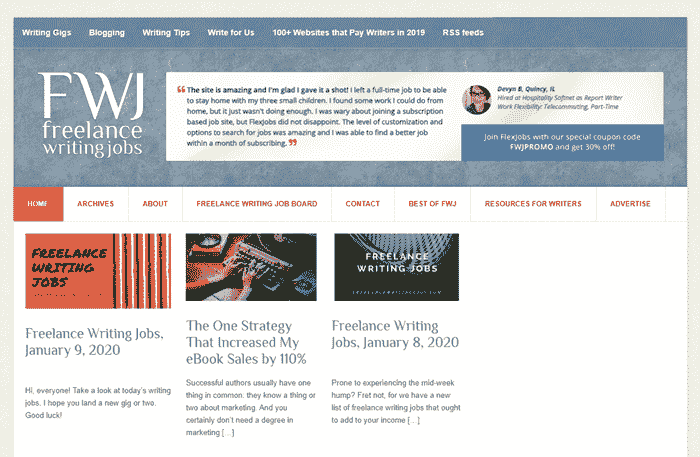

Freelance Writing Gigs 基本上是一个工作板，在工作日更新，这些新客户愿意为您付实际钱来写东西。 该门户用于编写作业，在线内容作业，编辑作业，博客作者作业，发布作业等。 您也可以远程执行这些工作。

**链接**： [https://www.freelancewritinggigs.com/](https://www.freelancewritinggigs.com/)

### 8）[作家访问权限](https://www.freelancewritinggigs.com/)

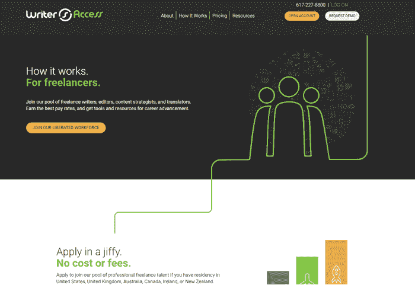

Writer Access 是自由编辑，作家，内容战略家和翻译的汇集地。 居住在美国，澳大利亚，加拿大，爱尔兰，英国等地的人们可以为客户服务。 您可以根据需要的研究和项目的复杂性来接收付款。 如果您是初学者，那么该公司将提供免费的内容营销培训。

**链接**： [https://www.writeraccess.com/talent-overview/](https://www.writeraccess.com/talent-overview/)

### 9）[文本代理](https://www.freelancewritinggigs.com/)

Text Broker 是一个通过编写内容来赚钱的网站。 如果您刚刚开始您的职业，Text Broker 使您可以访问每个主题的大量内容编写机会。 您只需要选择编写内容的时间和数量即可。 该平台不提供任何收入限制。 但是，根据订单，自由撰稿人有各种付款条件。

**链接**： [https://www.textbroker.com/authors](https://www.textbroker.com/authors)

## 自由测试工作（网站）

### 1）[测试鸟](https://nest.testbirds.com/home/tester)

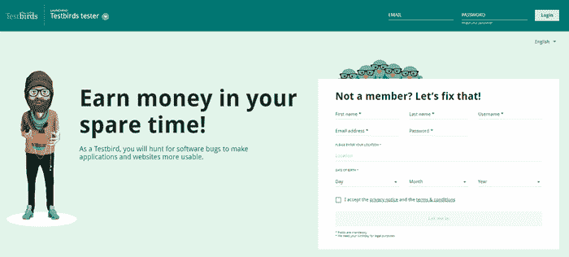

Testbirds 是一个允许您获得与网站或应用程序测试报告相关的工作的网站，您将获得额外的费用来检测错误。 这个自由职业者的网站允许您选择在白天或晚上进行测试。

### 2）[用户感觉](https://www.userfeel.com/)

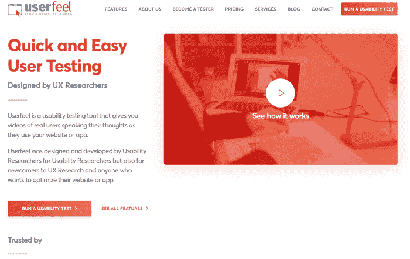

User Feel 门户网站以多种语言提供网站测试工作。 例如，测试人员可以用母语提交评论。 要成为测试人员，您需要在此网站上注册并通过资格测试。 这是进行自由职业者测试人员的初始过程。

**链接**： [https://www.userfeel.com/](https://www.userfeel.com/)

### 3）[用户测试](https://www.usertesting.com/be-a-user-tester)

用户测试是通过测试站点赚钱的地方。 您可以从您的网站或应用程序访问它。 要从用户测试中赚钱，您只需要一台 PC，麦克风和互联网连接。 您必须有一个 PayPal 帐户才能接收付款。 完成网站测试任务后，您将在几天内收到付款。

**链接**： [https://www.usertesting.com/be-a-user-tester](https://www.usertesting.com/be-a-user-tester)

希望以上清单对您有所帮助！